<h1 align="center">
Cookbook - Cookbook Template for IBM Cloud Paks
</h1>


## Instruction how to use it

1.Click **Use this template** button

  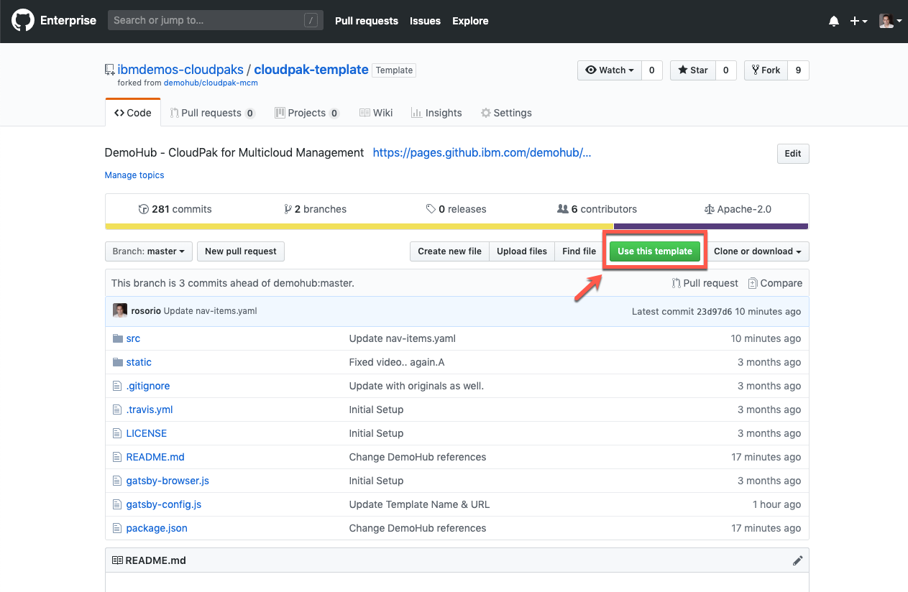

2.Select the **ibmdemos-cloudpaks** as organization and enter the name of your pak following the standard: cloudpak-pak_name (e.g: cloudpak-automation, cloudpak-security, etc).

  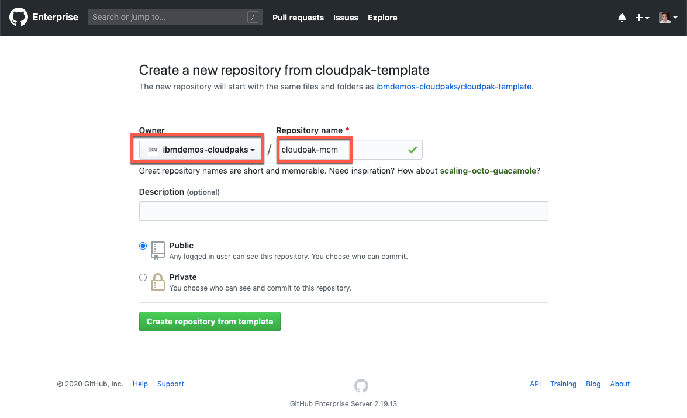

3.Ok, now you need to create a gh-pages branch in your repo. The content is published to the GitHub pages site through the gh-pages branch using the gh-pages npm module. In the final step of this documentation you will learn how to generate the page. By now, you just need to create the branch. Click the **Branch: master** combobox (1), enter **gh-pages** (2) and click **Create branch: gh-pages** (3).


4.Click the **Clone or download** button and copy the url of your new repo.

  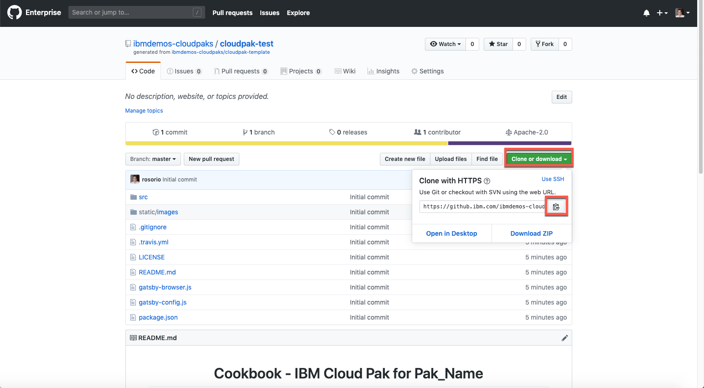

5.Using github desktop, clone your new repo to your local machine: **Add > Clone Repository**.

  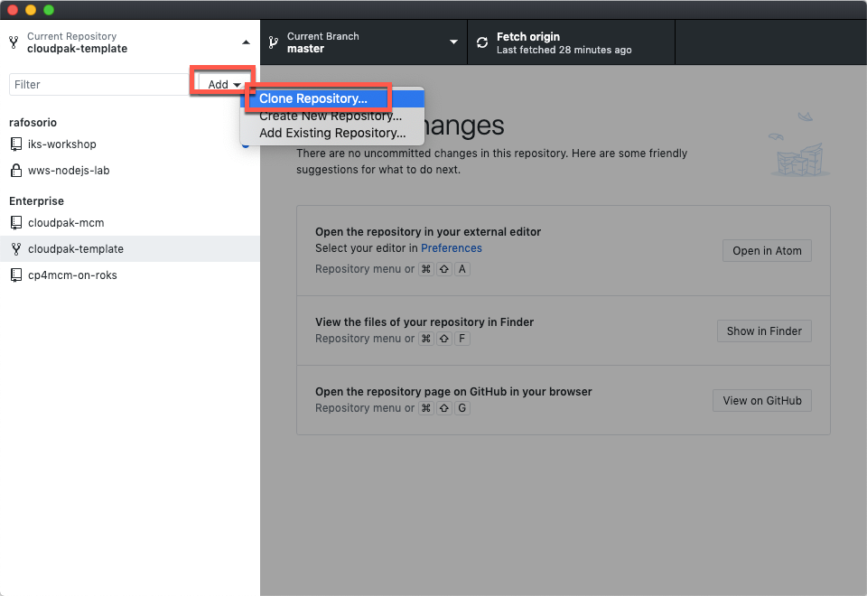

6.On **URL tab**, paste the url of your git repo and click **Clone**.

  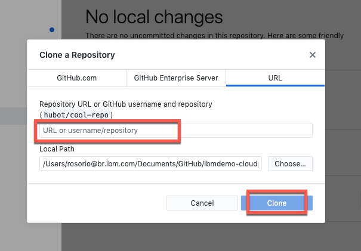

7.**Right click** on your repo on Git Desktop and open in your code editor (e.g: Atom)

  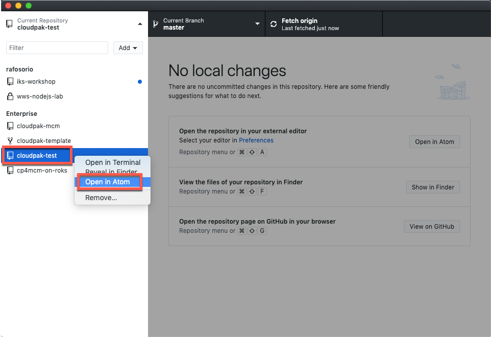

8.On your Code editor, open **Find > Find in Project** (or similar).

  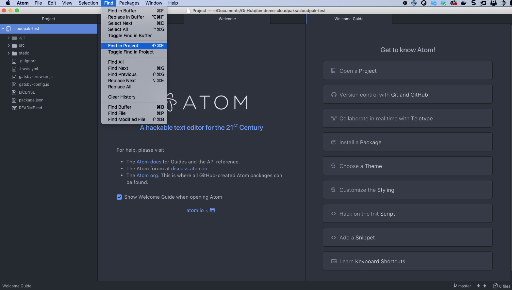

9.Find in project all **Pak_Name** and replace all to  **Your_Pak** (e.g. Automation).

  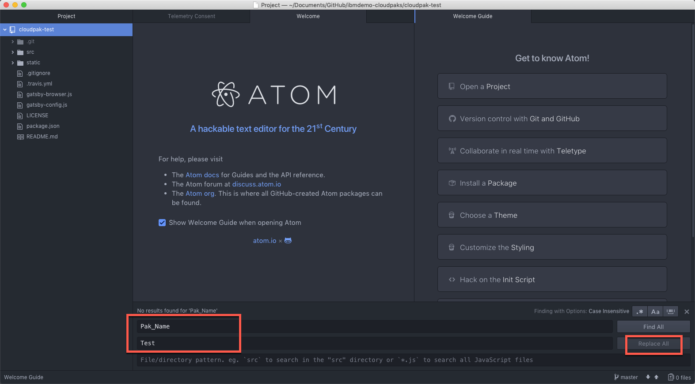

10.Repeat the same step, but now find all **cloudpak-template** and replace all to **cloudpak-yourpak** (e.g. cloudpak-automation).

  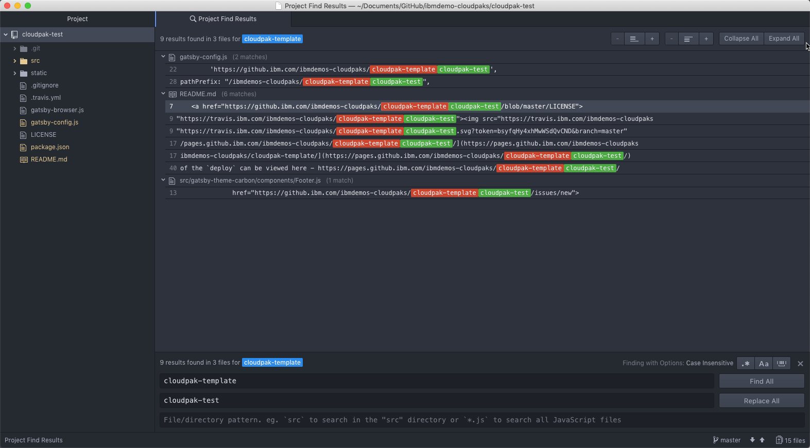

11.Back to git desktop, **commit** your changes to master.

  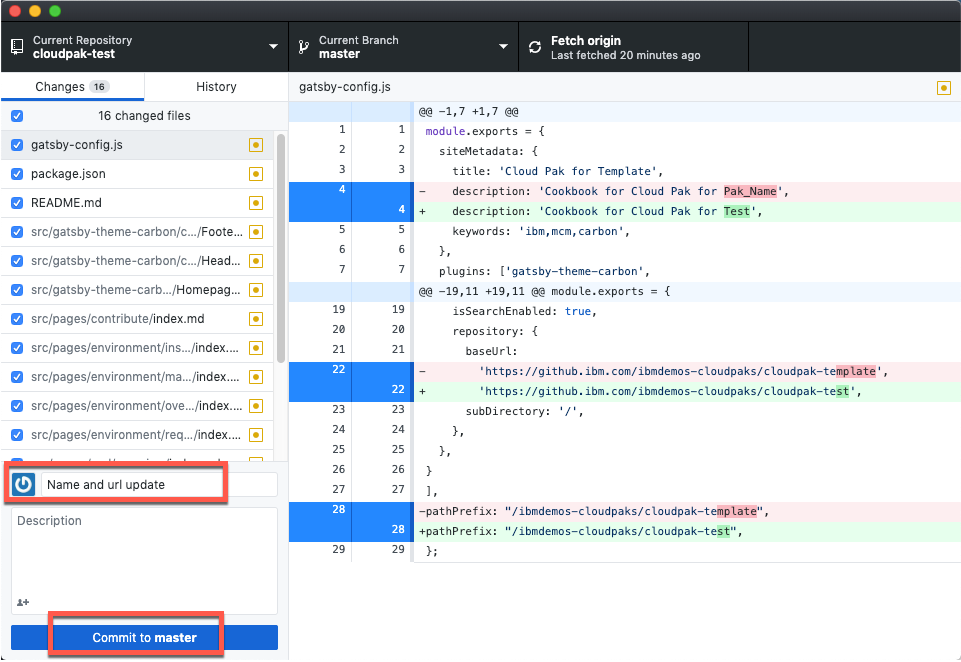

12.**Push** commits to the origin remote

  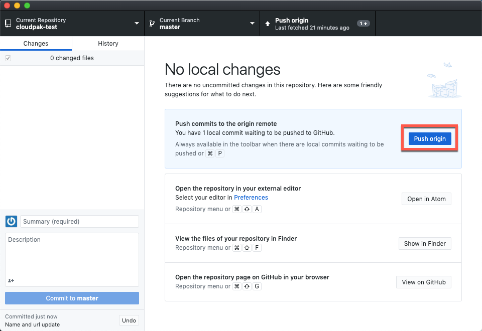

13.**Right click** again and now select **Open in Terminal**.

  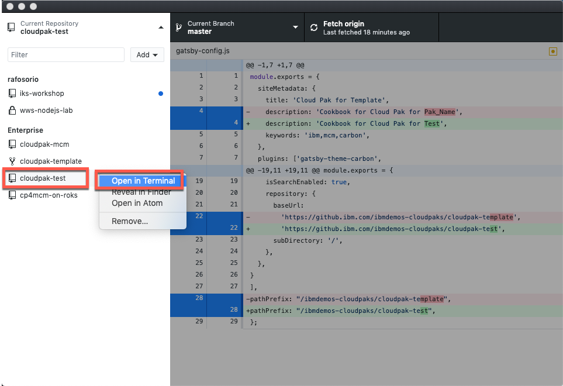

14.To install dependencies, run the command below:
```
npm install
```

  *Note*: you will receive multiple warnings messages, just ignore them.

15.Currently, the content is published to the GitHub pages site through the gh-pages branch using the gh-pages npm module. All of the details for handling the publishing are covered within the deploy script. The deploy can be run using the following:
```
npm run deploy
```

  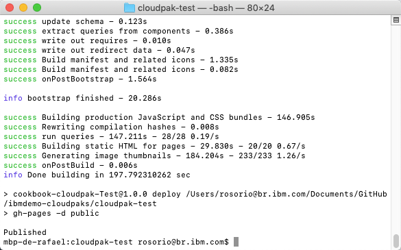

16.Great! Now to access your Cookbook git page open the url below, changing the name of your pak:
```
https://github.ibm.com/ibmdemos-cloudpaks/cloudpak-PAK_NAME
```


### Problems?

Slack: Rafael Osorio (rosorio@br.ibm.com)
