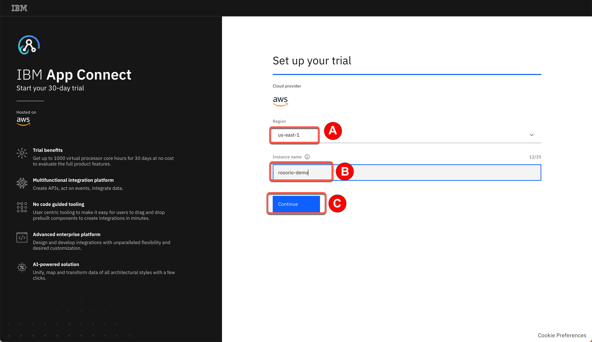
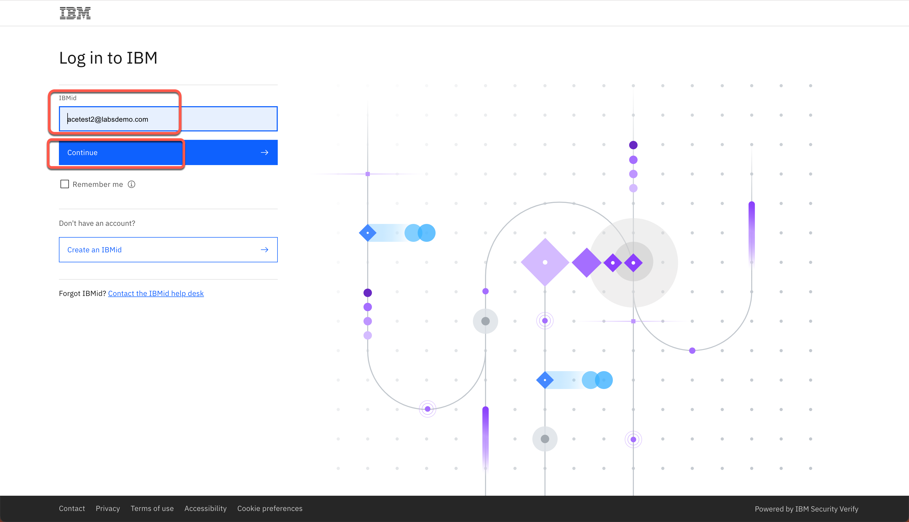
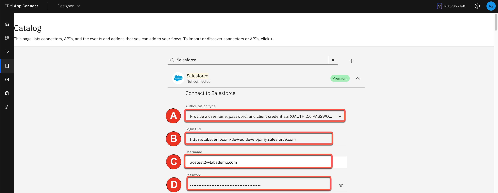
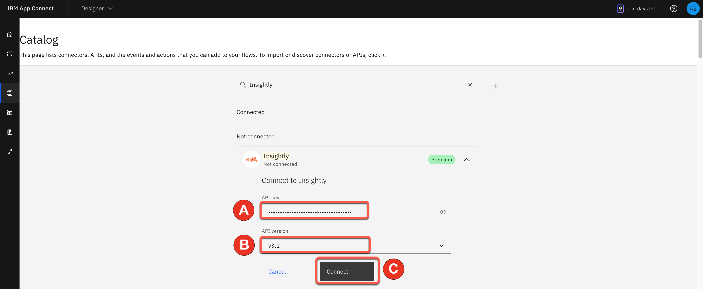

<FeatureCard
  title="AI Powered Integration with IBM App Connect Designer - Demo Preparation"
  color="dark"
  >

</FeatureCard>

<AnchorLinks>
  <AnchorLink>1. Review Demo Scenario</AnchorLink>
  <AnchorLink>2. IBM App Connect on AWS Trial Account</AnchorLink>
  <AnchorLink>3. Set up Salesforce</AnchorLink>
  <AnchorLink>4. Set up Insightly</AnchorLink>
  <AnchorLink>5. Connect IBM App Connect to your endpoints</AnchorLink>
</AnchorLinks>

***

### 1. Review Demo Scenario

| DEMO OVERVIEW |                          |
| --------------------------------------- | ------------------------------------- |
| **Scenario overview** | Focus has acquired another business and needs to synchronize the contacts between two CRM applications. Data mapping is among the most important design steps in building an integration flow. This design-time task is usually the most tedious, time-consuming, complex, and error-prone because it requires deep understanding of all the data fields on the source and target systems. Building a successful data mapping also requires business analysis, domain expertise, and technical knowledge on both source and target systems.  The Focus team would like to explore an easier way to implement this integration using AI Capabilities from IBM App Connect.  |
| **Demo products** | IBM App Connect Enterprise |
| **Demo capabilities** | IBM App Connect Designer; Low-code integration authoring; Mapping assist; AI-generated flow creation; Data Assist; |
| **Demo intro slides** | Download the Introduction and Overview slides <a href="https://github.com/ibm-integration/learninghub/blob/main/src/pages/demos/apic-tech-graphql/files/APICGraphQLSlides.pptx" target="_blank" rel="noreferrer">here</a>. |
| **Demo script** | This demo script has multiple tasks that each have multiple steps. In each step, you have the details about what you need to do (**Actions**), what you can say while delivering this demo step (**Narration**), and what diagrams and screenshots you will see.   This demo script is a suggestion, and you are welcome to customize based on your sales opportunity. Most importantly, practice this demo in advance. If the demo seems easy for you to execute, the customer will focus on the content. If it seems difficult for you to execute, the customer will focus on your delivery. |
| **Demo authors** | Rafael Osorio, Alan Glickenhouse and Brian Wilson based on Mapping Assist Demo created by CP4I Dev team |
| **How to get support** | Contact <a href="mailto:rosorio@br.ibm.com">rosorio@br.ibm.com</a> regarding issues with running this demo use case. |
| **Disclaimer** |  This product is being developed and released in an agile manner. In addition to adding new capabilities, the interface is likely to change over time. Therefore, the screenshots used in this lab may not always look exactly like what you see in the product. |

***

### 2. IBM App Connect on AWS Trial Account

IBM App Connect Enterprise SaaS on AWS is a powerful Integration-Platform-as-a-Service solution. Integration-Platform-as-a-Service (iPaaS) is a self-service cloud-based solution that standardizes how applications are integrated. Business technologists, citizen and professional developers, integration specialists and consultants can all use iPaaS solutions out-of-the-box to quickly build the integration flows for sharing data within an organization or with multiple companies.

With iPaaS solutions, organizations can connect different applications, data, business processes, and services, whether they are hosted on-premises, in a private cloud, or within a public cloud environment.

Next steps, you create your IBM App Connect Enterprise as a Service trial.

2.1. Open the trial registration page <a href="https://register.saas.ibm.com/ace/trial/aws?source=UserCommunity" target="_blank">here</a> and  log in with your IBMid, or if necessary create a new one.

2.2. Select the best **AWS region** for your trial (1), define an **instance name** (e.g.: yourname-demo) (2) and click **Continue** (3).

2.3. In a few minutes, your trial should be ready. Click on **Access your trial now**.

2.4. The first time, you will see a Welcome to IBM App Connect Designer dialog. You are welcome to explore the options. Feel free to start a product tour (2). When done, **close** the Welcome dialog to access the IBM App Connect Designer home screen.

***

### 3. Set up Salesforce

You need a Salesforce developer account to run this demo. If you already have a Salesforce developer account, you can use that (start at step 3.2 below). If not, you can sign up for a free developer account by following step 3.1 below.

3.1. Go to <a href="https://developer.salesforce.com/signup" target="_blank" rel="noreferrer">Salesforce Developers</a>. Follow the prompts on the Salesforce pages to get your free developer account. 

3.2. As soon as you have your account, go back to the <a href="https://login.salesforce.com/" target="_blank" rel="noreferrer">Salesforce log in page</a> and log in to your developer account.  

3.3. Click the **profile** icon (1) and save your Salesforce Login URL (2).  

3.4. In the same user profile menu select **Settings**.  

3.5. Click **Reset My Security Token** in the **My Personal Information** (1) menu. Then, click **Reset Security Token** (2). A newly-generated security token will be emailed to you.  

3.6. Next, you will create an application representing App Connect Enterprise, and then retrieve the Consumer Key and Consumer Secret. Click the **cogwheel** icon (1) and select **Setup** (2).  

3.7. In the navigator on the left-hand side, scroll to **PLATFORM TOOLS**, expand **Apps** (1), and click **App Manager** (2).  

3.8. Click **New Connected App**.  

3.9. Enter **App Connect** (1) as the **Connect App Name** and your email as the **Contact Email** (2). Salesforce generates the API name. Select **Enable OAuth Settings** (3).  

3.10. Select **Enable for Device Flow** (1). Now select **Manage user data via APIs (api)** (2) as the **Selected OAuth Scopes**. Click **Add** (3)  

3.11. Click **Save**.  

3.12. It will take approximately 10 minutes for the new connected app to register in Salesforce. Once it does, you should see **Manage Consumer Details** displayed. Click **Manage Consumer Details,** following any authentication directions.  

3.13. Save the **Consumer Key** and **Consumer Secret.**  

Your Salesforce developer account is ready.

***

### 4. Set up Insightly

Next, let’s set up Insightly, a cloud-based customer relationship management (CRM) solution.

We will create a trial account that lasts for 15 days. After the trial period, you can migrate your trial account to a free account (with limited users).

4.1. Go to <a href="https://www.insightly.com/" target="_blank" rel="noreferrer">Insightly</a> and click **Try CRM Free**.  

4.2. Complete the form with your personal data to create a free Insightly account. Accept the **Terms of Service and Privacy Policy** and click **Create My Account**.  

4.3. Confirm your email address.   

4.4. As soon as you click the link to confirm your email, you should see an initial Insightly screen asking basic information about your company.  Write **demo** (1), select **1-5** (2), select **IT Services** (3), and fill in any phone number (4), matching the screenshot below. Click **Let's go!** (5).  

4.5. Close the **Invite your team** dialog.  

4.6. You have an Insightly account. Let's get the API key to enable App Connect to authenticate when making API calls. Click the **Profile** (1) icon in Insightly and select **User Settings** (2).  

4.7. Scroll down to the bottom of the page and copy the **API key**, which is a long string of characters.  

 

Your Insightly account is ready to use.

 

***

### 5. Connect IBM App Connect to your endpoints

Let’s configure our services endpoints in IBM App Connect on AWS.
 

5.1.	If you already accessed your App Connect trial, skip this step. If not, open your email inbox (that you used to create the App Connect trial account), search for **IBM SaaS** (1), open the ****Your IBM App Connect trial is ready” email (2).

5.2. Now, click **Access trial** button.

5.3. Log in with your App Connect **Username** and **Password**.

5.4. Click the **Catalog** button on the left menu.

5.5. Search for **salesforce** (1) and click **Connect** (2).

5.6. In *Authorization type*, select "**Provide a username, password and client credentials (OAUTH 2.0 PASSWORD)**" (1). Paste your Salesforce Login URL (2). Input your Salesforce **Username** (3). Fill in the connector’s **Password** field (4) by concatenating your Salesforce **Password** and the **Security token** received via email. For example, if your Salesforce password is ‘myGreatPassword’ and your Salesforce security token is ‘2325jsdhew4312hs534dh’ then enter ‘myGreatPassword2325jsdhew4312hs534dh’ in the Password field.

5.7. Input Salesforce’s **Consumer Key** as *Client ID* (1) and **Secret** as *Client Secret* (2), respectively, in the connector account UI. Click **Connect** (3).

5.8. Search for **Insightly** and click **Connect**.

5.9. Paste your **API key** (1) in the *API key* field. Keep **v3.1** (2) in the *API version* field. Click **Connect** (3).

You are ready to present the demo.
