<FeatureCard
  title="AI Powered Integration with IBM App Connect Designer - Demo Script"
  color="dark"
  >

</FeatureCard>

### **Introduction**
 
In a world where disruption is the norm, businesses that harness AI will become industry leaders. On the other hand, we know that Integration is the key step of a successful Digital Transformation journey. But, how are you leveraging AI to implement your Integration strategy?  Are you creating Integration flows using AI Natural Language Processing capabilities? Are you using AI-powered mapping assistance and data transformation capabilities when designing integration flow?
  
Focus Corporation, a hypothetical retail company engaged with IBM, is highly motivated to derive more revenue from first-time customers to their online storefronts. Focus has acquired another business and needs to synchronize the contacts between two CRM applications. Data mapping is among the most important design steps in building an integration flow. This design-time task is usually the most tedious, time-consuming, complex, and error-prone because it requires deep understanding of all the data fields on the source and target systems. Building a successful data mapping also requires business analysis, domain expertise, and technical knowledge on both source and target systems.
  
In the first part of the demo, Focus team will learn how to use AI generated flow capability to easily create an event-driven flow to synchronize the CRM solutions. With this new flow, Focus team will synchronize contact information between the Salesforce and Insightly CRM systems. They will recognize and automatically match fields with high confidence levels. They will also recommend and assist with other fields where there is lower confidence. And Focus team will generate a transformation across the fields when the field formats are not the same. As they continue to use the Mapping Assist capability it learns from previously accepted matches to raise confidence levels in future mapping efforts.
  
Second part of the lab, Focus team will develop an API flow from scratch using a low-code approach. They will learn how easy to create APIs using App Connect.
  
In the following demo, Focus team will learn how to use IBM App Connect to implement an AI powered Integration. Using AI-powered mapping, they can reduce errors and speed integration development.
  

(Demo Slides <a href="https://github.com/ibm-integration/learninghub/blob/main/src/pages/demos/apic-tech-graphql/files/APICGraphQLSlides.pptx" target="_blank" rel="noreferrer">here</a>)
 

### **1 - Access the environment**

1.1 - Access the App Connect Environment
 

**Narration**

IBM App Connect is an industry-leading integration solution that connects any of your applications and data, no matter where they reside. With hundreds of prebuilt connectors and customizable templates, App Connect helps users of all skill levels rapidly connect Software as a Service (SaaS) applications and build integration flows.

Focus would like to explore how IBM App Connect will support them to eliminate digital silos to power their business. For this demo, they are using a trial account of IBM App Connect Enterprise as a Service on AWS.

 

**Action** &nbsp; 1.1.1

In your email inbox (that you used to create the App Connect trial account), search for **IBM SaaS** (1), open the ”**Your IBM App Connect trial is ready**” email (2).

  

 

**Action** &nbsp; 1.1.2

Now, click the **Access trial** button.

  

 

**Action** &nbsp; 1.1.3

**Log in** with your App Connect *username* and *password*.

  

***

1.2 - Explore App Connect Enterprise as a Service
 

**Narration**

Welcome to IBM App Connect Designer. With App Connect Designer you can easily create and test integrations that connect your applications without the need for coding.  Let's have a look around App Connect Designer.

In the home page, Focus can get started with creating and importing flows.

In the Designer dashboard page, Focus team will be able to monitor, edit, or delete their flows. They can also create more flows from this dashboard. They will do it, later

In the Monitor page, they are able to see CPU and memory usage date for the integration runtimes.  Summary data is shown in graphs and tables, and they can drill down to see more detailed data.

In the Catalog page, Focus can lists all the applications and APIs and the associated events and actions that they can add to their flows.  Here, they can connect App Connect to their application accounts on the catalog tab, or they can choose to connect to them when they create their flows. By now, they already have two connected acccounts: Insightly and Salesforce. These connectors were pre-configured and they are ready to be used.

In the Templates page, Focus can explore the templates gallery, where they’ll find templates that cover a range of cognitive, marketing, sales, support, business ops, e-commerce, and finance use cases.

In the Logs page, they are able to see recent logs for their integrations and audit activity.

In the Setting page, Focus can connect App Connect to their applications on a private network, to enable artificial intelligence (AI) features, and to generate credentials to access the public API.

IBM App Connect Enterprise as a Service provides App Connect Designer and App Connect Dashboard environments for authoring and running integrations. Each environment provides tools and resources to create and deploy your integrations. You can switch between your App Connect Designer and App Connect Dashboard instances by using the instance switcher on the header.

 

**Action** &nbsp; 1.2.1

If necessary close the tour dialog (click on **Maybe later** button). Show the **home page** and click on Designer button on the left menu.

  

 

**Action** &nbsp; 1.2.2

Show the Designer Dashboard page and click on **Monitor** button on the left menu.

  

 

**Action** &nbsp; 1.2.3

Show the Monitor page and click on **Catalog** button on the left menu.

  

 

**Action** &nbsp; 1.2.4

Show the Catalog page and click on **Templates** button on the left menu.

  

 

**Action** &nbsp; 1.2.5

Show the Templates page and click on **Logs** button on the left menu.

  

 

**Action** &nbsp; 1.2.6

Show the Logs page and click on **Settings** button on the left menu.

  

 

**Action** &nbsp; 1.2.7

Show the Settings page and click on **Dashboard** button on the left menu.

  

***

  

### **2 - Create  AI generated event-driven flow**

2.1 - Using AI generated flow capability
 

**Narration**

To transform a natural language description into an event-driven flow, IBM App Connect  connects to a service that is called Experimental Flow Generator. Experimental Flow Generator uses NLP to parse the natural language description that you provide, and AI to generate a flow template. This feature helps business users to quickly transform a natural language description into an event-driven flow, without needing any knowledge of flow design.

You start by entering a sentence in plain English that describes your integration. You then review the template that is generated and, if necessary, refine your description to generate a more appropriate template. Let's try a first scenario about ServiceNow integration and Trello.

As you can see, Focus team receives an auto-generated flow, editable in Designer, based on a simple text sequence. But, let's focus on Focus CRM synchronization scenario.

Focus Integration team would like to get contacts from Salesforce and copy them to the new Insightly CRM, let's try it!

Voila! Here they have their AI generated flow, when they're ready, they open the template in the flow editor, where they can connect to their accounts, map data between their applications, and customize their flow.

 

**Action** &nbsp; 2.1.1

Click **Create > AI-generated flow**.

  

 

**Action** &nbsp; 2.1.2

Type the following sentence: "**Send a slack message when a new ticket is created in ServiceNow**”, then press **Enter**.

  

 

**Action** &nbsp; 2.1.3

Type the following sentence: "**Get contacts from Salesforce and copy it to Insightly**”, then press **Enter**.

  

 

**Action** &nbsp; 2.1.4

Click **Open in Designer**.

  

***

  

### **3 - Exploring and improving the flow**

3.1 - Explore the flow
 

**Narration**

Here Focus team can see their initial flow, which initially has a Salesforce integration to retrieve contacts and an Insightly integration to create a new content. They will use the designer flow editor to edit and change their flow to add the necessary additional steps.

The connectors are already using the pre-configured accounts. However they need to do some adjusts to finalize the flow.

First, Focus team configures the Salesforce node to limit a maximum number of items to retrieve.  Here, they can see there is a error message in Insightly integration, this message is informing that Focus team needs to inform the First name field in the new CRM. They will need to mapping fields between Salesforce and Insightly. They will do it later taking advantage of the AI capabilities from IBM App Connect.

 

**Action** &nbsp; 3.1.1

Click on **Salesforce Retrieve contacts** node.

  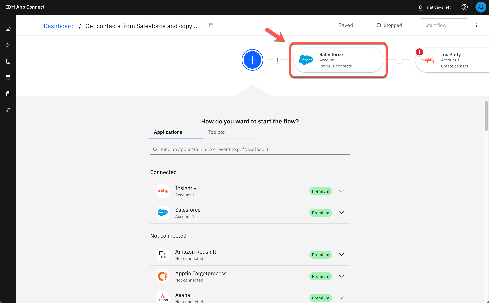

 

**Action** &nbsp; 3.1.2

Click on **Process 10 items from the collection**.

  

 

**Action** &nbsp; 3.1.3

Click on **Insightly Create contact** node.

  

 

**Action** &nbsp; 3.1.4

Show the error message “**First Name: This field is required**”.

  

***

3.2 - Add an event to trigger the flow
 

**Narration**

In an event-driven flow, you identify an event that can occur, which automatically triggers defined actions in one or more applications. An event can be considered as a change or an activity that occurs in an application.

Now, Focus team needs to specify the event that triggers the flow. The event might be something that happens in an application, or they might decide to start the flow on a schedule.

This flow will run when it is called from another flow. Because of it, Focus team selects the Callable flow Input option.

 

**Action** &nbsp; 3.2.1

Click on the initial **Plus** icon

  

 

**Action** &nbsp; 3.2.2

Show the available **Applications triggers** and open the **Toolbox** tab.

  

 

**Action** &nbsp; 3.2.3

Show the **Scheduler trigger** and open the **Application** tab.

  

 

**Action** &nbsp; 3.2.4

Select the **Callable flow** option and click on **Input link**.

    

***

3.3 - ‘*For each*’ statement
 

**Narration**

Now, we need to add a ‘for each’ statement because we need to retrieve all of the contacts from Salesforce. For each contact, we need to create a contact in the Insightly CRM. We’ll select the “Salesforce Contacts” object as the object to be processed.

Now, they need to move the Insighlty integration to be executed inside the For each loop.

 

**Action** &nbsp; 3.3.1

Click the **Plus** icon after the salesforce node.

  

 

**Action** &nbsp; 3.3.2

Then, open the **Toolbox** tab (1) and select the **For each** statement (2).

  

 

**Action** &nbsp; 3.3.3

Enter **Contacts** in the *Select the collection of items to process* field (1), and select the **Salesforce Contacts** object (2).

  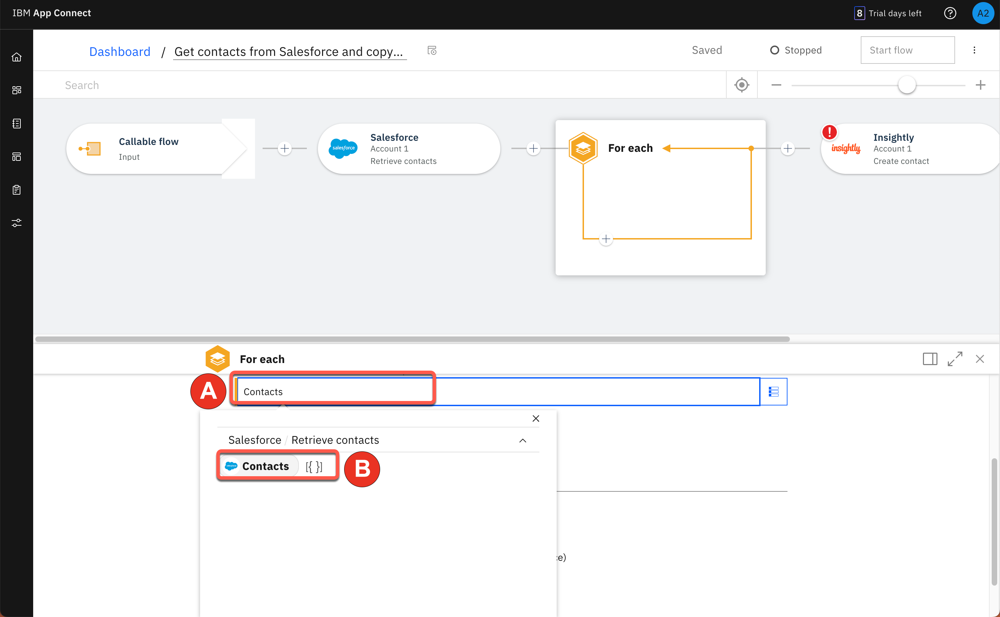

 

**Action** &nbsp; 3.3.4

Drag and drop the **Insightly** node to the **For each** loop.

  

***

  

### **4 - Using the Mapping Assist feature**

4.1 - View suggestions
 

**Narration**

In the node, Focus team can manually define the map between the Salesforce and Insightly fields. However, this is difficult because there are lots of fields, and the products will probably have different field names for the same objects.

With Mapping Assist, they don’t need to type all of these mappings. They’ll use AI to simplify their work! Once Insightly’s ‘Create Contact’ node is added, mapping suggestions are automatically generated. The best possible matches (top suggestions) are presented, which can be automatically inserted into fields with a single click. These top suggestions have an 80% (or higher) confidence score, and the count (20+ suggestions) identifies the total number of fields that will be populated with mappings.

By clicking “Generate or Preview mapping suggestions”, all suggestions with a confidence score of at least 80% are automatically displayed into Insightly’s ‘Create Contact’ node. Note that there are suggestions for simple fields as well as for more complex, nested fields. Mapping Assist uses a pre-trained AI algorithm to provide intelligent, customized data map suggestions. From this interface, they can clear the suggestions, or they can accept and apply the suggestions.

 

**Action** &nbsp; 4.1.1

Open the **Insightly Create contact** node.

  

 

**Action** &nbsp; 4.1.2

Click **Generate mapping suggestions** button.

  

 

**Action** &nbsp; 4.1.3

Show the list of suggestions (1) and click **Apply suggestions** (2).

    

***

4.2 - Resolve warnings
 

**Narration**

Mapping Assist’s AI algorithm sometimes finds multiple high-confidence mapping possibilities. When this occurs, we need to decide which mapping we want to accept.

 

**Action** &nbsp; 4.2.1

You may or may not see this situation. When this happens, a **warning** message is shown. You need to resolve any/all fields where this occurs. In the picture below, there is an issue with the First name field. Delete the field name that is currently mapped to the field with the warning.

  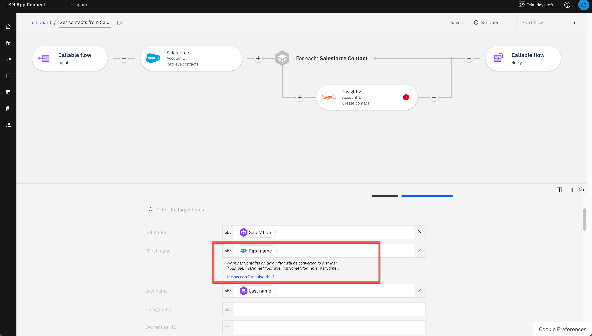

 

**Action** &nbsp; 4.2.2

Click the **selection list** icon next to the field (1), and select the mapping option listed with the “**For Each**” option from the displayed list (2). Repeat these steps for each field that has a warning.

  

***

  

### **5 - Generate a Transformation**

5.1 - Transform data format
 

**Narration**

In some situations, a direct mapping may not be adequate, for instance the data format of the “source” does not match the data format of the “target” field. In this situation you can generate a JSONata expression to define how the source data should be presented in the target application. JSONata is a declarative open-source query and transformation language for JSON data.

Focus will explore it with the ‘Assistant’s Name’ field. They select “Generate transformation”. The ‘Generate transformation’ panel opens with five blank sources and corresponding target fields that they can use for mapping data formats. They’ll need to provide at least five examples of source and target formats for IBM App Connect to generate the transformation formula.

Using IBM App Connect and the Mapping Assist capability, they were able to easily create a data sync between two CRM solutions without needing to write any code.

 

**Action** &nbsp; 5.1.1

On the **Assistant name** field, click the **Assistant’s Name** mapping (1) and select **Transform data format** (2).

  

 

**Action** &nbsp; 5.1.2

On the **Generate transformation** dialog, enter **Michael Jordan** as the first source name, and enter **M. Jordan** under **‘Assistant name’ examples (target)**. Repeat the same steps to include four more assistants’ names using the same transformation format (e.g., **Magic Johnson**, **M. Johnson**; **Larry Bird**, **L. Bird**; **Charles Barkley**, **C. Barkley**; **Patrick Ewing**, **P. Ewing**) (1). Click **Transform data format** (2), and click **Insert transformation** (3).

  

 

***

  

### **6 - Testing your data sync**

6.1 - Check the target contacts
 

**Narration**

Before Focus team start to test their data sync flow, they need to check the contacts that they have available. They just need to open the pre-created Insightly CRM account and see the available contacts before they execute the flow. As they can confirm, they have approximately 20 pre-created contacts, each with pictures. After the test of their flow, they should have two or three new contacts without pictures.

 

**Action** &nbsp; 6.1.1

Open your **Insightly** home page (1). Open the **Contacts** view (2).

  

 

**Action** &nbsp; 6.1.2

Notice that there are approximately 20 pre-created contacts, each with pictures.

  

***

6.2 - Test the Flow
 

**Narration**

Focus team is able to test the flow using the IBM App Connect Designer page, They just need to click on “Try this flow” button.

 

**Action** &nbsp; 6.2.1

Back to App Connect Designer page, click on **Try this flow** button.

  

 

**Action** &nbsp; 6.2.2

Click **Continue** to confirm that you want to proceed with the test.

  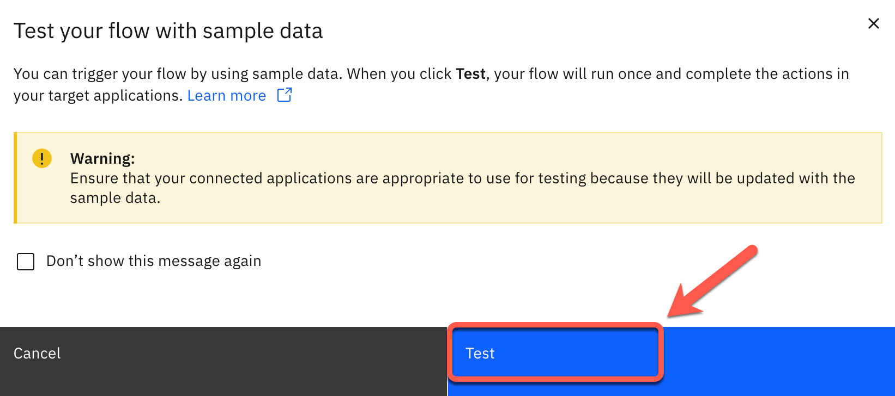

 

**Action** &nbsp; 6.2.3

Click on **View details** button.

  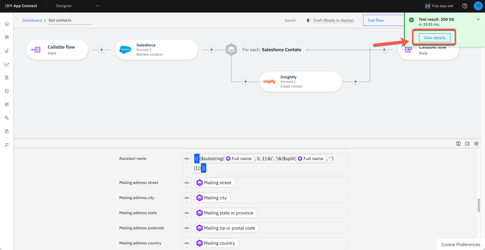

 

**Action** &nbsp; 6.2.4

Show the Test results dialog with the **200** result and the successful message: “**The flow test completed successfully**”.

  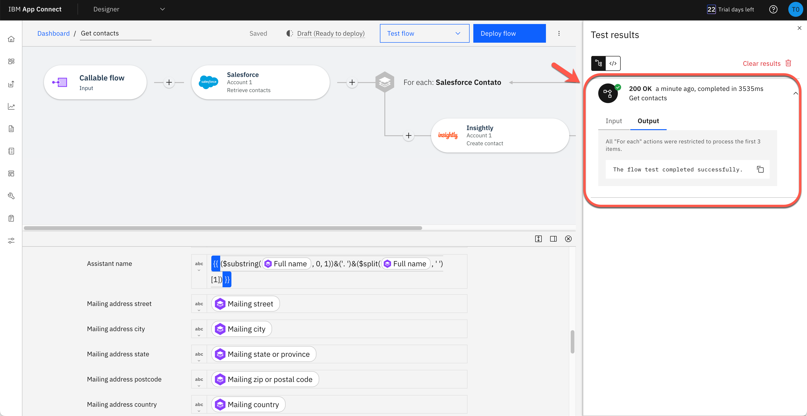

 

**Action** &nbsp; 6.2.5

Click on **Dashboard** link on breadcrumbs to return to the Dashboard page.

  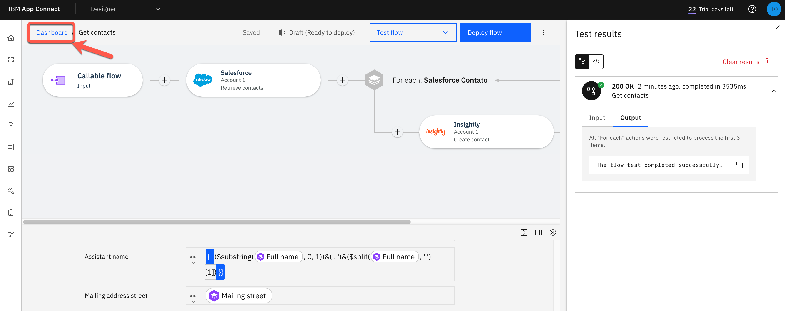

***

6.3 - Check the data sync
 

**Narration**

Now they can check the new contacts. They should have at least two new contacts. They just need to refresh the ‘Contacts’ page, and here are their new contacts. They can check the contact to see the new ‘Assistant Name’ format.

Great! Everything works as expected.

 

**Action** &nbsp; 6.3.1

Go back to Insightly’s **Contacts** page and refresh the page.

  

 

**Action** &nbsp; 6.3.2

Explore the **new contacts** (without the sample_data tags).

  

 

**Action** &nbsp; 6.3.3

Click one of the contacts without a picture (1), and show the new format of **Assistant Name** based on the function we defined in the flow (2).

  

***

  

### **7 - Create flows for an API**

7.1 - Create Flows for an API from Scratch
 

**Narration**

Focus team learned how easy is to create event-driven flow using the AI Generated flow capability. But before move to the new Insightly CRM, they would like to provide an easy way for current developers to consume the old CRM without need to access Salesforce. Because of that, they would like to see how eay is to create a flow for an API from scratch on IBM App Connect.

A flow for an API (alternatively referred to as an API flow) contains a request, actions for one or more target applications, and a response. The flow is triggered by calling the API operation such as from mobile and web applications.

Focus team uses the IBM App Connect Dashboard to create a flow for an API.

 

**Action** &nbsp; 7.1.1

Click **Create** button and select **Flows for an API**.

  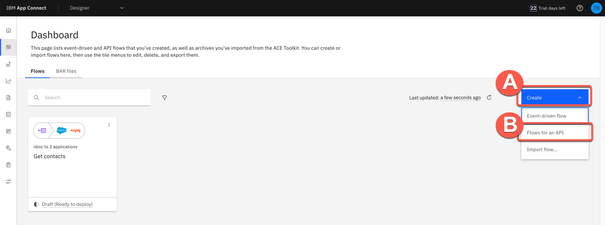

 

**Action** &nbsp; 7.1.2

Rename the API to Customer API** (1), name the model to **Customer** (2), and click the **Create model button (3).

  

***

7.2 - Create properties
 

**Narration**

Focus team starts by adding properties to their Customer model. There will be an ID, FirstName, LastName, Email. As we can see, they are developing their API based on a model. It’s completely model-driven, and they’ve just modeled their ‘Customer’ object. Next, they’ll design and implement the operation that is related to this ‘Customer’ model.

 

**Action** &nbsp; 7.2.1

In the property name, enter **CustomerID** and click **Add property**. Repeat the same steps to include **FirstName**, **LastName** and **Email** (1). Click **Operations** (2).

  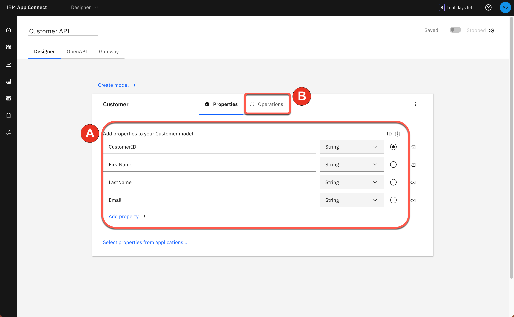

***

7.3 - Create operation
 

**Narration**

To define how the API interacts with the object, they need to define the operations. First they will add an operation to create an object. Later, they can improve this model by adding operations to retrieve, update or delete an object. First, Focus Integration team will define the “Create Customer” operation.

 

**Action** &nbsp; 7.3.1

Click the **Select an operation to add** dropdown. select **Create Customer** (2).

  

 

**Action** &nbsp; 7.3.2

Click **Implement flow**.

  

***

  

### **8 - Implementing the flow**

8.1 - Create contact
 

**Narration**

Here Focus team can see their initial flow, which initially has just a ‘Request’ node and a ‘Response’ node. They will use the designer flow editor to edit and change their flow to add the necessary additional steps.

Focus API will be easy to create. The API will create a contact in Salesforce. They just need to include the Salesforce connector and select the “Create contact” operation.

 

**Action** &nbsp; 8.1.1

Click the **Plus** icon (1). Search for the **Salesforce** connector (2).

  

 

**Action** &nbsp; 8.1.2

From your pre-configured Salesforce connector, select **Contacts > Create contact**.

  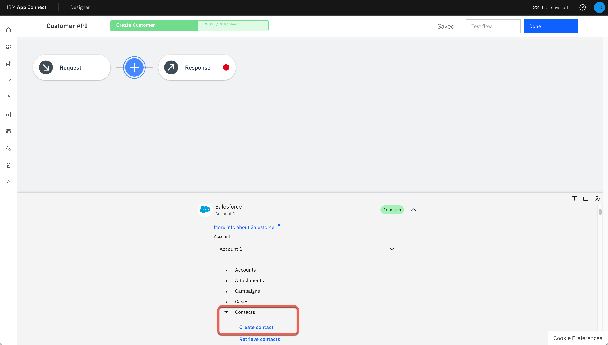

***

8.2 - Mapping Data
 

**Narration**

Now, Focus team needs to map fields from the request into the Salesforce Create contact action. Because they already knows the Mapping Assist capability from IBM App Connect, it is really simple to do it. They just need to put AI to simplify their work.

 

**Action** &nbsp; 8.2.1

Click **Generate mapping suggestions** button.

  

 

**Action** &nbsp; 8.2.2

Click **Apply suggestions** button.

  

***

8.3 - Adjust flow response
 

**Narration**

To finalize the API, Focus team needs to adjust the response that is returned when the flow is called. This response serves to close the API flow and is a required construct. Map the available fields from the Salesforce Create contact action to the response.

 

**Action** &nbsp; 8.3.1

Click the **Response** node.

  

 

**Action** &nbsp; 8.3.2

For the mandatory response field **CustomerID**, map the Salesforce field Contact ID.

  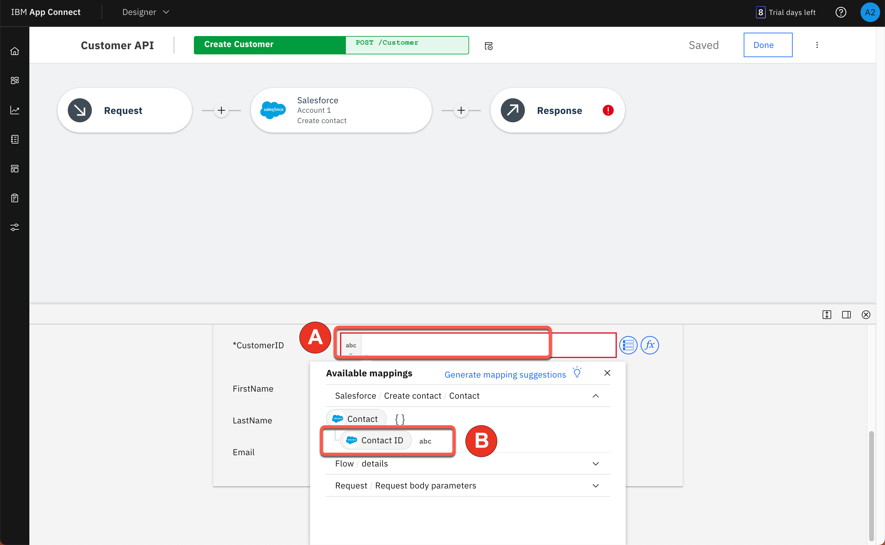

***

8.4 - Starting the API
 

**Narration**

Great, the API is ready, now Focus team just need to start the API.

 

**Action** &nbsp; 8.3.1

Click **Done** to return to your model.

  

 

**Action** &nbsp; 8.3.2

**Start** your flow.

  

***

  

### **9 - Test the API flow**

9.1 - Test the API
 

**Narration**

With the API started, they are able to use the Test tab of IBM App Connect to test the new API.

 

**Action** &nbsp; 9.1.1

Open the **Test** tab (1). Click **POST /Customer** (2) and open the **Try it** tab (3).

  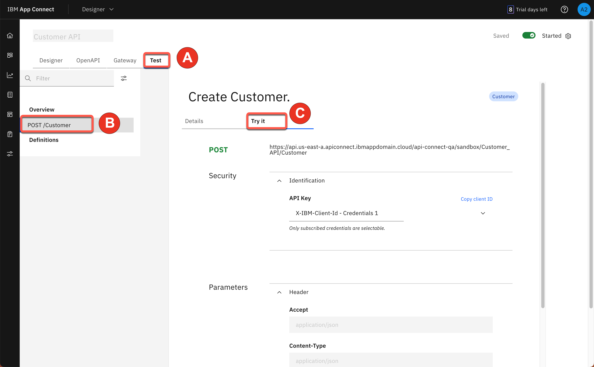

 

**Action** &nbsp; 9.1.2

Scroll down to see the body field, and click **Generate** (1) to create some dummy body content. Click **Send** (2), and you should see a **201 Created** response (3).

  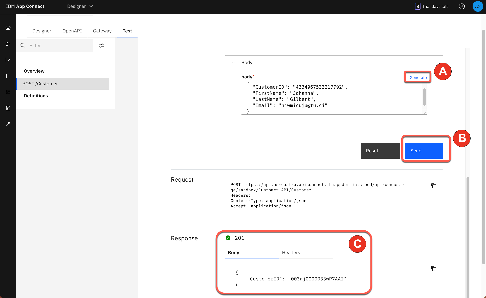

***

9.2 - Check the new contact
 

**Narration**

To validate the API, Focus team will check the new contact in SalesForce. They just need to check the ‘Contacts’ page, and here is the new contact.

Great! Everything works as expected.

 

**Action** &nbsp; 9.2.1

Open **Salesforce** home page (1). Open the **Contacts** view (2).

  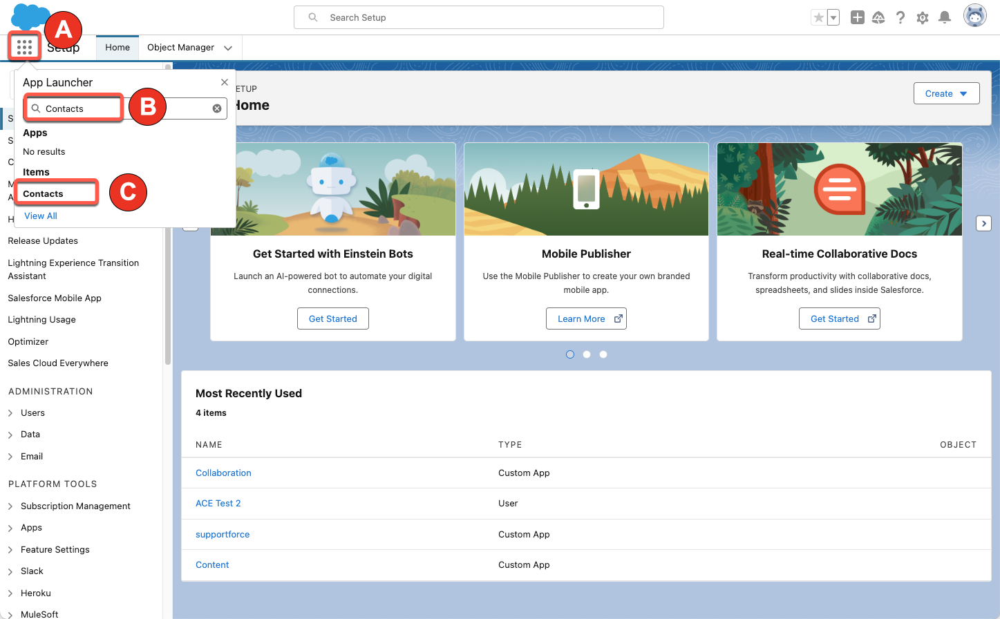

 

**Action** &nbsp; 9.2.2

Check and explore the **new contact**.

  

***

  

### **Summary**

 
Let’s summarize what Focus’ team has done today. In this demo they:  
<ul>
<li>Created AI generated flow to synchronize contact data between SalesForce CRM and Insightly CRM</li>
<li>Improved the Event-driven flow using IBM App Connect Designer</li>
<li>Created a graph composition using @materializer</li>
<li>Used the Mapping Assist capability to implement data mapping between the different applications</li>
<li>Created data transformation function in minutes instead of hours</li>
<li>Created a flow for an API from scratch using no-code/low-code approach</li>
</ul> 
As we mentioned in the beginning, data mapping is difficult, time-consuming, and error-prone. In this demo, Focus team learned how AI-powered Mapping Assist can alleviate these issues.
  
They auto-mapped all the fields where the matching confidence was at least 80%. Mapping Assist learns from their decisions about selected mappings, and shows these as top suggestions when a similar source and target mapping is attempted in the future -- further reducing their mapping efforts.
  
Focus team also generated a data transformation by providing examples of source and target data when fields do not have the same format. AI was used to determine the pattern and generate the transformation.
  
Using AI-powered Mapping Assist reduced the development time and eliminated errors as Focus Corporation successfully integrated the new customer contacts from their business acquisition.
  
Thank you for attending today’s presentation.
 
