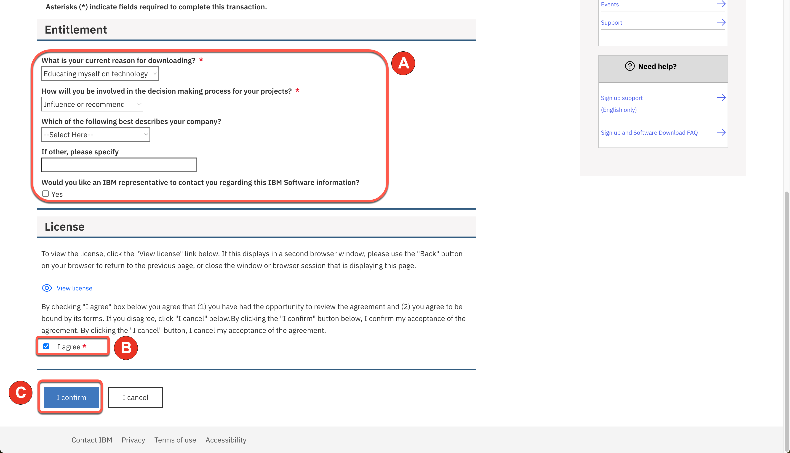
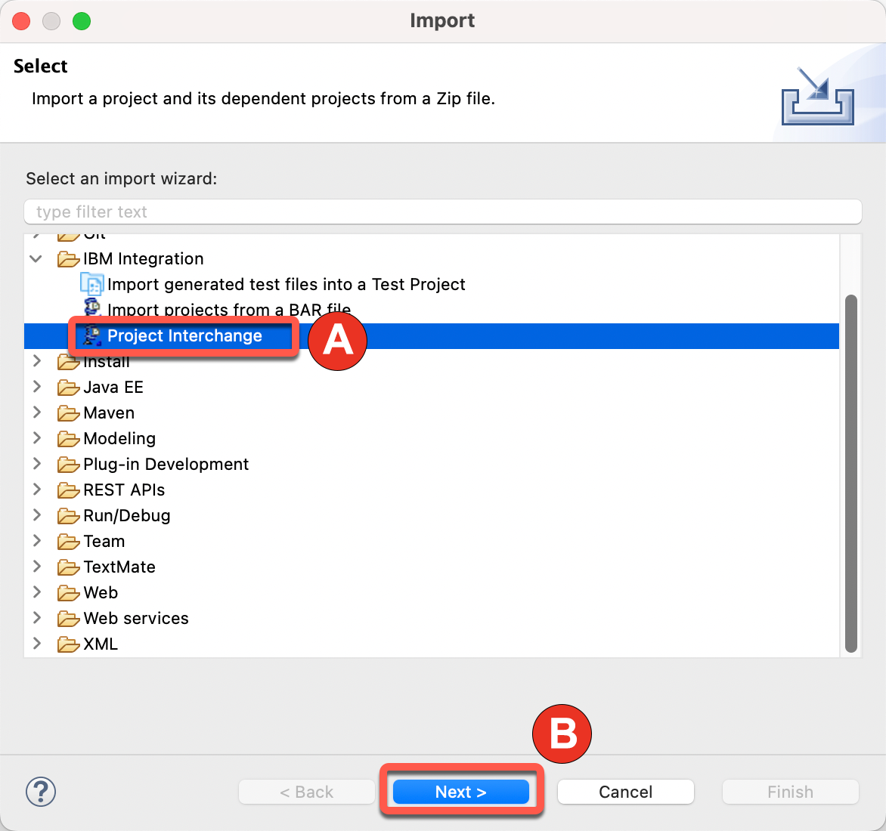

<FeatureCard
  title="Create integrations with App Connect for Developers Toolkit - Demo Preparation"
  color="dark"
  >

</FeatureCard>

<AnchorLinks>
  <AnchorLink>1. Review Demo Scenario</AnchorLink>
  <AnchorLink>2. Create IBM App Connect on AWS trial account</AnchorLink>
  <AnchorLink>3. Install IBM App Connect Enterprise for Developers (Toolkit)</AnchorLink>
  <AnchorLink>4. Import HelperFiles Project</AnchorLink>
</AnchorLinks>

***

### 1. Review Demo Scenario

| DEMO OVERVIEW |                          |
| --------------------------------------- | ------------------------------------- |
| **Scenario overview** | Focus has acquired another business and needs to integrate the different IT applications.   Focus Integration expert would like to build complex, multi-style integrations with support for multiple programming languages using IBM App Connect Toolkit.  |
| **Demo products** | IBM App Connect Enterprise |
| **Demo capabilities** | IBM App Connect for Developers (Toolkit); Code integration authoring; Java; ESQL |
| **Demo script** | This demo script has multiple tasks that each have multiple steps. In each step, you have the details about what you need to do (**Actions**), what you can say while delivering this demo step (**Narration**), and what diagrams and screenshots you will see.   This demo script is a suggestion, and you are welcome to customize based on your sales opportunity. Most importantly, practice this demo in advance. If the demo seems easy for you to execute, the customer will focus on the content. If it seems difficult for you to execute, the customer will focus on your delivery. |
| **Demo authors** | Rafael Osorio and Joel Ramirez |
| **How to get support** | Contact <a href="mailto:rosorio@br.ibm.com">rosorio@br.ibm.com</a> regarding issues with running this demo use case. |
| **Disclaimer** |  This product is being developed and released in an agile manner. In addition to adding new capabilities, the interface is likely to change over time. Therefore, the screenshots used in this lab may not always look exactly like what you see in the product. |

***

### 2. Create IBM App Connect on AWS trial account

IBM App Connect Enterprise SaaS on AWS is a powerful Integration-Platform-as-a-Service solution. Integration-Platform-as-a-Service (iPaaS) is a self-service cloud-based solution that standardizes how applications are integrated. Business technologists, citizen and professional developers, integration specialists and consultants can all use iPaaS solutions out-of-the-box to quickly build the integration flows for sharing data within an organization or with multiple companies.

With iPaaS solutions, organizations can connect different applications, data, business processes, and services, whether they are hosted on-premises, in a private cloud, or within a public cloud environment.

Next steps, you create your IBM App Connect Enterprise as a Service trial account.

2.1. Open the trial registration page <a href="https://register.saas.ibm.com/ace/trial/aws?source=UserCommunity" target="_blank">here</a> and log in with your IBMid created in the previous section (if necessary enter the validation code).

  

2.2. Select the best **AWS region** for your trial (A), define an **instance name** (e.g.: yourname-demo) (B) ands click **Continue** (C).

  

2.3. In few minutes, you trial should be ready. Click on **Access your trial now**.

  

2.4. First time, you will see a Welcome to IBM App Connect Designer dialog. You are welcome to explore the options. You are welcome to start a product tour (B). When done, **close** the Welcome dialog to access the IBM App Connect Designer home screen.

  

***

### 3. Install IBM App Connect Enterprise for Developers (Toolkit)

You can use the IBM App Connect Enterprise Toolkit to build powerful integration applications, services, and APIs. You can then deploy your integration solutions to the software run time, IBM App Connect Enterprise as a Service, containers, or a combination of environments.

3.1. Using your **IBMid**, **log in** on <a href="https://www.ibm.com/resources/mrs/assets?source=swg-wmbfd" target="_blank">IBM MRS Tool page</a>.

  

3.2. Provide the requested details (A) and **agree** (B) with the license and click **I confirm** (C).

  

3.3. Select the latest version of **IBM App Connect Enterprise for Developers** (A) and click **Continue** (B).

  

3.4. Then select the appropriate download option (for example, ACE-WIN64-DEVELOPER.exe 1.26 GB), and click **Download**.

  

3.5. Install **IBM App Connect Enterprise for Developers** on your chosen platform. More details available on this <a href="https://www.ibm.com/docs/en/app-connect/12.0?topic=enterprise-download-ace-developer-edition-get-started" target="_blank">page</a>.

  

***

### 4. Import HelperFiles Project

In this demo, you will import a REST API documentation and reuse a pre-created ESQL file. These files will be available as HelperFiles Project in App Connect. Next steps, you will download and import it!

4.1. Open a **browser** and go to this <a href="https://github.com/ibm-integration/learninghub/blob/main/static/ace-toolkit-files/HelperFiles.zip" target="_blank">GitHub page</a>

4.2. Then click on the **Download** raw file icon.

  

4.3. Open your **App Connect Enterprise Toolkit** by clicking the icon on the Launchpad (MAC OS) or Desktop (Windows) or executing **ace toolkit** in terminal window.

  

4.4. In the Workspace Launcher window, you are welcome to create a new workspace or accept the default one. Click **Launch**.

  

4.5. **Close** the welcome page.

  

4.6. Select **File->Import**.

  

4.7. Select **Project Interchange** (A) and click **Next** (B).

  

4.8. Select **HelperFiles.zip** (A) file that you downloaded in the first step. Verify **HelperFile project is checked** (B) and click **Finish** (C).

  

4.9. You should see your HelperFiles in the *Independent Resources* group.

  

You are ready to present the demo!

 
