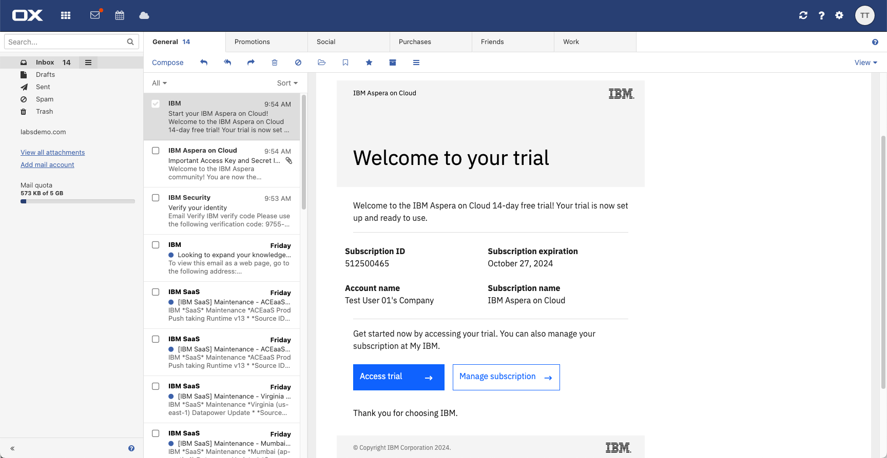
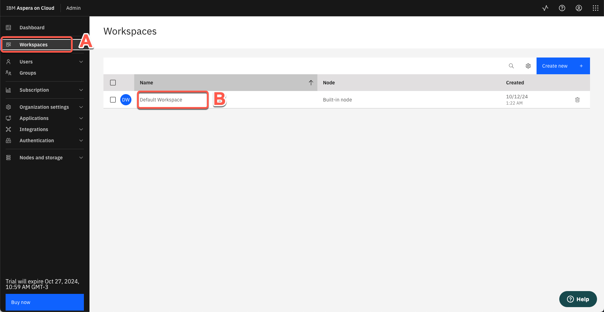
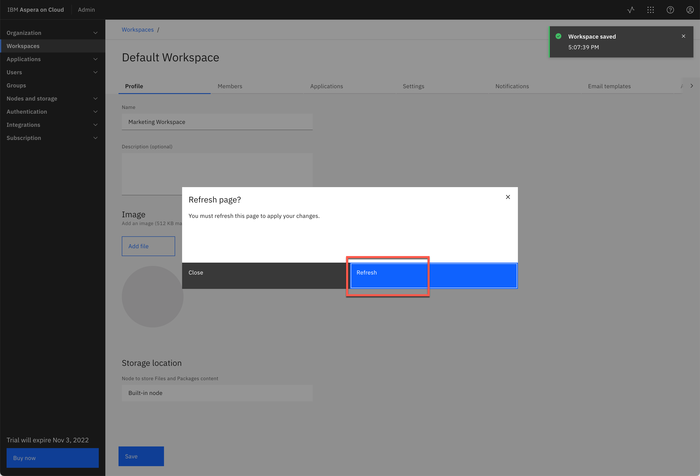
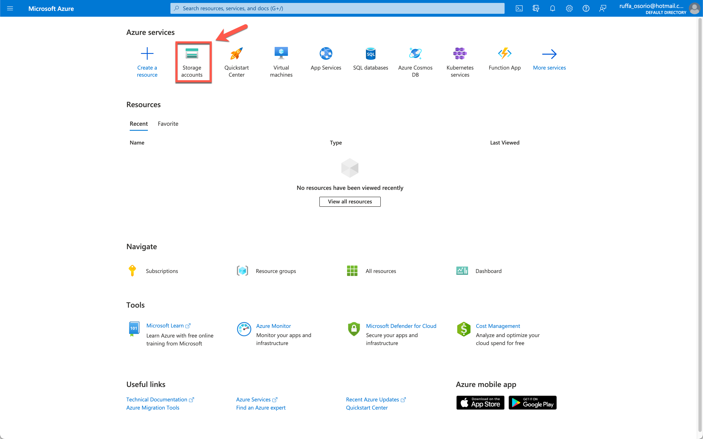
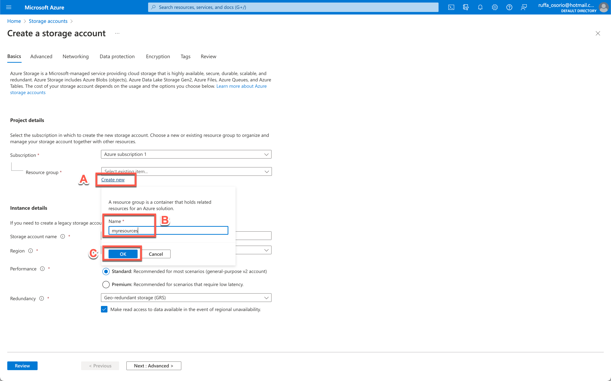
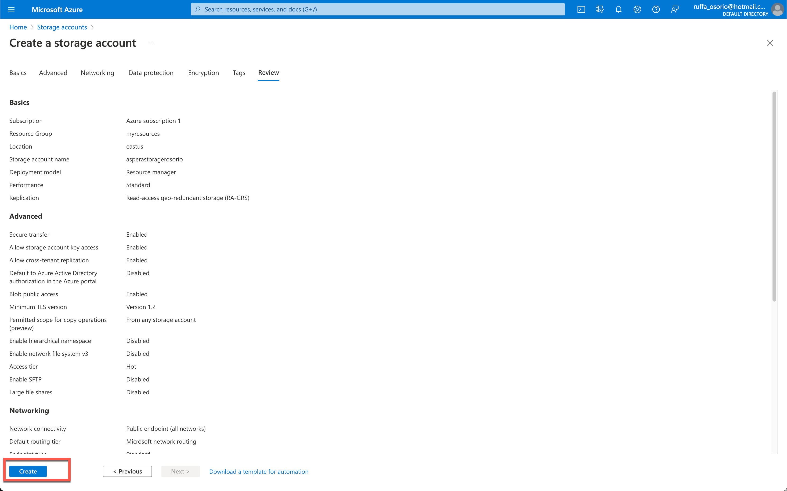
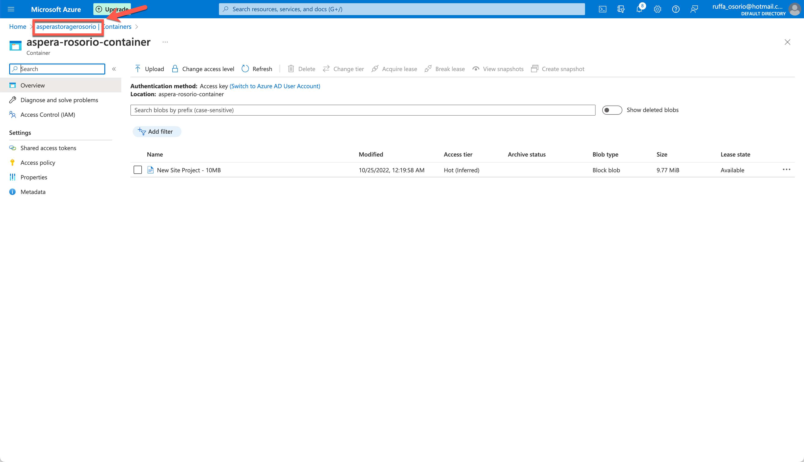

<FeatureCard
  title="Aspera on Cloud Demo for Technical Sales - Demo Preparation"
  color="dark"
  >

</FeatureCard>

<AnchorLinks>
  <AnchorLink>1 - Review Demo Scenario</AnchorLink>
  <AnchorLink>2 - Create your Aspera on Cloud free trial account</AnchorLink>
  <AnchorLink>3 - Installing Aspera Connect</AnchorLink>
  <AnchorLink>4 - Renaming your Workspace</AnchorLink>
  <AnchorLink>5 - Creating your Demo Files</AnchorLink>
  <AnchorLink>6 - Creating IBM Cloud Object Storage (ICOS) Services</AnchorLink>
  <AnchorLink>7 - Creating Microsoft Azure Blob Storage Services (Optional)</AnchorLink>
  <AnchorLink>8 - Copying Access Key and Secret of your built-in node</AnchorLink>
  <AnchorLink>9 - Defining your Demo Users</AnchorLink>
</AnchorLinks>

***

### 1 - Review Demo Scenario

| DEMO OVERVIEW |                          |
| --------------------------------------- | ------------------------------------- |
| **Scenario overview** | In this digital world, fast and reliable movement of digital data, including massive sizes over global distances, is becoming vital to business success across virtually every industry. The Transmission Control Protocol (TCP) that has traditionally been the engine of this data movement, however, has inherent bottlenecks in performance. This demo will show how to use Aspera on Cloud to move the world's data at maximum speed. |
| **Demo products** | IBM Aspera on Cloud |
| **Demo capabilities** | File, Package, Activity, Automation, Admin, Cloud Storage Integration |
| **Demo intro slides** | Download the Introduction and Overview slides <a href="https://ibm.box.com/s/tph26q1zzqhix1t1fkm2ukyc9eqgwdbg" target="_blank" rel="noreferrer">here</a>. |
| **Demo script** | This demo script has multiple tasks that each have multiple steps. In each step, you have the details about what you need to do (Actions), what you can say while delivering this demo step (Narration), and what diagrams and screenshots you will see.    This demo script is a suggestion, and you are welcome to customize based on your sales opportunity. Most importantly, practice this demo in advance. If the demo seems easy for you to execute, the customer will focus on the content. If it seems difficult for you to execute, the customer will focus on your delivery.  You will use a dedicated workspace with an Aspera on Cloud trial account. |
| **How to get support** | Contact <a href="mailto:rosorio@br.ibm.com">rosorio@br.ibm.com</a> or <a href="mailto:jaym@us.ibm.com">jaym@us.ibm.com</a> regarding issues with setting up and running this demo use case. |

***

### 2 - Create your Aspera on Cloud free trial account

2.1 Access the <a href="https://www.ibm.com/account/reg/us-en/signup?formid=urx-30538" target="_blank">Sign up for IBM Aspera on Cloud page</a>.

2.2 On the **Sign up for our free trial** page, if you already have an IBM account, click **Log in** (A). If not, complete the registration form (B).

2.3 At the end, you need to verify your email. Open your email and **copy the 7 digit code**.

2.4 Return to the Sign-up form and **paste the 7 digit code** into the form (A). Then, click **Start your free trial** (B).

2.5 In the **About your IBMid Account**, check the information there and when ready, click **Proceed**.

2.6 Now, back to your email, you should have an email from IBM Aspera on Cloud. Open this email and click on **Start using IBM Aspera on Cloud now**.

2.7 Click **Log in with IBMid**. Then, go ahead and use your new IBMid credentials.

***

### 3 - Installing Aspera Connect

3.1 On Aspera on Cloud home page, open the **Admin** app.

3.2 First time you access the Aspera on Cloud, you should see the **Welcome** dialog, click **close**.

3.3 Now, you will see a page, asking you to install the IBM Aspera Connect transfer client. You need to install both the Aspera Connect browser plug-in and the Aspera Connect client. Let's do it! Click **Install extension**.  

3.4 Go ahead, and follow the necessary steps to install the extension in your browser.

3.5 When done, click **Install Connect** to open the <a href="https://www.ibm.com/aspera/connect/" target="_blank">IBM Aspera Connect</a> page. 

3.6 Go ahead and follow the necessary steps to install IBM Aspera Connect in your OS. 

3.7 When done, return back to the Aspera on Cloud page. Now, you should see the admin page.

***

### 4 - Renaming your Workspace

By default your first workspace is default. To have a more appealing demo workspace, let's rename it.

4.1 Click on **Default Workspace** to edit it.

4.2 On *Name* field, change to **Marketing Workspace** (A). Then click **Save** (B).

4.3. Click **Refresh**.

Great! Your workspace is ready for demo. 

***

### 5 - Creating your Demo Files

As part of this demo, you will need to upload some files. You can decide the size of files that you will use in your Demo based in your network bandwith. One important point: Large files are good to show how fast is to transfer files in Aspera, on the other hands, you don't want to stay in front of customer waiting a file to be uploaded. The recommendation is: Try first and define the best experience for your audience.

You can create your demo files by using your personal files. Another possibility is to download some dummy files from internet. There are multiple sites where you can download test files, this <a href="http://xcal1.vodafone.co.uk/" target="_blank">site is one example</a>.

Below are the names and size of files that we are using in the demo script. Feel free to recreate them. It is a good practice to keep them in a folder with easy access during the demo.

| File Name | File Size |
| --------------------------------------- | ------------------------------------- |
| A-B Testing Fall 2022 | 10 MB |
| A-B Testing Summer 2022 | 10 MB |
| Campaign Launch Video | 100 MB |
| Campaign Logos | 10 MB |
| Summer Campaign | 200 MB |
| Mobile Campaign | 200 MB |
| New Site Project | 10 MB |

***

### 6 - Creating IBM Cloud Object Storage (ICOS) Services

In this section and next, you will configure two Object Storage services in different cloud providers to use in the demo to show file transfer between different cloud providers. Because of configuration simplicity, in this demo, you will use IBM Cloud and Microsoft Azure. Both Cloud providers enable you to use object storage service as part of free tier / trial account. The same is true with Google Cloud Platform and AWS. You are welcome to use any Object Storage service. 

6.1 Access <a href="https://cloud.ibm.com/login" target="_blank">IBM Cloud log in page</a>.

6.2 If you already have an account, just **log in**. If you don't, go ahead and follow all the steps to **create an account**.

6.3 On IBM Dashboard, on *Search* field, type **Object Storage** (A)  and select **Object Storage** in *Catalog Results* (B). 

6.4 On *Cloud Object Storage* page, keep the **Lite Plan** selected (A), and click **Create** (B).

6.5 On your Storage instance page, click **Buckets** on the left menu. 

6.6 Click **Create bucket**.

6.7 Click **Quickly get started** to use a predefined bucket.

6.8 Close the **Get started creating a bucket** dialog.

6.9 Your IBM Cloud storage must be in a region that is supported by the Aspera on Cloud transfer service. To view the supported regions, check the <a href="https://ats.aspera.io/pub/v1/servers/softlayer" target="_blank">list</a> here.  Check that you are using **us-south** (A) and click **Next** (B).

6.10 **Drag and drop a 50MB file** (A) and click **Next** (B).

6.11 On *Test your bucket* page, click **View bucket configuration** button.

6.12 On the Bucket configuration page, take notes of your Bucket name (A), you will need that during the demo to integrate your ICOS bucket with Aspera on Cloud. Open the **Service credentials** page (B).

6.13 You need to have HMAC credentials for the IBM Cloud bucket. Let's create one! Click **New credential**.

6.14 Enter **Service credentials-HMAC** as Credential Name (A). Open the **Advanced options** (B). **Turn On** the *Include HMAC Credential* (C). And click **Add** (D).

6.15 Click on **Service credentials-HMAC** credential (A) and take note of the **access_key_id** and **secret_access_key** (B). You will need both during the demo.

Great, your IBM Cloud Object Storage is ready for demo. Let's prepare the second Storage bucket on a different cloud provider.

***

### 7 - Creating Microsoft Azure Blob Storage Services (Optional)

For the second storage bucket, you will need an acccount in a different Cloud platform. If you don't have one, you can go ahead and create an Azure free account and use its free tier capabilities. However, you will need to enter a valid <u>**credit card**</u>. It is a temporary authorization and will not charge unless you move to pay-as-you-go subscription. However If you don't want to create a free tier account, because you don't want to enter your *credit card*, no problem! You can go ahead with this demo and ignore the last section of the demo script (Transfer files between different cloud platforms).

As previous described, here you will see how to create a Storage bucket in Azure Blob Storage. However, you are welcome to use a different Cloud platform, if you prefer.

7.1 If you have an Azure account, log in <a href="https://portal.azure.com/" target="_blank">Azure Portal page</a>.

7.2 If not open the <a href="https://azure.microsoft.com/en-us/free/" target="_blank">Azure free account page</a>. Then click on **Start free** and follow the steps to create your free account.

7.3 On Azure portal, on *Azure services* section, click **Storage accounts**.

7.4 On Storage accounts page, click **Create storage account**.

7.5 First, you need to select a Resource group. If you don't have one, click **Create new** (A). Enter a name for your resource group (e.g.: myresources) (B). Then, click **OK** (C).

7.6 In the *Storage account name*, enter a unique name for your storage (A), don't forget to take notes of this name, you will use later in the demo.

Your Azure storage must be in a region that is supported by the transfer service. To view the supported regions check <a href="https://ats.aspera.io/pub/v1/servers/AZURE" target="_blank">here</a>. For this demo, let's keep **(US) East US** as Region (B).

7.7 Wait few seconds for the review process is ready. When completed, click **Create**.

7.8 You need to wait few minutes to deploy your storage account. When **your deployment is complete** (A), click **Go to resource** (B).

7.9 Now you need to create your Blob container. On *Data storage* section, click on **Containers**.

7.10 To create a new container, click on **+ Container**.

7.11 Enter a **unique name** for your container (A) and set *Public access level* to **Blob (anonymous read access for blobs only)** (B). Click **Create** (C). Don't forget to take notes of your Container name, you will need that in the demo too.

7.12 On Blob container, click **Upload** (A). Select a **10 Mb file** (B) and click **Upload** button (C).

7.13 Let's go back to the storage page. On the *Breadcrumbs*, click on your **Storage name**.

7.14 Click on **Access keys**.

7.15 On **key1** field, click **Show** button (A) and click **Copy** button (B) to copy the *Key* field. You will need that later in the demo to attach the Azure Blob Storage on Aspera on Cloud.

Great, your second object storage is ready for the demo.

***

### 8 - Copying Access Key and Secret of your built-in node

Each Aspera on Cloud subscription includes one built-in, Aspera-managed transfer server (ATS) node with storage in IBM Cloud Storage. The access credentials (or access key) for this transfer server are automatically delivered to the administrator who first created the AoC organization. You can see these credentials in a digital package from Tech Support in the Packages app. It's very important to track and store these credentials securely so that you can access and manage content on this node.  You’ll need this key/secret for certain administrative tasks during the demo. Let's copy it!

8.1 Back to Aspera on Cloud site, open the **App switcher** menu (A) and select **Packages** (B).

8.2 In **My inbox** view (A), you should have the *Access key information* package from *Tech Support*. Click on **Access key information** package (B).

8.3 In the **Assets** tab (A), select the **access_key_info.txt** file (B) and click **Download** (C).

8.4 Open the **Transfer activity** dialog (A) and click on **View local folder** (B).

8.5 Open the file with a Text editor and copy the **secret**.

***

### 9 - Defining your Demo Users

During the demo, you will need to invite external users to access your files. We recommend to use a real external email (e.g.: gmail, hotmail, yahoo, ...).

You can use your personal email. But a good practice is to create a fake demo user email (e.g.: fadams@gmail.com), and use different browser user profile to deliver your demo. For example, check <a href="https://support.google.com/chrome/answer/2364824?hl=en&co=GENIE.Platform%3DDesktop" target="_blank">here</a> how to use chrome with multiple user profiles.
