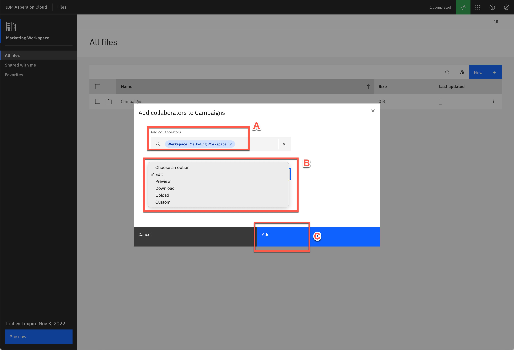
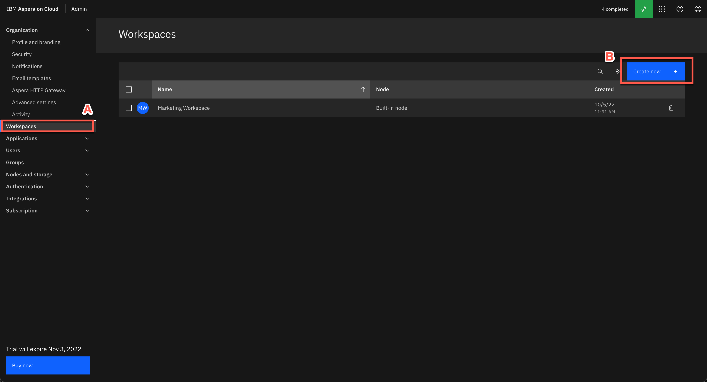
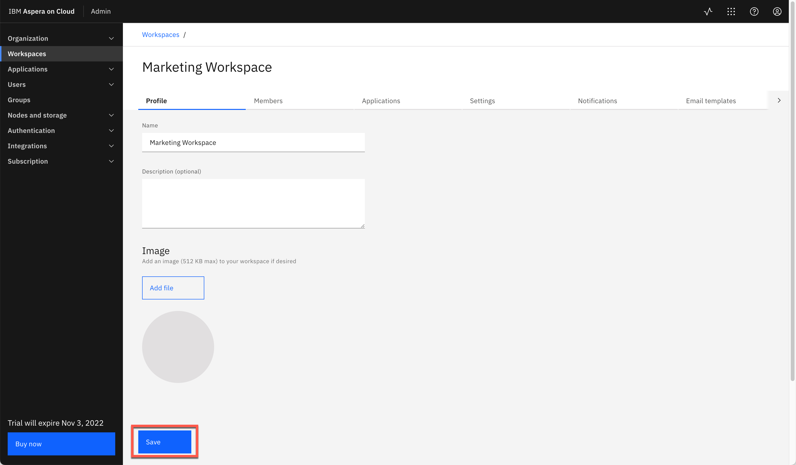
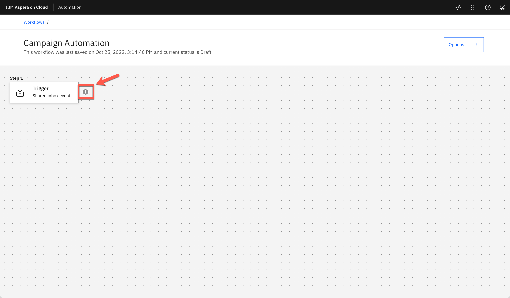
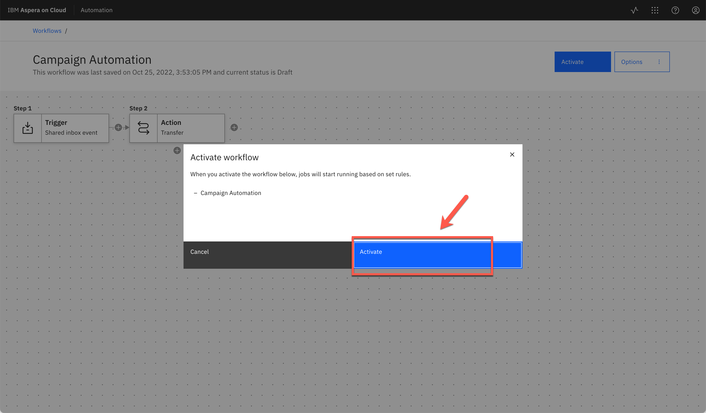
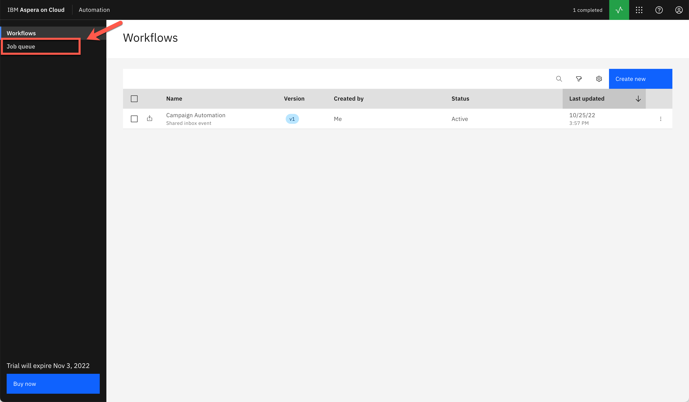

<FeatureCard
  title="Aspera on Cloud Demo for Technical Sales - Demo Script"
  color="dark"
  >

</FeatureCard>

Introduction

 
Hello everyone. Today we will demonstrate how Aspera on Cloud transfers, distributes, and synchronizes large files and data sets globally at maximum speed.
  
Today, businesses across industries are facing greater challenges moving large files and massive sets of data quickly and reliably between global sites and teams. Failing to meet these challenges can limit an organization’s ability to meet critical business imperatives that yield increased revenues, reduced costs, improved customer service, and new or improved business models.
  
As the size and volume of data continues to explode and permeate more business processes and decisions, the speed that data moves over the WAN becomes more crucial. However, most enterprise tools in use today cannot reliably and securely move large files and data volumes at high speed over global distances. This is due to the inherent limitations of the Internet’s underlying transfer technology called the Transmission Control Protocol (TCP).
  
Aspera FASP technology has the ability to move large amounts of data in a variety of ways, including both file transfer and streaming.  Regardless of the size of data - megabytes, gigabytes, or terabytes, we can transfer it quickly, securely, and reliably around the world.  Our solutions integrate the latest security technologies, practices and auditing practices to keep your data safe. Today's demo will focus on file transfer.  We will demonstrate the use of our Software as a Service solution Aspera on Cloud to upload and download files to a repository, send packages of files to another party and share files between different cloud storages.
  
This demo shows a typical file transfer scenario between different users in a company. Here we will see how to transfer, distribute, and synchronize files and data sets globally at maximum speed. We will learn how to accelerate collaboration with teams around the world on big data and large files. At the same time, we will see how to automate, monitor and control data transfers and workflows. By the conclusion of this demonstration, we will see how to copy and move files between different Cloud storages.   
Let’s get started!
  

(Demo intro slides <a href="./files/Aspera for TechSellers - Presentation.pptx" target="_blank" rel="noreferrer">here</a>)

 

1 - Accessing Aspera on Cloud

 

| **1.1** | **Accessing the Environment** |
| :--- | :--- |
| **Narration** | In this demo we are using Aspera on Cloud. Aspera on Cloud is IBM’s on-demand SaaS offering for global content transfer and exchange. The service enables organizations to move large files and data sets – securely and reliably – across on-premises and multi-cloud environments at unrivaled speed. Let’s see Aspera on Cloud in action. Let me begin by logging in.  |
| **Action** &nbsp; 1.1.1 | Open your Aspera on Cloud Demo organization URL. If you don't know your URL, open the <a href="https://ibmaspera.com/help/find-organizations" target="_blank">Welcome to IBM Aspera on Cloud page</a> and click on your organization on **Recently viewed organizations** (if you are not able to see your organization here, find your organization using your email address).     |
| **Action** &nbsp; 1.1.2 | Click **Log in with IBMid**. (If necessary enter your IBMid and password)  <br/  |

 

| **1.2** | **Welcome page** |
| :--- | :--- |
| **Narration** | Here we have our Aspera on Cloud organization. Using Aspera on Cloud, organizations can store and readily access files and folders in multiple cloud-based and on-premises storage systems. Sharing among users is as easy as browsing or dragging-and-dropping files – regardless of where the files are located – freeing collaboration from traditional boundaries among colleagues in both local and remote locations.    When we login the first time, we see the list of applications we have access to. Aspera on Cloud include multiples applications: Files to manage and share files and folders; Packages to send and download files; Activity to track usage and user activities; Automation to create automated tasks to simplify workflows and Admin to manage user and configure server settings. Users will only see and access applications that they have permission to use.    In this page, we can define a default app to open by default when we access or Aspera on Cloud organization. Let’s start using Files. |
| **Action** &nbsp; 1.2.1 | Describe and show all apps (don't click).     |
| **Action** &nbsp; 1.2.2 | Show how to make an app default (don't click).     |
| **Action** &nbsp; 1.2.3 | Open **Files**.     |

 

**[Go to top](#place1)**

2 - File Sharing

 

| **2.1** | **Create Folder** |
| :--- | :--- |
| **Narration** | Here we are in Marketing workspace. But what is a workspace? The workspace is a collection of Aspera on Cloud users working together—on a project perhaps, or in a department or division. Users in a given workspace can freely collaborate with other members of the same workspace.    The workspace name displays in the upper left corner, immediately below the app name (in this case: Files).  You may be a member of more than one workspace. You may have different permissions and access in one workspace than you do in another.    As a workspace member in the Files app, you have access to a collection of folders shared with you by your administrator and by other members of your workspace. When others share a folder, they may share it with you only, or they may share it with multiple people. Your collection of folders may be very different than the collection of another user in the same workspace, though you may share some of the same folders.    Right now, we don’t have any folders in our Workspace. Let’s create the first one. |
| **Action** &nbsp; 2.1.1 | Describe and show the Marketing Workspace (don't click).      |
| **Action** &nbsp; 2.1.2 | Click **New** (A), then click **Create folder** (B).      |
| **Action** &nbsp; 2.1.3 | Enter **Campaigns** as your folder name (A) and click **Create** (B).      |
 

| **2.2** | **Upload File** |
| :--- | :--- |
| **Narration** | Files app members with proper permission can upload files and folders from any accessible source to the app. Once the file or folder is uploaded, that user can share it with others. Until the file or folder is shared, it is visible and accessible only to the user who uploaded it. As part of Marketing team, we need to share a 200MB campaign media file with other members. Let’s see how easy and quick to do it using Aspera. |
| **Action** &nbsp; 2.2.1 | Open **Campaigns** folder.      |
| **Action** &nbsp; 2.2.2 | Click **New** (A) and click **Upload file** (B).      |
| **Action** &nbsp; 2.2.3 | If Aspera Connect request permission to access your computer, click **Yes**.      |
| **Action** &nbsp; 2.2.4 | Feel free to select a file based in your network bandwith. If you have a good network, select a large file, for example 200 MB.      |
 

| **2.3** | **File Transfer** |
| :--- | :--- |
| **Narration** | Aspera on Cloud uses IBM Aspera’s FASP protocol, which overcomes the limitations of other file-transfer technologies. By moving large data sets at maximum speed, reliably and securely – regardless of network conditions, physical distance between sites, and file size, type, or number – Aspera technology enables a new world of collaboration, sharing, and content delivery. Let’s see here, how fast is to transfer this large file. |
| **Action** &nbsp; 2.3.1 | Click on **Transfer Activity** button.      |
| **Action** &nbsp; 2.3.2 | Show the **Transfer Activity details**.      |
| **Action** &nbsp; 2.3.3 | Close the **Transfer Activity dialog**.      |
 

| **2.4** | **Share with collaborators** |
| :--- | :--- |
| **Narration** | From the Files app we can easily Download, Move, Copy, Favorite, Send in package, and for some files we are able to Preview (for example PDFs, videos and images).  Now, let’s see how to share a folder. Let’s go back to our All Files view.    Sharing folders using the Aspera on Cloud Files app is like collaborating using a shared file repository. Each user has access to certain folders in the repo, with specific permissions to each folder. Files app users can share their folders with others, assigning content permissions to each recipient. Keep in mind that if you upload to your Files app, no one sees your folder until you share it with them. Let’s share our folder, by clicking on context menu and select Share.    In share dialog we can share with a member. We just need to enter the member’s email id. Another possibility is to enter a Workspace name to share with all workspace members. After that, we just need to define the Permissions. Behind the scenes, the user will receive an email about the Share event. Great! our folder is accessible for all members of the Workspace. Later in this demo we will see how to add users in your workspace. |
| **Action** &nbsp; 2.4.1 | Select the **200 MB file checkbox** (A). Show the actions available (B). Click **Cancel** (C).       |
| **Action** &nbsp; 2.4.2 | On breadcrumbs, click on **All files** link.      |
| **Action** &nbsp; 2.4.3 | Click on **Menu** (A) and click **Share** (B).      |
| **Action** &nbsp; 2.4.4 | In the *Add collaborators* field, enter **Marketing Workspace** (A), show the different type of *Permissions* but keep **Edit** (B), then click **Add** (C).      |
 

**[Go to top](#place1)**

3 - Working with Packages

 

| **3.1** | **Sending Files** |
| :--- | :--- |
| **Narration** | So far we explored the basic functions about File app, now let’s explore the Package app! In the Packages app, a package is a collection of digital assets (files, folders, video, images, etc.) that you gather to send to one or more individuals or user groups, or to an Aspera on Cloud shared inbox.    Sending files and folders using the Aspera on Cloud Packages app is very much like sending an email with attachments. Senders use a simple form to address recipients and attach content. Recipients receive a copy of the content and can download it to use however they want.    Here, we can select files from your local machine or select a file from the Files app. And we can easily add a password protection layer. |
| **Action** &nbsp; 3.1.1 |  Click on **App switcher** button (A) and select **Packages** (B).      |
| **Action** &nbsp; 3.1.2 |  Click **Send files** button.      |
| **Action** &nbsp; 3.1.3 |  Enter an **external user email** in *To* field (A), enter a Title (e.g.: **Summer Campaign**) (B), click **Add files** (C) and select **Files** (D).       |
| **Action** &nbsp; 3.1.4 |  Go ahead and select a file from your local machine.      |
| **Action** &nbsp; 3.1.5 |  Now click **Add Files** (A) again and now select **Upload from Files** (B).      |
| **Action** &nbsp; 3.1.6 |  Open the **Campaigns** folder (A), select the campaign **file** (B) and click **Add** (C).      |
| **Action** &nbsp; 3.1.7 |  Now click **Send**.       |
| **Action** &nbsp; 3.1.8 |  Open the **Transfer activity dialog**  (A) to show the **files transfer** (B).      |
 

| **3.2** | **Downloading a Package** |
| :--- | :--- |
| **Narration**  | Let’s see how an external user receives a package. Now, we are an external user (for example: a designer from an external Marketing agency). The designer has received an email notifying about them about the new package.    Great! Without any previous registration the user can download one or more files. Notice that a password was not requested. That’s because we didn’t configure it in the last step, it’s optional. Isn’t it easy? |
| **Action** &nbsp; 3.2.1 | Open external user email. Open the Aspera on Cloud email. Click on **Open IBM Aspera on Cloud**.      |
| **Action** &nbsp; 3.2.2 | You are welcome to download one or more files and show how fast is the download using Aspera on Cloud.      |
 

| **3.3** | **Creating a Submission Link** |
| :--- | :--- |
| **Narration**  | When we need to ask another person to send us files and folders, we can send a submission link. A submission link is a feature of the Packages app. Let’s see how to manage submission links.    When we send a submission link, Aspera on Cloud sends an email notification to our recipients. The notification includes the submission link, which allows them to send us a digital package using Aspera’s high-speed transfer technology, whether or not they have an Aspera account. |
| **Action** &nbsp; 3.3.1 | If necessary, close the *Transfer activity dialog*.      |
| **Action** &nbsp; 3.3.2 | Click **Manage submission links**.      |
| **Action** &nbsp; 3.3.3 | On the Manage links page, click **New link**.      |
| **Action** &nbsp; 3.3.4 | Click **Send** button.      |
| **Action** &nbsp; 3.3.5 | On the *Send link* field, enter the **external user email** (A). On the *Message* field, type any message (B). Then click **Send** (C).      |
 

| **3.4** | **Sending Files with a Submission Link** |
| :--- | :--- |
| **Narration**  | Now, let’s play the role of the external Marketing Designer. When a recipient clicks the submission link in the email notification, Aspera presents a sending portal that allows the user to collect the files and folders we asked for and send them to us in a digital package. The recipient of our invitation can send any number of packages until the link expires or until we revoke the link. |
| **Action** &nbsp; 3.4.1 | Log in back to the external user email. And check the new email from Aspera On Cloud. Click on **Open IBM Aspera on Cloud** button.      |
| **Action** &nbsp; 3.4.2 | In the *Send files* form, enter the **Designer's name** (A), enter the **external user email** (B), enter a title: **Campaign Logos** (C), include one or more files (D). Click **Send** (E).         |
 

| **3.5** | **Receiving Files with a Submission Link** |
| :--- | :--- |
| **Narration**  | Back as the marketing employee, the file we requested appears in My inbox. &nbsp; &nbsp; &nbsp; &nbsp; &nbsp; &nbsp; &nbsp; &nbsp; &nbsp; &nbsp; &nbsp; &nbsp; &nbsp; &nbsp; &nbsp; &nbsp; &nbsp; &nbsp; &nbsp; &nbsp; &nbsp; &nbsp; &nbsp; &nbsp; &nbsp; &nbsp; &nbsp; &nbsp; &nbsp; &nbsp; &nbsp; &nbsp; &nbsp; &nbsp; &nbsp; &nbsp; &nbsp; &nbsp; &nbsp; &nbsp; &nbsp; &nbsp; &nbsp; &nbsp; &nbsp; &nbsp; &nbsp; &nbsp; &nbsp; &nbsp; &nbsp; &nbsp; &nbsp; &nbsp; &nbsp; &nbsp; &nbsp; &nbsp; &nbsp; &nbsp; &nbsp; &nbsp; &nbsp; &nbsp; &nbsp; &nbsp; &nbsp; &nbsp; &nbsp; &nbsp; &nbsp; &nbsp; &nbsp; &nbsp; &nbsp; &nbsp; &nbsp; &nbsp; &nbsp; &nbsp; &nbsp; &nbsp; &nbsp; &nbsp; |
| **Action** &nbsp; 3.5.1 | Back to Marketing employee's browser, click on **My inbox**. &nbsp; &nbsp; &nbsp; &nbsp; &nbsp; &nbsp; &nbsp; &nbsp; &nbsp; &nbsp; &nbsp; &nbsp; &nbsp; &nbsp; &nbsp; &nbsp; &nbsp; &nbsp; &nbsp; &nbsp; &nbsp; &nbsp; &nbsp; &nbsp; &nbsp; &nbsp; &nbsp; &nbsp; &nbsp; &nbsp; &nbsp; &nbsp; &nbsp; &nbsp; &nbsp; &nbsp; &nbsp; &nbsp; &nbsp; &nbsp; &nbsp; &nbsp;  &nbsp; &nbsp; &nbsp; &nbsp; &nbsp; &nbsp; &nbsp; &nbsp; &nbsp; &nbsp; &nbsp; &nbsp; &nbsp; &nbsp; &nbsp; &nbsp; &nbsp; &nbsp; &nbsp; &nbsp; &nbsp; &nbsp; &nbsp; &nbsp; &nbsp; &nbsp; &nbsp; &nbsp; &nbsp; &nbsp; &nbsp; &nbsp; &nbsp; &nbsp; &nbsp; &nbsp; &nbsp; &nbsp; &nbsp; &nbsp; &nbsp; &nbsp;      |
| **Action** &nbsp; 3.5.2 | Open the new package (A). And show the files in this package (B).     |
| **Action** &nbsp; 3.5.3 | When ready, **close** the package dialog.     |
 

| **3.6** | **Creating a Shared Inbox** |
| :--- | :--- |
| **Narration**  | Now, let’s check the Shared Inbox concept. A shared inbox is an optional workspace feature similar to a drop box: we can send content directly and simultaneously to all members of the shared inbox without having to address it to particular users or user groups. Let’s create one shared inbox!    Initially we need to enter basic information, for example, a name. Now, we can define more details for this shared inbox. For example, add members, manage links, define settings and email notifications.    As a workspace manager, we can configure metadata fields. When present, these fields allow senders to apply metadata tags to packages they send to a shared inbox; these tags provide information about the package contents without requiring the recipient to open the package. The metadata also allows shared inbox members to search and sort packages easily. If any metadata data fields are required, we cannot send the package without addressing the required field.    Let’s add two metadata fields in our A/B Testing inbox. First a Date-time field to inform the Test Date, and second a Dropdown menu to select the Test Campaign. |
| **Action** &nbsp; 3.6.1 | Click on **Manage shared inboxes**.      |
| **Action** &nbsp; 3.6.2 | Click **Create new**.     |
| **Action** &nbsp; 3.6.3 | Enter a *Name* for your shared inbox (e.g.: **A/B Testing**) (A) and click **Save** (B).    |
| **Action** &nbsp; 3.6.4 | Show the **Members** tab.    |
| **Action** &nbsp; 3.6.5 | Show the **Manage links** tab.    |
| **Action** &nbsp; 3.6.6 | Show the **Settings** tab.    |
| **Action** &nbsp; 3.6.7 | Open **Metadata** tab (A) and click **Add field** (B).    |
| **Action** &nbsp; 3.6.8 | Define the metadata as **Date-time** Type (A), **Test Date** as *Label* (B), and *Required* as **On** (C). Click **Save** (D).    |
| **Action** &nbsp; 3.6.9 | Click **Add field** button again.    |
| **Action** &nbsp; 3.6.10 | Now, define the metadata as **Dropdown menu** *Type* (A), enter **Campaign** as *Label* (B), click *four* times on **Add Option** button (C) to add the options: **Spring, Summer, Fall and Winter** (D). Click **Save** (E).    |
| **Action** &nbsp; 3.6.11 | Click **Save**.     |
 

| **3.7** | **Submitting a Package to a Shared Inbox** |
| :--- | :--- |
| **Narration**  | Let’s test it! To do this we need to send files to our A/B Testing shared inbox. Enter the basic package information, next enter the specific package metadata for our A/B Testing shared inbox.    Now all members of our Shared inbox will receive a notification about the new package. We can check it by accessing our A/B Testing. From here we can explore each package with all the assets and metadata. |
| **Action** &nbsp; 3.7.1 | Click **Send files**.     |
| **Action** &nbsp; 3.7.2 | Click on To field and select **Shared Inbox: A/B Testing** (A), enter **B2B Site A/B Testing** as *Title* (B), click **Add files** (C), include some files from your machine (D) and click **Next** (E).      |
| **Action** &nbsp; 3.7.3 | Enter a *Test Date* (A) and select **Summer** as *Campaign* (B). Click **Send** (C).     |
| **Action** &nbsp; 3.7.4 | Open the **A/B Testing** inbox.      |
| **Action** &nbsp; 3.7.5 | Click to open the **B2B Site A/B Testing** package (A). On the **Assets** tab (B), you can show the file shared with all inbox members (C).     |
| **Action** &nbsp; 3.7.6 | Open the **Metadata** tab (A), to show the package metadata (B).      |
| **Action** &nbsp; 3.7.7 | **Close** the Package dialog.     |
 

**[Go to top](#place1)**

4 - Administering Workspaces and Users

 

| **4.1** | **Create Workspace** |
| :--- | :--- |
| **Narration** | Now, let's explore the basic Administration features of Aspera on Cloud. We’ll start with Workspace creation. As I explained earlier, the workspace is a collection of users working together. The users, packages, files, and folders in one workspace are completely separate from those in another workspace.  So far, we have only one workspace in our organization: Marketing Workspace. Let's create another one: Sales Workspace.   Using the workspace admin page, we can add members to a workspace, define workspace settings or configure the applications available in the Workspace.|
| **Action** &nbsp; 4.1.1 | Open the **App switcher** menu (A) and select **Admin** (B).      |
| **Action** &nbsp; 4.1.2 | In the **Workspaces** (A) page, click **Create new** (B).      |
| **Action** &nbsp; 4.1.3 | Enter **Sales Workspace** as *Name* (A). Keep the default Storage location. Then click **Create** (B).     |
| **Action** &nbsp; 4.1.4 | Show the Workspace administration capabilities.     |
 

| **4.2** | **Shared Folders** |
| :--- | :--- |
| **Narration** | Let's explore the Applications tab to define some Applications settings for this new Workspace. By selecting the Files app, we can unselect the use of global app settings and define specific configurations for the Files app in this new workspace, for example, we can define who can share folders via public links.   Now, let's see how to define a Shared folder in a Workspace. First, we need to create the folder, then give permission to all workspace members.  Before we test it, we need to add our user as member of this workspace. Let's do it!   Great! Now we are ready to test it. We just need to open the Files app. Switch to the new Sales Workspace. Voilá! we can see the Shared folder that we have just created and shared with all workspace members.|
| **Action** &nbsp; 4.2.1 | Open the **Applications** tab (A) and click on **Files** app (B).      |
| **Action** &nbsp; 4.2.2 | Uncheck the **Use global app settings** (A) and show some *Collaboration settings* (B).       |
| **Action** &nbsp; 4.2.3 | Click **Shared folders**.     |
| **Action** &nbsp; 4.2.4 | Click **Create new**.     |
| **Action** &nbsp; 4.2.5 | Copy and Paste the **Secret** of your Access Key (check in Demo Preparation how to do it) (A) and click **Log in** (B).      |
| **Action** &nbsp; 4.2.6 | Click **Create folder**.      |
| **Action** &nbsp; 4.2.7 | Enter **Sales Enablement** as folder Name (A). Click **Create** (B).     |
| **Action** &nbsp; 4.2.8 | Select **Sales Enablement** (A) and click **Submit** (B).     |
| **Action** &nbsp; 4.2.9 | Click **Add all workspace members**.      |
| **Action** &nbsp; 4.2.10 | Keep the default values and click **Add**.      |
| **Action** &nbsp; 4.2.11 | On the breadcrumbs menu, click on **...** (three dots) link (A). And select **Sales Workspace** (B).     |
| **Action** &nbsp; 4.2.12 | Open the **Members** tab (A) and click on **Add members** button (B).     |
| **Action** &nbsp; 4.2.13 | On the *Search for new members* field, enter and select your user (A) and click on **Add** (B).      |
| **Action** &nbsp; 4.2.14 | Click to **Refresh** the page.      |
| **Action** &nbsp; 4.2.15 | Open the **App switcher** menu again (A) and select **Files** (B).     |
| **Action** &nbsp; 4.2.16 | Open the Workspace **menu** (A) and select **Sales Workspace** (B).     |
| **Action** &nbsp; 4.2.17 | Show the new **Sales Enablement**, shared folder.     |
 

| **4.3** | **Manage Users** |
| :--- | :--- |
| **Narration** | Let's see how to manage users in our organization. Back to the Admin app, we need to open the Users and Management menu. From here we can see all registered users and their status. Let's create a new user.   Now that we have the new user invited to join our organization, let's define his or her workspace membership.  We can easily add a new membership, by defining a role as a workspace manager in our Sales Workspace. Another way to manage users is using Group. The process is almost the same.|
| **Action** &nbsp; 4.3.1 | Open the **App switcher** menu (A) and select **Admin** (B).      |
| **Action** &nbsp; 4.3.2 | Open **Users > Management** menu (A) and click **Create new** (B).      |
| **Action** &nbsp; 4.3.3 | On the *Invite people to join this organization* enter a user id (A). Then click **Create** (B).     |
| **Action** &nbsp; 4.3.4 | Open the **Workspace memberships** tab (A). And click on **Add workspace memberships** (B).     |
| **Action** &nbsp; 4.3.5 | On the *Role* field, select **Workspace manager** (A), on the *Search for workspaces* field, type and select **Sales Workspace** (B). And click **Add** (C).      |
| **Action** &nbsp; 4.3.6 | On the breadcrumbs menu, click on **Users**.      |
| **Action** &nbsp; 4.3.7 | Here you can show the new user as *Pending* status.     |
 

**[Go to top](#place1)**

5 - Monitoring Activities

 

| **5.1** | **Transfer Activity** |
| :--- | :--- |
| **Narration** | Let’s explore the monitoring capabilities of Aspera on Cloud. The Activity app shows app events and the performance, history, and usage for file transfers. Activity’s responsive engine streams log data to the web application, generating interactive visualizations of real-time and historical data.    Let’s explore the first capability: Transfer activity. Here we can view historic and live transfer activity based on filters.    This page displays real-time and historical transfer data for the organization. It includes context for a given transfer, such as the time of the transfer and whether it completed or failed. We can also review performance data for the resources (workspaces, nodes, and users) associated with your workspace. This can help us identify issues in the system; for example, an inactive server may need to be evaluated for connectivity issues.    And we can easily export the data into a .CSV file and use in any other Data Visualization tool. |
| **Action** &nbsp; 5.1.1 | Open the **App switcher** menu (A) and select **Activity** (B).      |
| **Action** &nbsp; 5.1.2 | On the **Transfer activity** page (A), change the filter to show more data (B). Show the information on top of the page (C).     |
| **Action** &nbsp; 5.1.3 | Scroll down the page, and show the information on bottom of the page.     |
| **Action** &nbsp; 5.1.4 | Click **Export**.     |
| **Action** &nbsp; 5.1.5 | Keep the default name (A) and click **Export** (B). You are welcome to show the downloaded CSV file.     |
 

| **5.2** | **Volume Usage** |
| :--- | :--- |
| **Narration** | Exploring some more, let’s take a look at the second capability of the Activity app: Volume Usage.    Use the Volume usage page to monitor transfer volume for our entire organization or filtered by each component of the transfer system: entitlements, nodes, access keys, workspaces, and users. We can zoom in to data based on configurable time spans.    The graph displays aggregate volume data for a selected time period. The graph is interactive. We can hover over any bar on the graph to see upload and download values for that point in time. |
| **Action** &nbsp; 5.2.1 | Click on **Volume usage**.      |
| **Action** &nbsp; 5.2.2 | Hover over any bar on the graph to see upload and download values for that point in time.      |
 

| **5.3** | **File Access** |
| :--- | :--- |
| **Narration** | Let’s see the File Access capability. The File access page displays file accesses by user name or file name.    For example, here we can see all file permissions assigned to our current user. We can use the pagination buttons to check all files.    Another possibility is to use the search field to check the users who have permissions to a specific file. Let’s try it with Campaigns files.    Here we can see the users and the permissions that they have in this file. In this case, it is only one user. |
| **Action** &nbsp; 5.3.1 | Click on **File access**.     |
| **Action** &nbsp; 5.3.2 | By default, the first view of File access page will show all the file permissions assigned to the current user (A), maybe it is necessary to use next page button to find a useful file (B).     |
| **Action** &nbsp; 5.3.3 | On the search field, enter **Campaigns** as the file name (A) and select one of the file that you see in the result dialog (B).     |
| **Action** &nbsp; 5.3.4 | Show the user and permission in this specific file.     |
 

| **5.4** | **Application Events** |
| :--- | :--- |
| **Narration** | We arrived at the final capability to explore, the Application events page.    The Application events page displays data for all app events, filterable by event type (such as user login or file creation), and time. Here we can get insights into events throughout our Aspera on Cloud applications, for security and monitoring purposes.    We can monitor different types of events, some examples include: Log in, log out; workspace creation or deletion; packages sent, received or downloaded; File uploaded; Folder shared; or even when a User has left a shared folder. |
| **Action** &nbsp; 5.4.1 | Click on **Application events**.     |
| **Action** &nbsp; 5.4.2 | Filter by specific **date**.     |
| **Action** &nbsp; 5.4.3 | Show and filter by specific Event type (e.g.: **Sent a package**).     |

 

**[Go to top](#place1)**

6 - Sharing files between Cloud Storages 

 

| **6.1** | **Attach your IBM Cloud storage** |
| :--- | :--- |
| **Narration** | We can attach an existing Cloud storage to your Aspera on Cloud organization. Once attached, we can make the bucket and its contents available to our users in the form of administratively shared folders.  To attach our Cloud Storages in Aspera on Cloud, we need to create nodes. An IBM Aspera node is a computing machine (physical, virtual, or container) on which IBM Aspera High-Speed Transfer Server software is installed. The Aspera on Cloud subscription comes provisioned with one node, managed by IBM Aspera and connected to storage in IBM Cloud. We can connect additional storage to our Aspera on Cloud organization, either by attaching our own IBM Aspera HSTS node or cluster, or by using Aspera Transfer Service (ATS), the Aspera-managed auto-scaling transfer cluster.  Now, let's use the Admin app to create a new node using IBM Cloud Object Storage (COS). On the new node page, let's attach a cloud storage. Here we enter all the details of our IBM Cloud Object Storage. It is important to highlight that our IBM Cloud Storage must be in a region that is supported by the transfer service. In this demo, we will use a Storage in the United States South region. Now, we just need to enter access key and secret profile.  Great, here we have our IBM COS node. We just need to save the node access key and secret, because we will need that later to manage this node.|
| **Action** &nbsp; 6.1.1 |  Open the **App switcher** menu (A) and select **Admin** (B).    |
| **Action** &nbsp; 6.1.2 |  Open the **Nodes and storage** menu (A) and click on **Nodes** page (B).    |
| **Action** &nbsp; 6.1.3 |  Click **Create new**.     |
| **Action** &nbsp; 6.1.4 |  Click **Attach my cloud storage**.    |
| **Action** &nbsp; 6.1.5 |  Enter **IBM-COS** as *Name* (A). Select **IBM COS** as *Storage*  (B). Select **us-south** as *Region* (C). Paste your **access_key_id** in *Access key ID* field (D), copied in the Demo Preparation part. Paste your **secret_access_key** in *Access key* secret field (E), copied in the Demo Preparation part.  Paste the **Bucket name** in Bucket field (F), copied in the Demo Preparation part. Enter **/** in *Path* field (G). Then click **Create** (H).     |
| **Action** &nbsp; 6.1.6 |  **Download** or take notes of your IBM-COS node **Access key** (A) and **Secret** (B). You will need them later. **Close** the dialog (C).    |
| **Action** &nbsp; 6.1.7 |  Paste your **IBM-COS Secret** (A) and click **Log in** (B).     |
 

| **6.2** | **Attach your Azure Blob storage (Optional)** |
| :--- | :--- |
| **Narration** | Now, let's create a new node using Azure Blob Storage. Let's repeat the same steps, but now let's select Azure Blob Storage. It is important to highlight that our Azure Storage must be in a region that is supported by the transfer service. In this demo, we will use a Storage in the U.S. South region. As before we have to enter access key and secret profile.  Great, here we have our Azure node. We just need to save the node access key and secret, because we will need that later to manage this Azure node. |
| **Action** &nbsp; 6.2.1 |  On the *Breadcrumbs*, click on **Nodes**.    |
| **Action** &nbsp; 6.2.2 |  Click **Create new**.    |
| **Action** &nbsp; 6.2.3 |  Click **Attach my cloud storage**.    |
| **Action** &nbsp; 6.2.4 |  Enter **Azure** as *Name* (A). Select **Microsoft Azure Blob** as *Storage*  (B). Select **eastus** as *Region* (C). Select **Block** as *API type* (D). Select **Key** as *Storage credentials* (E). Paste your **Storage account name** in *Storage account* field (F), copied in the Demo Preparation part. Paste your **Key** in *Key* field (G), copied in the Demo Preparation part.  Copy the **Container name** in *Container* field (H).     |
| **Action** &nbsp; 6.2.5 |  Enter **/** in *Path* field (A). Then click **Create** (B).     |
| **Action** &nbsp; 6.2.6 |  **Download** or take notes of your Azure node **Access key** (A) and **Secret** (B). You will need them later. **Close** the dialog (C).    |
| **Action** &nbsp; 6.2.7 |  Paste your **Azure** (A) and click **Log in** (B).    |
 

| **6.3** | **Create Shared Folders using IBM-COS node** |
| :--- | :--- |
| **Narration** | Now that we have our nodes attached with Cloud Storage, we can use them to support a workspace. Let's create a Shared Folder using IBM-COS in Marketing Workspace. Let's open the Marketing Workspace configuration page. In the Files Application settings, let's create a Shared Folder. But now, we will use the IBM-COS storage. Let's take advantage this UI to create a new folder in the IBM Cloud Object Storage. Now the IBM-COS share folder is created, let's share this with all Workspace members. |
| **Action** &nbsp; 6.3.1 |  Click on **Workspaces**.    |
| **Action** &nbsp; 6.3.2 |  Click on **Marketing Workspace**.    |
| **Action** &nbsp; 6.3.3 |  Open the **Applications** tab (A) and click on **Files** app (B).    |
| **Action** &nbsp; 6.3.4 |  Click **Shared folders**.    |
| **Action** &nbsp; 6.3.5 |  Click **Create new**.    |
| **Action** &nbsp; 6.3.6 |  Select **IBM-COS** node (A). Paste the Secret of your IBM-COS node (B) and click **Log in** (C).    |
| **Action** &nbsp; 6.3.7 |  Click **Create folder**.    |
| **Action** &nbsp; 6.3.8 |  Enter **Campaigns** as folder Name (A). Click **Create** (B).    |
| **Action** &nbsp; 6.3.9 |  Enter **IBM-COS** as *Display name* (A) and click **Submit** (B).    |
| **Action** &nbsp; 6.3.10 |  Click **Add all workspace members**.    |
| **Action** &nbsp; 6.3.11 |  Keep the default values and click **Add**.     |
| **Action** &nbsp; 6.3.12 |  On the breadcrumbs menu, click on **Shared folders**.    |
 

| **6.4** | **Create Shared Folders using Azure node (Optional)** |
| :--- | :--- |
| **Narration** | Now, let's repeat the same steps using the Azure Blob Storage. Let's create a Testing folder in the Azure storage. And share the Azure shared folder with all workspace members. |
| **Action** &nbsp; 6.4.1 |  Click **Create new**.    |
| **Action** &nbsp; 6.4.2 |  Select **Azure** node (A). Paste the **Secret** of your Azure node (B) and click **Log in** (C).    |
| **Action** &nbsp; 6.4.3 |  Click **Create folder**.    |
| **Action** &nbsp; 6.4.4 |  Enter **Testing** as folder Name (A). Click **Create** (B).    |
| **Action** &nbsp; 6.4.5 |  Enter **Azure** as *Display name* (A) and click **Submit** (B).    |
| **Action** &nbsp; 6.4.6 |  Click **Add all workspace members**.    |
| **Action** &nbsp; 6.4.7 |  Keep the default values and click **Add**.     |
| **Action** &nbsp; 6.4.8 |  On the breadcrumbs menu, click on **...** (three dots) link (A). And select **Marketing Workspace** (B).    |
| **Action** &nbsp; 6.4.9 |  Click **Save**.     |
| **Action** &nbsp; 6.4.10 |  Click **Refresh**.     |
 

| **6.5** | **Copy files between different Cloud Providers (Optional)** |
| :--- | :--- |
| **Narration** | Great, now we should have two folders in our Marketing Workspace, one is showing files in IBM Cloud Object Storage and other is showing files in Azure Blob Storage. Let's check them!   We just need to open the Files app, and voilá! we have our two shared folders using different cloud providers. Let's see the files there!   Here we have the Azure Shared folder. This New Site Project file and the Testing folders are stored in Azure Blob Storage. Now, let's explore the IBM-COS shared folder. The Campaign Video and the Campaigns folder are stored in IBM Cloud Object Storage.   Now, let's see how easy is to use Aspera UI to copy or move files between different Cloud Storages. We just need to select the file and click copy. Then select the other Storage folder. It is easy, isn't? And more, you are using the IBM Aspera's FASP protocol, which overcomes the limitations of other file-transfer technologies. With this technology you can move large data sets at maximum speed.   Here we are transferring file from IBM Cloud Object Storage to Azure Blob Storage, but we can do that with other Cloud Providers too, including AWS S3 and Google Cloud Storage.|
| **Action** &nbsp; 6.5.1 |  Open the **App switcher** menu (A) and select **Files** (B).    |
| **Action** &nbsp; 6.5.2 |  On the Workspace switcher (A), change to **Marketing Workspace** (B).     |
| **Action** &nbsp; 6.5.3 |  Open the **Azure** folder.    |
| **Action** &nbsp; 6.5.4 |  Show the file available in Azure Blob Storage (A) and show the folder created in the previous section (B).    |
| **Action** &nbsp; 6.5.5 |  On the *Breadcrumbs*, click on **All files**.    |
| **Action** &nbsp; 6.5.6 |  Click on **IBM-COS** folder.    |
| **Action** &nbsp; 6.5.7 |  Show the file available in IBM Cloud Object Storage (A) and show the folder created in the previous section (B).     |
| **Action** &nbsp; 6.5.8 |  Click the **Checkbox** (A) of *Campaign Video* file and click **Copy** (B).    |
| **Action** &nbsp; 6.5.9 |  Click **Azure** folder (A) and click **Copy** (B).     |
| **Action** &nbsp; 6.5.10 |  **Open** the *Transfer activity* dialog (A) and show the **node to node** transfer (B).     |
| **Action** &nbsp; 6.5.11 |  **Close** the *Transfer activity* dialog (A) and open the **All files** link on *Breadcrumbs* (B).    |
| **Action** &nbsp; 6.5.12 |  Open the **Azure** folder.     |
| **Action** &nbsp; 6.5.13 |  Show the **Campaign Video** file.     |
| **Action** &nbsp; 6.5.14 |  You are welcome to repeat the steps and now copy the New Site Project file from Azure to IBM-COS. |
 

**[Go to top](#place1)**

7 - Automating your transfer workflows

 

| **7.1** | **Create a Workflow** |
| :--- | :--- |
| **Narration** | The Automation app in Aspera on Cloud lets us create automated workflows that initiate file transfers, make calls to an API, and send notifications to users. In this part of the demo we will explore this app, its components, key concepts for automated workflows and jobs, and provides an example use case, to copy files received in a Shared Inbox to a Third party cloud storage. Let's get started!  Here in the Automation app, we begin by creating a new Campaign Automation workflow. |
| **Action** &nbsp; 7.1.1 |  Open the **App switcher** menu (A) and select **Automation** (B).    |
| **Action** &nbsp; 7.1.2 |  Click **Create new**.    |
| **Action** &nbsp; 7.1.3 |  Enter **Campaign Automation** as workflow *Name* (A). Click **Submit** (B).     |
 

| **7.2** | **Define a Trigger** |
| :--- | :--- |
| **Narration** | The first thing we need to define is how to trigger the workflow. Workflow triggers include scheduled or time based events; file, folder, and shared inbox events; and so on. For our demo, let's use a Shared inbox event. In this case, the workflow will start when a package arrives in an inbox.   Let's select the A/B Testing inbox that we created previously in the Marketing Workspace. |
| **Action** &nbsp; 7.2.1 |  Click **Shared inbox event**.    |
| **Action** &nbsp; 7.2.2 |  Type and select **Marketing Workspace** in *Workspace* field (A). In **Shared inbox**, select the **A/B Testing** (B). Keep all the other values as default. Click **Save** (C).     |
 

| **7.3** | **Define an Action** |
| :--- | :--- |
| **Narration** | Now, we need to define an action to be executed after the workflow trigger. Workflow actions include transfer, send a package, notify, call an API, and so on. In this demo, let's use a Transfer action. This action will transfer the files received in the Shared inbox to a Node folder. In our case, the workflow will copy the files to Azure Testing folder. |
| **Action** &nbsp; 7.3.1 |  Click on the **Add step (+)** button.    |
| **Action** &nbsp; 7.3.2 |  Select **Transfer** as action type.    |
| **Action** &nbsp; 7.3.3 |  Open the **Source of your transfer** section (A). On the *Source location* field, select **Same as trigger** (B). Open the **Destination of your transfer** section (C). On *Select a folder* field, select **On a node** (D).  Click **Select a node** button (E).     |
| **Action** &nbsp; 7.3.4 |  Select **Azure** as node Name (A).  And paste your **Azure Node Secret** (B). Click **Log in** (C). Note: If you didn't create an Azure Trial account because the Credit Card issue, no problem, go ahead and select IBM-COS as node. Any external node storage works for this scenario.     |
| **Action** &nbsp; 7.3.5 |  Select the **Testing** folder, or any other folder available in your node (A) and click **Select** (B).    |
| **Action** &nbsp; 7.3.6 |  Keep the other values as default and click **Save**.     |
 

| **7.4** | **Testing the Workflow** |
| :--- | :--- |
| **Narration** | Great, our workflow is ready. Before we test it, let's activate it! To activate the workflow we’ll  submit a file to our A/B Testing Shared inbox in Package app.   We just need to select a file to submit, and inform the package metadata, including the Test Date and Campaign type.   Great, our file was submitted. |
| **Action** &nbsp; 7.4.1 |  Click **Activate**.    |
| **Action** &nbsp; 7.4.2 |  Click **Activate** again.    |
| **Action** &nbsp; 7.4.3 |  Open the **App switcher** menu (A) and select **Packages** (B).    |
| **Action** &nbsp; 7.4.4 |  Click **Send files**.    |
| **Action** &nbsp; 7.4.5 |  Select **A/B Testing** Shared inbox in *To* field (A). Enter a *Title* (e.g.: **Mobile App A/B Testing**) (B). Click **Add files > Files** button (C). And select a file (e.g.: 10 Mb) in your local machine (D). Click **Next** (E).    |
| **Action** &nbsp; 7.4.6 |  Enter a **Test Date** (A). Select a *Campaign* type (e.g.: **Fall**) (B). And click **Send** (C).    |
| **Action** &nbsp; 7.4.7 |  **Open** the *Transfer activity* dialog (A). Check the *File Uploading* message (B). When is done, **close** the *Transfer activity* dialog (C).     |
 

| **7.5** | **Check the Automation** |
| :--- | :--- |
| **Narration** | Now, let's check our automation. Back to the Automation app, let's open the Job queue page.   In this page, we can see all running, queued and completed jobs. After few minutes, we can see that our first campaign automation job is completed. Here we can see the job details.   Let's use our Azure shared folder in Files app to confirm that our file was copied to Azure Blob Storage.   Great, here we can see the file that we sent using the Package app. It was copied to Azure. With this simple automation, it is easy to enable teams that are using other cloud providers to collaborate and work with different files and take advantage of fast file sharing of Aspera on Cloud to move large files around the globe.   We have arrived at the conclusion of our demonstration.|
| **Action** &nbsp; 7.5.1 |  Open the **App switcher** menu (A) and select **Automation** (B).    |
| **Action** &nbsp; 7.5.2 |  Click **Job queue**.    |
| **Action** &nbsp; 7.5.3 |  Open the **Campaign Automation** *job* to see the *Job details* dialog.    |
| **Action** &nbsp; 7.5.4 |  Open and show the **Step 1 - Trigger** section (A). Open and show the **Step 2- Action** section (B). **Close** the Job details dialog.    |
| **Action** &nbsp; 7.5.5 |  Open the **App switcher** menu (A) and select **Files** (B).    |
| **Action** &nbsp; 7.5.6 |  Open the **Azure** folder (or any other Storage node folder that you are using in the Automation Workflow).    |
| **Action** &nbsp; 7.5.7 |  Open the **Testing** folder (or any other folder that you are using the Automation Workflow)    |
| **Action** &nbsp; 7.5.8 |  Open the **contents** folder.    |
| **Action** &nbsp; 7.5.9 |  Show the file submitted to the Shared Inbox using the Package app.    |
 

**[Go to top](#place1)**

Summary

 
Let’s summarize what we’ve done today.
  
In this demo we: accessed the Aspera on Cloud environment and explored the capabilities; managed and shared files and folders; sent and downloaded packages;  administered workspaces and users; tracked usage and user activities; shared files between cloud storages; and also automated our transfer workflow.
  
From a business perspective we used Aspera on Cloud to access and move data in a fast, secure, and reusable way, by liberating data locked away in multiple file sharing systems. With Aspera, we are able to improve customer satisfaction by providing easier access to data spread across multiple locations.
  
Thank you for your time and attention.

 

**[Go to top](#place1)**

