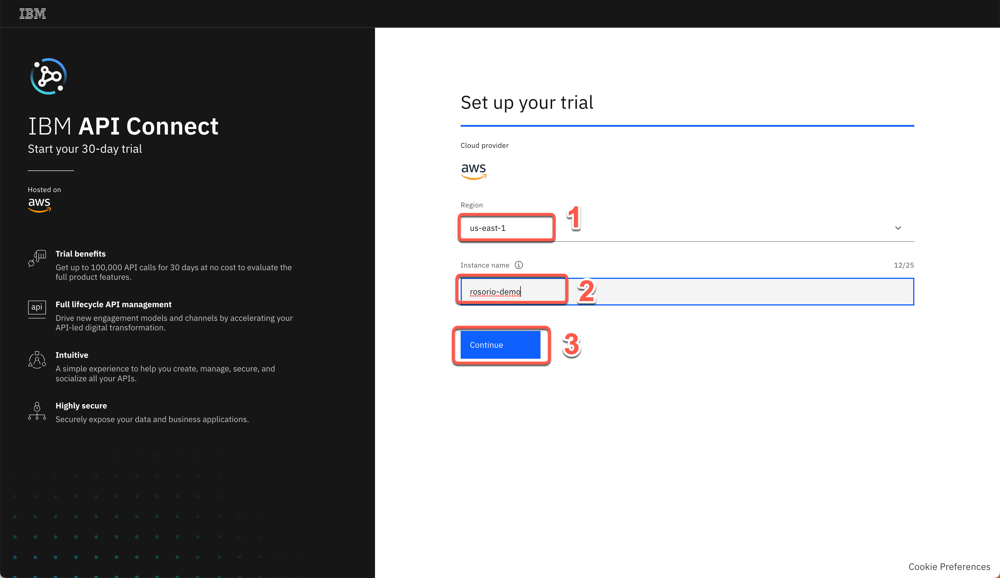
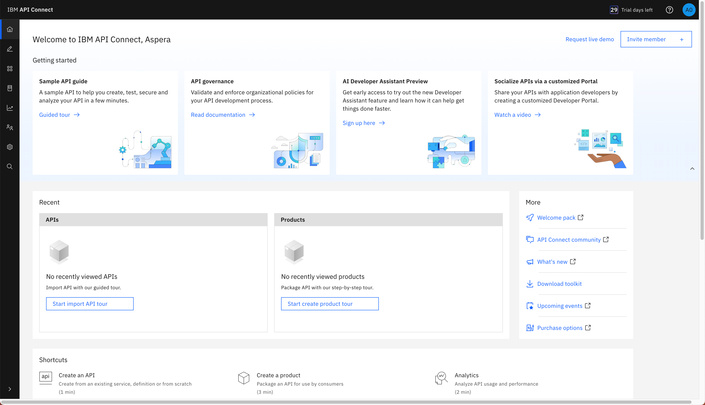
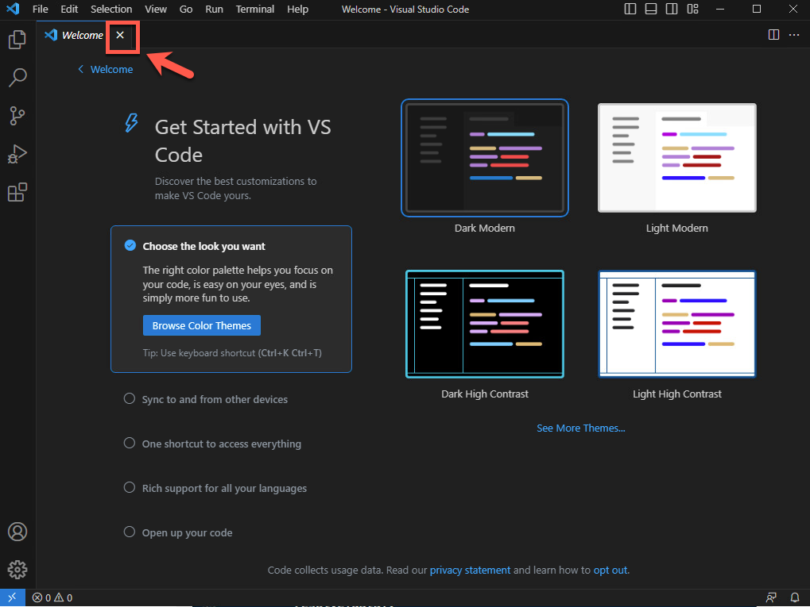

<FeatureCard
  title="Mastering Enterprise-Level GraphQL with APIC and APIC Essentials - Demo Preparation"
  color="dark"
  >


</FeatureCard>

<AnchorLinks>
  <AnchorLink>1 - Review Demo Scenario</AnchorLink>
  <AnchorLink>2 - StepZen Free Account</AnchorLink>
  <AnchorLink>3 - APIC on AWS Trial Account</AnchorLink>
  <AnchorLink>4 - Create Developer Portal</AnchorLink>
  <AnchorLink>5 - Install Node.JS</AnchorLink>
  <AnchorLink>6 - Install IDE</AnchorLink>
  <AnchorLink>7 - Install StepZen CLI</AnchorLink>
</AnchorLinks>

***

### 1 - Review Demo Scenario

| DEMO OVERVIEW |                          |
| --------------------------------------- | ------------------------------------- |
| **Scenario overview** | Your company decided to invest in GraphQL as a new standard for APIs. GraphQL is a query language for APIs that gives an application client greater control over what data it retrieves in an API request when compared with a REST API request.<br/><br/>You would like to explore an easier way for developers to build GraphQL APIs, consuming data stored everywhere. Take an e-commerce application for example. With a single call, GraphQL can merge data that is found in different subsystems, like customer information, order numbers, and delivery status, and return it in an expected format. While GraphQL APIs are significantly easier for the application teams to consume, they can represent a challenge to the API teams tasked with building them, securing them, socializing them, and managing them. To ease the process of building these APIs, you would like to explore a way to create GraphQL APIs using a declarative approach for federated access to data.<br/><br/>On the other hand, as a developer, you are having problems managing the use of GraphQL APIs in your company. |
| **Demo products** | IBM API Connect and API Connect Essentials (StepZen) |
| **Demo capabilities** | Create, Manage, Secure and Socialize GraphQL APIs |
| **Demo intro slides** | Download the Introduction and Overview slides <a href="https://github.com/ibm-integration/learninghub/blob/main/src/pages/demos/mq-techsales/files/MQUniformSlides.pptx" target="_blank" rel="noreferrer">here</a>. |
| **Demo script** | This demo script has multiple tasks that each have multiple steps. In each step, you have the details about what you need to do (**Actions**), what you can say while delivering this demo step (**Narration**), and what diagrams and screenshots you will see.<br/><br/> This demo script is a suggestion, and you are welcome to customize based on your sales opportunity. Most importantly, practice this demo in advance. If the demo seems easy for you to execute, the customer will focus on the content. If it seems difficult for you to execute, the customer will focus on your delivery. |
| **Demo authors** | Rafael Osorio and Morris Matsa|
| **How to get support** | Contact <a href="mailto:rosorio@br.ibm.com">rosorio@br.ibm.com</a> regarding issues with running this demo use case. |

***

### 2 - StepZen Free Account

To follow this demo, you need to have a StepZen (API Connect Essentials) account. StepZen provides an easier way for developers to build GraphQL APIs. StepZen takes a declarative programming approach (describing WHAT the program does, without explicitly specifying HOW), which results in smaller and more intuitive code, better runtime performance, and faster time to value. StepZen was also designed to be highly flexible. It is compatible with other API approaches and is available as-a-Service (SaaS) while also supporting deployments in private clouds and on-premises data centers. If you don’t have an account, you are able to get started with a free StepZen account, let's see how to do it!

2.1 To create your free StepZen account, open the <a hreg="https://stepzen.com/signup" target="_blank">page</a> below.
```
https://stepzen.com/signup
```

2.2 Click on **Create An Account**.


2.3 Enter your email and password (A) and click **SIGN UP** (B).


2.4 Enter your personal information (A), accept the terms and conditions (B) and click **Start free plan**.


2.5 Congratulations! Your StepZen (API Connect Essentials) free account was created.


***

### 3 - APIC on AWS Trial Account

API Connect Enterprise as a Service is a cloud-based edition of IBM API Connect. Using API Connect Enterprise as a Service enables you to work in the cloud to create, manage, secure, and socialize APIs using our latest user experiences, innovation, and industry standards for full API lifecycle management.

API Connect Enterprise as a Service uses the software-as-a-service is a delivery model. With this model, API Connect is hosted on Amazon Web Services and is managed by IBM. You pay for using the software without worrying about owning and maintaining the underlying infrastructure. With API Connect Enterprise as a Service, you pay for usage through your AWS bill.

API Connect Enterprise as a Service offers the following subscription levels:
  - Trial: provides a single service instance for 30 days, with up to 100K API calls, at no cost.
  - Base: provides 3 service instances, a choice of call-volume tiers, and a dedicated support team within IBM.

The trial subscription is subject to the following terms:
  - The trial and the Base tiers include the same set of features. The only difference is that the trial period is 30 days and includes 1 instance of API Connect Enterprise as a Service with up to 100K API calls. All API Calls with response codes of 1xx, 2xx, 3xx, 4xx, and 5xx are counted.
  - Dedicated support is not included in the trial but you can visit the API Connect user community page to read other users’ questions and ask your own questions.
  - The person who creates the trial instance is designated as the Administrator and can invite other users to the trial instance.
  - The Administrator can upgrade the trial instance to a paid subscription at any time during the 30-day trial period, using the same IBMid and trial instance. When you upgrade, all of your trial assets will be upgraded as well.
  - After the 30-day trial period ends, users can no longer log in to the trial instance to access their assets. However, IBM retains the assets for an additional 30-day “suspension period” to allow you time to upgrade to a paid subscription without losing your assets.
  - If the trial subscription is not upgraded within 60 days of the initial trial sign-up date, all assets will be deleted.
  - If your trial instance reaches the 100K API call limit within the 30-day trial period, your users cannot make any more API calls. However, users can still log in and view assets until the 30-day trial period ends.
  - The Administrator will receive multiple emails as you approach your API calls limit or the end of your 30-day trial period.

Let's create our API Connect Enterprise as a Service trial now.

3.1 Open the trial registration page <a href="https://register.saas.ibm.com/apic/trial/aws?source=UserCommunity" target="_blank">here</a> and log in with your IBMid, or if necessary create a new one.


3.2 After you log in, click **Continue** to start your trial creation.


3.3 Select the best **AWS region** for your trial (1), define an **instance name** (e.g.: yourname-demo) (2) ands click **Continue** (3).


3.4 In few minutes, you trial should be ready. Click on **Access your trial now**.


3.5 First time, you will see a Welcome to API Connect dialog. You are welcome to explore the options. Feel free to see a **Product overview** (1), if necessary. When done, **close** (2) the Welcome dialog to access the API Connect home screen.


3.6 Great, now you are on API Connect home screen. Here you can easily create, manage, secure and socialize APIs.  Now, let's create the IBM App Connect to develop integration flows. Click on **Develop integration flows with OpenAPI using App Connect**. If you don't see this tile, click <a href="https://register.saas.ibm.com/ace/trial/aws?source=UserCommunity" target="_blank">here</a> to access the App Connect trial registration page.



***

### 4 - Create Developer Portal


***

### 5 - Install Node.JS

In this section you will install Node.JS in your machine. Let’s start it!

5.1 In a browser, open the <a href="https://nodejs.org" target="_blank">URL below</a> (1). And download the recommended node.js version.
```
https://nodejs.org
```


5.2 Save the Node installation in your machine and execute it.


5.3 Accept the default values and click **Install** to complete the installation. If necessary enter the Windows administrator password (Passw0rd).


5.4 When completed, just click **Finish**.

***

### 6 - Install IDE

An **Integrated Development Environment (IDE)** is a piece of software that contains all of the things you need to develop, compile, link, and debug your programs. Furthermore, IDEs typically bundle a number of other helpful editing features, such as integrated help, name completion, auto-formatting, and sometimes a version control system. So while you could do all of these things separately, it’s much easier to install an IDE and have them all accessible from a single interface.

In this lab, you will use the IDE to explore your GraphQL schema. You are welcome to use any IDE that you prefer. If you don't have any preference, you can follow the steps below to install Visual Studio Code.


6.1 On your browser, open the <a href="https://code.visualstudio.com/Download" target="_blank">URL below</a> (1). And download the VSCode User Installer specific of your OS (2).
```
https://code.visualstudio.com/Download
```


6.2 Save the VSCode installation in your machine and execute it.


6.3 Follow the installation steps to complete it.


6.4 At the end, check the option to **Launch Visual Studio Code** and click **Finish**.


6.5 You can close the **Welcome** tab.



6.6 Open the **Terminal** menu and click on **New Terminal**.


6.7 Great! Now you should see a terminal window on bottom of your Visual Studio Code. Enter the command below to check if the node installation is ok (as result of the command you should see the node version).
```
node -v
```


`TROUBLESHOOTING:` *If you are not able to recognize your node command in Visual Studio console, you need to close and start your Visual Studio Code again. Enter the node command again, and now it should work. *

6.8 If you are using Windows machine, now you need to change the PowerShell execution policies to be able to execute scripts in VS Code terminal. An execution policy is part of the PowerShell security strategy. Execution policies determine whether you can load configuration files, such as your PowerShell profile, or run scripts. Let's do it! On your Visual Studio Code Terminal window run the command below.
```
Set-ExecutionPolicy -Scope CurrentUser -ExecutionPolicy Bypass
```


  That is it! Now you are ready for the lab. Take a breath and enjoy your lab!


***

### 7 - Install StepZen CLI

In this section, you will install StepZen CLI. StepZen enables developers to easily build and deploy a single GraphQL API that gets the data they need from multiple backends. The StepZen CLI is the primary tool for creating, uploading, deploying and testing your StepZen API. The StepZen CLI enables you use to manage your StepZen schemas, configurations, and endpoints. The CLI also comes with a built-in Schema Explorer that enables you to explore and test the API you've deployed locally from your browser. The StepZen CLI is available via npm, let's install it.


7.1 On your terminal, run the command below to install the StepZen CLI.
```
npm install -g stepzen
```


Great! You are ready to present the demo!  Take a breath and happy selling!
