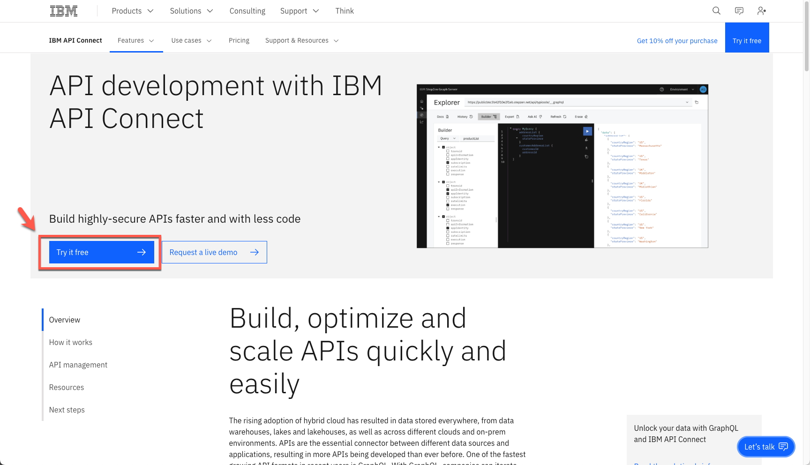

<FeatureCard
  title="Create, Manage, Secure and Socialize GraphQL APIs with APIC and APIC Essentials - Demo Preparation"
  color="dark"
  >


</FeatureCard>

<AnchorLinks>
  <AnchorLink>1 - Review Demo Scenario</AnchorLink>
  <AnchorLink>2 - API Connect Essentials Free Account</AnchorLink>
  <AnchorLink>3 - APIC on AWS Trial Account</AnchorLink>
  <AnchorLink>4 - Create Developer Portal</AnchorLink>
  <AnchorLink>5 - Install Node.JS</AnchorLink>
  <AnchorLink>6 - Install IDE</AnchorLink>
  <AnchorLink>7 - Install API Connect Essentials CLI</AnchorLink>
</AnchorLinks>

***

### 1 - Review Demo Scenario

| DEMO OVERVIEW |                          |
| --------------------------------------- | ------------------------------------- |
| **Scenario overview** | Focus Corporation decided to invest in GraphQL as a new standard for APIs. GraphQL is a query language for APIs that gives an application client greater control over what data it retrieves in an API request when compared with a REST API request.<br/><br/>Focus's developers would like to explore an easier way to build GraphQL APIs, consuming data stored everywhere. Take an e-commerce application for example. With a single call, GraphQL can merge data that is found in different subsystems, like customer information, order numbers, and delivery status, and return it in an expected format. While GraphQL APIs are significantly easier for the application teams to consume, they can represent a challenge to the API teams tasked with building them, securing them, socializing them, and managing them. To ease the process of building these APIs, they would like to explore a way to create GraphQL APIs using a declarative approach for federated access to data.<br/><br/>On the other hand, Focus' developers are having problems managing the use of GraphQL APIs in their company. |
| **Demo products** | IBM API Connect and API Connect Essentials (StepZen) |
| **Demo capabilities** | Create, Manage, Secure and Socialize GraphQL APIs |
| **Demo intro slides** | Download the Introduction and Overview slides <a href="https://github.com/ibm-integration/learninghub/blob/main/src/pages/demos/apic-tech-graphql/files/APICGraphQLSlides.pptx" target="_blank" rel="noreferrer">here</a>. |
| **Demo script** | This demo script has multiple tasks that each have multiple steps. In each step, you have the details about what you need to do (**Actions**), what you can say while delivering this demo step (**Narration**), and what diagrams and screenshots you will see.<br/><br/> This demo script is a suggestion, and you are welcome to customize based on your sales opportunity. Most importantly, practice this demo in advance. If the demo seems easy for you to execute, the customer will focus on the content. If it seems difficult for you to execute, the customer will focus on your delivery. |
| **Demo authors** | Rafael Osorio and Morris Matsa <br/> Reviewed by Brian Wilson |
| **How to get support** | Contact <a href="mailto:rosorio@br.ibm.com">rosorio@br.ibm.com</a> regarding issues with running this demo use case. |
| **Notes** | In this course, the terms StepZen and App Connect Essentials are used interchangeably. StepZen was the company IBM acquired, App Connect Essentials is the new name for the product and the terms are at the time of this development being used interchangeably as it is in the CLI and other parts of the software. |

***

### 2 - API Connect Essentials Free Account

To follow this demo, you need to have a API Connect Essentials (StepZen) account. API Connect Essentials provides an easier way for developers to build GraphQL APIs. API Connect Essentials takes a declarative programming approach (describing WHAT the program does, without explicitly specifying HOW), which results in smaller and more intuitive code, better runtime performance, and faster time to value. StepZen was also designed to be highly flexible. It is compatible with other API approaches and is available as-a-Service (SaaS) while also supporting deployments in private clouds and on-premises data centers. If you don’t have an account, you are able to get started with a free StepZen account, let's see how to do it!

2.1 To create your free StepZen account, open the <a href="https://www.ibm.com/products/api-connect/api-development" target="_blank">page</a> below.
```
https://www.ibm.com/products/api-connect/api-development
```

2.2 Click on **Try it Free**.

  

2.3 Enter your account information (A) and press **Next** (B).

  

2.4 Enter your Additional information (A), and click **Next** (B).

  

2.5 Enter the *Verification token* to verify your email (A), and click **Create account** (B).

  

2.6 Click **Proceed**.

  

2.7 Select your **Region** and **Instance name** (A) and click **Continue** (B).

  

2.8 Click **Access your trial now**.

  

2.5 Congratulations! Your API Connect Essentials free account was created.

  

***

### 3 - APIC on AWS Trial Account

API Connect Enterprise as a Service is a cloud-based edition of IBM API Connect. Using API Connect Enterprise as a Service enables you to work in the cloud to create, manage, secure, and socialize APIs using our latest user experiences, innovation, and industry standards for full API lifecycle management.

API Connect Enterprise as a Service uses the software-as-a-service delivery model. With this model, API Connect is hosted on Amazon Web Services and is managed by IBM. You pay for using the software without worrying about owning and maintaining the underlying infrastructure. With API Connect Enterprise as a Service, you pay for usage through your AWS bill.

API Connect Enterprise as a Service offers the following subscription levels:
  - Trial: provides a single service instance for 30 days, with up to 100K API calls, at no cost.
  - Base: provides 3 service instances, a choice of call-volume tiers, and a dedicated support team within IBM.

Let's create our API Connect Enterprise as a Service trial now.

3.1 Open the trial registration page <a href="https://register.saas.ibm.com/apic/trial/aws?source=UserCommunity" target="_blank">here</a> and log in with your IBMid created in the previous section (if necessary enter the validation code).

  

3.2 Enter your additional information (A), and click **Continue** (B).

  

3.3 Select the best **AWS region** for your trial (1), define an **instance name** (e.g.: yourname-demo) (2) and click **Continue** (3).

  

3.4 In few minutes, you trial should be ready. Click on **Access your trial now**.

  

3.5 The first time, you will see a Welcome to API Connect dialog. You are welcome to explore the options. Feel free to see a **Product overview** (A), if necessary. When done, **close** (B) the Welcome dialog to access the API Connect home screen.

  

3.6 Great, now you are on the API Connect home screen. Here you can easily create, manage, secure and socialize APIs. In the next section, you will start to use APIC on AWS.

  


***

### 4 - Create Developer Portal

To simplify your demo, you will now create the Developer Portal, to avoid the wait for the Portal creation during the demo. Let's do it!

4.1 Click the **Manage** icon.

  

4.2 Click the **Sandbox** catalog.

  

4.3 Open the **Catalog settings** tab (A). Open the **Portal** page (B).

  

4.4 Here you should see a message that *No portal added to this catalog*, click **Create**.

  

4.5 Select **Default API connect Portal site** (A) and click **Create** (B).

  

4.6 It will take a few minutes to complete the portal creation. Once complete, you will receive an email containing a link to set the password for the portal admin account. You will not use the admin account in your demo, but feel free to change the password if you desire.

  

***

### 5 - Install Node.JS

In this section you will install Node.JS in your machine. Let’s start it!

5.1 In a browser, open the <a href="https://nodejs.org" target="_blank">URL below</a> (1). Download the recommended node.js version.
```
https://nodejs.org
```

  

5.2 Save the Node installation in your machine and execute it.

  

5.3 Accept the default values and follow the installation process.

  [](images/install-node-3.png)


***

### 6 - Install IDE

An **Integrated Development Environment (IDE)** is a piece of software that contains all of the things you need to develop, compile, link, and debug your programs. Furthermore, IDEs typically bundle a number of other helpful editing features, such as integrated help, name completion, auto-formatting, and sometimes a version control system. So while you could do all of these things separately, it’s much easier to install an IDE and have them all accessible from a single interface.

In this lab, you will use the IDE to explore your GraphQL schema. You are welcome to use any IDE that you prefer. If you don't have any preference, you can follow the steps below to install Visual Studio Code.


6.1 On your browser, open the <a href="https://code.visualstudio.com/Download" target="_blank">URL below</a> (1). Download the VSCode User Installer specific of your OS (2).
```
https://code.visualstudio.com/Download
```

  

6.2 Save the VSCode installation in your machine and execute it.

  

6.3 Follow the installation steps to complete it.

  

6.4 At the end, check the option to **Launch Visual Studio Code** and click **Finish**.

  

6.5 You can close the **Welcome** tab.

  

6.6 Open the **Terminal** menu and click on **New Terminal**.

  

6.7 Great! Now you should see a terminal window at the bottom of your Visual Studio Code. Enter the command below to check if the node installation is ok (as result of the command you should see the node version).
```
node -v
```

  

6.8 If you are using a Windows machine, now you need to change the PowerShell execution policies to be able to execute scripts in VS Code terminal. An execution policy is part of the PowerShell security strategy. Execution policies determine whether you can load configuration files, such as your PowerShell profile, or run scripts. Let's do it! On your Visual Studio Code Terminal window run the command below.
```
Set-ExecutionPolicy -Scope CurrentUser -ExecutionPolicy Bypass
```

  

  That is it! Now you are ready for the lab. Take a breath and enjoy your lab!


***

### 7 - Install API Connect Essentials CLI

In this section, you will install the API Connect Essentials (StepZen) CLI. API Connect Essentials enables developers to easily build and deploy a single GraphQL API that gets the data they need from multiple backends. The StepZen CLI is the primary tool for creating, uploading, deploying and testing your StepZen API. The StepZen CLI enables you use to manage your StepZen schemas, configurations, and endpoints. The CLI also comes with a built-in Schema Explorer that enables you to explore and test the API you've deployed locally from your browser. The StepZen CLI is available via npm. Let's install it.


7.1 On your terminal, run the command below to install the StepZen CLI.
```
npm install -g stepzen
```

<InlineNotification kind="warning">To install the StepZen CLI, you need to use an administrator user. If you are not using an admin user, you need to login with a root first (e.g.: su -).</InlineNotification>


  


Great! You are ready to present the demo!  Take a breath and happy selling!
