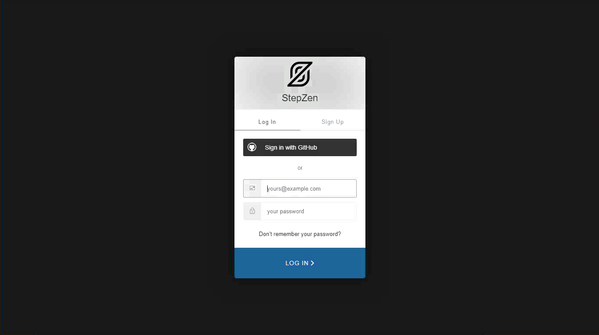

<FeatureCard
  title="Mastering Enterprise-Level GraphQL with APIC and APIC Essentials - Demo Preparation"
  color="dark"
  >


</FeatureCard>

<span id="place1"></span>

### **Introduction**
<br/>
The rising adoption of hybrid cloud has resulted in data stored everywhere – in different types of data stores likes data warehouses, lakes, and lakehouses as well as across different clouds and on-premises environments. APIs serve as the essential connector between different data sources and applications, which means that businesses are relying on and creating more APIs than ever before to get the data they need to power their applications and experiences.
<br/><br/>
GraphQL has rapidly become a go-to query language for companies to interact with their data and is emerging as a new standard for APIs, layering upon the investments in REST APIs and data systems. While GraphQL APIs are significantly easier for the application teams to consume, they can represent a challenge to the API Provider teams tasked with building them.  We believe that APIs built declaratively are simply better - leading to first implementation with fewer lines of clean code, faster time to deploy, and APIs with built-in performance, cost, and reliability optimizations.
<br/><br/>
Our company decided to invest in GraphQL as a new standard for APIs. GraphQL is a query language for APIs that gives an application client greater control over what data it retrieves in an API request when compared with a REST API request.
<br/><br/>
We would like to explore an easier way for developers to build GraphQL APIs, consuming data stored everywhere. Take an e-commerce application for example. With a single call, GraphQL can merge data that is found in different subsystems, like customer information, order numbers, and delivery status, and return it in an expected format. While GraphQL APIs are significantly easier for the application teams to consume, they can represent a challenge to the API teams tasked with building them, securing them, socializing them, and managing them. To ease the process of building these APIs, we would like to explore a way to create GraphQL APIs using a declarative approach for federated access to data.
<br/><br/>
On the other hand, our Development's team is having problems managing the use of GraphQL APIs in your company, including rate limits, API lifecycle, security and how to socialize these APIs with our developers ecosystem.
<br/><br/>
In this demo we will learn how to move from Zero to Enterprise in the GraphQL domain. Initially we will learn how to use API Connect Essentials (StepZen) to create a a federated GraphQL API by pulling data from disparate sources (REST API and MySQL). After that you will use IBM API Connect to create a GraphQL API proxy definition that proxies a backend GraphQL server from StepZen, and to define rate limiting controls that reflect the amount of data that is returned from the server by a request to the GraphQL API.
<br/><br/>
Here we will see how to CREATE, MANAGE, SECURE and SOCIALIZE our GraphQL APIs using IBM API Connect solutions.
<br/><br/>
Let's get started!<br/><br/>

(Demo Slides <a href="https://github.com/ibm-integration/learninghub/blob/main/src/pages/demos/mq-techsales/files/APICSlides.pptx" target="_blank" rel="noreferrer">here</a>)
<br/>


### **1 - Setup StepZen**

<details>
<summary>1.1 - Access StepZen</summary><br/>

**Narration**

StepZen enables developers to easily build and deploy a single GraphQL API that gets the data they need from multiple backends. The StepZen CLI is the primary tool for creating, uploading, deploying and testing your StepZen API. The StepZen CLI enables you use to manage your StepZen schemas, configurations, and endpoints. The CLI also comes with a built-in Schema Explorer that enables you to explore and test the API you’ve deployed locally from your browser.


We already installed StepZen CLI here. Now we need to get the details about our StepZen account. For this demo we are using a free StepZen account, let's log in here.


<hr/><br/>

**Action** &nbsp; 1.1.1

On a browser window open the <a href="http://www.stepzen.com" target="_blank">URL below</a> (1) and click on **Log In** link (2).

```
 http://www.stepzen.com
```
&nbsp;
&nbsp;
  


<hr/><br/>

**Action** &nbsp; 1.1.2

**Log in** with your *username* and *password*.


  

***
</details>


<details>
<summary>1.2 - Get your Account details</summary><br/>

**Narration**

When we get our account, first we need to navigate to the Stepzen Dashboard. In the Account page, we will find our account name, and the two keys weneed for API authentication.

<hr/><br/>

**Action** &nbsp; 1.2.1

On StepZen Dashboard page, on the left menu, open the **Account** page (key icon).

  

<hr/><br/>

**Action** &nbsp; 1.2.2

Copy the **Account name** (1) and **Admin Key** (2). You will use them in the next step.

  

***
</details>

<details>
<summary>1.3 - StepZen CLI log in</summary><br/>

**Narration**

To run StepZen in the cloud, we can connect the CLI to our account to get a private and secure endpoint or use StepZen with a public account. After installing the CLI, we can connect it to our account using the login CLI command.

<hr/><br/>

**Action** &nbsp; 1.3.1

Using Visual Studio Code terminal window, execute the command below to log in with StepZen CLI, replace [your_account] with the account value (1) from the Account page.

```
stepzen login -a [your_account]
```
&nbsp;
&nbsp;
  

**Action** &nbsp; 1.3.2

Now, you need to enter your Admin Key. Copy and paste the **Admin Key** value (2) from the Account page.

  

***
</details>

<br/><br/>

### **2 - Build your GraphQL API from a REST API**

<details>
<summary>2.1 - Create your API directory</summary><br/>

**Narration**

Using StepZen, we can create a GraphQL API for backends with REST interfaces in minutes.

There are two ways to create our GraphQL API with StepZen when we have a REST backend.

<ul>
<li>Use the command-line interface (CLI) command stepzen import curl to specify an existing REST endpoint - StepZen introspects the endpoint and auto-generates a GraphQL schema for you.</li>
<li>Write your schema code in a .graphql GraphQL Schema Definition Language (SDL) file. Use the powerful GraphQL directive @rest to connect the REST endpoint, and with just a few lines of code, you have a working schema.</li>
</ul><br/>

In this section we will learn how to use StepZen import curl on an existing REST API. This command sends a curl request to StepZen and parses the GraphQL types from the JSON response.

Before we build our GraphQL API, let’s create a new directory.

<hr/><br/>

**Action** &nbsp; 2.1.1

On Visual Studio Code Terminal, execute the command below to create a new directory.

```
mkdir product-demo
```
&nbsp;
&nbsp;
  

<hr/><br/>

**Action** &nbsp; 2.1.2

Change to the new directory.

```
cd product-demo
```
&nbsp;
&nbsp;


***
</details>

<details>
<summary>2.2 - Initialize the StepZen workspace</summary><br/>

**Narration**

We need to initialize the StepZen workspace in our working directory. Let's use the StepZen CLI init command to do it.

<hr/><br/>

**Action** &nbsp; 2.2.1

On Visual Studio Code Terminal, execute the command below.

```
stepzen init --endpoint=api/product-demo
```
&nbsp;
&nbsp;
  

***
</details>


<details>
<summary>2.3 - Introspects the REST endpoint</summary><br/>

**Narration**

Let's take advantage of StepZen to introspects the REST endpoint and auto-generates a GraphQL schema for us. Here we are using a REST API developed by our company's DEV team with CUSTOMERS information.

<hr/><br/>

**Action** &nbsp; 2.3.1

On Visual Studio Code Terminal, execute the command below.

```
stepzen import curl "https://introspection.apis.stepzen.com/customers" --query-name "customers"
```
&nbsp;
&nbsp;
  

***
</details>
