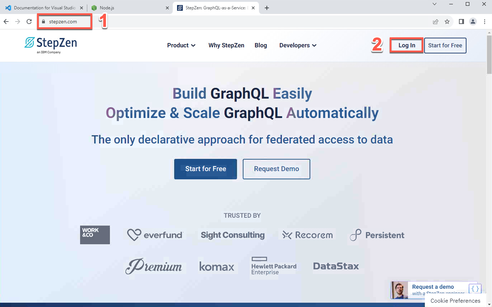
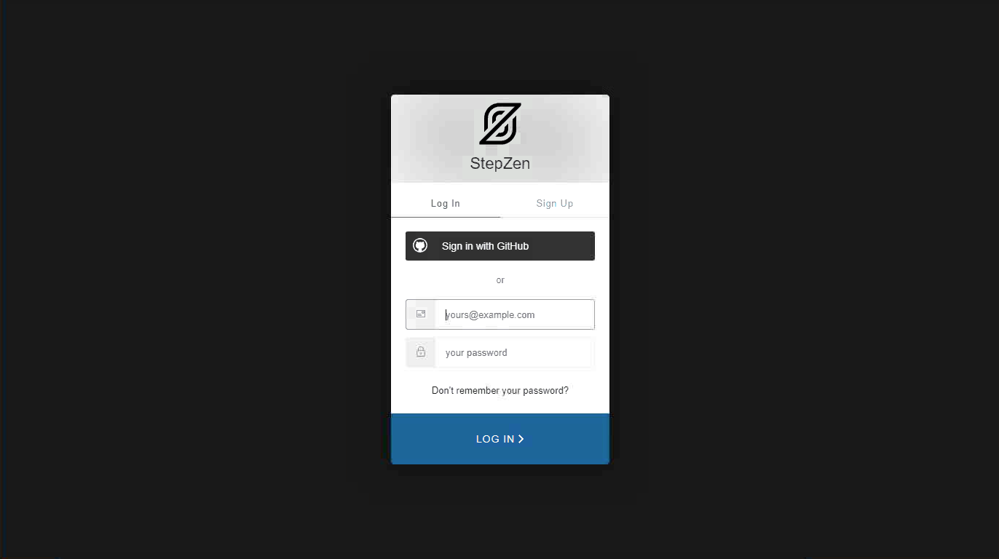
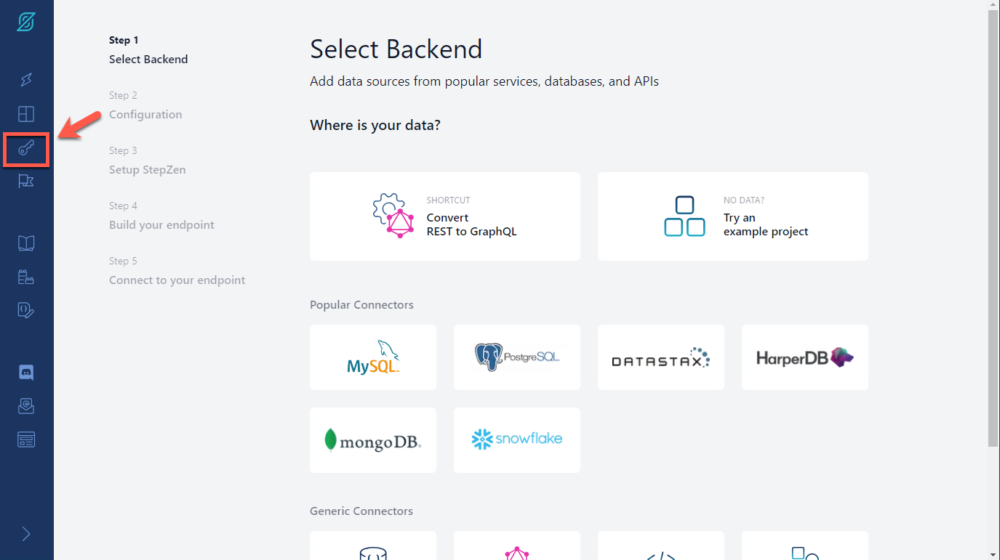
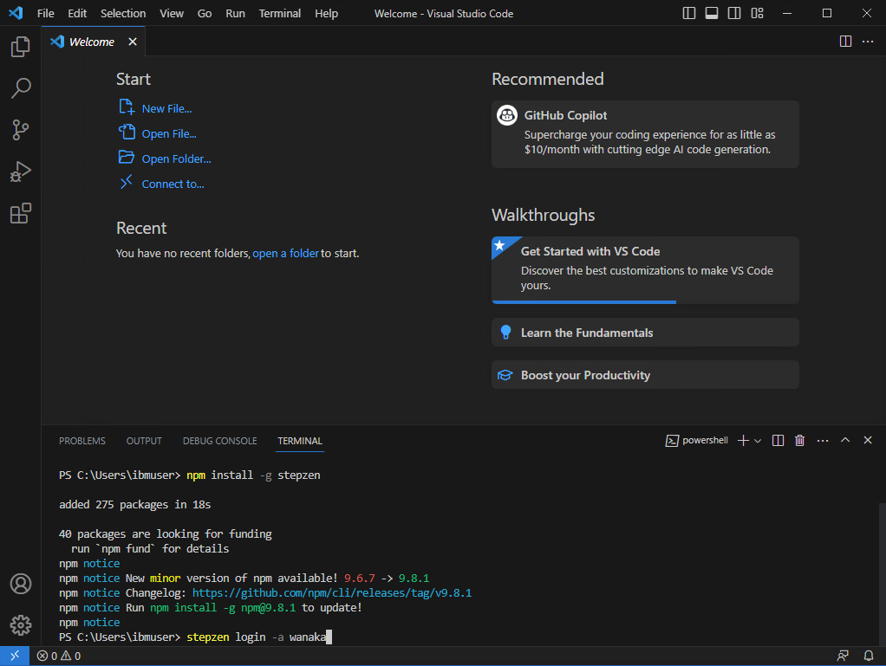
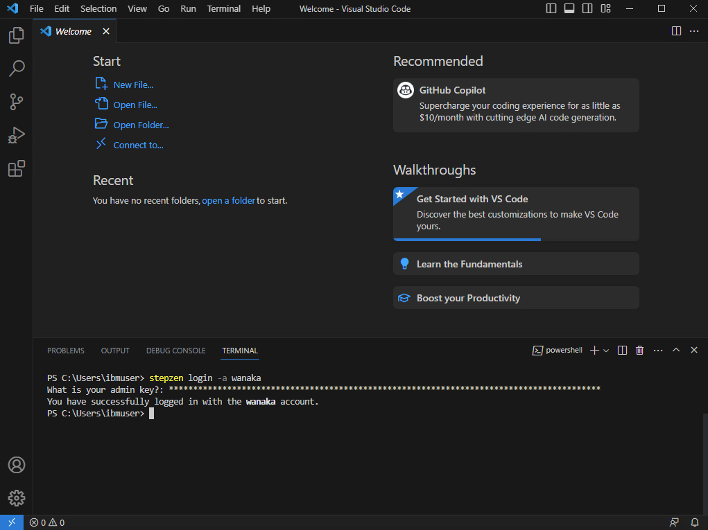
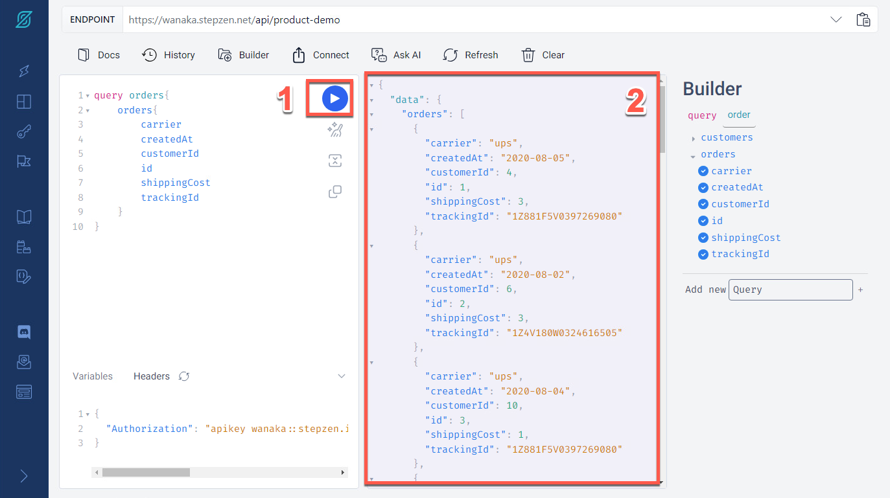
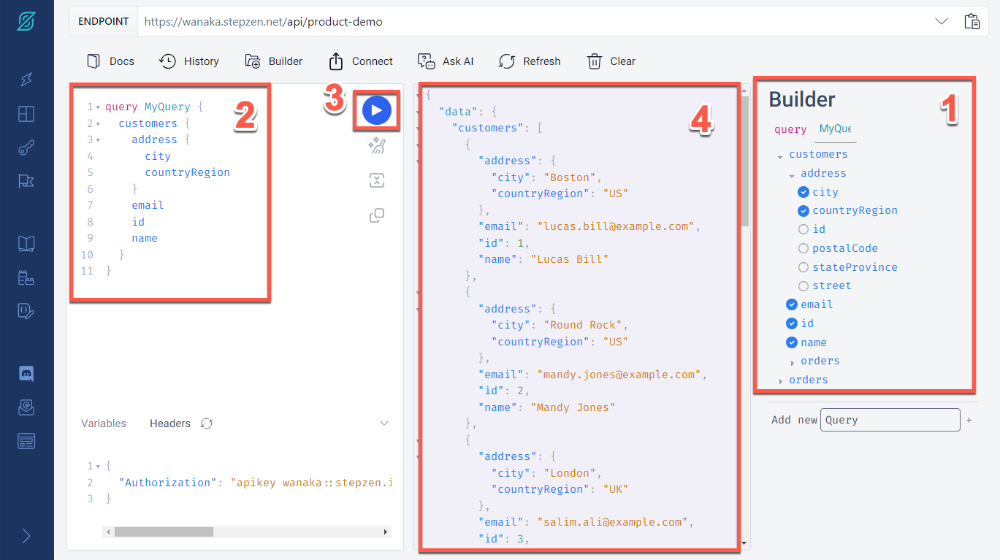
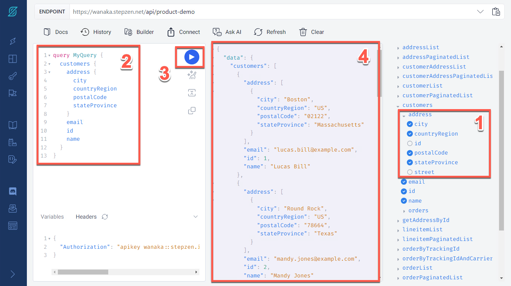

<FeatureCard
  title="Mastering Enterprise-Level GraphQL with APIC and APIC Essentials - Demo Preparation"
  color="dark"
  >


</FeatureCard>

<span id="place1"></span>

<details>

<summary>Introduction</summary>
<br/>
The rising adoption of hybrid cloud has resulted in data stored everywhere – in different types of data stores likes data warehouses, lakes, and lakehouses as well as across different clouds and on-premises environments. APIs serve as the essential connector between different data sources and applications, which means that businesses are relying on and creating more APIs than ever before to get the data they need to power their applications and experiences.
<br/><br/>
GraphQL has rapidly become a go-to query language for companies to interact with their data and is emerging as a new standard for APIs, layering upon the investments in REST APIs and data systems. While GraphQL APIs are significantly easier for the application teams to consume, they can represent a challenge to the API Provider teams tasked with building them.  We believe that APIs built declaratively are simply better - leading to first implementation with fewer lines of clean code, faster time to deploy, and APIs with built-in performance, cost, and reliability optimizations.
<br/><br/>
Our company decided to invest in GraphQL as a new standard for APIs. GraphQL is a query language for APIs that gives an application client greater control over what data it retrieves in an API request when compared with a REST API request.
<br/><br/>
We would like to explore an easier way for developers to build GraphQL APIs, consuming data stored everywhere. Take an e-commerce application for example. With a single call, GraphQL can merge data that is found in different subsystems, like customer information, order numbers, and delivery status, and return it in an expected format. While GraphQL APIs are significantly easier for the application teams to consume, they can represent a challenge to the API teams tasked with building them, securing them, socializing them, and managing them. To ease the process of building these APIs, we would like to explore a way to create GraphQL APIs using a declarative approach for federated access to data.
<br/><br/>
On the other hand, our Development's team is having problems managing the use of GraphQL APIs in your company, including rate limits, API lifecycle, security and how to socialize these APIs with our developers ecosystem.
<br/><br/>
In this demo we will learn how to move from Zero to Enterprise in the GraphQL domain. Initially we will learn how to use API Connect Essentials (StepZen) to create a a federated GraphQL API by pulling data from disparate sources (REST API and MySQL). After that you will use IBM API Connect to create a GraphQL API proxy definition that proxies a backend GraphQL server from StepZen, and to define rate limiting controls that reflect the amount of data that is returned from the server by a request to the GraphQL API.
<br/><br/>
Here we will see how to CREATE, MANAGE, SECURE and SOCIALIZE our GraphQL APIs using IBM API Connect solutions.
<br/><br/>
Let's get started!<br/><br/>

(Demo Slides <a href="https://github.com/ibm-integration/learninghub/blob/main/src/pages/demos/mq-techsales/files/APICSlides.pptx" target="_blank" rel="noreferrer">here</a>)
<br/>
</details>

<details>
<summary>1 - Setup StepZen</summary>

<br/>

| **1.1** | **Access StepZen** |
| :--- | :--- |
| **Narration** | StepZen enables developers to easily build and deploy a single GraphQL API that gets the data they need from multiple backends. The StepZen CLI is the primary tool for creating, uploading, deploying and testing your StepZen API. The StepZen CLI enables you use to manage your StepZen schemas, configurations, and endpoints. The CLI also comes with a built-in Schema Explorer that enables you to explore and test the API you’ve deployed locally from your browser. <br/><br/> We already installed StepZen CLI here. Now we need to get the details about our StepZen account. For this demo we are using a free StepZen account, let's log in here.  |
| **Action** &nbsp; 1.1.1 | On a browser window open the <a href="http://www.stepzen.com" target="_blank">URL below</a> (1) and click on **Log In** link (2). <br/><br/>```http://www.stepzen.com```<br/><br/><br/>|
| **Action** &nbsp; 1.1.2 | **Log in** with your *username* and *password*. <br/><br/><br/>|

| **1.2** | **Get your Account details** |
| :--- | :--- |
| **Narration** | When we get our account, first we need to navigate to the Stepzen Dashboard. In the Account page, we will find our account name, and the two keys weneed for API authentication. |
| **Action** &nbsp; 1.2.1 | On StepZen Dashboard page, on the left menu, open the **Account** page (key icon). <br/><br/><br/>|
| **Action** &nbsp; 1.2.2 | Copy the **Account name** (1) and **Admin Key** (2). You will use them in the next step. <br/><br/><br/>|

| **1.3** | **StepZen CLI log In** |
| :--- | :--- |
| **Narration** | To run StepZen in the cloud, we can connect the CLI to our account to get a private and secure endpoint or use StepZen with a public account. After installing the CLI, we can connect it to our account using the login CLI command. |
| **Action** &nbsp; 1.3.1 | Using Visual Studio Code terminal window, execute the command below to log in with StepZen CLI, replace [your_account] with the account value (1) from the Account page. <br/><br/> ```stepzen login -a [your_account]``` <br/><br/><br/>|
| **Action** &nbsp; 1.3.2 | Now, you need to enter your Admin Key. Copy and paste the **Admin Key** value (2) from the Account page.  <br/><br/><br/>|

<br/>

**[Go to top](#place1)**

</details>

<details>
<summary>2 - Build your GraphQL API from a REST API</summary>

<br/>

| **2.1** | **Create your API directory** |
| :--- | :--- |
| **Narration** | Using StepZen, we can create a GraphQL API for backends with REST interfaces in minutes. <br/><br/>There are two ways to create our GraphQL API with StepZen when we have a REST backend. <br/><br/> <ul><li>Use the command-line interface (CLI) command stepzen import curl to specify an existing REST endpoint - StepZen introspects the endpoint and auto-generates a GraphQL schema for you.</li><li>Write your schema code in a .graphql GraphQL Schema Definition Language (SDL) file. Use the powerful GraphQL directive @rest to connect the REST endpoint, and with just a few lines of code, you have a working schema.</li></ul><br/>In this section we will learn how to use StepZen import curl on an existing REST API. This command sends a curl request to StepZen and parses the GraphQL types from the JSON response.<br/><br/>Before we build our GraphQL API, let’s create a new directory.|
| **Action** &nbsp; 2.1.1 | On Visual Studio Code Terminal, execute the command below to create a new directory. <br/><br/>```mkdir product-demo```<br/><br/>|
| **Action** &nbsp; 2.1.2 | Change to the new directory. <br/>```cd product-demo```<br/><br/>|

| **2.2** | **Initialize the StepZen workspace** |
| :--- | :--- |
| **Narration** | We need to initialize the StepZen workspace in our working directory. Let's use the StepZen CLI init command to do it. |
| **Action** &nbsp; 2.2.1 | On Visual Studio Code Terminal, execute the command below.<br/><br/>```stepzen init --endpoint=api/product-demo```<br/><br/>|

| **2.3** | **Introspects the REST endpoint** |
| :--- | :--- |
| **Narration** | Let's take advantage of StepZen to introspects the REST endpoint and auto-generates a GraphQL schema for us. Here we are using a REST API developed by our company's DEV team with CUSTOMERS information. |
| **Action** &nbsp; 2.3.1 | On Visual Studio Code Terminal, execute the command below.<br/><br/>```stepzen import curl "https://introspection.apis.stepzen.com/customers" --query-name "customers"```<br/><br/>|

| **2.4** | **Explore graphQL schema** |
| :--- | :--- |
| **Narration** | Our first GraphQL API was created. Let's explore the graphQL schema! First, we need to open our project folder and open the index.graphql file on curl folder. Here we have all the schema of our customers REST API.  We will not deploy this GraphQL yet. Before that, let's import another REST endpoint. |
| **Action** &nbsp; 2.4.1 | On Visual Studio Code, click on **Explorer** icon (1) and click **Open Folder** (2).<br/><br/> |
| **Action** &nbsp; 2.4.2 | Select the new created **product-demo** folder (1) and click **Select Folder** (2).<br/><br/>  |
| **Action** &nbsp; 2.4.3 | If necessary, click **Yes, I trust the authors** button. <br/><br/>  |
| **Action** &nbsp; 2.4.4 | To see the GraphQL schema, open the **curl** folder and select the **index.graphql** file (1). You are welcome to explore and check the .graphQL file (2). <br/><br/>  |
| **Action** &nbsp; 2.4.5 | If necessary, click **View > Terminal** to see the terminal window again. <br/><br/>  |

<br/>

**[Go to top](#place1)**

</details>

<details>
<summary>3 - Adding a new REST API in your GraphQL API</summary>

<br/>

| **3.1** | **Import a new REST API** |
| :--- | :--- |
| **Narration** | Now, let's improve our GraphQL API by addding another REST API. We just need to execute the import command again with a new REST URL to add a new REST API. |
| **Action** &nbsp; 3.1.1 | On Visual Studio Code Terminal, execute the command below to import another REST API.<br/><br/>```stepzen import curl "https://introspection.apis.stepzen.com/orders" --query-name "orders" --query-type "Order"```<br/><br/> |

| **3.2** | **Explore schema** |
| :--- | :--- |
| **Narration** | To check the new graphQL schema, we just need to open the curl-01 folder and open the new index.graphql file. Here we can see the schema of the orders API.  <br/><br/>This third schema in the product-demo folder is aggregating the other two schemas of our two different REST APIs.  |
| **Action** &nbsp; 3.2.1 | Open the **curl-01** folder and open the new **index.graphql** file (1). You are welcome to explore the new schema (2).<br/><br/> |
| **Action** &nbsp; 3.2.2 | Open the third schema, the **index.graphql** file in the **product-demo** folder (1) and check this schema is referencing the other two schemas (2).<br/><br/> |

| **3.3** | **Start the endpoint** |
| :--- | :--- |
| **Narration** | StepZen can be deployed and run as a managed service on StepZen's cloud, on a virtual private cloud, or in a colocation data center. Whatever your choice of deployment, StepZen helps you build clean, declarative, consistent APIs and run them at scale with built-in optimizations.<br/><br/>
To Deploy and run our endpoint, from command line, let's run stepzen start command. <br/><br/>
This command does three things:<ul><li>Deploys the code in the current directory (or the directory provided via the --dir flag) to the specified endpoint on StepZen.</li><li>Watches the directory for changes and automatically deploys them to the endpoint specified.</li><li>Share a URL with StepZen's Schema Explorer that enables you to test your API by exploring the queries and types available and querying the API running on StepZen.</li></ul>The StepZen dashboard provides a playground for testing your GraphQL API. Let's open it to explore our GraphQL API.  |
| **Action** &nbsp; 3.3.1 | On Visual Studio Code terminal,  run the command below to initialize your endpoint.<br/>```stepzen start```<br/><br/> |
| **Action** &nbsp; 3.3.2 | Show the stepzen start return.<br/><br/> |
| **Action** &nbsp; 3.3.3 | Scroll down your terminal page to see the Dashboard URL of your API. Copy and paste it in you browser window.<br/><br/> |

| **3.4** | **Test the endpoint** |
| :--- | :--- |
| **Narration** | The StepZen dashboard provides a playground for testing your GraphQL API. In the Dashboard we can play with different queries, for example, let's try the orders query.<br/><br/>Let's try a customers query now, with some fields. Remember, with this GraphQL API, we are consuming data from two different REST APIs. And we can do that with APIs from different types of data sources as well. |
| **Action** &nbsp; 3.4.1 | Go ahead and click **Execute Query** button (1) to test the orders query.  Check the result data (2).<br/><br/> |
| **Action** &nbsp; 3.4.2 | You are welcome to play with the Builder section (1), to create queries with different values. For example, delete the order query, and create a customers query with some fields (2). Execute the query again (3) and check the result data (4).<br/><br/>  |

<br/>

**[Go to top](#place1)**

</details>

<details>
<summary>4 - Autogenerate GraphQL Schemas from MySQL Database</summary>

<br/>

| **4.1** | **Import MySQL schema** |
| :--- | :--- |
| **Narration** | Now, let's see how to create a GraphQL API with a SQL database backend. <br/><br/> There are two ways to create your GraphQL API with StepZen when you have a SQL database backend. <ul><li>Use the command-line interface (CLI) command stepzen import mysql to specify your database - StepZen introspects it and auto-generates a GraphQL schema for you.</li><li>Write your schema code in a .graphql GraphQL Schema Definition Language (SDL) file. Use the GraphQL directive @dbquery to connect the database, and with just a few lines of code, you have a working schema.)</li></ul>Here, we will see how to use stepzen import mysql command. Our company database's team provided use with a MySQL database. Let's use StepZen CLI command to import it. |
| **Action** &nbsp; 4.1.1 | On Visual Studio Code terminal, cancel the current execution (CTRL+C). And execute the command below to create a GraphQL API that connects data from a database backend.<br/><br/>```stepzen import mysql --db-host='db.introspection.stepzen.net' --db-database='introspection' --db-user='testUserIntrospection' --db-password='HurricaneStartingSample1934' --name=mysql```<br/><br/>  |

| **4.2** | **Explore MySQL schema** |
| :--- | :--- |
| **Narration** | To check the new graphQL schema, open the mysql folder and open the new index.graphql file. Here we have our database schema from MySQL. <br/><br/> By now, we are invoking two REST APIs and one MySQL database in our GraphQL API. |
| **Action** &nbsp; 4.2.1 | On VSCode, open the **mysql** folder and open the new **index.graphql** file (1). You are welcome to explore the new schema (2). <br/><br/>  |

<br/>

**[Go to top](#place1)**

</details>

<details>
<summary>5 - Creating a composition of building blocks using @materializer</summary>

<br/>

| **5.1** | **Create the getAddressById query** |
| :--- | :--- |
| **Narration** | In many organizations, APIs are built around organizations or domains. For example, a B2C retail business might have customer APIs, e-commerce APIs, marketing APIs, and so on. These APIs are typically built by semi-independent teams, and usually have some common lightweight structures (like authentication, documentation, etc.), but otherwise are constructed independently. And they might appear in the same portal for the API consumer, but there is nothing that connects them. <br/><br/> Because GraphQL APIs are designed to “stitch” data together, GraphQL represents an opportunity to connect APIs easily—even those built by independent teams.  GraphQL federation is a critical element of your GraphQL architecture. Federation is about assembling the work of independent teams into one, or possibly a few, uber GraphQL APIs. Let's see how to do it!  <br/><br/> First, let's create a query to getAddressById in our MySQL database. |
| **Action** &nbsp; 5.1.1 | On the **index.graphql** from **mysql** folder (1), scroll down to see the ‘*type Query*’ declaration. Below the sentence "**Queries for type ‘Address’**" include the query code below (2).<br/><br/>This code is defining a getAddressById query to select address from mySQL database.<br/><br/> |
| **Action** &nbsp; 5.1.2 | **Save** the file (File > Save or CTRL+S).<br/>|

| **5.2** | **Create a composition with @materializer** |
| :--- | :--- |
| **Narration** | By now we have multiple subgraphs, we can link types across subgraphs with @materializer. Let's do it! <br/><br/>We just need to change our address field to use the getAdressById query that we have just created. We can easily link these two subgraphs with @materializer. |
| **Action** &nbsp; 5.2.1 | Open the **index.graphql** file from **curl** folder (1), this is the schema from customers REST API.  Scroll down to see the ‘*type RootEntry*’ section.  By now, the address is coming from the REST API endpoint. Let's change it to get this value from MySQL database. Replace the current address type definition (address: Address) for the code below (2). <br/><br/> |
| **Action** &nbsp; 5.2.2 |  **Save** the file (File > Save or CTRL+S).<br/> |

| **5.3** | **Test the composition** |
| :--- | :--- |
| **Narration** | We are ready to deploy our new API. Now we can test the new API, by creating a customers query including address attributes.<br/><br/>Here we have the result, including data from REST API and MySQL database at the same time.<br/><br/>Before we move to API Connections part, to see how to manage, secure and socialize this API, we need to take a copy of our API endpoint and the Authorization header. We will need them later to invoke our API.<br/><br/>One important point to highlight here is about how StepZen controls access to GraphQL schemas and endpoints.<br/><br/>As we build out our GraphQL APIs, we will want to add access control mechanisms to prevent unauthorized use of these endpoints. StepZen supports two different solutions for this problem.<ul><li>API Keys: we can use API keys to control access to the entire endpoint. API keys are the default access control mechanism.</li><li>And Field Policies: we can use Field policies to control access to specific entry point fields on the endpoint. Field policies provide fine-grained access control to your GraphQL API, using a model similar to attribute-based access control.</li></ul>StepZen provides two different types of API keys for use with an account: Admin Keys and API Keys. Admin keys provide administrative-level access to your account, and should only be used at development time. API keys provide more limited access to your account, and should be used for production.<br/><br/>In this demo, for simplification purpose, we will use the Admin Keys to access our API. In a real environment, we should use API Keys or Field Policies to improve our API’s security.|
| **Action** &nbsp; 5.3.1 | On Visual Studio Code terminal, execute the command below.```stepzen start```<br/><br/> |
| **Action** &nbsp; 5.3.2 | Back to the browser, refresh the Stepzen Dashboard page. |
| **Action** &nbsp; 5.3.3 | On the StepZen Dashboard page, use the Builder section (1), to create a customers query including address attributes (2). Execute the query again (3) and check the result data is coming from Rest and MySQL database (4).<br/><br/> |
| **Action** &nbsp; 5.3.4 | Take a copy of your API endpoint (1) and the Authorization header (2).<br/><br/> |

<br/>

**[Go to top](#place1)**

</details>

<details>
<summary>6 - Create a GraphQL Proxy API in APIC</summary>

<br/>

| **6.1** | **Access your APIC Environment** |
| :--- | :--- |
| **Narration** | Great, our GraphQL API was created. However our developer's team still need a comprehensive API solution and strategy to manage these new GraphQL APIs from a unified and centrally visible solution. <br/><br/>They are looking for an integrated API management offering, with capabilities and tooling for all phases of the API lifecycle. Key steps of the API lifecycle include create, secure, manage, socialize, and analyze the APIs.<br/><br/>IBM API Connect is a full lifecycle API management solution that uses an intuitive experience to help consistently create, manage, secure, socialize and monetize APIs, which promotes digital transformation on premises and across clouds. This means we can power digital apps and spur innovation in real-time. IBM API Connect is also available as-a-Service as a highly scalable, fully managed API management platform on Amazon Web Services (AWS).<br/><br/>Let's explore how IBM API Connect will support our development team to manage our GraphQL APIs.  For this demo, we are using a trial account of IBM APIC on AWS.  |
| **Action** &nbsp; 6.1.1 | In your email inbox (that you used to create the APIC trial account), search for **IBM SaaS** (1), open the "**Your API Connect trial is ready**" email (2). <br/><br/>  |
| **Action** &nbsp; 6.1.2 | Now, click **Access trial** button.<br/><br/>  |
| **Action** &nbsp; 6.1.3 | Log in with your APIC user and password.<br/><br/> |

| **6.2** | **Create a new API from existing GraphQL service** |
| :--- | :--- |
| **Narration** | Here, you are on your API Connect Enterprise as a Service environment. API Connect Enterprise as a Service is a cloud-based edition of IBM API Connect. Using API Connect Enterprise as a Service enables you to work in the cloud to create, manage, secure, and socialize APIs using our latest user experiences, innovation, and industry standards for full API lifecycle management.<br/><br/>API Connect Enterprise as a Service uses software-as-a-service as a delivery model. With this model, API Connect is hosted on Amazon Web Services and is managed by IBM. You pay for using the software without worrying about owning and maintaining the underlying infrastructure. With API Connect Enterprise as a Service, you pay for usage through your AWS bill.<br/><br/>IBM API Connect enables you to create a GraphQL API proxy definition that proxies a backend GraphQL server. API Connect extends the GraphQL standard by providing, in a GraphQL API definition, the ability to configure a range of settings that are used to calculate the complexity of a GraphQL request and an associated cost that counts towards the rate limit..<br/><br/>Let’s see how to create a GraphQL Proxy API. |
| **Action** &nbsp; 6.2.1 | Click on the **Develop** menu. <br/><br/> |
| **Action** &nbsp; 6.2.2 | Then click **Add->API**. <br/><br/>  |
| **Action** &nbsp; 6.2.3 | Select **From Existing GraphQL service (GraphQL proxy)** (1).  Then click **Next** (2). <br/><br/> |

| **6.3** | **Add the details of your GraphQL service** |
| :--- | :--- |
| **Narration** | Now, we need to add details from our GraphQL API created with API Connect Essentials (StepZen).  When we point to an existing GraphQL server, API Connect introspects the service and automatically creates a GraphQL proxy service. <br/><br/> As described earlier in this lab, your StepZen API is using an API Key approach to control access to the entire endpoint. Because of that, you need to include the API Key in the Authorization Header of the HTTP Header. Here you will include that to read the API Schema for introspection to setup this proxy API, and it will be used this one time only and not be saved for later to call the API itself. Let’s do it! <br/><br/> The schema validator reports warning and errors if found. Let's ignore the schema warning by now, will fix this warning in later steps.<br/><br/> Great! API Connect successfully created a GraphQL proxy API. |
| **Action** &nbsp; 6.3.1 | Enter the following values: <br/> &nbsp;&nbsp&nbsp Title: **customers** (1)<br/> &nbsp;&nbsp&nbsp GraphQL server URL: [*Your API URL copied from StepZen Dashboard*] (for example: https://wanaka.stepzen.net/api/product-demo/__graphql) (2) <br/><br/>  |
| **Action** &nbsp; 6.3.2 | In the *HTTP Header* section, click **Add** (1) to enter **Authorization** (2) as *Header* and paste the *API Key value* that you copied from the *StepZen Dashboard Headers* section as *Value* (3). Then click *Next* (4). <br/><br/> |
| **Action** &nbsp; 6.3.3 | In the Paths section, select **all** the available endpoints (1), then click **Next** (2). <br/><br/>  |
| **Action** &nbsp; 6.3.4 | Keep both **Secure using Client ID** and **CORS** checked (1) and click **Next** (2).<br/><br/>  |
| **Action** &nbsp; 6.3.5 | Great! API Connect successfully created a GraphQL proxy API.<br/><br/> |

<br/>

**[Go to top](#place1)**

</details>

<details>
<summary>7 - Editing and Testing the GraphQL Proxy API</summary>

<br/>

| **7.1** | **Edit API** |
| :--- | :--- |
| **Narration** |  |
| **Action** &nbsp; 7.1.1 | <br/><br/> |
| **Action** &nbsp; 7.1.2 | <br/><br/> |

| **7.2** | **Apply suggestions** |
| :--- | :--- |
| **Narration** |  |
| **Action** &nbsp; 7.2.1 | <br/><br/> |
| **Action** &nbsp; 7.2.2 | <br/><br/> |
| **Action** &nbsp; 7.2.3 | <br/><br/> |

| **7.3** | **Edit Gateway Flow** |
| :--- | :--- |
| **Narration** |  |
| **Action** &nbsp; 7.3.1 | <br/><br/> |
| **Action** &nbsp; 7.3.2 | <br/><br/> |
| **Action** &nbsp; 7.3.3 | <br/><br/> |
| **Action** &nbsp; 7.3.4 | <br/><br/> |

| **7.4** | **Test the API** |
| :--- | :--- |
| **Narration** |  |
| **Action** &nbsp; 7.4.1 | <br/><br/> |
| **Action** &nbsp; 7.4.2 | <br/><br/> |
| **Action** &nbsp; 7.4.3 | <br/><br/> |
| **Action** &nbsp; 7.4.4 | <br/><br/> |
| **Action** &nbsp; 7.4.5 | <br/><br/> |
| **Action** &nbsp; 7.4.6 | <br/><br/> |
| **Action** &nbsp; 7.4.7 | <br/><br/> |

| **7.5** | **Add the authorization header** |
| :--- | :--- |
| **Narration** |  |
| **Action** &nbsp; 7.5.1 | <br/><br/> |
| **Action** &nbsp; 7.5.2 | <br/><br/> |
| **Action** &nbsp; 7.5.3 | <br/><br/> |
| **Action** &nbsp; 7.5.4 | <br/><br/> |
| **Action** &nbsp; 7.5.5 | <br/><br/> |

| **7.6** | **Test the new header** |
| :--- | :--- |
| **Narration** |  |
| **Action** &nbsp; 7.6.1 | <br/><br/> |
| **Action** &nbsp; 7.6.2 | <br/><br/> |

<br/>

**[Go to top](#place1)**

</details>

<details>
<summary>8 - Create a Product and apply GraphQL RateLimits</summary>

<br/>

| **8.1** | **Add new Product** |
| :--- | :--- |
| **Narration** |  |
| **Action** &nbsp; 8.1.1 | <br/><br/> |
| **Action** &nbsp; 8.1.2 | <br/><br/> |
| **Action** &nbsp; 8.1.3 | <br/><br/> |
| **Action** &nbsp; 8.1.4 | <br/><br/> |
| **Action** &nbsp; 8.1.5 | <br/><br/> |
| **Action** &nbsp; 8.1.6 | <br/><br/> |
| **Action** &nbsp; 8.1.7 | <br/><br/> |

| **8.2** | **Review the Plans** |
| :--- | :--- |
| **Narration** |  |
| **Action** &nbsp; 8.2.1 | <br/><br/> |
| **Action** &nbsp; 8.2.2 | <br/><br/> |
| **Action** &nbsp; 8.2.3 | <br/><br/> |
| **Action** &nbsp; 8.2.4 | <br/><br/> |

<br/>

**[Go to top](#place1)**

</details>

<details>
<summary>9 - Socialize your API</summary>

<br/>

| **9.1** | **Access the Developer Portal** |
| :--- | :--- |
| **Narration** |  |
| **Action** &nbsp; 9.1.1 | <br/><br/> |
| **Action** &nbsp; 9.1.2 | <br/><br/> |
| **Action** &nbsp; 9.1.3 | <br/><br/> |

| **9.2** | **Register a Developer Acccount** |
| :--- | :--- |
| **Narration** |  |
| **Action** &nbsp; 9.2.1 | <br/><br/> |
| **Action** &nbsp; 9.2.2 | <br/><br/> |
| **Action** &nbsp; 9.2.3 | <br/><br/> |
| **Action** &nbsp; 9.2.4 | <br/><br/> |

| **9.3** | **Create a new Application** |
| :--- | :--- |
| **Narration** |  |
| **Action** &nbsp; 9.3.1 | <br/><br/> |
| **Action** &nbsp; 9.3.2 | <br/><br/> |
| **Action** &nbsp; 9.3.3 | <br/><br/> |
| **Action** &nbsp; 9.3.4 | <br/><br/> |
| **Action** &nbsp; 9.3.5 | <br/><br/> |
| **Action** &nbsp; 9.3.6 | <br/><br/> |
| **Action** &nbsp; 9.3.7 | <br/><br/> |
| **Action** &nbsp; 9.3.8 | <br/><br/> |
| **Action** &nbsp; 9.3.9 | <br/><br/> |

| **9.4** | **Test the API** |
| :--- | :--- |
| **Narration** |  |
| **Action** &nbsp; 9.4.1 | <br/><br/> |
| **Action** &nbsp; 9.4.2 | <br/><br/> |
| **Action** &nbsp; 9.4.3 | <br/><br/> |
| **Action** &nbsp; 9.4.4 | <br/><br/> |

| **9.5** | **Analyze the API** |
| :--- | :--- |
| **Narration** |  |
| **Action** &nbsp; 9.5.1 | <br/><br/> |
| **Action** &nbsp; 9.5.2 | <br/><br/> |

<br/>

**[Go to top](#place1)**

</details>


<details>
<summary>Summary</summary>

<br/>
Let’s summarize what we’ve done today. In the demo we:
<br/><br/>
<ul>
<li>Created a GraphQL API using a declarative approach using API Connect Essentials (StepZen);</li>
<li>Created a GraphQL API using different sources (two REST services and one MySQL database);</li>
<li>Created a graph composition using @materializer;</li>
<li>Deployed the new GraphQL API on StepZen Cloud runtime;</li>
<li>Created a GraphQL Proxy API in API Connect to call the GraphQL API on StepZen;</li>
<li>Managed our API and set up the security and rate limits;</li>
<li>Create a Product and apply GraphQL RateLimits;</li>
<li>Socialize our GraphQL API on Developer Portal and demonstrated how a developer can use the API portal to perform self-service consumption of the API;</li>
</ul>
<br/><br/>
From a business perspective, we used APIs to automate a series of steps to: obtain customer and order information from different sources (legacy services and databases). We presented how API is the foundation of a digital transformation journey.
<br/><br/>
For developers, we demonstrated an easier way to build GraphQL APIs, consuming data stored everywhere.  At the same time, we presented a complete API Management solution that enables them to create, secure, socialize and manage APIs.
<br/><br/>
Thank you for attending today’s presentation.
<br/>

**[Go to top](#place1)**

</details>
