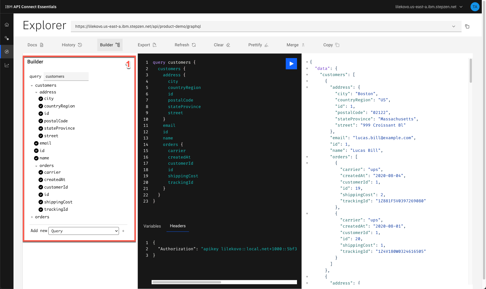
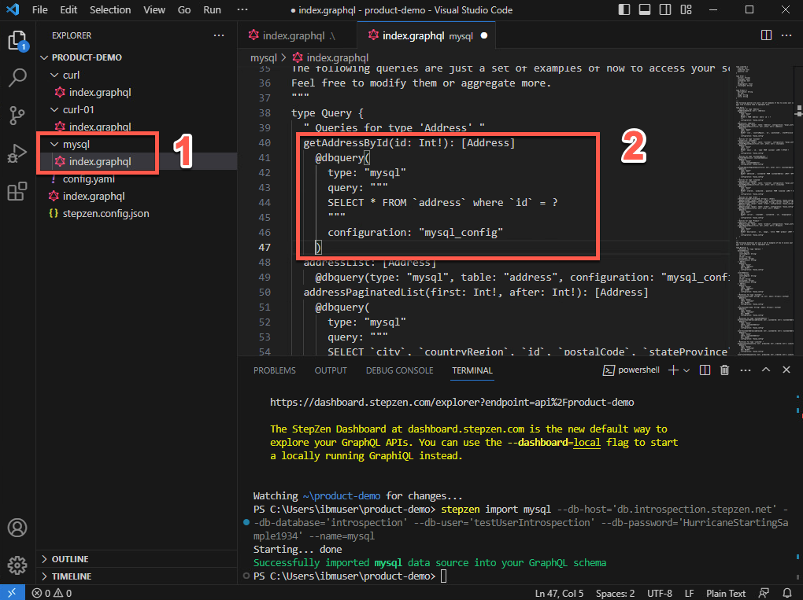
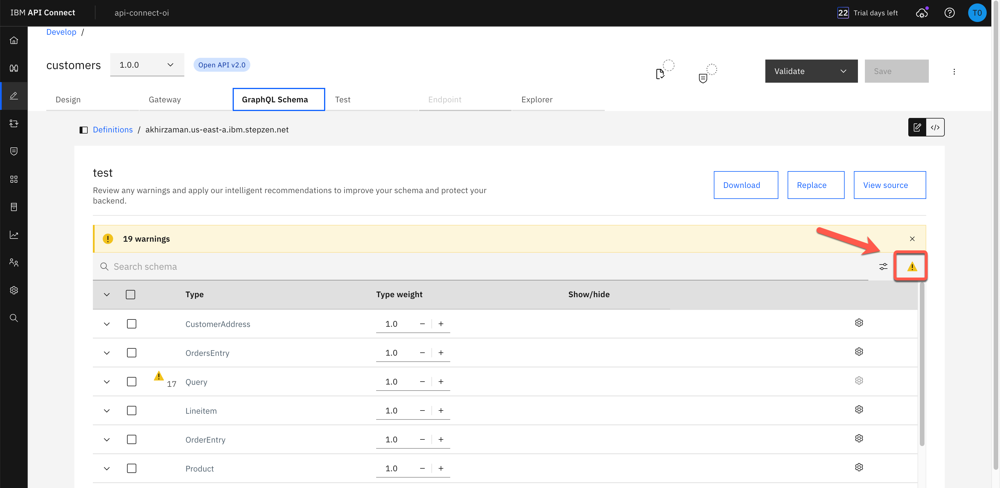
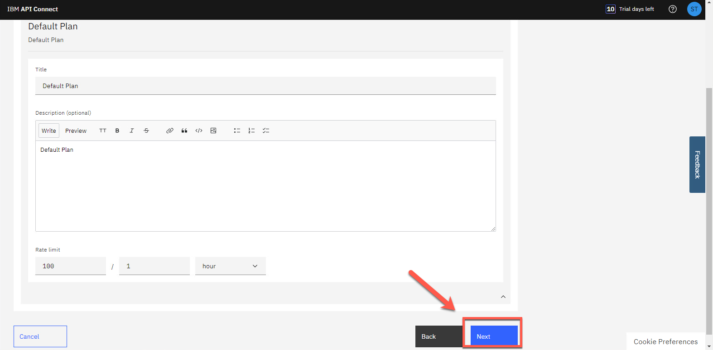
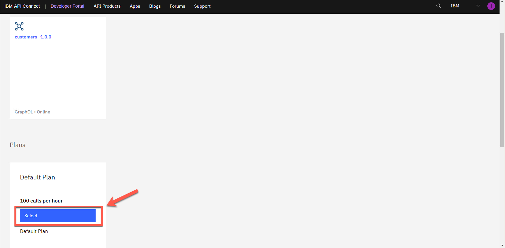
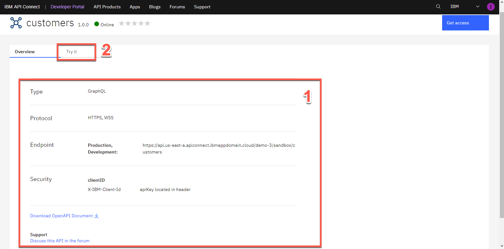
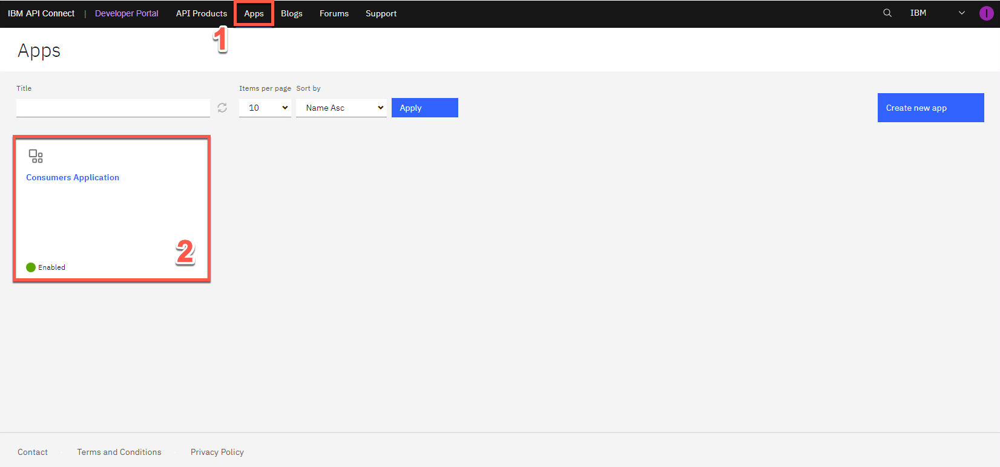

<FeatureCard
  title="Create, Manage, Secure and Socialize GraphQL APIs with APIC and APIC Essentials - Demo Script"
  color="dark"
  >


</FeatureCard>

<span id="place1"></span>

### **Introduction**
<br/>
The rising adoption of hybrid cloud has resulted in data stored everywhere – in different types of data stores likes data warehouses, lakes, and lakehouses as well as across different clouds and on-premises environments. APIs serve as the essential connector between different data sources and applications, which means that businesses are relying on and creating more APIs than ever before to get the data they need to power their applications and experiences.
<br/><br/>
GraphQL has rapidly become a go-to query language for companies to interact with their data and is emerging as a new standard for APIs, layering upon the investments in REST APIs and data systems. While GraphQL APIs are significantly easier for the application teams to consume, they can represent a challenge to the API Provider teams tasked with building them. We believe that APIs built declaratively are simply better - leading to first implementation with fewer lines of clean code, faster time to deploy, and APIs with built-in performance, cost, and reliability optimizations.
<br/><br/>
Focus Corporation, a hypothetical retail company engaged with IBM, is highly motivated to derive more revenue from first-time customers to their online storefronts. Focus development team decided to invest in GraphQL as a new standard for APIs. GraphQL is a query language for APIs that gives an application client greater control over what data it retrieves in an API request when compared with a REST API request.
<br/><br/>
Focus’ developers would like to explore an easier way for developers to build GraphQL APIs, consuming data stored everywhere.  While GraphQL APIs are significantly easier for the application teams to consume, they can represent a challenge to the API teams tasked with building them, securing them, socializing them, and managing them. To ease the process of building these APIs, they would like to explore a way to create GraphQL APIs using a declarative approach for federated access to data.
<br/><br/>
Focus’ team requested a demo to learn how to move from zero to enterprise in the GraphQL API domain. The following demo, Focus’ developers will learn how to use API Connect Essentials (StepZen) to create a a federated GraphQL API by pulling data from disparate sources (REST API and MySQL). After that they will use IBM API Connect to create a GraphQL API proxy definition that proxies a backend GraphQL server from StepZen, and to define rate limiting controls that reflect the amount of data that is returned from the server. In this demo, Focus will see how to CREATE, MANAGE, SECURE and SOCIALIZE their GraphQL APIs using IBM API Connect solution.
<br/><br/>

(Demo Slides <a href="https://github.com/ibm-integration/learninghub/blob/main/src/pages/demos/apic-tech-graphql/files/APICGraphQLSlides.pptx" target="_blank" rel="noreferrer">here</a>)
<br/>


### **1 - Setup API Connect Essentials (StepZen)**

<details>
<summary>1.1 - Access APIC Essentials</summary><br/>

**Narration**

StepZen enables developers to easily build and deploy a single GraphQL API that gets the data they need from multiple backends. The StepZen CLI is the primary tool for creating, uploading, deploying, and testing your StepZen API. The StepZen CLI enables Focus’ developers to manage they StepZen schemas, configurations, and endpoints. The CLI also comes with a built-in Schema Explorer that enables them to explore and test the API.

Focus' developers already installed StepZen CLI. Next, they need to get the details about our StepZen account. For this demo, they are using a free StepZen account.


<hr/><br/>

**Action** &nbsp; 1.1.1

In your email inbox (that you used to create the API Connect Essentials free account), search for **IBM SaaS** (1), open the "**ccess your IBM API Connect Essentials free instance**" email (2). Then click **Access Lite** (3).

  

<hr/><br/>


**Action** &nbsp; 1.1.2

Click **Log in** button.

  

<hr/><br/>


**Action** &nbsp; 1.1.3

**Log in** with your *username* and *password*.


  

***
</details>


<details>
<summary>1.2 - Get your Account details</summary><br/>

**Narration**

To get the details about Focus’ account, first they need to navigate to the API Connect Essentials Dashboard. In the Account page, they will find their environment name, the domain, and the two keys they need for API authentication.

<hr/><br/>

**Action** &nbsp; 1.2.1

On API Connect Essentials Dashboard page, scroll down to see the *Authentication details* section. Copy the **Environment** name (1), the **Domain** (2) and **Admin Key** (3). You will use them in the next step.

  

***
</details>

<details>
<summary>1.3 - APIC Essentials CLI log in</summary><br/>

**Narration**

To run APIC Essentials in the cloud, the developers can connect the CLI to their account to get a private and secure endpoint or use APIC Essentials with a public account. After installing the CLI, they are able to connect it to their account using the login CLI command.

<hr/><br/>

**Action** &nbsp; 1.3.1

Using Visual Studio Code terminal window, execute the command below to log in with API Connect Essentials CLI, replace [your_environment] with the environment value (1), and [your_domain] with the domain value (2) from the Account details page.

```
stepzen login [your_domain] -a [your_environment]
```
&nbsp;
&nbsp;
  

**Action** &nbsp; 1.3.2

Now, you need to enter your Admin Key. Copy and paste the **Admin Key** value (3) from the Account page.

    

***
</details>

<br/><br/>

### **2 - Build a GraphQL API from a REST API**

<details>
<summary>2.1 - Create your API directory</summary><br/>

**Narration**

Using API Connect Essentials, Focus’ developers can create a GraphQL API for backends with REST interfaces in minutes.

There are two ways to create a GraphQL API with StepZen when they have a REST backend.

<ul>
<li>Use the command-line interface (CLI) command stepzen import curl to specify an existing REST endpoint - StepZen introspects the endpoint and auto-generates a GraphQL schema for you.</li>
<li>Write the schema code in a .graphql GraphQL Schema Definition Language (SDL) file. Use the powerful GraphQL directive @rest to connect the REST endpoint, and with just a few lines of code, they have a working schema.</li>
</ul><br/>

In this module, Focus’ developers will learn how to use stepzen import curl command on an existing REST API. This command sends a curl request to StepZen and parses the GraphQL types from the JSON response. Before the developers build their GraphQL API, they need to create a new directory.

<hr/><br/>

**Action** &nbsp; 2.1.1

On Visual Studio Code Terminal, execute the command below to create a new directory.

```
mkdir product-demo
```
&nbsp;
&nbsp;
  

<hr/><br/>

**Action** &nbsp; 2.1.2

Change to the new directory.

```
cd product-demo
```
&nbsp;
&nbsp;


***
</details>

<details>
<summary>2.2 - Initialize the APIC Essentials workspace</summary><br/>

**Narration**

With the directory created, Focus’ developers need to initialize the StepZen workspace in their working directory. They use the StepZen CLI init command to do it.

<hr/><br/>

**Action** &nbsp; 2.2.1

On Visual Studio Code Terminal, execute the command below.

```
stepzen init --endpoint=api/product-demo
```
&nbsp;
&nbsp;
  

***
</details>


<details>
<summary>2.3 - Introspects the REST endpoint</summary><br/>

**Narration**

An amazing feature of StepZen is the possibility to introspects the REST endpoint and auto-generates a GraphQL schema for Focus’ team. Using this capability, the Focus’ developers are using a REST API provided by their legacy CRM system with their CUSTOMERS information, and creating a new GraphQL API.

<hr/><br/>

**Action** &nbsp; 2.3.1

On Visual Studio Code Terminal, execute the command below.

```
stepzen import curl "https://introspection.apis.stepzen.com/customers" --query-name "customers"
```
&nbsp;
&nbsp;
  

***
</details>

<details>
<summary>2.4 - Explore GraphQL schema</summary><br/>

**Narration**

Their first GraphQL API was created. Now, it is time to explore the graphQL schema! First, they need to open their project folder and open the index.graphql file on curl folder. Here the developers have all the schema of their customers REST API.  Before, they deploy the GraphQL, they would like to import another REST endpoint.

<hr/><br/>

**Action** &nbsp; 2.4.1

On Visual Studio Code, click on **Explorer** icon (1) and click **Open Folder** (2).

  

<hr/><br/>

**Action** &nbsp; 2.4.2

Select the new created **product-demo** folder (1) and click **Select Folder** (2).

  

<hr/><br/>

**Action** &nbsp; 2.4.3

If necessary, click **Yes, I trust the authors** button.

  

<hr/><br/>

**Action** &nbsp; 2.4.4

To see the GraphQL schema, open the **curl** folder and select the **index.graphql** file (1). You are welcome to explore and check the .graphQL file (2).

  

<hr/><br/>

**Action** &nbsp; 2.4.5

If necessary, click **View > Terminal** to see the terminal window again.

  

***
</details>

<br/><br/>

### **3 - Adding a new REST API in the GraphQL API**
<details>
<summary>3.1 - Import a new REST API</summary><br/>

**Narration**

Focus’ developers will now improve their GraphQL API by addding another REST API from their CRM about ORDERS. To do it, they just need to run the import command again with a different REST URL.

<hr/><br/>

**Action** &nbsp; 3.1.1

On Visual Studio Code Terminal, execute the command below to import another REST API.

```
stepzen import curl "https://introspection.apis.stepzen.com/orders" --query-name "orders" --query-type "Order"
```
&nbsp;
&nbsp;
  


***
</details>


<details>
<summary>3.2 - Explore the schema</summary><br/>

**Narration**

To check the new graphQL schema, the developers just need to open the curl-01 folder and open the new index.graphql file. Here they can see the schema of the orders API.

This third schema in the product-demo folder is aggregating the other two schemas of the two different REST APIs.

<hr/><br/>

**Action** &nbsp; 3.2.1

Open the **curl-01** folder and open the new **index.graphql** file (1). You are welcome to explore the new schema (2).

  

<hr/><br/>


**Action** &nbsp; 3.2.2

Open the third schema, the **index.graphql** file in the **product-demo** folder (1) and check this schema is referencing the other two schemas (2).

  


***
</details>


<details>
<summary>3.3 - Start the endpoint</summary><br/>

**Narration**

StepZen can be deployed and run as a managed service on StepZen's cloud, on a virtual private cloud, or in a colocation data center. Whatever Focus’ choice of deployment, StepZen helps them to build clean, declarative, consistent APIs and run them at scale with built-in optimizations.

To Deploy and run their endpoint, from command line, the Focus’ developers will run the stepzen start command.

This command does three things:

<ul>
  <li>Deploys the code in the current directory (or the directory provided via the --dir flag) to the specified endpoint on StepZen.</li>
  <li>Watches the directory for changes and automatically deploys them to the endpoint specified.</li>
  <li>Share a URL with StepZen's Schema Explorer that enables the developers to test their API by exploring the queries and types available and querying the API running on StepZen.</li>
</ul><br/>

The StepZen dashboard provides a playground for testing Focus’ GraphQL API. Next they will explore their GraphQL API.

<hr/><br/>

**Action** &nbsp; 3.3.1

On Visual Studio Code terminal,  run the command below to initialize your endpoint.

```
stepzen start
```
&nbsp;
&nbsp;
  


<hr/><br/>

**Action** &nbsp; 3.3.2

Show the stepzen start return.
  

<hr/><br/>

**Action** &nbsp; 3.3.3

Back to the APIC Essentials page, open the **Endpoint** page.
  

<hr/><br/>

**Action** &nbsp; 3.3.4

Click on **Actions** menu (1) and select **Open Explorer** (2).
  

***
</details>


<details>
<summary>3.4 - Test the endpoint</summary><br/>

**Narration**

The APIC Essentials Explorer provides a playground for testing the GraphQL API. In the Explorer, Focus’ developers can play with different queries, for example, they can try the orders query. Another possibility is to run a customer query, with some custom fields. Remember, with this GraphQL API, they are consuming data from two different REST APIs. And if they want, they can do that with APIs from different types of data sources as well.

<hr/><br/>

**Action** &nbsp; 3.4.1

Go ahead and click **Execute Query** button (1) to test the *customers* query.  Check the result data (2).

  

<hr/><br/>


**Action** &nbsp; 3.4.2

You are welcome to play with the Builder section (1), to create queries with different values.

  


***
</details>

<br/><br/>


### **4 - Autogenerate GraphQL Schemas from MySQL Database**
<details>
<summary>4.1 - Import MySQL schema</summary><br/>

**Narration**

At this stage, the Focus’ team decided to create a GraphQL API with a SQL database backend.

There are two ways to create your GraphQL API with StepZen when you have a SQL database backend.

<ul>
  <li>Use the command-line interface (CLI) command stepzen import [mysql OR postgresql] to specify their database - StepZen introspects it and auto-generates a GraphQL schema for you.</li>
  <li>Write the schema code in a .graphql GraphQL Schema Definition Language (SDL) file. Use the GraphQL directive @dbquery to connect the database, and with just a few lines of code, they have a working schema.)</li>
</ul><br/>

Focus' team decided to use stepzen import mysql command. Focus's Database team provided all details of a MySQL database. The developers use StepZen CLI command to import the database schema to a GraphQL API.

<hr/><br/>

**Action** &nbsp; 4.1.1

On Visual Studio Code terminal, cancel the current execution (CTRL+C). And execute the command below to create a GraphQL API that connects data from a database backend.

```
stepzen import mysql --db-host='db.introspection.stepzen.net' --db-database='introspection' --db-user='testUserIntrospection' --db-password='HurricaneStartingSample1934' --name=mysql
```
&nbsp;
&nbsp;
  

***
</details>


<details>
<summary>4.2 - Explore MySQL schema</summary><br/>

**Narration**

To check the new graphQL schema, they just need to open the mysql folder and open the new index.graphql file. Here they have their database schema from MySQL.

By now, they are invoking two REST APIs and one MySQL database in their GraphQL API.

<hr/><br/>

**Action** &nbsp; 4.2.1

On VSCode, open the **mysql** folder and open the new **index.graphql** file (1). You are welcome to explore the new schema (2).

  

***
</details>


<br/><br/>

### **5 - Creating a composition of building blocks using @materializer**
<details>
<summary>5.1 - Create the getAddressById query</summary><br/>

**Narration**

In many organizations, APIs are built around organizations or domains. For example, a B2C retail business might have customer APIs, e-commerce APIs, marketing APIs, and so on. These APIs are typically built by semi-independent teams, and usually have some common lightweight structures (like authentication, documentation, etc.), but otherwise are constructed independently. And they might appear in the same portal for the API consumer, but there is nothing that connects them.

Because GraphQL APIs are designed to “stitch” data together, GraphQL represents an opportunity to Focus’ team to connect APIs easily—even those built by independent teams.  GraphQL federation is a critical element of a GraphQL architecture. Federation is about assembling the work of independent teams into one, or possibly a few, uber GraphQL APIs. Focus’ developers would like to see how to do it!

First, they need to create a query to getAddressById in their MySQL database.


<hr/><br/>

**Action** &nbsp; 5.1.1

On the **index.graphql** from **mysql** folder (1), scroll down to see the ‘*type Query*’ declaration. Below the sentence "**Queries for type ‘Address’**" include the query code below (2).

```
getAddressById(id: Int!): [Address]
@dbquery(
  type: "mysql"
  query: """
  SELECT * FROM `address` where `id` = ?
  """
  configuration: "mysql_config"
)
```
&nbsp;
&nbsp;
This code is defining a getAddressById query to select address from mySQL database.

  


<hr/><br/>


**Action** &nbsp; 5.1.2

**Save** the file (File > Save or CTRL+S).
<br/>

***
</details>


<details>
<summary>5.2 - Create a composition with @materializer</summary><br/>

**Narration**

At this stage, they have multiple subgraphs. They would like to explore the scenario of link types across subgraphs with @materializer.

Focus’ team just need to change the address field to use the getAdressById query that they have just created. With that, they can easily link these two subgraphs with @materializer.

<hr/><br/>

**Action** &nbsp; 5.2.1

Open the **index.graphql** file from **curl** folder (1), this is the schema from customers REST API.  Scroll down to see the ‘*type RootEntry*’ section.  By now, the address is coming from the REST API endpoint. Let's change it to get this value from MySQL database. Replace the current address type definition (address: Address) for the code below (2).
```
address: [Address]
  @materializer (query: "getAddressById")
```
&nbsp;
&nbsp;
  

<hr/><br/>

**Action** &nbsp; 5.2.2

**Save** the file (File > Save or CTRL+S).
<br/>

***
</details>


<details>
<summary>5.3 - Test the composition</summary><br/>

**Narration**

Focus’ developers are ready to deploy their new API. Now they can test the new API, by creating a customers query including address attributes.

Finally, here is the response, including data from REST API and MySQL database at the same time.

Before the developers move to API Connections part, to see how to manage, secure and socialize this API, they need to take a copy of their API endpoint and the Authorization header. They will use this information later to invoke this API.

One important point to highlight here is about how StepZen controls access to GraphQL schemas and endpoints.

As Focus’team build out their GraphQL APIs, they will want to add access control mechanisms to prevent unauthorized use of these endpoints. StepZen supports two different solutions for this problem.

<ul>
  <li>API Keys: they can use API keys to control access to the entire endpoint. API keys are the default access control mechanism.</li>
  <li>And Field Policies: they can use Field policies to control access to specific entry point fields on the endpoint. Field policies provide fine-grained access control to their GraphQL API, using a model similar to attribute-based access control.</li>
</ul><br/>

StepZen provides two different types of API keys for use with an account: Admin Keys and API Keys. Admin keys provide administrative-level access to their account, and should only be used at development time. API keys provide more limited access to their account, and should be used for production.

In this demo, for simplification purpose, Focus’ developers will use the Admin Keys to access their API. In a real environment, they should use API Keys or Field Policies to improve their API’s security.

<hr/><br/>

**Action** &nbsp; 5.3.1

On Visual Studio Code terminal, execute the command below.
```
stepzen start
```
&nbsp;
&nbsp;
  

<hr/><br/>


**Action** &nbsp; 5.3.2

Back to the browser, refresh the Stepzen Dashboard page.

<hr/><br/>


**Action** &nbsp; 5.3.3

On the APIC Essentials Explorer page, use the Builder section (1), to create a customers query including address attributes (2). Execute the query again (3) and check the result data is coming from Rest and MySQL database (4).

  


<hr/><br/>

**Action** &nbsp; 5.3.4

Take a copy of your API endpoint (1) and the Authorization header (2).

  


***
</details>


<br/><br/>

### **6 - Create a GraphQL Proxy API in APIC**
<details>
<summary>6.1 - Access the APIC Environment</summary><br/>

**Narration**

Great, Focus’ team created their GraphQL API using a declarative approach. However the developer's team still need a comprehensive API solution and strategy to manage these new GraphQL APIs from a unified and centrally visible solution.

They are looking for an integrated API management offering, with capabilities and tooling for all phases of the API lifecycle. Key steps of the API lifecycle include create, secure, manage, socialize, and analyze the APIs.

IBM API Connect is a full lifecycle API management solution that uses an intuitive experience to help consistently create, manage, secure, socialize and monetize APIs, which promotes digital transformation on premises and across clouds. This means Focus can power digital apps and spur innovation in real-time. IBM API Connect is also available as-a-Service as a highly scalable, fully managed API management platform on Amazon Web Services (AWS).

The Focus’ developer would like to explore how IBM API Connect will support them to manage their GraphQL APIs.  For this demo, they are using a trial account of IBM APIC on AWS.

<hr/><br/>

**Action** &nbsp; 6.1.1

In your email inbox (that you used to create the APIC trial account), search for **IBM SaaS** (1), open the "**Your API Connect trial is ready**" email (2).

  

<hr/><br/>


**Action** &nbsp; 6.1.2

Now, click **Access trial** button.

  

<hr/><br/>


**Action** &nbsp; 6.1.3

Log in with your APIC user and password.

  


<hr/><br/>

<InlineNotification kind="warning">There is a known issue to edit the gateway policies in the new assembly editor on APIC on AWS. The Development's team is working to fix it as soon as possible. Because of it, the steps below are a workaround to set a flag to use the old editor. As soon as the bug is fixed, the steps 6.1.4 to 6.1.6 will be removed.</InlineNotification>

<br/>

**Action** &nbsp; 6.1.4 (WORKAROUND)

Edit your APIC on AWS home URL and include **/FF** at the end and press **ENTER**.

  

<hr/><br/>

**Action** &nbsp; 6.1.5 (WORKAROUND)

On the *Feature flags* page, scroll down to see the latest flag **Enable legacy assembly editor for gateway policies) and toggle the button from offline to **online**.

  

<hr/><br/>

**Action** &nbsp; 6.1.6 (WORKAROUND)

Click the **Home** button to return to the APIC homepage.

  

<br/>

***
</details>


<details>
<summary>6.2 - Create a new API from existing GraphQL service</summary><br/>

**Narration**

Here, the developers are on their API Connect Enterprise as a Service environment. API Connect Enterprise as a Service is a cloud-based edition of IBM API Connect. Using API Connect Enterprise as a Service enables them to work in the cloud to create, manage, secure, and socialize APIs using latest features, innovation, and industry standards for full API lifecycle management.

API Connect Enterprise as a Service uses software-as-a-service as a delivery model. With this model, API Connect is hosted on Amazon Web Services and is managed by IBM. Focus Corporation pays for using the software without worrying about owning and maintaining the underlying infrastructure. With API Connect Enterprise as a Service, they pay for usage through their AWS bill.

IBM API Connect enables them to create a GraphQL API proxy definition that proxies a backend GraphQL server. API Connect extends the GraphQL standard by providing, in a GraphQL API definition, the ability to configure a range of settings that are used to calculate the complexity of a GraphQL request and an associated cost that counts towards the rate limit.

<hr/><br/>

**Action** &nbsp; 6.2.1

Click on the **Develop** menu.

  

<hr/><br/>


**Action** &nbsp; 6.2.2

Then click **Add->API**.

  

<hr/><br/>


**Action** &nbsp; 6.2.3

Select **From Existing GraphQL service (GraphQL proxy)** (1).  Then click **Next** (2).

  

***
</details>


<details>
<summary>6.3 - Add the details of your GraphQL service</summary><br/>

**Narration**

Now, Focus’ developers need to add details from their GraphQL API created with API Connect Essentials (StepZen).  Pointing to an existing GraphQL server, API Connect introspects the service and automatically creates a GraphQL proxy service.

As described earlier in this demo, the StepZen API is using an API Key approach to control access to the entire endpoint. Because of that, the Focus’ developers need to include the API Key in the Authorization Header of the HTTP Header.

The schema validator reports warning and errors if found. By now, the developers ignore the schema warning. They will fix this warning in later steps.

Great! Focus' developers successfully created a GraphQL proxy API using IBM API Connect.

<hr/><br/>

**Action** &nbsp; 6.3.1

Enter the following values:

  Title: **customers** (1)

  GraphQL server URL: [*Your API URL copied from StepZen Dashboard*] (for example: https://wanaka.stepzen.net/api/product-demo/__graphql) (2)

  

<hr/><br/>

**Action** &nbsp; 6.3.2

In the *HTTP Header* section, click **Add** (1) to enter **Authorization** (2) as *Header* and paste the *API Key value* that you copied from the *StepZen Dashboard Headers* section as *Value* (3). Then click *Next* (4).

  

<hr/><br/>


**Action** &nbsp; 6.3.3

In the Paths section, select **all** the available endpoints (1), then click **Next** (2).

  

<hr/><br/>


**Action** &nbsp; 6.3.4

Keep both **Secure using Client ID** and **CORS** checked (1) and click **Next** (2).

  

<hr/><br/>


**Action** &nbsp; 6.3.5

Great! API Connect successfully created a GraphQL proxy API.

  

***
</details>

<br/><br/>


### **7 - Edit and Test the GraphQL Proxy API**
<details>
<summary>7.1 - Edit API</summary><br/>

**Narration**

Next, the developers would like to edit the API to view more details on the proxy flow.

GraphQL APIs are structured the same as REST APIs with some additional options. Just like REST APIs, developers are able to add security schemas, paths and definitions from the left menu bar. They can also view the Gateway, Test and Explorer tabs similar to REST APIs. They will notice a new tab for GraphQL APIs.

<hr/><br/>

**Action** &nbsp; 7.1.1

Click **Edit API** to continue.

  

<hr/><br/>

**Action** &nbsp; 7.1.2

Click on **GraphQL Schema** tab to view the schema.

  

***
</details>

<details>
<summary>7.2 - Apply suggestions</summary><br/>

**Narration**

The GraphQL Schema tab displays Type for every type in your GraphQL schema, and Type Weight information for the cost or expense of each type. The weighting factor is used when calculating the type cost for a request to the GraphQL API. For example, a field that requires extensive CPU or memory use on the server to retrieve its value would be given a higher cost.

In addition to the warning details, the Warning window gives an option to fix the warning by applying the limits. While this Artificial Intelligence is often very accurate, for a real scenario it is important to carefully examine the results and only accept them when they are accurate, since this affects the security of your application.

After applying the recommendations, the warning message is removed.


<hr/><br/>

**Action** &nbsp; 7.2.1

Click **View** in the *Warning* message.

  

<hr/><br/>


**Action** &nbsp; 7.2.2

In our case, click **Apply all** (1), then click **Apply** (2).

  


<hr/><br/>

**Action** &nbsp; 7.2.3

Click **Save** to save the API definition.


***
</details>

<details>
<summary>7.3 - Edit Gateway Flow</summary><br/>

**Narration**

It is time to explore the Gateway view. The flow is automatically created as part of the initial API creation. The developers may apply additional logic by dragging and dropping items from the palette to the canvas. Focus’ developers will do a small change to allow Authorization header propagation.

Here they can add the  Authorization header in the allowlist.


<hr/><br/>

**Action** &nbsp; 7.3.1

Open the **Gateway** view.

  


<hr/><br/>

**Action** &nbsp; 7.3.2

Scroll down the flow (1) and on the **Otherwise** ramification (2), you should see a **graphql-invoke** node, click on it to edit (3).

  


<hr/><br/>


**Action** &nbsp; 7.3.3

On the *graphql-invoke* node definition, scroll down to see the *Header control* section. Click on **Add allowlist** to add a new header in the list.

  


<hr/><br/>


**Action** &nbsp; 7.3.4

Enter **Authorization** as the new header allowed (1) and click **Save** button (2). This means that we will send the Authorization header on to the backend.

  


***
</details>

<details>
<summary>7.4 - Test the API</summary><br/>

**Narration**

At this stage, they are ready to test the Proxy API. To publish the API, first they need to set their API to online.

After successfully publishing the API to API Gateway, additional tabs appear on the screen. It is time to explore the Test tab.

The Test page also includes a GraphQL Editor. Here Focus’ developers can include their customers query. If necessary, they can use Prettify option to improve the visualization of the GraphQL query.

Next, they need to include the Authorization heard in the Parameters tab.

Every time that they invoke their API, they need to pass their API Key as the Authorization header. By now, they will include it in their test.

On the Trace section, they should see an HTTP Status: 200 and in the Response data, they can see the data returned from their GraphQL API.

<hr/><br/>

**Action** &nbsp; 7.4.1

Click the **Settings** icon.


<hr/><br/>


**Action** &nbsp; 7.4.2

Toggle the *Auto-publish* button from off to **on** (1). Then click **Save Preferences** (2).


<hr/><br/>


<InlineNotification kind="warning">There is a known issue with GraphQL test tool on APIC on AWS. The Development's team is working to fix it as soon as possible. Because of it, please skip steps 7.4.3 - 7.4.8. The step 7.4.9 is a workaround to test your GraphQL Proxy API using an external tool. As soon as the issue is fixed, the step 7.4.9 will be removed.</InlineNotification>

<br/>

**Action** &nbsp; 7.4.3 (This step is currently not working, see the notification above)

Select **Test** tab to test the API.


<hr/><br/>

**Action** &nbsp; 7.4.4 (This step is currently not working, see the notification on step 7.4.3)

Enter the following GraphQL query in the GraphQL Editor. You may use **Prettify** option to improve the visualization of the GraphQL query.

```
{
  customers {
    email
    id
    name
    address {
      city
      countryRegion
      postalCode
      stateProvince
    }
  }
}
```
&nbsp;
&nbsp;
  

<hr/><br/>

**Action** &nbsp; 7.4.5 (This step is currently not working, see the notification on step 7.4.3)

Now you need to include the Authorization heard. Open the **Parameters** tab.

  

<hr/><br/>

**Action** &nbsp; 7.4.6 (This step is currently not working, see the notification on step 7.4.3)

On the bottom of the Parameters list, include a new parameter with the following value:

Key: **Authorization** (1)

Located In: **header** (2)

Value: *[paste the API Key value that you copied from the StepZen Dashboard Headers]* (3)

  

<hr/><br/>

**Action** &nbsp; 7.4.7 (This step is currently not working, see the notification on step 7.4.3)

Now click the **Send** button (1) and open the **GraphiQL** tab (2) again to see the result.

  

<hr/><br/>

**Action** &nbsp; 7.4.8 (This step is currently not working, see the notification on step 7.4.3)

On the Trace section, you should see an HTTP Status: 200 (1) and in the Response data you have the data returned from your GraphQL API (2).

  


<hr/><br/>

**Action** &nbsp; 7.4.9 (WORKAROUND)

Another way to test your API is using a GraphQL sandbox. For example, open this <a href="https://graphqlzero.almansi.me/api" target="_blank">URL</a> (1), copy and paste the requested URL from APIC (2), enter the Graphql query (3) and in the HTTP Header section, enter a JSON with the Authorization header parameter that you copied from StepZen, and copy and paste the X-IBM-Client-Id from APIC parameters tab (see step 7.4.6) (4). And click on the **Play** button to see the graphQL returned data (5).

```
{
  customers {
    email
    id
    name
    address {
      city
      countryRegion
      postalCode
      stateProvince
    }
  }
}
```
<br/>

  

***
</details>

<details>
<summary>7.5 - Add the authorization header</summary><br/>

**Narration**

That is really good! But the Focus’. Team decided to simplify it. They decided to hardcode the Authorization header parameter in their GraphQL API Proxy flow.

To do it, they will add a set variable node before the graphql-invoke. This node will add the authorization header in their message with the value that they copied from StepZen Dashboard.

<hr/><br/>

**Action** &nbsp; 7.5.1

Open the **Gateway** tab again.

  

<hr/><br/>

**Action** &nbsp; 7.5.2

On the **Otherwise** (1) which starts with a *Parse*, you will add a node before the *graphql-invoke* node.  On the *Palette* view, scroll down to see the *Policies* section (2). Drag and drop the **Set Variable** (3) node between the "*ratelimit expected*" node and the "*graphql-invoke*" node (4).

  

<hr/><br/>

**Action** &nbsp; 7.5.3

Enter **set-authorization** as Title (1) and click **Add action** (2).

  

<hr/><br/>

**Action** &nbsp; 7.5.4

Keep **Set** (1) as the type of the action. On the Set field, enter **message.headers.Authorization** (2) as the name of the variable to be set. Select **String** (3) as type of the value to set. And in the *Value* field, paste the *API Key value that you copied from the StepZen Dashboard Headers* (4).

  

<hr/><br/>

**Action** &nbsp; 7.5.5

Then click **Save**.

  

***
</details>


<details>
<summary>7.6 - Test the new header</summary><br/>

**Narration**

It’s finally time to test the hard work of Focus’ Development team. Now, they will test their API again, this time without passing the Authorization token.

Great! Now their GraphQL Proxy is running and available to be used.

<hr/><br/>

<InlineNotification kind="warning">There is a known issue with GraphQL test tool on APIC on AWS. The Development's team is working to fix it as soon as possible. Because of it, please skip steps 7.6.1 - 7.6.2. The step 7.6.3 is a workaround to test your GraphQL Proxy API using an external tool. As soon as the issue is fixed, the step 7.6.3 will be removed.</InlineNotification>

<br/>

**Action** &nbsp; 7.6.1 (This step is currently not working, see the notification above)

Open the **Test** tab (1), and click the **Execute Query** button (2). (Note: if you want, you can check in the Parameters tab that there isn't an Authorization header parameter).

  

<hr/><br/>

**Action** &nbsp; 7.6.2 (This step is currently not working, see the notification on step 7.6.1)

Show the result. You are welcome to change the GraphQL query to test more scenarios. You can also use the **Example** button to help start your creativity. On breadcrumbs, return to **Develop** page.

  

<hr/><br/>

**Action** &nbsp; 7.6.3 (WORKAROUND)

You can keep using the <a href="https://graphqlzero.almansi.me/api" target="_blank">external GraphQL playground</a> to test your api(1), but now in the HTTP Header section, remove the Authorization header parameter (4). Then click on the **Play** button to see the graphQL returned data (5).

```
{
  customers {
    email
    id
    name
    address {
      city
      countryRegion
      postalCode
      stateProvince
    }
  }
}
```
<br/>

  

***

</details>

<br/><br/>

### **8 - Create a Product and apply GraphQL RateLimits**
<details>
<summary>8.1 - Add new Product</summary><br/>

**Narration**

Having successfully tested their GraphQL Proxy API, Focus’ team is ready to package their APIs using products for publishing to consumers. Products are packages that contain both the APIs and the accompanying plans. The providers use plans to control access to APIs and to manage API usage. Plans can use differing rate limits to provide different levels of service to API consumers. Focus Corporation can have multiple plans for different consumers. For example, they can add approval steps for consumers when they sign up, or they can allocate them plans as a provider.

Based on that, the Focus’ team decided to create a product from scratch. After including the basic information about the product, they an define the default plan.

The Default Plan contains traditional rate limiting options, but in the next steps, they will be able to list and define the GraphQL rate limits.

Next, they publish the product to Sandbox catalog and accept the default for Visibility and Subscribability.

Great! Focus Corporation has a new API product.


<hr/><br/>

**Action** &nbsp; 8.1.1

Click **Add->Product**.

  

<hr/><br/>

**Action** &nbsp; 8.1.2

Select **New product** (1) and click **Next** (2).

  

<hr/><br/>

**Action** &nbsp; 8.1.3

Name the product as **Customers Product** (1) and click **Next** (2).

  

<hr/><br/>

**Action** &nbsp; 8.1.4

Add Customers API to the product by selecting **customers** (1). Then click **Next** (2).

  

<hr/><br/>

**Action** &nbsp; 8.1.5

For now, just click **Next**.

  

<hr/><br/>

**Action** &nbsp; 8.1.6

Publish the Product to Sandbox Catalog by selecting **Publish product** (1). Accept the default for *Visibility* and *Subscribability* (2) and click **Next** (3).

  

<hr/><br/>

**Action** &nbsp; 8.1.7

Click **Done**.

  

***
</details>

<details>
<summary>8.2 - Review the Plans</summary><br/>

**Narration**

At this moment, Focus’ team had successfully created a new plan. They want to review the plan to check the GraphQL rate limits.

In the Plan page, they are able to adjust GraphQL cost parameters, including costs per field or type. They can set a limit or make it unlimited.

<hr/><br/>

**Action** &nbsp; 8.2.1

Back to the *Develop* view, open **Products** tab (1) and click on **Customers Product** (2).

  

<hr/><br/>

**Action** &nbsp; 8.2.2

Open the **Plans** section (1), and on the *Default Plan*, open the **context menu** (2) and select **Edit** (3).

  

<hr/><br/>

**Action** &nbsp; 8.2.3

Show the GraphQL rate limits section.

  

<hr/><br/>

**Action** &nbsp; 8.2.4

On the left menu, click **Manage** icon to manage our Sandbox catalog.

  

***
</details>

<br/><br/>

### **9 - Socialize your API**
<details>
<summary>9.1 - Access the Developer Portal</summary><br/>

**Narration**

Now it is time to publish their API. To do it, the developers need to make sure that their API consumers can discover it and use it. The Developer Portal will allow customers to view the APIs, sign up and subscribe to plans in a self-service manner, test the APIs, download the OpenAPI - Swagger documents and more.

To access the Developer Portal, first they need to get their Portal URL and open it.


<hr/><br/>

**Action** &nbsp; 9.1.1

On *Manage* page, open the **Sandbox** catalog.

  


<hr/><br/>

**Action** &nbsp; 9.1.2

Click **Catalog settings** (1) and open the **Portal** tab (2).

  


<hr/><br/>

**Action** &nbsp; 9.1.3

Here you have your **Portal URL**. Copy it, and open it in a new browser tab.

  


***
</details>

<details>
<summary>9.2 - Register a Developer Acccount</summary><br/>

**Narration**

Focus’ Developer Portal is their public-facing website and therefore it is highly flexible and customizable, in this demo they are using the default design.

Focus team will share this Developer Portal with their Developers ecosystem, other developers that want to consume Focus’ APIs to create new applications. Focus’ team call them as API Consumers.

These consumers need need to create an account to access the developer portal. It is a self-service process.

After validate their account, the consumers are ready to log in!


<hr/><br/>

**Action** &nbsp; 9.2.1

Click **Create account** to create a new developer account.

  

<hr/><br/>

**Action** &nbsp; 9.2.2

Complete the registration form, go ahead and use any personal email.  Take note of the username (not email) and password. You will need them later to log in to the Developer Portal.

  


<hr/><br/>

**Action** &nbsp; 9.2.3

You will receive an email to activate your new developer account.  Click on the link to validate the registration.

  


<hr/><br/>

**Action** &nbsp; 9.2.4

**Sign in** (1) to Developer Portal using your developer's *username* and *password* (2).

  

***
</details>

<details>
<summary>9.3 - Create a new Application</summary><br/>

**Narration**

Note that all of these next steps are simulating what Focus’ API Consumers, their end-user customer, will do to find, buy, and use the Focus’ API.

Developer Portal displays all the products that are currently published. In Focus’ case, no Apps created yet. As a consumer/developer, they are going to create a new application in the portal. This will give them an API key, allowing them to call Focus’ APIs.

They have not subscribed to any APIs yet, they need to do it now. Next, they need to select the Customers Product 1.0. After that, they can see the plans available. In this case, only the Default plan. Now, they just need to select the app that Focus’ team created earlier and confirm their subscription. And done - they are subscribed to Focus API and they are ready to use it!

<hr/><br/>

**Action** &nbsp; 9.3.1

Click **Create a new App**.

  

<hr/><br/>

**Action** &nbsp; 9.3.2

Enter **Consumers Application** as the **App Title** (1). Click **Save** (2).

  

<hr/><br/>

**Action** &nbsp; 9.3.3

On the **Credentials** dialog box, copy the *API Key* (1), copy the *API Secret* (2), then click **OK** (3).

  

<hr/><br/>

**Action** &nbsp; 9.3.4

Click on **Why not browse the available APIs?** link.

  

<hr/><br/>

**Action** &nbsp; 9.3.5

Click on **Customers Product 1.0.0**.

  

<hr/><br/>

**Action** &nbsp; 9.3.6

In the **Default Plan** section, click **Select**.

  


<hr/><br/>

**Action** &nbsp; 9.3.7

Select the **Consumers Application**.

  

<hr/><br/>

**Action** &nbsp; 9.3.8

Confirm the subscription by clicking **Next**.

  

<hr/><br/>

**Action** &nbsp; 9.3.9

Click **Done**.

  

***
</details>

<details>
<summary>9.4 - Test the API</summary><br/>

**Narration**

The App developesr are now back at the product screen. They are able to explore the Focus’ API here. From the Overview page, they can download the OpenAPI Document and get the API endpoint. Note the portal has everything the consumers need to call the API, it’s even generated clients in various languages for them to copy/paste into their calling application. They can try the API on the Try it area. They can use the customers query here. It is time to test it. Great, they got a response, The Focus’ GraphQL Proxy API is running and available for their ecosystem. It is amazing how quickly the results are returned in the results window, coming from different sources. If this was a REST API multiple end points would be needed to achieve the same result.

<hr/><br/>

**Action** &nbsp; 9.4.1

Click the **customers 1.0.0 API**.

  

<hr/><br/>

**Action** &nbsp; 9.4.2

Open the **Try it** tab.

  


<hr/><br/>

<InlineNotification kind="warning">There is a known issue with GraphQL test tool on APIC on AWS. The Development's team is working to fix it as soon as possible. Because of it, please skip steps 9.4.3 - 9.4.4. The step 9.4.5 is a workaround to test your GraphQL Proxy API using an external tool. As soon as the issue is fixed, the step 9.4.5 will be removed.</InlineNotification>

<br/>

**Action** &nbsp; 9.4.3 (This step is currently not working, see the notification above)

Paste the API Key that you copied in the previous step (1). Paste the GraphQL below in the GraphQL editor (2). And click on **Execute Query** button (3).

```
{
  customers {
    email
    id
    name
    address {
      city
      countryRegion
      postalCode
      stateProvince
    }
  }
}
```
<br/>

  

<hr/><br/>

**Action** &nbsp; 9.4.4 (This step is currently not working, see the notification on step 9.4.3)

Your GraphQL Proxy API is running. You are welcome to continue to test the API, using the GraphQL Editor. Submit requests with different field names.

  


<hr/><br/>

**Action** &nbsp; 9.4.5 (WORKAROUND)

You can keep using the <a href="https://graphqlzero.almansi.me/api" target="_blank">external GraphQL playground</a> to test your api(1), but now in the HTTP Header section, paste the API Key that you copied in the previous stepr as your X-IBM-Client-Id header parameter (4). Then click on the **Play** button to see the graphQL returned data (5).

```
{
  customers {
    email
    id
    name
    address {
      city
      countryRegion
      postalCode
      stateProvince
    }
  }
}
```
<br/>

  

***
</details>

<details>
<summary>9.5 - Analyze the API</summary><br/>

**Narration**

Another great capability from API Connect, the consumers can see the API statistics in the portal. They just need to select ther app, and here they can see all the API calls, including any possible errors. If they make more calls, they will see larger statistic results.

In this page, the developers can view information about the APIs to help them to develop new applications.


<hr/><br/>

**Action** &nbsp; 9.5.1

Open the **Apps** page (1) and select the **Consumers Application** (2).

  

<hr/><br/>

**Action** &nbsp; 9.5.2

Show the statistics page.

  


***
</details>

<br/><br/>

### **Summary**

<br/>
Let’s summarize what Focus’ developers have done today. In this demo they: <br/>
<ul>
<li>Created a GraphQL API using a declarative approach using API Connect Essentials (StepZen);</li>
<li>Created a GraphQL API using different sources (two REST services and one MySQL database);</li>
<li>Created a graph composition using @materializer;</li>
<li>Deployed the new GraphQL API on StepZen Cloud runtime;</li>
<li>Created a GraphQL Proxy API in API Connect to call the GraphQL API on StepZen;</li>
<li>Managed their API and set up the security policies;</li>
<li>Create a Product and apply GraphQL rate limits;</li>
<li>Socialize their GraphQL API on Developer Portal and demonstrated how an API consumer can use the API portal to perform self-service consumption of the API;</li>
</ul><br/>
From a business perspective, Focus Corporate learned how to use APIs to automate a series of steps to obtain customer and order information from different sources (legacy services and databases). They verified how to use API as the foundation of their digital transformation journey.
<br/><br/>
For Focus’ Development team, they learned an easier way to build GraphQL APIs and consume data stored everywhere.  At the same time, they saw a complete API Management solution that enables them to create, secure, socialize and manage APIs.
<br/><br/>
Thank you for attending today’s presentation.
<br/>
