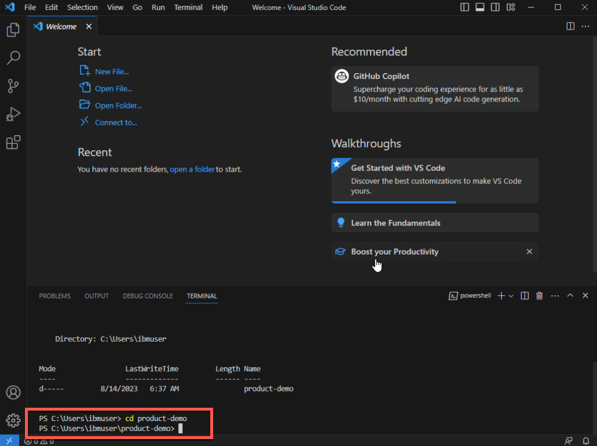
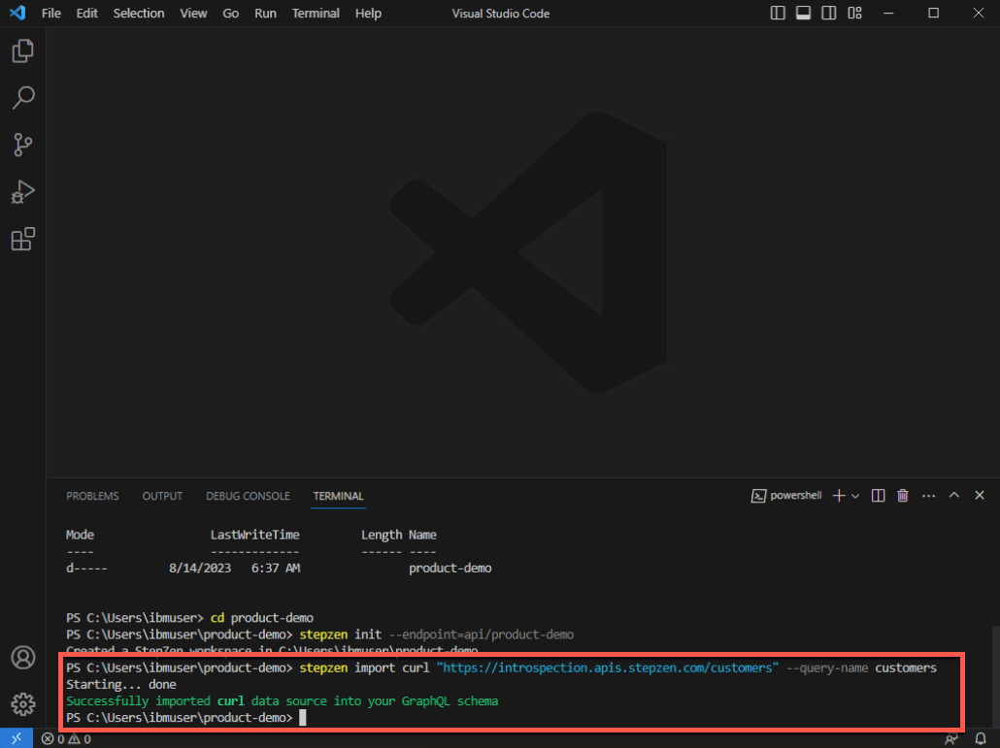

<FeatureCard
  title="Mastering Enterprise-Level GraphQL with APIC and APIC Essentials - Demo Preparation"
  color="dark"
  >


</FeatureCard>

<span id="place1"></span>

<details>

<summary>Introduction</summary>
<br/>
The rising adoption of hybrid cloud has resulted in data stored everywhere – in different types of data stores likes data warehouses, lakes, and lakehouses as well as across different clouds and on-premises environments. APIs serve as the essential connector between different data sources and applications, which means that businesses are relying on and creating more APIs than ever before to get the data they need to power their applications and experiences.
<br/><br/>
GraphQL has rapidly become a go-to query language for companies to interact with their data and is emerging as a new standard for APIs, layering upon the investments in REST APIs and data systems. While GraphQL APIs are significantly easier for the application teams to consume, they can represent a challenge to the API Provider teams tasked with building them.  We believe that APIs built declaratively are simply better - leading to first implementation with fewer lines of clean code, faster time to deploy, and APIs with built-in performance, cost, and reliability optimizations.
<br/><br/>
Our company decided to invest in GraphQL as a new standard for APIs. GraphQL is a query language for APIs that gives an application client greater control over what data it retrieves in an API request when compared with a REST API request.
<br/><br/>
We would like to explore an easier way for developers to build GraphQL APIs, consuming data stored everywhere. Take an e-commerce application for example. With a single call, GraphQL can merge data that is found in different subsystems, like customer information, order numbers, and delivery status, and return it in an expected format. While GraphQL APIs are significantly easier for the application teams to consume, they can represent a challenge to the API teams tasked with building them, securing them, socializing them, and managing them. To ease the process of building these APIs, we would like to explore a way to create GraphQL APIs using a declarative approach for federated access to data.
<br/><br/>
On the other hand, our Development's team is having problems managing the use of GraphQL APIs in your company, including rate limits, API lifecycle, security and how to socialize these APIs with our developers ecosystem.
<br/><br/>
In this demo we will learn how to move from Zero to Enterprise in the GraphQL domain. Initially we will learn how to use API Connect Essentials (StepZen) to create a a federated GraphQL API by pulling data from disparate sources (REST API and MySQL). After that you will use IBM API Connect to create a GraphQL API proxy definition that proxies a backend GraphQL server from StepZen, and to define rate limiting controls that reflect the amount of data that is returned from the server by a request to the GraphQL API.
<br/><br/>
Here we will see how to CREATE, MANAGE, SECURE and SOCIALIZE our GraphQL APIs using IBM API Connect solutions.
<br/><br/>
Let's get started!<br/><br/>

(Demo Slides <a href="https://github.com/ibm-integration/learninghub/blob/main/src/pages/demos/mq-techsales/files/APICSlides.pptx" target="_blank" rel="noreferrer">here</a>)
<br/>
</details>

<details>
<summary>1 - Setup StepZen</summary>

<br/>

| **1.1** | **Access StepZen** |
| :--- | :--- |
| **Narration** | StepZen enables developers to easily build and deploy a single GraphQL API that gets the data they need from multiple backends. The StepZen CLI is the primary tool for creating, uploading, deploying and testing your StepZen API. The StepZen CLI enables you use to manage your StepZen schemas, configurations, and endpoints. The CLI also comes with a built-in Schema Explorer that enables you to explore and test the API you’ve deployed locally from your browser. <br/><br/> We already installed StepZen CLI here. Now we need to get the details about our StepZen account. For this demo we are using a free StepZen account, let's log in here.  |
| **Action** &nbsp; 1.1.1 | On a browser window open the <a href="http://www.stepzen.com" target="_blank">URL below</a> (1) and click on **Log In** link (2). <br/><br/>```http://www.stepzen.com```<br/><br/><br/>|
| **Action** &nbsp; 1.1.2 | **Log in** with your *username* and *password*. <br/><br/><br/>|

| **1.2** | **Get your Account details** |
| :--- | :--- |
| **Narration** | When we get our account, first we need to navigate to the Stepzen Dashboard. In the Account page, we will find our account name, and the two keys weneed for API authentication. |
| **Action** &nbsp; 1.2.1 | On StepZen Dashboard page, on the left menu, open the **Account** page (key icon). <br/><br/><br/>|
| **Action** &nbsp; 1.2.2 | Copy the **Account name** (1) and **Admin Key** (2). You will use them in the next step. <br/><br/><br/>|

| **1.3** | **StepZen CLI log In** |
| :--- | :--- |
| **Narration** | To run StepZen in the cloud, we can connect the CLI to our account to get a private and secure endpoint or use StepZen with a public account. After installing the CLI, we can connect it to our account using the login CLI command. |
| **Action** &nbsp; 1.3.1 | Using Visual Studio Code terminal window, execute the command below to log in with StepZen CLI, replace [your_account] with the account value (1) from the Account page. <br/><br/> ```stepzen login -a [your_account]``` <br/><br/><br/>|
| **Action** &nbsp; 1.3.2 | Now, you need to enter your Admin Key. Copy and paste the **Admin Key** value (2) from the Account page.  <br/><br/><br/>|

<br/>

**[Go to top](#place1)**

</details>

<details>
<summary>2 - Build your GraphQL API from a REST API</summary>

<br/>

| **2.1** | **Create your API directory** |
| :--- | :--- |
| **Narration** | Using StepZen, we can create a GraphQL API for backends with REST interfaces in minutes. <br/><br/>There are two ways to create our GraphQL API with StepZen when we have a REST backend. <br/><br/> <ul><li>Use the command-line interface (CLI) command stepzen import curl to specify an existing REST endpoint - StepZen introspects the endpoint and auto-generates a GraphQL schema for you.</li><li>Write your schema code in a .graphql GraphQL Schema Definition Language (SDL) file. Use the powerful GraphQL directive @rest to connect the REST endpoint, and with just a few lines of code, you have a working schema.</li></ul><br/>In this section we will learn how to use StepZen import curl on an existing REST API. This command sends a curl request to StepZen and parses the GraphQL types from the JSON response.<br/><br/>Before we build our GraphQL API, let’s create a new directory.|
| **Action** &nbsp; 2.1.1 | On Visual Studio Code Terminal, execute the command below to create a new directory. <br/><br/>```mkdir product-demo```<br/><br/>|
| **Action** &nbsp; 2.1.2 | Change to the new directory. <br/>```cd product-demo```<br/><br/>|

| **2.2** | **Initialize the StepZen workspace** |
| :--- | :--- |
| **Narration** | We need to initialize the StepZen workspace in our working directory. Let's use the StepZen CLI init command to do it. |
| **Action** &nbsp; 2.2.1 | On Visual Studio Code Terminal, execute the command below.<br/><br/>```stepzen init --endpoint=api/product-demo```<br/><br/>|

| **2.3** | **Introspects the REST endpoint** |
| :--- | :--- |
| **Narration** | Let's take advantage of StepZen to introspects the REST endpoint and auto-generates a GraphQL schema for us. Here we are using a REST API developed by our company's DEV team with CUSTOMERS information. |
| **Action** &nbsp; 2.3.1 | On Visual Studio Code Terminal, execute the command below.<br/><br/>```stepzen import curl "https://introspection.apis.stepzen.com/customers" --query-name "customers"```<br/><br/>|

| **2.4** | **Explore graphQL schema** |
| :--- | :--- |
| **Narration** | Our first GraphQL API was created. Let's explore the graphQL schema! First, we need to open our project folder and open the index.graphql file on curl folder. Here we have all the schema of our customers REST API.  We will not deploy this GraphQL yet. Before that, let's import another REST endpoint. |
| **Action** &nbsp; 2.4.1 | On Visual Studio Code, click on **Explorer** icon (1) and click **Open Folder** (2).<br/><br/> |
| **Action** &nbsp; 2.4.2 | Select the new created **product-demo** folder (1) and click **Select Folder** (2).<br/><br/>  |
| **Action** &nbsp; 2.4.3 | If necessary, click **Yes, I trust the authors** button. <br/><br/>  |
| **Action** &nbsp; 2.4.4 | To see the GraphQL schema, open the **curl** folder and select the **index.graphql** file (1). You are welcome to explore and check the .graphQL file (2). <br/><br/>  |
| **Action** &nbsp; 2.4.5 | If necessary, click **View > Terminal** to see the terminal window again. <br/><br/>  |

<br/>

**[Go to top](#place1)**

</details>

<details>
<summary>3 - Adding a new REST API in your GraphQL API</summary>

<br/>

| **3.1** | **Import a new REST API** |
| :--- | :--- |
| **Narration** | Now, let's improve our GraphQL API by addding another REST API. We just need to execute the import command again with a new REST URL to add a new REST API. |
| **Action** &nbsp; 3.1.1 | On Visual Studio Code Terminal, execute the command below to import another REST API.<br/><br/>```stepzen import curl "https://introspection.apis.stepzen.com/orders" --query-name "orders" --query-type "Order"```<br/><br/> |

| **3.2** | **Explore schema** |
| :--- | :--- |
| **Narration** |  |
| **Action** &nbsp; 3.2.1 | Open the **curl-01** folder and open the new **index.graphql** file (1). You are welcome to explore the new schema (2).<br/><br/> |
| **Action** &nbsp; 3.2.2 | Open the third schema, the **index.graphql** file in the **product-demo** folder (1) and check this schema is referencing the other two schemas (2).<br/><br/> |

| **3.3** | **Start the endpoint** |
| :--- | :--- |
| **Narration** |  |
| **Action** &nbsp; 3.3.1 | On Visual Studio Code terminal,  run the command below to initialize your endpoint.<br/>```stepzen start```<br/><br/> |
| **Action** &nbsp; 3.3.2 | Show the stepzen start return.<br/><br/> |
| **Action** &nbsp; 3.3.3 | Scroll down your terminal page to see the Dashboard URL of your API. Copy and paste it in you browser window.<br/><br/> |

| **3.4** | **Test the endpoint** |
| :--- | :--- |
| **Narration** |  |
| **Action** &nbsp; 3.4.1 | Go ahead and click **Execute Query** button (1) to test the orders query.  Check the result data (2).<br/><br/> |
| **Action** &nbsp; 3.4.2 | You are welcome to play with the Builder section (1), to create queries with different values. For example, delete the order query, and create a customers query with some fields (2). Execute the query again (3) and check the result data (4).<br/><br/>  |

<br/>

**[Go to top](#place1)**

</details>

<details>
<summary>4 - Autogenerate GraphQL Schemas from MySQL Database</summary>

<br/>

| **4.1** | **Import MySQL schema** |
| :--- | :--- |
| **Narration** |  |
| **Action** &nbsp; 4.1.1 | <br/><br/> |

| **4.2** | **Explore MySQL schema** |
| :--- | :--- |
| **Narration** |  |
| **Action** &nbsp; 4.2.1 | <br/><br/> |

<br/>

**[Go to top](#place1)**

</details>

<details>
<summary>5 - Creating a composition of building blocks using @materializer</summary>

<br/>

| **5.1** | **Create the getAddressById query** |
| :--- | :--- |
| **Narration** |  |
| **Action** &nbsp; 5.1.1 | <br/><br/> |
| **Action** &nbsp; 5.1.2 | <br/><br/> |

| **5.2** | **Create a composition with @materializer** |
| :--- | :--- |
| **Narration** |  |
| **Action** &nbsp; 5.2.1 | <br/><br/> |
| **Action** &nbsp; 5.2.2 | <br/><br/> |

| **5.3** | **Test the composition** |
| :--- | :--- |
| **Narration** |  |
| **Action** &nbsp; 5.3.1 | <br/><br/> |
| **Action** &nbsp; 5.3.2 | <br/><br/> |
| **Action** &nbsp; 5.3.3 | <br/><br/> |
| **Action** &nbsp; 5.3.4 | <br/><br/> |

<br/>

**[Go to top](#place1)**

</details>

<details>
<summary>6 - Create a GraphQL Proxy API in APIC</summary>

<br/>

| **6.1** | **Access your APIC Environment** |
| :--- | :--- |
| **Narration** |  |
| **Action** &nbsp; 6.1.1 | <br/><br/> |
| **Action** &nbsp; 6.1.2 | <br/><br/> |
| **Action** &nbsp; 6.1.3 | <br/><br/> |

| **6.2** | **Create a new API from existing GraphQL service** |
| :--- | :--- |
| **Narration** |  |
| **Action** &nbsp; 6.2.1 | <br/><br/> |
| **Action** &nbsp; 6.2.2 | <br/><br/> |
| **Action** &nbsp; 6.2.3 | <br/><br/> |

| **6.3** | **Add the details of your GraphQL service** |
| :--- | :--- |
| **Narration** |  |
| **Action** &nbsp; 6.3.1 | <br/><br/> |
| **Action** &nbsp; 6.3.2 | <br/><br/> |
| **Action** &nbsp; 6.3.3 | <br/><br/> |
| **Action** &nbsp; 6.3.4 | <br/><br/> |
| **Action** &nbsp; 6.3.5 | <br/><br/> |

<br/>

**[Go to top](#place1)**

</details>

<details>
<summary>7 - Editing and Testing the GraphQL Proxy API</summary>

<br/>

| **7.1** | **Edit API** |
| :--- | :--- |
| **Narration** |  |
| **Action** &nbsp; 7.1.1 | <br/><br/> |
| **Action** &nbsp; 7.1.2 | <br/><br/> |

| **7.2** | **Apply suggestions** |
| :--- | :--- |
| **Narration** |  |
| **Action** &nbsp; 7.2.1 | <br/><br/> |
| **Action** &nbsp; 7.2.2 | <br/><br/> |
| **Action** &nbsp; 7.2.3 | <br/><br/> |

| **7.3** | **Edit Gateway Flow** |
| :--- | :--- |
| **Narration** |  |
| **Action** &nbsp; 7.3.1 | <br/><br/> |
| **Action** &nbsp; 7.3.2 | <br/><br/> |
| **Action** &nbsp; 7.3.3 | <br/><br/> |
| **Action** &nbsp; 7.3.4 | <br/><br/> |

| **7.4** | **Test the API** |
| :--- | :--- |
| **Narration** |  |
| **Action** &nbsp; 7.4.1 | <br/><br/> |
| **Action** &nbsp; 7.4.2 | <br/><br/> |
| **Action** &nbsp; 7.4.3 | <br/><br/> |
| **Action** &nbsp; 7.4.4 | <br/><br/> |
| **Action** &nbsp; 7.4.5 | <br/><br/> |
| **Action** &nbsp; 7.4.6 | <br/><br/> |
| **Action** &nbsp; 7.4.7 | <br/><br/> |

| **7.5** | **Add the authorization header** |
| :--- | :--- |
| **Narration** |  |
| **Action** &nbsp; 7.5.1 | <br/><br/> |
| **Action** &nbsp; 7.5.2 | <br/><br/> |
| **Action** &nbsp; 7.5.3 | <br/><br/> |
| **Action** &nbsp; 7.5.4 | <br/><br/> |
| **Action** &nbsp; 7.5.5 | <br/><br/> |

| **7.6** | **Test the new header** |
| :--- | :--- |
| **Narration** |  |
| **Action** &nbsp; 7.6.1 | <br/><br/> |
| **Action** &nbsp; 7.6.2 | <br/><br/> |

<br/>

**[Go to top](#place1)**

</details>

<details>
<summary>8 - Create a Product and apply GraphQL RateLimits</summary>

<br/>

| **8.1** | **Add new Product** |
| :--- | :--- |
| **Narration** |  |
| **Action** &nbsp; 8.1.1 | <br/><br/> |
| **Action** &nbsp; 8.1.2 | <br/><br/> |
| **Action** &nbsp; 8.1.3 | <br/><br/> |
| **Action** &nbsp; 8.1.4 | <br/><br/> |
| **Action** &nbsp; 8.1.5 | <br/><br/> |
| **Action** &nbsp; 8.1.6 | <br/><br/> |
| **Action** &nbsp; 8.1.7 | <br/><br/> |

| **8.2** | **Review the Plans** |
| :--- | :--- |
| **Narration** |  |
| **Action** &nbsp; 8.2.1 | <br/><br/> |
| **Action** &nbsp; 8.2.2 | <br/><br/> |
| **Action** &nbsp; 8.2.3 | <br/><br/> |
| **Action** &nbsp; 8.2.4 | <br/><br/> |

<br/>

**[Go to top](#place1)**

</details>

<details>
<summary>9 - Socialize your API</summary>

<br/>

| **9.1** | **Access the Developer Portal** |
| :--- | :--- |
| **Narration** |  |
| **Action** &nbsp; 9.1.1 | <br/><br/> |
| **Action** &nbsp; 9.1.2 | <br/><br/> |
| **Action** &nbsp; 9.1.3 | <br/><br/> |

| **9.2** | **Register a Developer Acccount** |
| :--- | :--- |
| **Narration** |  |
| **Action** &nbsp; 9.2.1 | <br/><br/> |
| **Action** &nbsp; 9.2.2 | <br/><br/> |
| **Action** &nbsp; 9.2.3 | <br/><br/> |
| **Action** &nbsp; 9.2.4 | <br/><br/> |

| **9.3** | **Create a new Application** |
| :--- | :--- |
| **Narration** |  |
| **Action** &nbsp; 9.3.1 | <br/><br/> |
| **Action** &nbsp; 9.3.2 | <br/><br/> |
| **Action** &nbsp; 9.3.3 | <br/><br/> |
| **Action** &nbsp; 9.3.4 | <br/><br/> |
| **Action** &nbsp; 9.3.5 | <br/><br/> |
| **Action** &nbsp; 9.3.6 | <br/><br/> |
| **Action** &nbsp; 9.3.7 | <br/><br/> |
| **Action** &nbsp; 9.3.8 | <br/><br/> |
| **Action** &nbsp; 9.3.9 | <br/><br/> |

| **9.4** | **Test the API** |
| :--- | :--- |
| **Narration** |  |
| **Action** &nbsp; 9.4.1 | <br/><br/> |
| **Action** &nbsp; 9.4.2 | <br/><br/> |
| **Action** &nbsp; 9.4.3 | <br/><br/> |
| **Action** &nbsp; 9.4.4 | <br/><br/> |

| **9.5** | **Analyze the API** |
| :--- | :--- |
| **Narration** |  |
| **Action** &nbsp; 9.5.1 | <br/><br/> |
| **Action** &nbsp; 9.5.2 | <br/><br/> |

<br/>

**[Go to top](#place1)**

</details>


<details>
<summary>Summary</summary>

<br/>
Let’s summarize what we’ve done today. In the demo we:
<br/><br/>
<ul>
<li>Created a GraphQL API using a declarative approach using API Connect Essentials (StepZen);</li>
<li>Created a GraphQL API using different sources (two REST services and one MySQL database);</li>
<li>Created a graph composition using @materializer;</li>
<li>Deployed the new GraphQL API on StepZen Cloud runtime;</li>
<li>Created a GraphQL Proxy API in API Connect to call the GraphQL API on StepZen;</li>
<li>Managed our API and set up the security and rate limits;</li>
<li>Create a Product and apply GraphQL RateLimits;</li>
<li>Socialize our GraphQL API on Developer Portal and demonstrated how a developer can use the API portal to perform self-service consumption of the API;</li>
</ul>
<br/><br/>
From a business perspective, we used APIs to automate a series of steps to: obtain customer and order information from different sources (legacy services and databases). We presented how API is the foundation of a digital transformation journey.
<br/><br/>
For developers, we demonstrated an easier way to build GraphQL APIs, consuming data stored everywhere.  At the same time, we presented a complete API Management solution that enables them to create, secure, socialize and manage APIs.
<br/><br/>
Thank you for attending today’s presentation.
<br/>

**[Go to top](#place1)**

</details>
