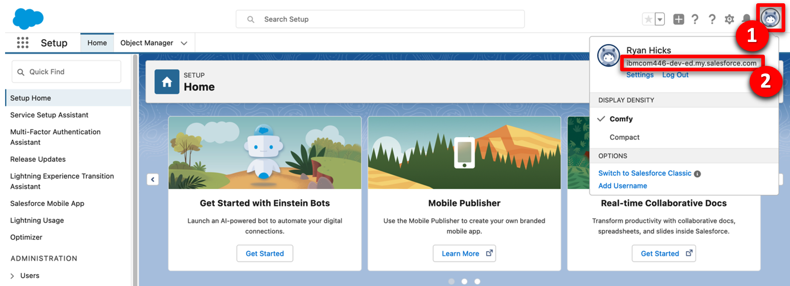
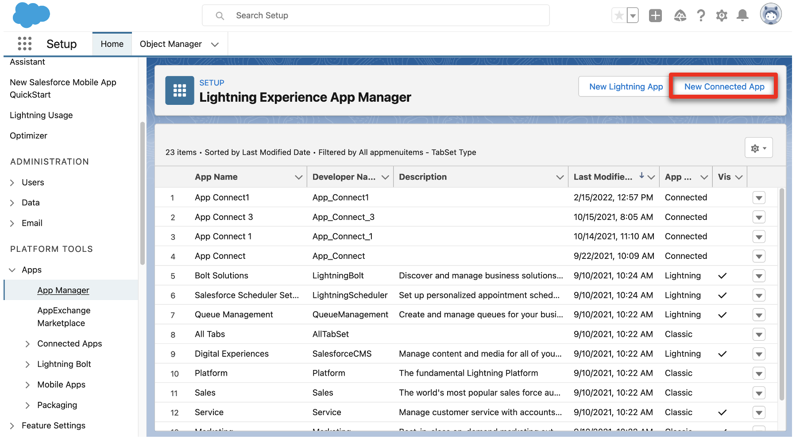
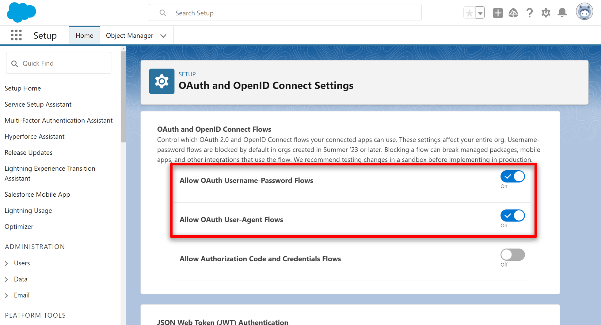
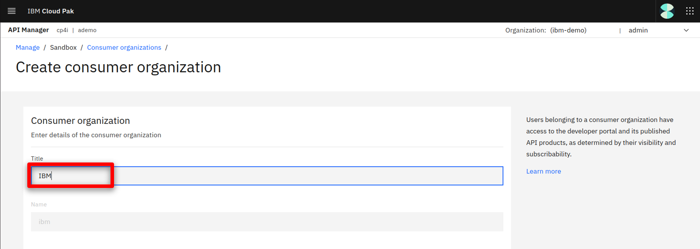

<FeatureCard
  title="API-enabled application integration - Demo Preparation"
  color="dark"
  >


</FeatureCard>

<AnchorLinks>
  <AnchorLink>1 - Review Demo Scenario</AnchorLink>
  <AnchorLink>2 - Provision a Red Hat OpenShift cluster</AnchorLink>
  <AnchorLink>3 - Access your OpenShift cluster and install the command line</AnchorLink>
  <AnchorLink>4 - Clone the demo assets from a GitHub repository</AnchorLink>
  <AnchorLink>5 - Install the demo</AnchorLink>
  <AnchorLink>6 - Set up Salesforce</AnchorLink>
  <AnchorLink>7 - Connect Cloud Pak for Integration instance to your endpoints</AnchorLink>
  <AnchorLink>8 - Configure the asset repository</AnchorLink>
  <AnchorLink>9 - Creating Dev User for Developer Portal</AnchorLink>
</AnchorLinks>

***

### 1 - Review Demo Scenario

| DEMO OVERVIEW |                          |
| --------------------------------------- | ------------------------------------- |
| **Scenario overview** | 	Access applications through APIs and integrations. Use SaaS connectivity to Salesforce to create a self-service car repair API giving customers real-time estimates and integrating directly with record systems. The demo shows easy API creation with no-code App Connect Designer, rate limiting plans, security policies and self-service API consumption using the API Connect portal. |
| **Demo products** | Cloud Pak for Integration |
| **Demo capabilities** | API management; Application integration; Connectors |
| **Demo intro slides** | Download the Introduction and Overview slides <a href="./files/CustomerInteractionsSlides.pptx" target="_blank" rel="noreferrer">here</a>. |
| **Demo script** | A complete demo script is on the second tab above. The demo script has multiple tasks that each have multiple steps. In each step, you have the details about what you need to do (**Actions**), what you can say while delivering this demo step (**Narration**), and what diagrams and screenshots you will see.<br/><br/> This demo script is a suggestion, and you are welcome to customize based on your sales opportunity. Most importantly, practice this demo in advance. If the demo seems easy for you to execute, the customer will focus on the content. If it seems difficult for you to execute, the customer will focus on your delivery. |
| **Demo authors** | Rafael Osorio, Alan Glickenhouse and Callum Jackson based on Car Repair Demo created by CP4I Dev team|
| **How to get support** | Contact <a href="mailto:rosorio@br.ibm.com">rosorio@br.ibm.com</a> regarding issues with setting up and running this demo use case. |

***

### 2 - Provision a Red Hat OpenShift cluster

To provision your own Red Hat OpenShift cluster for the Cloud Pak for Integration, follow these steps: <br/>

2.1  To deploy a Red Hat OpenShift cluster, go <a href="https://techzone.ibm.com/my/reservations/create/63a3a25a3a4689001740dbb3" target="_blank" rel="noreferrer">here</a>. Select if you prefer to make a reservation now or schedule for later.
<br/>
<br/>

2.2 If you do not have a sales opportunity, select the purpose **Practice / Self-Education** (1) for a 2-day reservation (which can be extended without any approvals to 6 days) and fill in the **Purpose description** (2).
<br/>
<br/>

2.3 Select the **Preferred Geography**.
<br/>
<br/>

2.4 Several additional fields will appear. Select **4.14** (1) as the OpenShift version, **ODF - 2TB** (2) for the storage, **16 vCPU x 64 GB - 100 GB ephemeral storage** (3) as the worker node flavor, accept the terms and conditions (4) and click **Submit**.
<br/>
<br/>

2.5 You will receive a few emails as the provisioning process continues. You should expect the final email to be sent after an hour. The final email should look similar to the following.
<br/>
<br/>

***

### 3 - Access your OpenShift cluster and install the command line

In this section, you access your OpenShift cluster and install the OpenShift command line tool.

3.1 Open the **Reservation ID** link that was included in the "Reservation Ready on IBM Technology Zone" email.
<br/>
<br/>

3.2 Copy the kubeadmin **Password** (1) and open the OpenShift console by clicking on **Open your IBM Cloud environment** (2).
<br/>
<br/>

3.3 Use **kubeadmin** (1) as the user, paste the **Password** (2) and click **Login** (3).
<br/>
<br/>

3.4 On the web console page, click **?** (1), and select **Command line tools** (2).
<br/>
<br/>

3.5 Follow the links to install the OpenShift Command Line Interface (CLI) for your Operating System.
<br/>
<br/>

3.6 To configure the command line on your machine, click on the down arrow to the right of kubeadmin (1) and select **Copy login command**.
<br/>
<br/>

3.7 Click on **Display token**.

3.8 Copy the **Login with this token** and run in the command line.
<br/>
<br/>

You have successfully configured the Openshift command line on your machine.

<br/>

***

### 4 - Clone the demo assets from a GitHub repository

To copy the repository you will need to have the Git CLI on your machine. If you don’t have it, follow the installation steps described in this <a href="https://github.com/git-guides/install-git" target="_blank" rel="noreferrer">page</a>, based on your operating system.


4.1 To download the scripts to install the demo, create a new directory, change to this newly created directory, and run the following command:

```
git clone https://github.com/ibm-integration/code-api-enabled-integration.git
```

   <br/>

4.2 Change to the new **platinum-demo-code-api-enabled-integration** directory:

```
cd code-api-enabled-integration
```

   <br/>

***

### 5 - Install the demo

5.1 The script to install the demo components requires a utility called jq. If you don't have it, follow the installation steps described in this <a href="https://jqlang.github.io/jq/download/" target="_blank" rel="noreferrer">page</a>, based on your operating system. <br/>

5.2 Install API Connect and App Connect by running the `deploy.sh` command:<br/>

```
./deploy.sh
```

This script may take 30-45 minutes to complete.

<br/>

***

### 6 - Set up Salesforce

You need a Salesforce developer account to run this demo. If you already have a Salesforce developer account, you can use that (start at step 2 below). If not, you can sign up for a free developer account by following step 1 below.

6.1 Go to <a href="https://developer.salesforce.com/signup" target="_blank" rel="noreferrer">Salesforce Developers</a>. Follow the prompts on the Saleforce pages to get your free developer account.<br/>

6.2 As soon as you have your account, go back to the <a href="https://login.salesforce.com/" target="_blank" rel="noreferrer">Salesforce log in page</a> and log in to your developer account.<br/><br/>

6.3 Click the **profile** icon (1) and save your Salesforce Login URL (2).<br/><br/>

6.4 In the same user profile menu select **Settings**.<br/><br/>

6.5 Click **Reset My Security Token** in the **My Personal Information** (1) menu. Then, click **Reset Security Token** (2). A newly-generated security token will be emailed to you.<br/><br/>

6.6 Next, you will create an application representing App Connect Enterprise, and then retrieve the Consumer Key and Consumer Secret. Click the **cogwheel** icon (1) and select **Setup** (2).<br/><br/>

6.7 In the navigator on the left-hand side, scroll to **PLATFORM TOOLS**, expand **Apps** (1), and click **App Manager** (2).<br/><br/>

6.8 Click **New Connected App**.<br/><br/>

6.9 Enter **App Connect** (1) as the **Connect App Name** and your email as the **Contact Email** (2). Select **Enable OAuth Settings** (3).<br/><br/>

6.10 Select **Enable for Device Flow** (1). Now select **Manage user data via APIs (api)** (2) as the **Selected OAuth Scopes**. Click **Add** (3)<br/><br/>

6.11 Click **Save**.<br/><br/>

6.12 It will take approximately 10 minutes for the new connected app to register in Salesforce. Once it does, you should see **Manage Consumer Details** displayed. Click **Manage Consumer Details,** following any authentication directions.<br/><br/>

6.13 Save the **Consumer Key** and **Consumer Secret.**<br/><br/>

6.14 In the search box at the top of the screen, enter **OAuth** (1), and then select **OAuth and OpenID Connect Settings** (2).<br/><br/>

6.15 Ensure that **OAuth User-Agent Flows** and **OAuth Username-Password Flows** are enabled. <br/><br/>

Your Salesforce developer account is ready.

<br/>

***

### 7 - Connect Cloud Pak for Integration instance to your endpoints

Let’s configure our services endpoints in Cloud Pak for Integration.
<br/>

7.1	Return to the command line and access the Platform Navigator using the provided URL. Copy and paste  the **Username** (1) and **Password** (2) from the command line output, and click **Sign In** (3).<br/><br/><br/>

7.2 You will be asked to provide a new password. Provide a new password and click **Submit**. <br/><br/>

7.3 In the menu on the top left, open the **Design** folder (1) and select **Integrations** (2). <br/><br/>

7.4 Click on the **ace-designer-demo** entry. <br/><br/>

7.5 Click the **Catalog** icon to see a list of the available connectors. <br/><br/>

7.6 Search for **salesforce** (1) and click **Connect** (2).<br/><br/>

7.7 Enter your Salesforce **Login URL**.<inline-notification text="You must enter <strong>‘https://’</strong> in front of the Saleforce Login URL you saved earlier. The connection will not work if you just copy/paste the hostname."></inline-notification>

7.8 Input your Salesforce **Username** (1). Fill in the connector's **Password** field (2) by concatenating your Salesforce **Password** and the **Security token** received via email.<br/><br/>For example, if your Salesforce password is ‘myGreatPassword’ and your Salesforce security token is ‘2325jsdhew4312hs534dh’ then enter ‘myGreatPassword2325jsdhew4312hs534dh’ in the **Password** field.<br/><br/><br/>

7.9 Input Salesforce’s **Consumer Key** as **Client ID** (1) and **Secret** as **Client Secret** (2), in the connector account UI. Click **Connect** (3).<br/><br/>

7.10 Click on the **menu** icon (1) and select **Rename Account** (2).<br/><br/>

7.11 Enter **App Connect Trial** (1) as **Account name** and click **Rename Account** (2).<br/><br/>

Your environment is ready to demo.

<br/>

***

### 8 - Configure the asset repository

During the demo we will import an existing flow from the assest repository. An GitHub repository will be configured to import the flow.

8.1 In the CP4I homepage, you should see the all instances available on your Pak. Select **assetrepo**.<br/><br/>

8.2 Click **Remotes** (1) and select **Add remote** (2). <br/><br/>

8.3 Fill in the following values:<br/>
   * **Name** (1): CP4I Demo Assets
   * **Git URL** (2): https://github.com/IBM/cp4i-demos.git
   * **Automatic sync options** (3): 5 minutes
   * **Asset types to synchronize** (4): Select all

   Click **Create remote** (5) to complete the form.

   <br/>

8.4 In a couple of minutes the resources from the GitHub repository will be synchronized.<br/><br/>

<br/>

***

### 9 - Creating Dev User for Developer Portal

Now create a user in the Developer Portal.

9.1 Expand **Design** and select **APIs** (1).<br/><br/>

9.2 Click **ademo** API management. <br/><br/>

9.3 If a login screen is presented, select **Cloud Pak User Registry** <br/><br/>

9.4 Click **Manage catalogs** (2).<br/><br/>

9.5 Open **Sandbox**.<br/><br/>

9.6 Select the **Consumers** (1) tab, click **Add** (2) and select **Create organization** (3).<br/><br/>

9.7 Fill in **IBM** as the title.<br/><br/>

9.8 Scroll down to the Owner section, set the type of user to **New user** (1), fill in the following details and click **Create**.

| FIELD | VALUE |
| ------ | ------- |
| **Username:** | devuser |
| **Email:** | devuser@ibmapiconnect.com |
| **First name:** | Dev |
| **Last name:** | User |
| **Password:** | AP1Connect! |


9.9 A new consumer organization is created.
<br/><br/>

Congratulations! Your portal developer user has been created and you are ready for the demo.

<br/>
