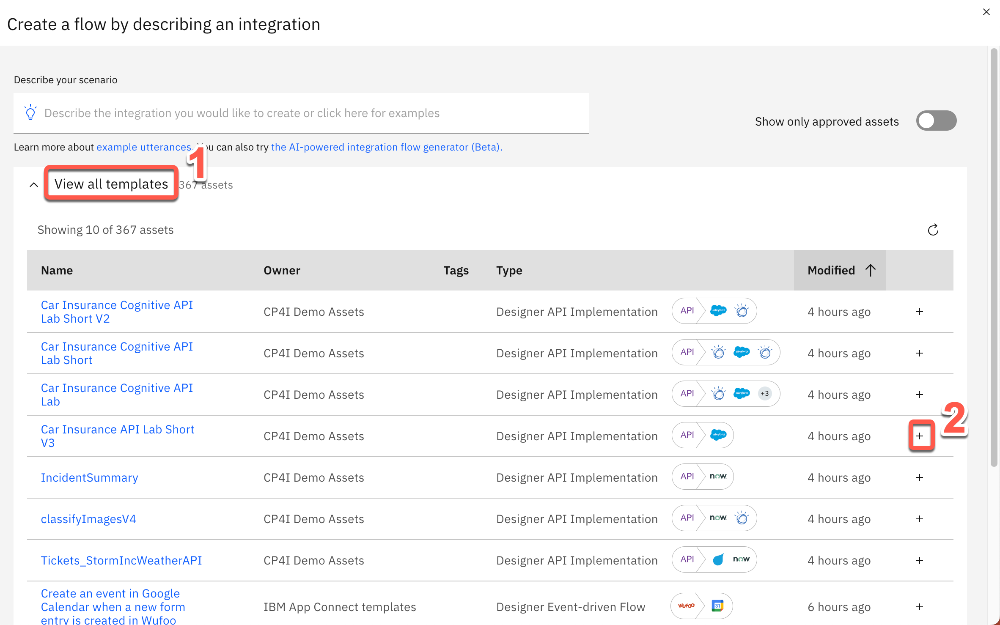

<FeatureCard
  title="API-enabled application integration - Demo Script"
  color="dark"
  >

</FeatureCard>

Introduction

 
Automating customer interactions can remove manual steps, data entry into multiple different applications, and potential errors and delays – all of which are additional costs to your business. This demo automates a series of steps to: obtain and validate input information from a customer with a concern, open a case in Salesforce, attach the incoming information to the case, and respond to the customer with the case number and expected date for resolution.
  
To automate this customer interaction, we will use both APIs and integrations to back-end applications. The demo scenario is related to a car repair, but this is just an example. The same techniques are applicable to your environment in support of your customers.
  
Let’s get started!
  
(Demo intro slides <a href="https://ibm.box.com/s/tph26q1zzqhix1t1fkm2ukyc9eqgwdbg" target="_blank" rel="noreferrer">here</a>)
 

1 - Accessing the environment

 

| **1.1** | **Log into Cloud Pak for Integration** |
| :--- | :--- |
| **Narration** | Let’s see IBM Cloud Pak for Integration in action. Here I have a cloud version of the product on IBM Cloud. Let me log in here.|
| **Action**  1.1.1 | Open the Cloud Pak for Integration and enter your **Username** (1), **Password** (2) and click **Sign In** (3).   |

 

| **1.2** | **View the Cloud Pak for Integration home screen** |
| :--- | :--- |
| **Narration** | Welcome to IBM Cloud Pak for Integration! We’re now at the home screen showing all the capabilities of the pak, brought together in one place. Specialized integration capabilities for API management, application integration, messaging and more, are built on top of powerful automation services. Let’s see the integration capabilities available.                                       |
| **Action**  1.2.1 | Show the **home screen**.   |

 

| **1.3** | **Access Integration instances** |
| :--- | :--- |
| **Narration** | To automate customer interactions with our company in this demo, we will use App Connect for application integration, API Connect for API management, and the Asset Repository as our centralized hub for allowing our teams to work together with integration assets. Let’s open our App Connect Designer. |
| **Action**  1.3.1 | Click **ace-designer-ai** to open the Integration design.    |

 

**[Go to top](#place1)**

2 - Importing the flow

 

| **2.1** | **Create a flow** |
| :--- | :--- |
| **Narration** | We are in the designer tooling. This is where we can create all our API integration flows and manage our connectivity to services and endpoints. Since we are just starting, there is nothing to see yet. Let’s build some integration logic and see how simple it is to create our flow from the Asset Repository. |
| **Action**  2.1.1 | Click **Create a flow by describing an integration**.  |

 

| **2.2** | **Select an asset** |
| :--- | :--- |
| **Narration** | Let's click the + sign to import this flow. |
| **Action**  2.2.1 | Open the **View all templates** section (1), then click the **+** sign to the right on the **Car Insurance API Lab Short V3** row (2).  |

 

**[Go to top](#place1)**

3 - Reviewing the flow

 

| **3.1** | **Review properties** |
| :--- | :--- |
| **Narration** | The designer builds your API for you. You don’t need to worry about OpenAPI specs or Swagger editors – it’s all built in. These are the fields we are going to use for our API. Note that we tell our API which field is the key – in our case, CaseReference. |
| **Action**  3.1.1 | Open the **Properties** view.     |
| **Action**  3.1.2 | Show the **Properties** view.     |
| **Action**  3.1.3 | Open the **Operations** view.   |

 

| **3.2** | **Review operations** |
| :--- | :--- |
| **Narration** | The Operations view shows actions that the API exposes along with the data. In this demo, we’re going to build just one operation: “Create CarRepairClaim." We can add more later if we wish. Let’s check the flow logic. |
| **Action**  3.2.1 | Show the **Operations**  view. Click **Edit flow**.    |

 

| **3.3** | **Review the flow** |
| :--- | :--- |
| **Narration** | Here we have our demo flow. In the designer flow editor, we can edit and change our flow. We are a car repair company that wants to create an API that will enable customers to send us photos of their cars, along with descriptions of what needs to be done with them. With this information we will create a case in Salesforce. Let’s explore our flow in detail. |
| **Action**  3.3.1 | Close the **Request** box by clicking the **X**.     |
| **Action**  3.3.2 | Explain the flow and scroll through all of the connectors in the flow. Open the **Request** again by clicking the first step of the flow.    |

 

| **3.4** | **Review request** |
| :--- | :--- |
| **Narration** | Our flow starts by receiving the customer’s car repair request with photo via an API. Designer automatically creates an API “request” and “response” for your API flow. |
| **Action**  3.4.1 | Show the **Request** box (1). Click to open the **If** step (2).    |

 

| **3.5** | **Validate the photo** |
| :--- | :--- |
| **Narration** | Next, we validate the photo. Here, we have a simple IF statement that checks if the PhotoOfCar is empty. If it is not empty, we move forward to retrieve contacts by connecting to Salesforce. |
| **Action**  3.5.1 | Explore the **If** step (1). Click the **Salesforce - Retrieve contacts** connector (2).                           |

 

| **3.6** | **Retrieve contacts** |
| :--- | :--- |
| **Narration** | Now, we use a connector to create a case in Salesforce with the data from the API. This case is where we store the details and progress of our repair. We are using a hard-coded contact name: ‘Andy Young.' He’s the contact for the insurance company. Salesforce Developer Accounts have a pre-populated set of data that you can use to test. ‘Andy Young’ is one of those pre-populated contacts. Let’s test our connection with Salesforce. Let me change the contact to ‘Andrew Young‘ and test the connection. |
| **Action**  3.6.1 | Show the **Salesforce - Retrieve contacts** box.    |
| **Action**  3.6.2 | Change the **Full Name** to **Andrew Young** (1). Click the **Test action** link, which tests the connection (2).    |
| **Action**  3.6.3 | On the **Try this action** dialog, check **Do not show this dialog box again** (1) and click **Continue** (2).   The result displays. |
| **Narration** | The test shows that we don’t have an ‘Andrew Young.‘ Let’s change it back to ‘Andy Young‘ and test again. We now receive a successful response. This proves that our connection is working. Let’s check the details. Here we can see the output returned from Salesforce, including the Contact ID. |
| **Action**  3.6.4 | Change the **Full Name** back to **Andy Young** (1). Click the highlighted icon to **Test** again (2). Click the **View details** link (3).    |
| **Action**  3.6.5 | On the **Output** tab, open the **Contact 1** object.    |
| **Action**  3.6.6 | Close all of the dialog tabs. Click the **Salesforce – Create case** connector.    |

 

| **3.7** | **Create a case** |
| :--- | :--- |
| **Narration** | Now that we have the ID that we need, let’s create our Salesforce case. Note that we just re-use the same Salesforce connector but with a different operation and data. Here we can see that our contact ID comes from the previous ‘retrieve contact’ Salesforce Call. The name and email address come from the API request. The connector knows that fields like ‘Case Type’ have a limited number of values in Salesforce – so it automatically converts them into pull-down lists of values you can choose. |
| **Action**  3.7.1 | Explore the **Salesforce – Create case** box (1). Open the **Salesforce - Create attachment** connector (2).    |

 

| **3.8** | **Create an attachment** |
| :--- | :--- |
| **Narration** | To add a photograph, we need to create a Salesforce attachment. That will be easy, since we just use the connector again. Note that we use the case ID that is a returned value from the ‘Create Case’ connector call, which is kept in the flow automatically. We send the PhotoOfCar as a base64 string and we tell Salesforce that the content type is image/jpeg. |
| **Action**  3.8.1 | Explore the **Salesforce – Create attachment** box (1). Open the **Create case comment** connector (2).   |

 

| **3.9** | **Create a case comment** |
| :--- | :--- |
| **Narration** | Now we’ll add a comment to the case with the Salesforce connector stating this case was opened by IBM Cloud Pak for Integration. |
| **Action**  3.9.1 | Explore the **Salesforce – Create case comment** box (1). Open the **Response** connector (2).                                                                                                        |

 

| **3.10** | **Respond to the customer** |
| :--- | :--- |
| **Narration** | Here we have the response that we submit to the customer after the API call. This response includes their Salesforce case reference for future enquiries, an estimate of how long it will take to repair, and also how much it will cost.  |
| **Action**  3.10.1 | Explore the **Response** box (1). Click **Done** (2).    |

 

**[Go to top](#place1)**

4 - Testing the flow

 

 

| **4.1** | **Start the flow** |
| :--- | :--- |
| **Narration** | Now that we’ve looked at the integration flow, let’s start it up. When our flow is running, we can test it. |
| **Action**  4.1.1 | Start the flow by switching the highlighted **toggle** at the top right from **Stopped** to **Started.**                                     |

 

| **4.2** | **Test the flow** |
| :--- | :--- |
| **Narration** | APIs can be tested in various ways, and we will perform two different tests: one in the designer tool now; another using the API Developer Portal that an application developer would use.    In the Test tab, we can get all the details to test our API - for example, endpoint and credentials. And we can easily test our flow here. We just need to generate a body and submit it. We have received the expected response with the case information.                                                                                                                  |
| **Action**  4.2.1 | Open the **Test** tab (1). Open **POST /CarRepairClaim** (2) and click **Try it** (3).     |
| **Action**  4.2.2 | Click **Generate** (1) and **Send** (2).     |
| **Action**  4.2.3 | Show the **Response** details.    |

 

| **4.3** | **Check Salesforce** |
| :--- | :--- |
| **Narration** | Let’s check our Salesforce system to see if we have a new case. Let’s open the Cases page. In the "Recently Viewed" section, we can check all open cases. Here we have our case with all the information, including the picture. With this information, our customer relationship team can support our customer. |
| **Action**  4.3.1 | Open the **Salesforce Dev Account** site (1). On the **App Launcher** menu, search for **Cases** (2). Open the **Cases** page (3).     |
| **Action**  4.3.2 | In the **Cases** view, open the latest **Car Breakdown** case.     |
| **Action**  4.3.3 | Explore all of the fields (the picture will be blank).    |

 

**[Go to top](#place1)**

5 - Viewing and testing in API Connect

 

| **5.1** | **Expose the API using the co-authoring feature** |
| :--- | :--- |
| **Narration** | Now, let’s explore the co-authoring capability. The co-authoring feature enables you to simultaneously expose your API in both App Connect Designer and API Connect. When you start the API in Designer, a Product is automatically created and published in the Sandbox Catalog. The Product is used to control the deployment of the API, such as making it visible in the Developer Portal. Let’s test it. Here in API Manager, we can see our API was automatically exposed from Designer, using the co-authoring feature. The Product title and name are derived from the name of the originating API flow, and also include a reference to App Connect Designer. The Product version is 0.0.1. |
| **Action**  5.1.1 | Open the **menu**, expand the **Design** section, and select **APIs**.     |
| **Action**  5.1.2 | Click the **apim-demo** entry.     |
| **Action**  5.1.3 | In the **API Connect** page, if a login screen is presented, select **Cloud Pak User Registry**.     |
| **Action**  5.1.4 | Click the **Manage** icon.     |
| **Action**  5.1.5 | Click the **Sandbox** catalog.     |
| **Action**  5.1.6 | On the **Products** tab, you should see the published product that contains the API.   |

 

| **5.2** | **Viewing the product in the developer portal using the co-authoring feature** |
| :--- | :--- |
| **Narration** | The co-authoring feature enables you to test the product in the developer portal too. With the portal URL, we can check that our API Product is available. With the co-authoring feature, you have a unified authoring experience across multiple Cloud Pak for Integration capabilities. It is important to note that the API product will exist in the developer portal only while the corresponding API in App Connect Designer is still running. When you stop the API in App Connect Designer, the API product is automatically removed from the portal. The purpose of this is to simplify the unit testing while developing the flow. |
| **Action**  5.2.1 | Open the **Catalog settings** tab (1). Click **Portal** (2). Click **Create** button (3).   |
| **Action**  5.2.2 | Copy the **Portal URL** (1). Open a new browser tab and access the portal URL (Maybe you need to accept the connections issues. If you receive a *404 Not Found* issue, you will need to wait few minutes to have the portal provisioned).  |
| **Action**  5.2.3 | Show the **Car Insurance** API product in the developer portal home page.   |
| **Action**  5.2.4 | Click **Sign in** (1) at the top right corner of the page. Use the username and password created during the demo preparation step **Creating Dev User for Developer Portal**. Click **Sign in** (2) in the credentials box.   |

 

| **5.3** | **Create a new app** |
| :--- | :--- |
| **Narration** | As a consumer/developer, we’re going to create a new application in the portal. This will give us an API key, allowing us to call our APIs. We just need to give an application title and copy the API key and secret. |
| **Action**  5.3.1 | Click **Apps** and **Create new app**.  |
| **Action**  5.3.2 | Enter **Car Repair Application** as the **App Title** (1). Click **Save** (2).    |
| **Action**  5.3.3 | On the **Credentials** dialog box, click **OK**.   |

 

| **5.4** | **Subscribe to the API** |
| :--- | :--- |
| **Narration** | We have not subscribed to any APIs, so let’s do it now. There’s only one API product to subscribe to in our demo (normally there would be many). Now that we've selected our API product, we can see the plans that are available. Which application do we want to use to subscribe? We can have many applications, but in this demo, we’ve only created one. So we just need to select the app that we created earlier and confirm our subscription. And done, we are subscribed to our API! |
| **Action**  5.4.1 | Click **Why not browse the available APIs?**   |
| **Action**  5.4.2 | Click **Car_Insurance_API_Lab_Short_V3 0.0.1**.  |
| **Action**  5.4.3 | In the **Default Plan** section, click **Select**.   |
| **Action**  5.4.4 | Select the **Car Repair Application**.   |
| **Action**  5.4.5 | Confirm the subscription by clicking **Next**.   |
| **Action**  5.4.6 | Click **Done**.   |

 

| **5.5** | **Test the API** |
| :--- | :--- |
| **Narration** | We’re now back at the product screen. Let’s explore our API here. From the Overview page, we can download the OpenAPI Document and get the API Endpoint. Note the portal has everything you need to call your API, it’s even generated clients in various languages for you to copy/paste into your calling application. You can try the API on the Try it area. Using the Generate button, the portal generates a request with random sample data for you. Now, let’s test it. Great, we got a response, our API is running, and we’ve gone through the gateway to access it. |
| **Action**  5.5.1 | Click the **Car_Insurance** API.   |
| **Action**  5.5.2 | Open **POST /CarRepairClaim**.   |
| **Action**  5.5.3 | Explore the **Example request** area.   |
| **Action**  5.5.4 | Open the **Try it** tab.   |
| **Action**  5.5.5 | Click **Generate** (1) and click **Send** (2).   |
| **Action**  5.5.6 | If you receive a CORS error (1), go ahead and open the API URL (2) and accept the certificate. Return to the Developer Portal page and click **Send** again. Now you should receive 201 status message.   |
| **Action**  5.5.7 | Explore the **Response**.   |

**[Go to top](#place1)**

Summary

 
Let’s summarize what we’ve done today.
  
In the demo we: accessed the Cloud Pak for Integration environment and explored the capabilities; imported and reviewed the automated customer interactions integration flow; tested the flow; deployed the flow into the Cloud Pak runtime environment; and demonstrated how a developer can use the API Portal to perform self-service consumption of the API.  From a business perspective we used APIs and application integrations to automate a series of steps to: obtain and validate input information from a customer with a concern, open a case in Salesforce, attach the incoming information to the case, and respond to the customer with the case number and expected date for resolution.
  
The customer needing assistance obtains rapid response to their interaction and the confidence that your business is handling their request.
  
Thank you for attending today’s presentation.
  

