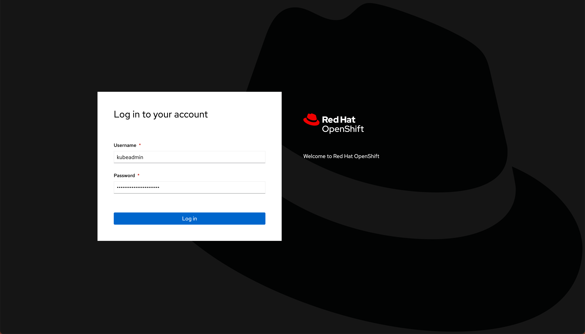

<FeatureCard
  title="CP4I Installation for Windows users - Demo Preparation"
  color="dark"
  >

</FeatureCard>

<AnchorLinks>
  <AnchorLink>1 - Provision a Red Hat VDI</AnchorLink>
  <AnchorLink>2 - Access your Linux Desktop</AnchorLink>
  <AnchorLink>3 - Access your CP4I environment</AnchorLink>
</AnchorLinks>

***

### 1 - Provision a Red Hat VDI

This documentations is only for Windows users, who wants to install CP4I environment. The Demo Preparation document of different Integration Sales Enablement course uses pre-created script to install CP4I and other integration software. These scripts are available for MAC OS and Linux users. If you are a Windows user and would like to install your CP4I, you have some options to do it:
  1) Request a MAC OS/Linux friend to execute the Demo Preparation script for you.
  2) Try to use linux emulator in your Windows machine.
  3) Or request a Linux Virtual Machine desktop on TechZone and execute the demo script from there.

This section describes the approach 3, about how to provision a Linux VDI.

1.1  To deploy your Linux VDI on TechZone, go <a href="https://techzone.ibm.com/my/reservations/create/638768e537f8a600183c7378" target="_blank" rel="noreferrer">here</a>. Select if you prefer to make a reservation now or schedule for later.

1.2 If you do not have a sales opportunity, select the purpose **Education** (A) for a 2-day reservation (which can be extended without any approvals) and fill in the **Purpose description** (B).

1.3 Select the **Preferred Geography** (A), and accept the terms and conditions (B) and click **Submit** (C).

1.4 You will receive a few emails as the provisioning process continues. You should expect the final email to be sent after 30 minutes or less. The final email should look similar to the following.

***

### 2 - Access your Linux Desktop

In this section, you access your OpenShift cluster and install the OpenShift command line tool.

2.1 Open the **Reservation ID** link that was included in the "Reservation Ready on IBM Technology Zone" email.

2.2 Scroll down to the *Virtual Machines* section and click on **Console** button.

2.3 Click **Open in a new window**.

2.4 Select **ibmuser**.

2.5 Enter **passw0rd** as password.

2.6 Here you have your linux desktop. This VDI has **oc CLI** and **git** installed. Check your course pre-requisites if you need to install any other tool. To follow with your demo preparation, just open the **Terminal** and follow the steps from your demo preparation document.

2.7 If you need to copy command from your host machine to virtual machine, you can use the **send text** button.

`Note:` If your demo preparation includes other steps that use browser, you can use your Windows machine to do it.

 

***

### 3 - Access your CP4I environment

After you complete the demo preparation document of your course, you can use this section to get the info about your CP4I environment from your Windows.

3.1 In you Windows machine, open a browser and access the OpenShift Web Console of your OCP cluster (check section 3 of your Demo Preparation about how to do it).

3.2 To get your Platform Navigator URL, open the **Networking** (A) > **Routes** (B) menu. Filter by **cp4i** project (C) and scroll down to see the *platform-navigator-pn* route, here you can see your **Platform Navigator URL** (D).

3.3 To get your *CP4I Admin temporary credentials*, open the **Workloads** (A) > **Secrets** (B) menu. Filter by **cp4i** project (C) again and scroll down to open the **integration-admin-initial-temporary-credentials** (D).

3.4 Here you can copy the CP4I admin **usernmae** and **password**.

You are ready to follow with your Demo script.
