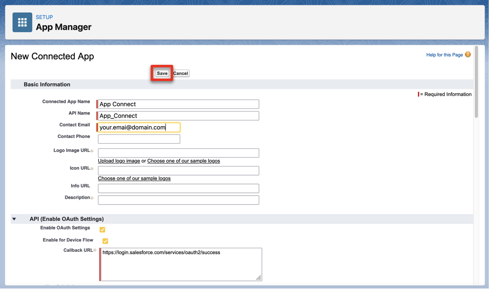
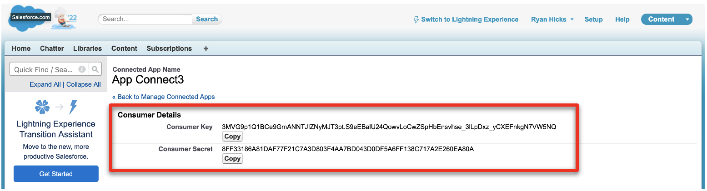
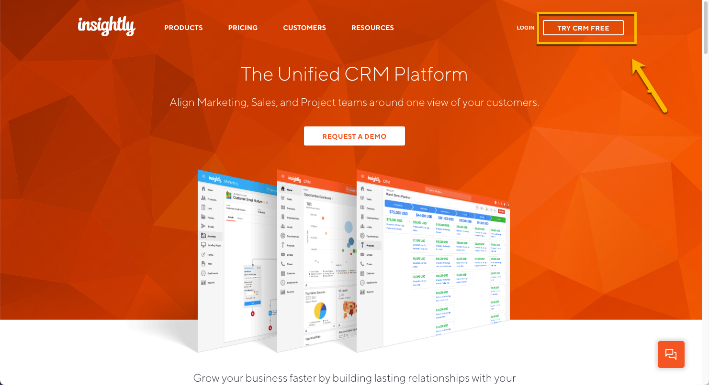
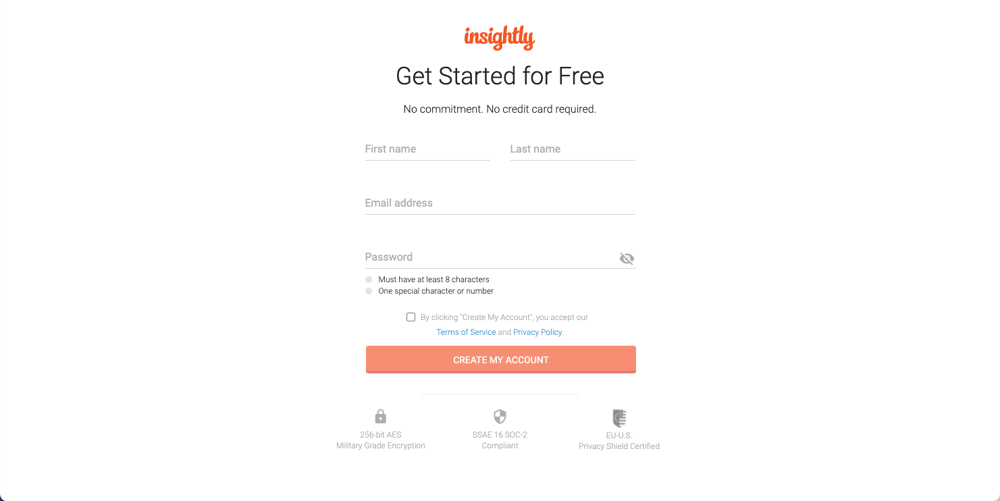
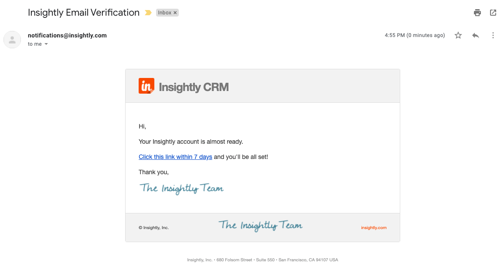
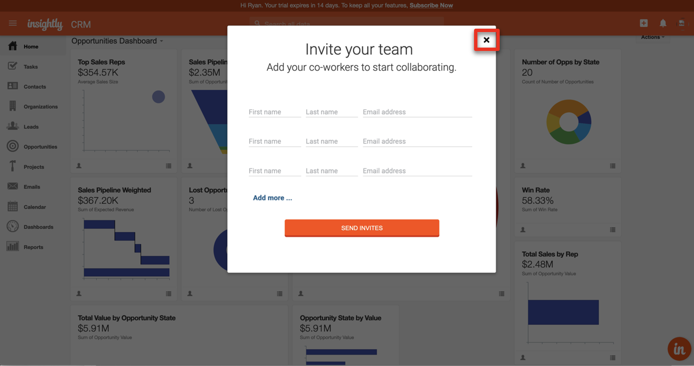
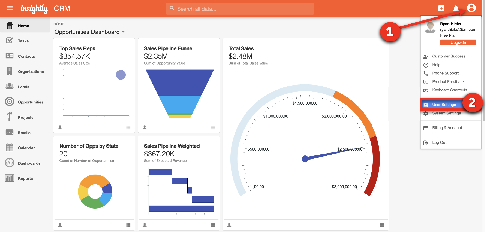
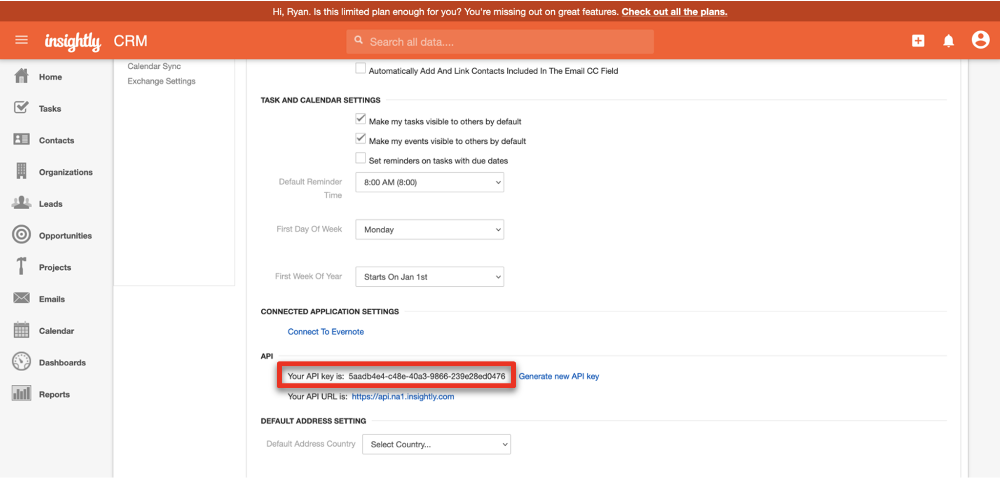
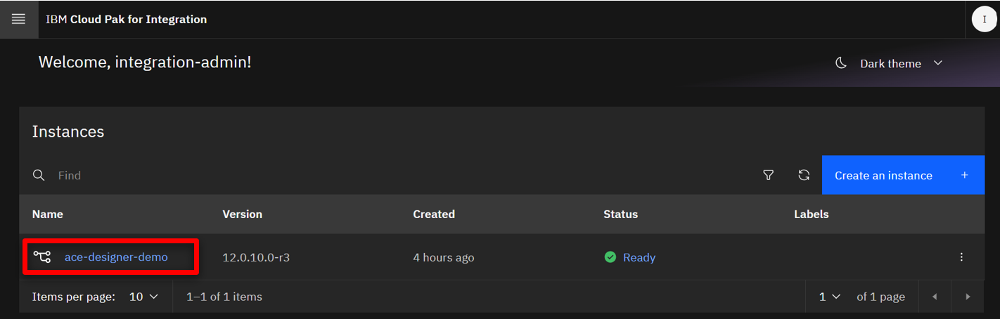
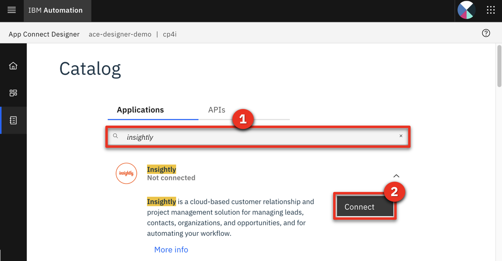

<FeatureCard
  title="Low-code integration using AI - Demo Preparation"
  color="dark"
  >


</FeatureCard>

<AnchorLinks>
  <AnchorLink>1 - Review Demo Scenario</AnchorLink>
  <AnchorLink>2 - Provision a Red Hat OpenShift cluster</AnchorLink>
  <AnchorLink>3 - Access your OpenShift cluster and install the command line</AnchorLink>
  <AnchorLink>4 - Clone the demo assets from a GitHub repository</AnchorLink>
  <AnchorLink>5 - Install the demo</AnchorLink>
  <AnchorLink>6 - Set up Salesforce</AnchorLink>
  <AnchorLink>7 - Set up Insightly</AnchorLink>
  <AnchorLink>8 - Connect Cloud Pak for Integration instance to your endpoints</AnchorLink>
</AnchorLinks>

***

### 1 - Review Demo Scenario

| DEMO OVERVIEW |                          |
| --------------------------------------- | ------------------------------------- |
| **Scenario overview** | 	In this demo, you are going to synchronize data between Salesforce and Insightly cloud CRM. You need to have these services and endpoints created and all the credentials necessary to access them securely in the demo. <br/><br/>Both Salesforce and Insightly are CRM systems provided as a SaaS (i.e., they are hosted in the cloud). In this scenario, we will synchronize contact information data between both solutions. |
| **Demo products** | Cloud Pak for Integration |
| **Demo capabilities** | APP Connect Designer: Low-code integration authoring; Mapping assistance |
| **Demo intro slides** | Download the Introduction and Overview slides <a href="./files/CustomerInteractionsSlides.pptx" target="_blank" rel="noreferrer">here</a>. |
| **Demo script** | A complete demo script is on the second tab above. The demo script has multiple tasks that each have multiple steps. In each step, you have the details about what you need to do (**Actions**), what you can say while delivering this demo step (**Narration**), and what diagrams and screenshots you will see.<br/><br/> This demo script is a suggestion, and you are welcome to customize based on your sales opportunity. Most importantly, practice this demo in advance. If the demo seems easy for you to execute, the customer will focus on the content. If it seems difficult for you to execute, the customer will focus on your delivery. |
| **Demo authors** | Rafael Osorio, Alan Glickenhouse and Callum Jackson based on Mapping Assist demo created by CP4I Dev team|
| **How to get support** | Contact <a href="mailto:rosorio@br.ibm.com">rosorio@br.ibm.com</a> regarding issues with setting up and running this demo use case. |

***

### 2 - Provision a Red Hat OpenShift cluster

To provision your own Red Hat OpenShift cluster for the Cloud Pak for Integration, follow these steps: <br/>

2.1  To deploy a Red Hat OpenShift cluster, go <a href="https://techzone.ibm.com/my/reservations/create/63a3a25a3a4689001740dbb3" target="_blank" rel="noreferrer">here</a>. Select if you prefer to make a reservation now or schedule for later.
<br/>
<br/>

2.2 If you do not have a sales opportunity, select the purpose **Practice / Self-Education** (1) for a 2-day reservation (which can be extended without any approvals to 6 days) and fill in the **Purpose description** (2).
<br/>
<br/>

2.3 Select the **Preferred Geography**.
<br/>
<br/>

2.4 Several additional fields will appear. Select **4.14** (1) as the OpenShift version, **ODF - 2TB** (2) for the storage, **16 vCPU x 64 GB - 100 GB ephemeral storage** (3) as the worker node flavor, accept the terms and conditions (4) and click **Submit**.
<br/>
<br/>

2.5 You will receive a few emails as the provisioning process continues. You should expect the final email to be sent after an hour. The final email should look similar to the following.
<br/>
<br/>

***

### 3 - Access your OpenShift cluster and install the command line

In this section, you access your OpenShift cluster and install the OpenShift command line tool.

3.1 Open the **Reservation ID** link that was included in the "Reservation Ready on IBM Technology Zone" email.
<br/>
<br/>

3.2 Copy the kubeadmin **Password** (1) and open the OpenShift console by clicking on **Open your IBM Cloud environment** (2).
<br/>
<br/>

3.3 Use **kubeadmin** (1) as the user, paste the **Password** (2) and click **Login** (3).
<br/>
<br/>

3.4 On the web console page, click **?** (1), and select **Command line tools** (2).
<br/>
<br/>

3.5 Follow the links to install the OpenShift Command Line Interface (CLI) for your Operating System.
<br/>
<br/>

3.6 To configure the command line on your machine, click on the down arrow to the right of kubeadmin (1) and select **Copy login command**.
<br/>
<br/>

3.7 Click on **Display token**.

3.8 Copy the **Login with this token** and run in the command line.
<br/>
<br/>

You have successfully configured the Openshift command line on your machine.

<br/>

***

### 4 - Clone the demo assets from a GitHub repository

To copy the repository you will need to have the Git CLI on your machine. If you don’t have it, follow the installation steps described in this <a href="https://github.com/git-guides/install-git" target="_blank" rel="noreferrer">page</a>, based on your operating system.


4.1 To download the scripts to install the demo, create a new directory, change to this newly created directory, and run the following command:

```
git clone https://github.com/ibm-integration/code-low-code-integration.git
```

   <br/>

4.2 Change to the new **platinum-demo-code-api-enabled-integration** directory:

```
cd code-low-code-integration
```

   <br/>

***

### 5 - Install the demo

5.1 To deploy the demo run:

```
./deploy.sh
```

   This will automatically deploy the resources into the CP4I namespace.


5.2 The deployment will take approximately 30-60 minutes to install. The URL and credentials will be shown once the installation is complete.
   

Your have installed the Cloud Pak for Integration ready to be configured.

<br/>

***

### 6 - Set up Salesforce

You need a Salesforce developer account to run this demo. If you already have a Salesforce developer account, you can use that (start at step 2 below). If not, you can sign up for a free developer account by following step 1 below.

6.1 Go to <a href="https://developer.salesforce.com/signup" target="_blank" rel="noreferrer">Salesforce Developers</a>. Follow the prompts on the Saleforce pages to get your free developer account.<br/>

6.2 As soon as you have your account, go back to the <a href="https://login.salesforce.com/" target="_blank" rel="noreferrer">Salesforce log in page</a> and log in to your developer account.<br/><br/>

6.3 Click the **profile** icon (1) and save your Salesforce Login URL (2).<br/><br/>

6.4 In the same user profile menu select **Settings**.<br/><br/>

6.5 Click **Reset My Security Token** in the **My Personal Information** (1) menu. Then, click **Reset Security Token** (2). A newly-generated security token will be emailed to you.<br/><br/>

6.6 Next, you will create an application representing App Connect Enterprise, and then retrieve the Consumer Key and Consumer Secret. Click the **cogwheel** icon (1) and select **Setup** (2).<br/><br/>

6.7 In the navigator on the left-hand side, scroll to **PLATFORM TOOLS**, expand **Apps** (1), and click **App Manager** (2).<br/><br/>

6.8 Click **New Connected App**.<br/><br/>

6.9 Enter **App Connect** (1) as the **Connect App Name** and your email as the **Contact Email** (2). Select **Enable OAuth Settings** (3).<br/><br/>

6.10 Select **Enable for Device Flow** (1). Now select **Manage user data via APIs (api)** (2) as the **Selected OAuth Scopes**. Click **Add** (3)<br/><br/>

6.11 Click **Save**.<br/><br/>

6.12 It will take approximately 10 minutes for the new connected app to register in Salesforce. Once it does, you should see **Manage Consumer Details** displayed. Click **Manage Consumer Details,** following any authentication directions.<br/><br/>

6.13 Save the **Consumer Key** and **Consumer Secret.**<br/><br/>

Your Salesforce developer account is ready.

<br/>

***

### 7 - Set up Insightly

Next, let’s set up Insightly, a cloud-based customer relationship management (CRM) solution.

We will create a trial account that lasts for 15 days. After the trial period, you can migrate your trial account to a free account (with limited users).

7.1 Go to <a href="https://www.insightly.com/" target="_blank" rel="noreferrer">Insightly</a> and click **Try CRM Free**.<br/><br/>

7.2 Complete the form with your personal data to create a free Insightly account. Accept the **Terms of Service and Privacy Policy** and click **Create My Account**.<br/><br/>

7.3 Confirm your email address.<br/><br/><br/>

7.4 As soon as you click the link to confirm your email, you should see an initial Insightly screen asking basic information about your company.<br/><br/>Write **demo** (1), select **1-5** (2), select **IT Services** (3), and fill in any phone number (4), matching the screenshot below. Click **Let's go!** (5).<br/><br/>

7.5 Close the **Invite your team** dialog.<br/><br/>

7.6 You have an Insightly account. Let's get the API key to enable App Connect to authenticate when making API calls. Click the **Profile** (1) icon in Insightly and select **User Settings** (2).<br/><br/>

7.7 Scroll down to the bottom of the page and copy the **API key**, which is a long string of characters.<br/><br/>

7.8 On the **Free** plan tile, click **Select Plan**.<br/><br/>

7.9 Click **OK** on the confirmation dialog box.

<br/>

Your Insightly account is ready to use.

<br/>

***

### 8 - Connect Cloud Pak for Integration instance to your endpoints

Let’s configure our services endpoints in Cloud Pak for Integration.
<br/>

8.1	Return to the command line and access the Platform Navigator using the provided URL. Copy and paste  the **Username** (1) and **Password** (2) from the command line output, and click **Sign In** (3).<br/><br/><br/>

8.2 You will be asked to provide a new password. Provide a new password and click **Submit**. <br/><br/>

8.3 In the menu on the top left, open the **Design** folder (1) and select **Integrations** (2). <br/><br/>

8.4 Click on the **ace-designer-demo** entry. <br/><br/>

8.5 Click the **Catalog** icon to see a list of the available connectors. <br/><br/>

8.6 Search for **salesforce** (1) and click **Connect** (2).<br/><br/>

8.7 Input your Salesforce **Username** (1). Fill in the connector's **Password** field (2) by concatenating your Salesforce **Password** and the **Security token** received via email.<br/><br/>For example, if your Salesforce password is ‘myGreatPassword’ and your Salesforce security token is ‘2325jsdhew4312hs534dh’ then enter ‘myGreatPassword2325jsdhew4312hs534dh’ in the **Password** field.<br/><br/>

8.8 Input Salesforce’s **Consumer Key** as **Client ID** (1) and **Secret** as **Client Secret** (2), respectively, in the connector account UI. Click **Connect** (3).<br/><br/>

8.9 Search for **insightly** and click **Connect**.<br/><br/>

8.10 Paste your **API key** (1) in the **API key** field. Keep **v3.1** (2) in the **API version** field. Click **Connect** (3).<br/><br/>

Your environment is ready to demo.

<br/>
