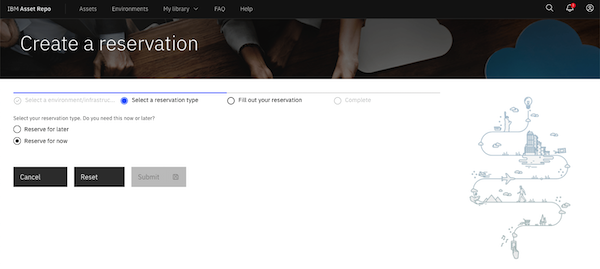
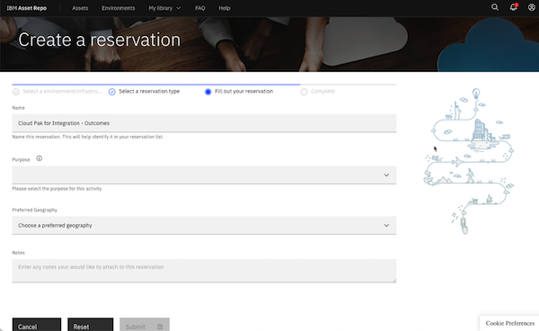
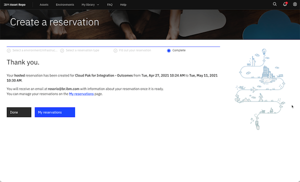
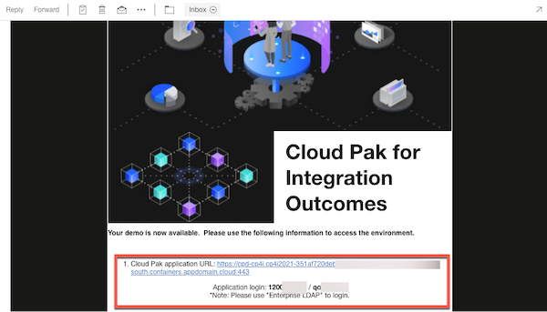
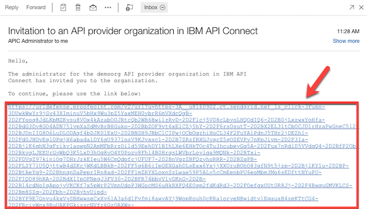
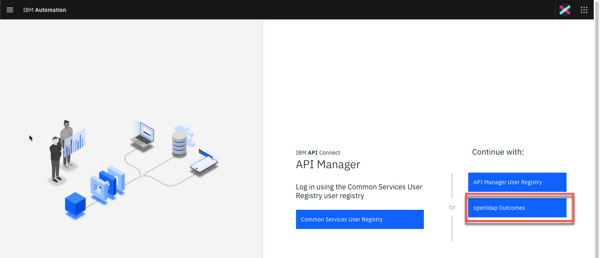
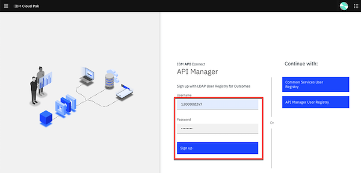
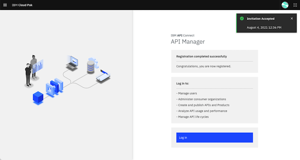
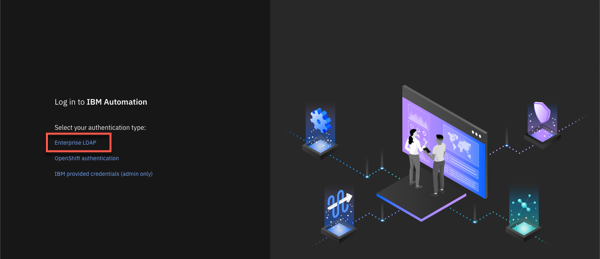
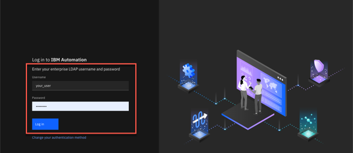

<FeatureCard
  title="Cloud Pak for Integration for Sales - Demo Preparation"
  color="dark"
  >

</FeatureCard>

<AnchorLinks>
  <AnchorLink>1 - Review Demo Scenario</AnchorLink>
  <AnchorLink>2 - Requesting access to the shared environment</AnchorLink>
  <AnchorLink>3 - Accepting the invitation for API provider organizations</AnchorLink>
  <AnchorLink>4 - Accessing the environment</AnchorLink>
</AnchorLinks>

***

### 1 - Review Demo Scenario

| DEMO OVERVIEW |                          |
| --------------------------------------- | ------------------------------------- |
| **Scenario overview** | Access applications through APIs and integrations. This demo automates a series of steps to: obtain and validate input information from a customer with a concern; open a case in Salesforce; attach the incoming information to the case; analyze the tone of the situation, and; respond to the customer with the case number and expected date for resolution.  To automate this customer interaction, we will use both APIs and integrations to back-end applications. |
| **Demo products** | Cloud Pak for Integration |
| **Demo capabilities** | API management; Application integration; Connectors |
| **Demo intro slides** | Download the Introduction and Overview slides <a href="./files/Aspera for Sellers - Presentation.pptx" target="_blank" rel="noreferrer">here</a>. |
| **Demo script** | This demo script has multiple tasks that each have multiple steps. In each step, you have the details about what you need to do (**Actions**), what you can say while delivering this demo step (**Narration**), and what diagrams and screenshots you will see.   This demo script is a suggestion, and you are welcome to customize based on your sales opportunity. Most importantly, practice this demo in advance. If the demo seems easy for you to execute, the customer will focus on the content. If it seems difficult for you to execute, the customer will focus on your delivery.    You are using a shared demo environment with multiple sellers at the same time. Please don't create custom flows or APIs in this environment. Also, don't do any customization (including customer names). Please just follow the steps. If you need to do a customized demo, please select the 300-level demo option. |
| **How to get support** | Contact <a href="mailto:rosorio@br.ibm.com">rosorio@br.ibm.com</a> regarding issues with setting up and running this demo use case. |

***

### 2 - Requesting access to the shared environment

2.1  Access the <a href="https://techzone.ibm.com/my/reservations/create/64c9031d4addf20017240b27" target="_blank" rel="noreferrer">Cloud Pak for Integration - Outcomes</a> page on IBM Asset Repo, and log in using your IBM credentials.

2.2 Select your **Reservation type**.

2.3 Follow the **Create a reservation** form to define the details of your ROKS Reservation.

2.4 After a few seconds, your Cloud Pak for Integration Outcomes Demonstration is ready.

***

### 3 - Accepting the invitation for API provider organizations

<InlineNotification>There is a known issue with Firefox when trying to access the API. For the best user experience, we recommend that you use the latest version of Safari or Chrome.</InlineNotification>

3.1 Check your email. You should have received two emails, one from IBM Technology Zone and the second one from the APIC Administrator. Let's start with the email from **IBM Technology Zone**. In this email, you should have the environment URL, login, and password. Copy the **login** and **password**.

3.2 As part of the demo, you will need to access the Demo API provider organization in IBM API Connect. Open the email from the **APIC Administrator**, and click the link to accept the invitation.

3.3 Select the **openldap Outcomes** authentication type.

3.4 Log in using the **username** and **password**.

3.5  Now you should see a **Registration completed successfully** screen.

***

### 4 - Accessing the environment

4.1  When you need to access your demo environment, use the URL, login, and password provided in the email from IBM Technology Zone. **Note**: Take note of these as you will use them multiple times during the demo.

4.2 If necessary, accept the risks. On the *Log in* page, click on the **Enterprise LDAP** link.

4.3.  Log in using the username and password that you received in your email.

Great! You are ready to present the demo! 
