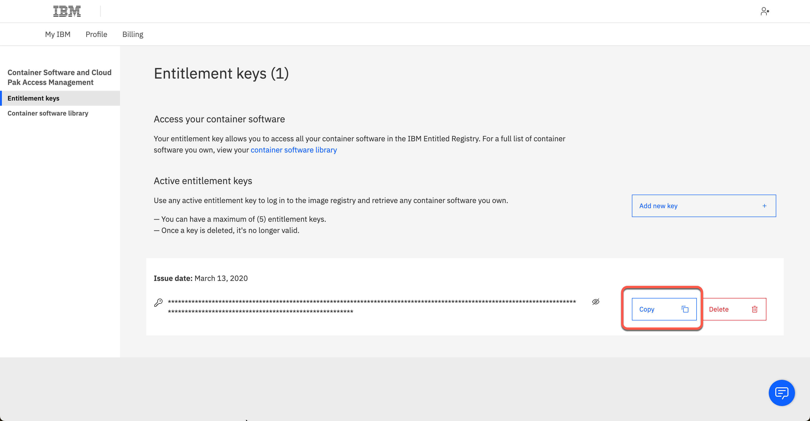

<FeatureCard
  title="Access backend systems using Messaging and Integration - Demo Preparation"
  color="dark"
  >


</FeatureCard>

<AnchorLinks>
  <AnchorLink>1 - Review Demo Scenario</AnchorLink>
  <AnchorLink>2 - OpenShift Installation</AnchorLink>
  <AnchorLink>3 - Access your OpenShift cluster and install the command line</AnchorLink>
  <AnchorLink>4 - Clone Repositories</AnchorLink>
  <AnchorLink>5 - Set Context</AnchorLink>
  <AnchorLink>6 - Install Foundational Services</AnchorLink>
  <AnchorLink>7 - Deploy the Platform UI</AnchorLink>
  <AnchorLink>8 - Deploy the Enterprise Messaging (MQ)</AnchorLink>
  <AnchorLink>9 - Deploy the App Connect</AnchorLink>
  <AnchorLink>10 - Install IBM App Connect Enterprise for Developers (Toolkit)</AnchorLink>
</AnchorLinks>

***

### 1 - Review Demo Scenario

| DEMO OVERVIEW |                          |
| --------------------------------------- | ------------------------------------- |
| **Scenario overview** | Access applications through  messages and integrations.  <br/><br/> To automate this customer interaction, we will use both messaging and integrations to back-end applications. |
| **Demo products** | Cloud Pak for Integration (IBM MQ & ACE) |
| **Demo capabilities** | Message Queue; ACE Toolkit; Application integration |
| **Demo intro slides** | Download the Introduction and Overview slides <a href="./files/MQACESlides.pptx" target="_blank" rel="noreferrer">here</a>. |
| **Demo script** | This demo script has multiple tasks that each have multiple steps. In each step, you have the details about what you need to do (**Actions**), what you can say while delivering this demo step (**Narration**), and what diagrams and screenshots you will see.<br/><br/> This demo script is a suggestion, and you are welcome to customize based on your sales opportunity. Most importantly, practice this demo in advance. If the demo seems easy for you to execute, the customer will focus on the content. If it seems difficult for you to execute, the customer will focus on your delivery. |
| **Prerequisites** | You need to have installed in your machine: <br/>- <a href="https://docs.openshift.com/container-platform/4.8/cli_reference/openshift_cli/getting-started-cli.html" target="_blank">oc CLI</a> v4.6+.<br/>- github CLI<br/>- Bash Shell<br/><br/>- JAVA v8+ <br/><br/>And you also need an account in the folllowing email service to configure your CP4I environment:<br/>- <a href="https://mailtrap.io/" target="_blank">mailtrap</a>|
| **Demo authors** | Rafael Osorio, Carlos Hirata and Ravi Katikala |
| **How to get support** | Contact <a href="mailto:rosorio@br.ibm.com">rosorio@br.ibm.com</a> regarding issues with running this demo use case or installing the Cloud Pak for Integration. <br/><br/> Open a support case at <a href="https://techzone.ibm.com/help" target="_blank">IBM Technology Zone Help</a> regarding issues with reserving and provisioning Tech Zone environments.|

***

### 2 - OpenShift Installation

<InlineNotification>If you already requested an environment for <a href="https://ibm-integration.github.io/learninghub/demos/mq-techsales/demo-preparation" target="_blank">MQ Uniform Clusters Demo</a>, you can reuse the same environment! You don't need to repeat the same demo preparation steps again, just go ahead and skip to step <a href="https://ibm-integration.github.io/learninghub/demos/mq-ace-techsales/demo-preparation#9-deploy-the-app-connect">9 - Deploy the App Connect</a>, and complete steps 9 and 10, and you will be ready to complete this demo. If not, go ahead and complete all steps of this document (steps 2 to 10).</InlineNotification>


IBM Cloud Pak for Integration brings together IBM’s market-leading middleware capabilities to support a broad range of integration styles and use cases. With powerful deployment, lifecycle management, and production services running on Red Hat OpenShift, it enables clients to leverage the latest agile integration practices, simplify the management of their integration architecture, and reduce cost. Cloud Pak for Integration demands an OpenShift cluster.

Follow the steps below to provision a Red Hat OpenShift Container Platform cluster on VMware on IBM Cloud.


2.1 To request an OpenShift Cluster on VMware on IBM Cloud, go <a href="https://techzone.ibm.com/my/reservations/create/63a3a25a3a4689001740dbb3" target="_blank">here</a> and complete the form with the follow details.

| Field  | Value |
| ------------- | ------------- |
| Purpose  | If you are doing the L4 course, select **Practice/Self Enablement**. <br/> If you are delivering a PoC, select:**Proof-of-Technology** and inform the Sales opportunity.  |
| Purpose Description  | If you are doing the L3 course, enter: **MQ L3 Course**. <br/> If you are delivering a POC, enter the PoC details.  |
| Preferred Geography  | You are welcome to select the preferred Geography |


| Field  | Value |
| ------------- | ------------- |
| OpenShift Version | 4.12 |
| Storage  | ODF - 500 GiB |
| Worker Node Count  | 5 |
| Worker Node Flavor  | 16 vCPU x 64 GB - 100 GB ephemeral storage |


2.2 **Agree** with the TechZone Terms and Conditions (A) and click **Submit** (B).


2.3 You will receive an email confirming the instance is provisioning.


2.4 You will receive a second email once the environment is provisioned. You should expect this to take between 30 and 120 minutes. Now the status update changed to **Ready**.  Click on **Reservation ID** to open the details page of your new reservation environment.


2.5 Copy your **Cluster Admin Username** (A) and **Cluster Admin Password** (B). Copy the **OCP Console link** (C).


***

### 3 - Access your OpenShift cluster and install the command line

In this section, you access your OpenShift cluster and install the OpenShift command line tool.

3.1 In a Browser, open the OCP Console link and paste the **Cluster Admin Username** (A) and **Password** (B) copied in the previous step and click **Log in** (C).


3.2 Great, you are almost ready for the demo. Last but not least important, let’s copy login command to access the cluster by CLI. On the top right, click your **username** (A) and select **Copy login command** (B).


3.3 Click **Display Token**.


3.4 Copy the **Log in with this token command** and **paste** on a terminal window.


That is it! Now you are ready for the Cloud Pak for Integration installation. Take a breath and let's start to install the Pak.

***

### 4 - Clone Repositories

To use this guide you will need to clone the <a href="https://github.ibm.com/joel-gomez/cp4i-demo" target="_blank">CP4I end to end demo repo</a> to your workstation. Let's do it now!


4.1 Open a terminal window and **run** the command below.

```
git clone https://github.ibm.com/joel-gomez/cp4i-demo.git
```

4.2 Open the **cp4i-demo** folder.
```
cd cp4i-demo
```

***

### 5 - Set Context

Based on where you have deployed your OCP cluster you will need to set up some environment variables to inform the installation script about your environment. Let’s do it here!

5.1 First, you need to define an environment variable to inform CP4I version.

```
export CP4I_VER=2023.4
```

5.2 Now let's set the OCP type based on the storage classes in your cluster.
```
export OCP_TYPE=ODF
```

`Note:` If you are using ROKS cluster, use export OCP_TYPE=ROKS.


5.3 Set mailtap credentials.
```
export MAILTRAP_USER=<my-mailtrap-user>
export MAILTRAP_PWD=<my-mailtrap-pwd>
```

5.4 If you have provisioned your OCP cluster in Tech Zone you can use the following script to set the proper default storage class.
```
scripts/99-odf-tkz-set-scs.sh
```

5.5 Your cluster will also need access to pull the container software required to deploy the Cloud Pak. Your Entitlement Key is used to grant access. You can download you entitlement key from <a href="https://myibm.ibm.com/products-services/containerlibrary" target="_blank">My IBM</a>. Click **Copy**.


5.6 The IBM Entitled Registry contains software images for the capabilities in IBM Cloud Pak® for Integration. To allow the Cloud Pak for Integration operators to automatically pull those software images, you must first obtain your entitlement key, then add your entitlement key in a pull secret.  Replace the *my-key* with your **IBM entitlement key**.
```
export ENT_KEY=<my-key>
```

5.7 Now, you need a namespace where you will deploy the different capabilities.
```
scripts/02a-cp4i-ns-key-config.sh
```

***

### 6 - Install Foundational Services

The IBM Cloud Pak foundational services operator is no longer installed automatically. Install this operator manually if you need to create an instance that uses identity and access management. That is exactly, what you will do in this section.

6.1 First we need to have a certificate manager, otherwise,  the IBM Cloud Pak foundational services operator installation will not complete. Let's do it!
```
oc apply -f resources/00-cert-manager-namespace.yaml
oc apply -f resources/00-cert-manager-operatorgroup.yaml
oc apply -f resources/00-cert-manager-subscription.yaml
```

6.2 Confirm the subscription has been completed successfully before moving to the next step running the following command.
```
oc get pods -n cert-manager-operator
```

You should get a response like this:
```
NAME                                                        READY   STATUS    RESTARTS   AGE
cert-manager-operator-controller-manager-7f779b98b4-2f64r   2/2     Running   0          13h
```

6.3 Now, you need to install Postgress SQL Catalog Source.
```
oc apply -f catalog-sources/${CP4I_VER}/01-postgress-sql-catalog-source-4.18.0.yaml
```

6.4 Confirm the catalog source has been deployed successfully before moving to the next step running the following command.
```
oc get pods -n openshift-marketplace | grep postgresql
```

You should get a response like this:
```
cloud-native-postgresql-catalog-jsmbk                             1/1     Running     0             14h
```

6.5 Ok, now you need to install Common Services Catalog source.
```
oc apply -f catalog-sources/${CP4I_VER}/02-common-services-catalog-source-4.4.0.yaml
```

6.6 Confirm the catalog source has been deployed successfully before moving to the next step running the following command.
```
oc get pods -n openshift-marketplace | grep opencloud
```

You should get a response like this:
```
opencloud-operators-fhbfd                                         1/1     Running     0             14h
```

6.7 Create the Common Services namespace.
```
oc new-project ibm-common-services
```

6.8 Now, let's intall the Foundational Services operator (former Common Services).
```
oc apply -f subscriptions/${CP4I_VER}/00-common-service-subscription.yaml
```

6.9 Confirm the operator has been deployed successfully before moving to the next step running the following command.
```
oc get pods -n openshift-operators | grep ibm-common-service
```

You should get a response like this:
```
ibm-common-service-operator-8c9b944f4-nkkgb                       1/1     Running     0          14h
```

***

### 7 - Deploy the Platform UI

Deploying the Platform UI allows you to deploy and manage instances from a central location.

7.1 First, let's install Platform UI Catalog source.
```
oc apply -f catalog-sources/${CP4I_VER}/03-platform-navigator-catalog-source-7.2.1.yaml
```

7.2 Confirm the catalog source has been deployed successfully before moving to the next step running the following command.
```
oc get pods -n openshift-marketplace | grep ibm-integration-platform-navigator
```

You should get a response like this:
```
ibm-integration-platform-navigator-catalog-xsm4w                  1/1     Running     0             14h
```

7.3 Now, let's install the Platform UI Operator.
```
oc apply -f subscriptions/${CP4I_VER}/01-platform-navigator-subscription.yaml
```

7.4 Confirm the operator has been deployed successfully before moving to the next step running the following command.
```
oc get pods -n openshift-operators | grep ibm-integration-platform-navigator
```

You should get a response like this:
```
ibm-integration-platform-navigator-operator-6489bb9b7-tcnz8       1/1     Running     0          14h
```

7.5 Let's deploy a Platform UI instance.
```
oc apply -f instances/${CP4I_VER}/common/01-platform-navigator-instance.yaml
```

7.6 Confirm the instance has been deployed successfully before moving to the next step running the following command:
```
oc get platformnavigator -n tools
```

You should get a response like this:
```
NAME             REPLICAS   VERSION      STATUS   READY   LASTUPDATE   AGE   MESSAGE
cp4i-navigator   3          2023.4.1-0   Ready    True    13h          14h   Platform UI has been provisioned.
```

7.7 Once the Platform UI instance is up and running get the access info.
```
scripts/03b-cp4i-access-info.sh
```

7.8 Open the Platform UI  URL and log in. Note the password is temporary and you will be required to change it. Take note of your new password, you will use it multiple times.


***

### 8 - Deploy the Enterprise Messaging (MQ)

8.1 First, let's intall the MQ Catalog Source.
```
oc apply -f catalog-sources/${CP4I_VER}/09-mq-catalog-source-3.0.1.yaml
```

8.2 Confirm the catalog source has been deployed successfully before moving to the next step running the following command.
```
oc get pods -n openshift-marketplace | grep ibmmq
```

You should get a response like this:
```
ibmmq-operator-catalogsource-4h9ql                                1/1     Running     0              3d23h
```

8.3 Now, let's install the MQ Operator.
```
oc apply -f subscriptions/${CP4I_VER}/06-mq-subscription.yaml
```

8.4 Confirm the operator has been deployed successfully before moving to the next step running the following command.
```
oc get pods -n openshift-operators | grep ibm-mq
```

You should get a response like this:
```
ibm-mq-operator-5965468479-btnkh                                  1/1     Running     0               3d23h
```

8.5 Set MQ namespace environment variable.
```
export MQ_NAMESPACE=cp4i-mq
```

8.6 Create certificates and extra route.
```
scripts/10a-qmgr-pre-config.sh
```

8.7 Create configmap with MQ configuration.
```
oc apply -f resources/03c-qmgr-mqsc-config.yaml
```

8.8 Deploy MQ Queue Manager instance.
```
scripts/10b-qmgr-inst-deploy.sh
```

8.9 Confirm the instance has been deployed successfully before moving to the next step running the following command.
```
oc get queuemanager -n tools
```

`Note` this will take few minutes, but at the end you should get a response like this:
```
NAME        PHASE
qmgr-demo   Running
```

8.10 Create CCDT.
```
scripts/10c-qmgr-post-config.sh
```

***

### 9 - Deploy the App Connect

Now, let's install the IBM App Connect.

Back to the terminal window logged in your OpenShift Environment.

9.1 First, let's intall the App Connect Catalog source.
```
oc apply -f catalog-sources/${CP4I_VER}/10-app-connect-catalog-source-11.2.0.yaml
```

9.2 Confirm the catalog source has been deployed successfully before moving to the next step running the following command.
```
oc get pods -n openshift-marketplace | grep appconnect
```

You should get a response like this.
```
appconnect-operator-catalogsource-qt2p5                           1/1     Running     0              3d23h
```

9.3 Now, we need to install the App Connect operator.
```
oc apply -f subscriptions/${CP4I_VER}/07-app-connect-subscription.yaml
```

9.4 Confirm the operator has been deployed successfully before moving to the next step running the following command.
```
oc get pods -n openshift-operators | grep ibm-appconnect
```

You should get a response like this.
```
ibm-appconnect-operator-7d789b5b4c-cr8qw                          1/1     Running     2 (3d4h ago)    3d23h
```

9.5 It is time to Deploy the Dashboard instance.
```
oc apply -f instances/${CP4I_VER}/${OCP_TYPE}/06-ace-dashboard-instance.yaml
```

9.6 Confirm the instance has been deployed successfully before moving to the next step running the following command.
```
oc get dashboard -n tools
```

Note this will take few minutes, but at the end you should get a response like this.
```
NAME            RESOLVEDVERSION   REPLICAS   CUSTOMIMAGES   STATUS   URL                                                                                   AGE
ace-dashboard   12.0.10.0-r3      1          false          Ready    https://ace-dashboard-ui-tools.apps.6597480c8e1478001153ba0d.cloud.techzone.ibm.com   3d23h
```

9.7 Now, let's create Bar Auth Configuration.
```
scripts/11-ace-config-barauth-github.sh
```

9.8 Create Policy Configuration to integrate with MQ.
```
scripts/12a-ace-config-policy-mq.sh
```

Your App Connect Dashboard environment is ready for the demo! Now, let's prepare the App Connect Toolkit environment.
***

### 10 - Install IBM App Connect Enterprise for Developers (Toolkit)

You can use the IBM App Connect Enterprise Toolkit to build powerful integration applications, services, and APIs. You can then deploy your integration solutions to the software run time, IBM App Connect Enterprise as a Service, containers, or a combination of environments.

10.1 Using your **IBMid**, **log in** on <a href="https://www.ibm.com/resources/mrs/assets?source=swg-wmbfd" target="_blank">IBM MRS Tool page</a>.


10.2 Provide the requested details (A) and **agree** (B) with the license and click **I confirm** (C).


10.3 Select the latest version of **IBM App Connect Enterprise for Developers** (A) and click **Continue** (B).


10.4 Then select the appropriate download option (for example, ACE-WIN64-DEVELOPER.exe 1.26 GB), and click **Download**.


10.5 Install **IBM App Connect Enterprise for Developers** on your chosen platform. More details available on this <a href="https://www.ibm.com/docs/en/app-connect/12.0?topic=enterprise-download-ace-developer-edition-get-started" target="_blank">page</a>.


10.6 Start the **IBM App Connect Enterprise Toolkit** on your chosen platform.


10.7 Now let's download the Toolkit project that we will use in the demo. Open a browser and go to this <a href="https://github.com/ibm-integration/learninghub/blob/main/static/mq-ace-files/ace-mq.zip" target="_blank">GitHub page</a>

10.8 Then click on the Download raw file icon.


Great! You are ready to present the demo!  Take a breath and happy selling!
