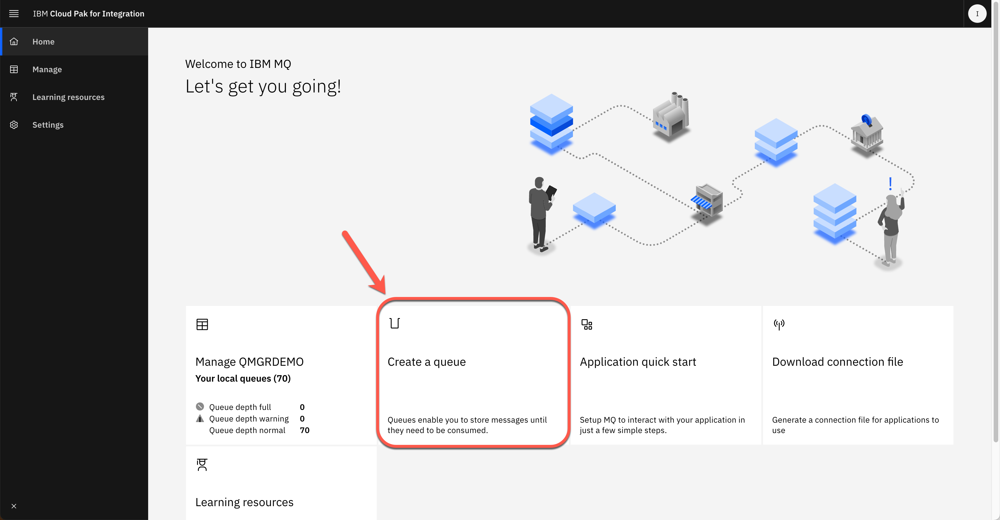
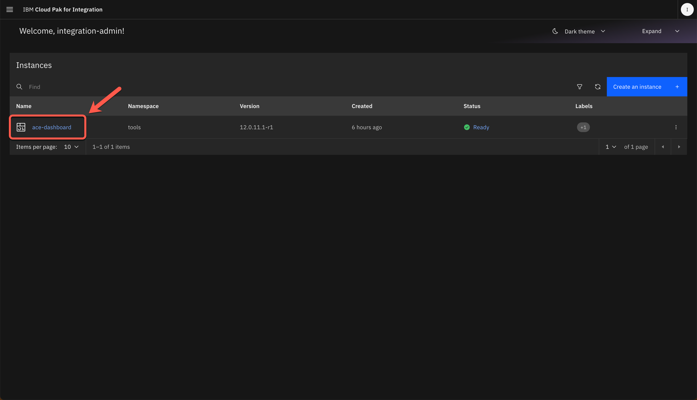

<FeatureCard
  title="Access backend systems using Messaging and Integration - Demo Script"
  color="dark"
  >


</FeatureCard>

<span id="place1"></span>

<details>

<summary>Introduction</summary>
<br/>
Every enterprise in today's markets must offer robust digital products and services, often requiring integration of complex capabilities and systems to deliver one coherent whole. IBM® Cloud Pak for Integration offers a simplified solution to this integration challenge, allowing the enterprise to modernize its processes while positioning itself for future innovation. Messaging is one of the key capabilities of IBM Cloud Pak for Integration.
<br/><br/>
IBM MQ provides a universal messaging backbone with robust connectivity for flexible and reliable messaging for applications and the integration of existing IT assets.  IBM MQ simplify, accelerate and facilitate the reliable exchange of data with a flexible and security-rich messaging solution that’s trusted by some of the world’s most successful enterprises. With IBM MQ, you ensure you receive the information you need, when you need it — and receive it only once.
<br/><br/>
This demo you will learn how to access applications through messages and integrations using IBM Integration Portfolio.
<br/><br/>
Let's get started!<br/><br/>

(Demo Slides <a href="https://github.com/ibm-integration/learninghub/blob/main/src/pages/demos/mq-ace-techsales/files/MQACESlides.pptx" target="_blank" rel="noreferrer">here</a>)
<br/>
</details>

<details>
<summary>1 - Accessing the environment</summary>

<br/>

| **1.1** | **Log in to Cloud Pak for Integration** |
| :--- | :--- |
| **Narration** | Let’s see IBM MQ and IBM App Connect in action. Here we have an IBM Cloud Pak for Integration environment with IBM MQ and IBM App Connector operators installed. We have a cloud version of the product on IBM Cloud. Let me log in here. |
| **Action** &nbsp; 1.1.1 | Open **Cloud Pak for Integration page** and **log in** with your **username** and **password**. <br/><br/><br/>|

<br/>

| **1.2** | **View the Cloud Pak for Integration instances** |
| :--- | :--- |
| **Narration** | Welcome to IBM Cloud Pak for Integration! We’re now at the home screen showing all the capabilities of the Pak, brought together in one place. Specialized integration capabilities — for API management, application integration, messaging, and more — are built on top of powerful automation services. <br/><br/>As you can see, you are able to access all the integration capabilities your team needs through a single interface. In this demo, to access backend systems , we will use App Connect for application integration, and the IBM MQ as an universal messaging backbone with robust connectivity for flexible and reliable messaging for applications and the integration of existing IT assets. |
| **Action** &nbsp; 1.2.1 | Show the **Instances page** and open the **Messaging** capability (qmgr-demo).<br/><br/>'Note'- If you didn't complete the Uniform Clusters demo before this demo, you don't have the uniform clusters instance. No problem at all! Just ignore them in the picture below. You don't need them. In this demo you only use the qmgr-demo instance.<br/><br/><br/> |


**[Go to top](#place1)**

</details>

<details>
<summary>2 - Create a queue</summary>

<br/>

| **2.1** | **View the IBM MQ home screen** |
| :--- | :--- |
| **Narration** | Welcome to IBM MQ on IBM Cloud Pak for Integration. IBM MQ offers proven, enterprise-grade messaging capabilities that skillfully and safely move information between applications. You can run IBM MQ in the pre-packaged container provided in IBM Cloud Pak for Integration.<br/><br/>Here we are on MQ Console page of a pre-created Queue Manager. From here you can manage your local queues or create a new queue. <br/><br/>IBM MQ can be managed using a variety of tools, from the IBM MQ Explorer GUI, through scripted or interactive command line tools or programmatically. <br/><br/> Let's explore how to create a new queue. <br/><br/> For demo purposes, we will create the queue using the Graphic User Interface, however in a production scenario you will create the queue using a ConfigMap that allows you to decouple environment-specific configuration from your container images, so that your applications are easily portable |
| **Action** &nbsp; 2.1.1 | Click **Create a queue**. <br/><br/><br/> |

| **2.2** | **Choose queue type** |
| :--- | :--- |
| **Narration** | An IBM MQ messaging system is made up of one or more queue managers. Queue managers are where messaging resources, such as queues, are configured and what applications connect to, either running on the same system as the queue manager or over the network.<br/><br/>A network of connected queue managers supports asynchronous routing of messages between systems, where producing and consuming applications are connected to different queue managers. <br/><br/>In this demo, we will use a Local queue. |
| **Action** &nbsp; 2.2.1 | In Create a queue page. Choose **Local** as your queue type. <br/><br/><br/>|

| **2.3** | **Define queue details** |
| :--- | :--- |
| **Narration** | Message queuing has been used in data processing for many years. It is most commonly used today in electronic mail. Without queuing, sending an electronic message over long distances requires every node on the route to be available for forwarding messages, and the addressees to be logged on and conscious of the fact that you are trying to send them a message. In a queuing system, messages are stored at intermediate nodes until the system is ready to forward them. At their final destination they are stored in an electronic mailbox until the addressee is ready to read them. <br/><br/> You can think of message queuing as being electronic mail for programs. In a message queuing environment, each program that makes up part of an application suite performs a well-defined, self-contained function in response to a specific request. To communicate with another program, a program must put a message on a predefined queue. The other program retrieves the message from the queue, and processes the requests and information contained in the message. So message queuing is a style of program-to-program communication. <br/><br/> A message queue, known simply as a queue, is a named destination to which messages can be sent. Messages accumulate on queues until they are retrieved by programs that service those queues.<br/><br/>Here, we need to define the details of our new queue. Let's define NEWORDER as the name of our new queue and keep the default values. |
| **Action** &nbsp; 2.3.1 | Enter **NEWORDER** as queue name (A), keep the **default values** (B) and the click **Create** (C). <br/><br/><br/> |

| **2.4** | **Manage your new queue** |
| :--- | :--- |
| **Narration** | Great we have a new local queue. In the manage page we can see all the queues available. Let's open the NEWORDER queue.<br/><br/> In the details page, we can see all the messages available in this queue. Right now, the NEWORDER queue is empty. Let's create an application to submit messages to this queue. By now, let's return to the queue manager page.  |
| **Action** &nbsp; 2.4.1 | In the **Manage** page (A), open the **Queues** tab (B), click on Find button (lens icon) (C) <br/><br/><br/> |
| **Action** &nbsp; 2.4.2 | Search for **NEWORDER** (A) queue and click on the **NEWORDER** queue link (B). <br/><br/><br/> |
| **Action** &nbsp; 2.4.3 | On the breadcrumbs, click **QMGRDEMO** link.<br/><br/><br/> |


**[Go to top](#place1)**

</details>

<details>
<summary>3 - Configuring the App Integration flow</summary>

<br/>

| **3.1** | **Checking the MQ Services name** |
| :--- | :--- |
| **Narration** | The applications connecting to IBM MQ can be written in any one of many different programming languages and to many different APIs. From C and Cobol, to Java and .Net to NodeJS and Ruby. In this demo, we will create an Integration Flow using App Connect Enterprise Toolkit. <br/><br/>Before starting App Connect Enterprise toolkit to create our flow, let’s check our IBM MQ IP address. |
| **Action** &nbsp; 3.1.1 | Open a **Terminal** window where you are already loggedin your CP4I environment. |
| **Action** &nbsp; 3.1.2 | Run the command below to get a list of mq services in the cp4i namespace. <br/><br/> oc get svc -n tools \| grep mq |
| **Action** &nbsp; 3.1.3 | Copy the MQ service name  from service which the port is 1414 (e.g.:*qmgr-demo-ibm-mq*).  <br/><br/><br/>|

| **3.2** | **Open App Connect Enterprise Toolkit** |
| :--- | :--- |
| **Narration** | Let's open the App Connect Enterprise Toolkit. <br/><br/> You can use the IBM App Connect Enterprise Toolkit to build powerful integration applications, services, and APIs. You can then deploy your integration solutions to the software run time, IBM App Connect Enterprise as a Service, containers, or a combination of environments.<br/><br/> The welcome page provides access to the Tutorials Gallery, which you can use to get started, what’s new information, and an option to install language packs. Let's close this Welcome page and go to Integration Development perspective. |
| **Action** &nbsp; 3.2.1 | Open your App Connect Enterprise Toolkit by clicking the icon on the Launchapad (MAC OS) or Desktop (Windows) or executing **ace toolkit** in terminal window. <br/><br/><br/>|
| **Action** &nbsp; 3.2.2 | In the Workspace Launcher window, you are welcome to create a new workspace or accept the default one. Click **Launch**. <br/><br/><br/>|
| **Action** &nbsp; 3.2.3 | **Close** the welcome page.  <br/><br/><br/> |

| **3.3** | **Import a flow** |
| :--- | :--- |
| **Narration** | Here we are in the Integration Development perspective. This is where we can create all our integration flows and manage our connectivity to our services and endpoints. We have a simple pre-created flow about a messaging integration scenario. Let’s import it to simplify our demonstration. |
| **Action** &nbsp; 3.3.1 | Select **File->Import** <br/><br/><br/> |
| **Action** &nbsp; 3.3.2 | Select **Project Interchange** (A) and click **Next** (B). <br/><br/><br/> |
| **Action** &nbsp; 3.3.3 | Select **ace-mq.zip** (A) file that you downloaded in the Demo Preparation part. Verify **neworder** project is checked (B) and click **Finish** (C). <br/><br/><br/>|

| **3.4** | **Check the integration flow** |
| :--- | :--- |
| **Narration** | Here we have our demo flow. In the flow editor, we can edit and change our flow. Message flows are created in the Toolkit using a drag and drop editor. <br/><br/>The flow is really simple, with four nodes. The Input and Output, a simple mapping node and an MQOutput node. |
| **Action** &nbsp; 3.4.1 | Open **neworder -> Resources -> Subflows -> getid.subflow** <br/><br/><br/> |

| **3.5** | **Configure MQ Output node properties** |
| :--- | :--- |
| **Narration** | This scenario uses an MQOutput node which is configured to interact with a local queue manager. Let's explore this node. <br/><br/>Let's start by defining the Queue name in the Basic section. Now, we need to inform the details of the MQ Connection, including the queue manager, the MQ ip, port and channel. <br/><br/> For demo purposes, we are hard coding the queue manager values in the flow, but in a production environment, we should use a Policy to implement it. |
| **Action** &nbsp; 3.5.1 | Click the **MQ Output** tile. <br/><br/><br/> |
| **Action** &nbsp; 3.5.2 | In the lower-right of the Properties pane, you see the **Properties** view (A), open the **Basic** tab (B) and type **NEWORDER** as the queue name (C). <br/><br/><br/>|
| **Action** &nbsp; 3.5.3 | Open the MQ Connection tab (A). On the Connection field, select **MQ client connection properties** (B). On Destination queue manager name, enter **QMGRDEMO** (case-sensitive) (C). On Queue manager host name, enter the **MQ service name** (e.g.: *qmgr-demo-ibm-mq*) identified in the previous step (D). On Listener port number, enter **1414** (E). On Channel name field, enter **SYSTEM.DEF.SRVCONN** (F). Save the flow (**CRTL+S**). <br/><br/> |

| **3.6** | **Export BAR file** |
| :--- | :--- |
| **Narration** | We are ready to deploy our Integration flow. Now, we need to generate a BAR (broker archive) file. The App Connect Enterprise server uses BAR files to save compiled message flows, libraries, etc. |
| **Action** &nbsp; 3.6.1 | In the Application Development window in the upper-left, on *neworder* application, right-click and select **New** then **BAR file**. <br/><br/><br/> |
| **Action** &nbsp; 3.6.2 | On the Window New Bar file, type **neworder** as the bar file name (A) and click **Finish** (B). <br/><br/><br/>|
| **Action** &nbsp; 3.6.3 | On the *Prepare* screen, mark the **REST APIs** checkbox (A). Check **Compile and in-line resources** (B). Click **Build and Save** (C). <br/><br/><br/> |
| **Action** &nbsp; 3.6.4 | Now, a popup window displays **Operation completed successfully**. Click **OK**. <br/><br/><br/> |

**[Go to top](#place1)**

</details>

<details>
<summary>4 - Deploying the App Integration flow</summary>

<br/>

| **4.1** | **Accessing the Integration Dashboard** |
| :--- | :--- |
| **Narration** | Let's see how to create an Integration Server using the App Connect Enteprise Dashboard in Cloud Pak for Integration. |
| **Action** &nbsp; 4.1.1 | Back to the **Cloud Pak Integration Platform Navigator** in the browser. Open the **Menu** (A) and on the **Run** section (B), open the **Integrations** dashboard (C). <br/><br/><br/>|
| **Action** &nbsp; 4.1.2 | On the Run integrations view, select the **ace-dashboard**. <br/><br/><br/>|

| **4.2** | **Deploy integrations** |
| :--- | :--- |
| **Narration** | Welcome to IBM App Connect Dashboard. Here we are able to administer integration servers and integration runtimes, which are deployed from BAR files. Let's deploy our Integration flow. <br/><br/>Because we need to deploy a simple integration, let's select the Quick start integration type. <br/><br/>Now we need to provide a BAR file. The BAR file contains all the resources that are needed to deploy an integration that exposes the integration and its operations. Let's upload our exported BAR file. <br/><br/>We can use the Configuration component to create any configurations that we want to apply to the integration server when we deploy it. For our scenario, we don't need to use the configuration package. <br/><br/>Now, we need to define a name for our Integration server, for example neworder. That is it. After few minutes our server should be ready with our integration flow. |
| **Action** &nbsp; 4.2.1 | Click **Deploy integrations**. <br/><br/><br/>|
| **Action** &nbsp; 4.2.2 | Select **Quick start integration** option (A) and click **NEXT** (B). <br/><br/><br/> |
| **Action** &nbsp; 4.2.3 | Click to upload your BAR File. And select the **neworders.bar** (A) file (it is in your workspace folder in a Bar Files directory). And click **Next** (B).   <br/><br/><br/> |
| **Action** &nbsp; 4.2.4 | You don't need any Integration configuration, click **Next**. <br/><br/><br/> |
| **Action** &nbsp; 4.2.5 | Enter the Integration Server name as **neworder** (A). Then click **Create** (B). <br/><br/><br/> |
| **Action** &nbsp; 4.2.6 | The deployment process takes up to 5 minutes, **refresh** the browser to see the BAR file deployed and started. <br/><br/><br/> |

**[Go to top](#place1)**

</details>

<details>
<summary>5 - Testing the Integration flow</summary>

<br/>

| **5.1** | **Copying the Integration server endpoint** |
| :--- | :--- |
| **Narration** | To test our Integration flow, we need to have the Integration API endpoint. Let's copy our Integration flow endpoint here in the Integration definition.  |
| **Action** &nbsp; 5.1.1 | Click the **neworder** server icon. <br/><br/><br/> |
| **Action** &nbsp; 5.1.2 | Click the **neworder API** icon. <br/><br/><br/>|
| **Action** &nbsp; 5.1.3 | Copy the **Endpoint URL**. <br/><br/><br/>|

| **5.2** | **Invoking the Integration flow** |
| :--- | :--- |
| **Narration** | To test our flow, let's do a simple curl HTTP request to our endpoint, passing the order number as parameter. |
| **Action** &nbsp; 5.2.1 | Open a terminal window and enter the curl command below. <br/><br/> ``` curl -G -k [NEWORDER_ENDPOINT]/00000```  <br/><br/> `Note` - Replace the API URL with your Endpoint and don’t forget to include 0000 as order number at the end of the URL. <br/><br/><br/> |

| **5.3** | **Checking the message** |
| :--- | :--- |
| **Narration** | Now, let’s check if the message arrived in the NEWORDER queue in IBM MQ. Let’s use IBM MQ Console to do it. Great, here we can see that our NEWORDER queue has one new message.  |
| **Action** &nbsp; 5.3.1 | Open the **Menu** again (A), and on **Run** section (B), click on **Messaging** (C). <br/><br/><br/>|
| **Action** &nbsp; 5.3.2 | Select **qmgr-demo**. <br/><br/><br/>|
| **Action** &nbsp; 5.3.3 | Click **Manage QMGRDEMO**. <br/><br/><br/> |
| **Action** &nbsp; 5.3.4 | Open the **Queues** tab. <br/><br/><br/> |
| **Action** &nbsp; 5.3.5 | In the Maximum depth, you can see that a new message has arrived in NEWORDER queue. <br/><br/><br/> |
| **Action** &nbsp; 5.3.6 | Click on the **NEWORDER** queue. <br/><br/><br/> |
| **Action** &nbsp; 5.3.7 | Show the messages received. <br/><br/><br/> |

**[Go to top](#place1)**

</details>

<details>
<summary>Summary</summary>

<br/>
Let’s summarize what we’ve done today.
<br/><br/>
In the demo we: accessed the Cloud Pak for Integration environment and explored the capabilities; created a queue in IBM MQ; imported and configured an Integration flow using IBM App Connect Enterprise toolkit; deployed and tested our Application flow in IBM App Connect Dashboard.
<br/><br/>
From a business perspective we used messaging and application integrations to integrate backend systems using a messaging platform. IBM MQ provides a universal messaging backbone with robust connectivity for flexible and reliable messaging for applications and the integration of existing IT assets.  IBM MQ simplify, accelerate and facilitate the reliable exchange of data with a flexible and security-rich messaging solution that’s trusted by some of the world’s most successful enterprises. With IBM MQ, you ensure you receive the information you need, when you need it — and receive it only once.
<br/><br/>
Thank you for attending today’s presentation.
<br/>

**[Go to top](#place1)**

</details>
