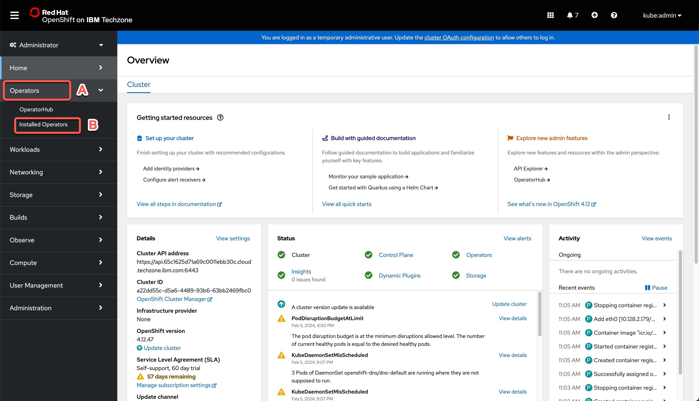
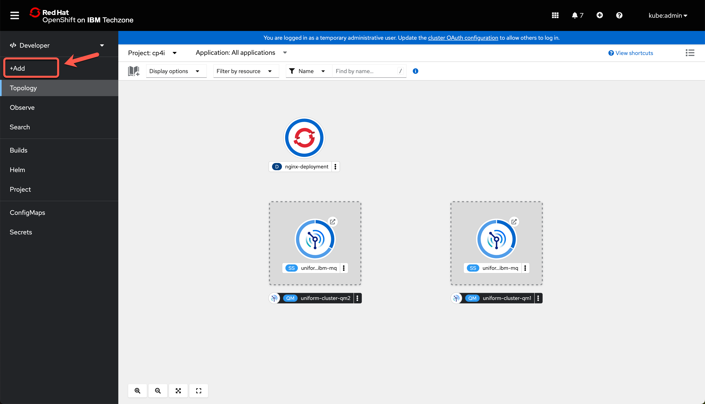
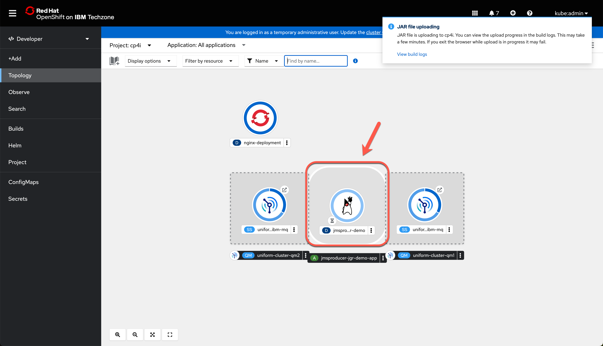

<FeatureCard
  title="Horizontally scaling IBM MQ with Uniform Clusters - Demo Preparation"
  color="dark"
  >


</FeatureCard>

<span id="place1"></span>

<details>

<summary>Introduction</summary>
<br/>
We’re running a cluster of IBM MQ queue managers in Red Hat OpenShift, together with a large number of client applications putting and getting messages to them. This workload will vary over time, so we need flexibility in how we scale all of this.
<br/><br/>
This demo will show how we can easily scale the number of instances of our client applications up and down, without having to reconfigure their connection details and without needing to manually distribute or load balance them.
<br/><br/>
And it will show how to quickly and easily grow the queue manager cluster – adding a new queue manager to the cluster without complex, new, custom configuration. In this demo, we will see the Universal Cluster capability of IBM MQ in action.
<br/><br/>
Let's get started!<br/><br/>

(Demo Slides <a href="./files/MQUniformSlides.pptx" target="_blank" rel="noreferrer">here</a>)
<br/>
</details>

<details>
<summary>1 - Accessing the environment</summary>

<br/>

| **1.1** | **Log in to Cloud Pak for Integration** |
| :--- | :--- |
| **Narration** |Let’s see how to scale IBM MQ cluster and client applications in OpenShift. Here we have an IBM Cloud Pak for Integration environment with IBM MQ operator installed. We have a cloud version of the product on IBM Cloud. Let me log in here.  &nbsp; &nbsp; &nbsp; &nbsp; &nbsp; &nbsp; &nbsp; &nbsp; &nbsp; &nbsp; &nbsp; &nbsp; &nbsp; &nbsp; &nbsp; &nbsp;  |
| **Action** &nbsp; 1.1.1 | Open **Cloud Pak for Integration page** and **log in** with your **username** and **password**. <br/><br/><br/>|

<br/>

| **1.2** | **View the Cloud Pak for Integration instances** |
| :--- | :--- |
| **Narration** | Welcome to IBM Cloud Pak for Integration! We’re now at the home screen showing all the capabilities of the Pak, brought together in one place. Specialized integration capabilities — for API management, application integration, messaging, and more — are built on top of powerful automation services. <br/><br/>As you can see, you are able to access all the integration capabilities your team needs through a single interface.So far we have a basic MQ instance here. IBM MQ is an universal messaging backbone with robust connectivity for flexible and reliable messaging for applications and the integration of existing IT assets. In this demo, to scale our IBM MQ Cluster, we will create a Universal cluster. |
| **Action** &nbsp; 1.2.1 | Show the **Instnces page**. <br/><br/><br/> |

| **1.3** | **Access OpenShift Web Console** |
| :--- | :--- |
| **Narration** | Let's check our environment on OpenShift Web Console. On Installed Operators page, we can confirm that IBM MQ operator is installed. But we have only one queue manager so far. Next step is to create our Universal Cluster in MQ.  |
| **Action** &nbsp; 1.3.1 | Open the **OpenShift Web Console** and **log in**. <br/><br/><br/>  |
| **Action** &nbsp; 1.3.2 | Open the **Operators** (A) > **Installed Operators** (B). <br/><br/><br/>  |
| **Action** &nbsp; 1.3.3 | Open the **IBM MQ** operator. <br/><br/><br/>  |
| **Action** &nbsp; 1.3.4 | Open the **Queue Manager** tab. <br/><br/><br/>  |
| **Action** &nbsp; 1.3.5 | Show the queue manager available <br/><br/><br/>  |

**[Go to top](#place1)**

</details>

<details>
<summary>2 - Deploy Uniform Cluster configuration</summary>

<br/>

| **2.1** | **Create configurations** |
| :--- | :--- |
| **Narration** | The objective of a uniform cluster deployment is that applications can be designed for scale and availability, and can connect to any of the queue managers within the uniform cluster. This removes any dependency on a specific queue manager, resulting in better availability and workload balancing of messaging traffic.<br/><br/>Let's create it now. First we need to create our uniform cluster configurations. |
| **Action** &nbsp; 2.1.1 | On a terminal windows, **log in** on your OpenShift environment and run the command below. <br/> ```oc apply -f resources/03d-qmgr-uniform-cluster-config.yaml```|

| **2.2** | **Deploy Queue Managers** |
| :--- | :--- |
| **Narration** | Uniform clusters are a specific pattern of an IBM MQ cluster that provides a highly available and horizontally scaled small collection of queue managers. These queue managers are configured almost identically, so that an application can interact with them as a single group. This makes it easier to ensure each queue manager in the cluster is being used, by automatically ensuring application instances are spread evenly across the queue managers.<br/><br/>Now we need to create our two queue Managers. Let's do it!<br/><br/>Great now let's confirm the instances have been deployed successfully before moving to the next step. |
| **Action** &nbsp; 2.2.1 | Run the command below.``` oc apply -f instances/${CP4I_VER}/${OCP_TYPE}/13a-qmgr-uniform-cluster-qm1.yaml -n cp4i ``` |
| **Action** &nbsp; 2.2.2 | Run the command below.``` oc apply -f instances/${CP4I_VER}/${OCP_TYPE}/13b-qmgr-uniform-cluster-qm2.yaml -n cp4i ``` |
| **Action** &nbsp; 2.2.3 | Run the command below.``` oc get queuemanager -n cp4i ``` <br/><br/> `Note` this will take few minutes, but at the end you should get a response like this. <br/><br/><br/>  |

| **2.3** | **Deploy NGINX to serve CCDT** |
| :--- | :--- |
| **Narration** | We need to create the CCDT to be used by our application and deploy an NGINX instance to serve CCDT. <br/><br/>Voilá, the NGINX service was created to be used by our application. Now we can deploy our application. |
| **Action** &nbsp; 2.3.1 | Run the command below to create CCDT to be used by App. <br/> ``` oc apply -f resources/04a-nginx-ccdt-configmap.yaml ``` |
| **Action** &nbsp; 2.3.2 | Run the command below to deploy NGINX instance to serve CCDT. <br/> ``` oc apply -f resources/04b-nginx-deployment.yaml ``` |
| **Action** &nbsp; 2.3.3 | Confirm the instances has been deployed successfully before moving to the next step running the following command. <br/><br/>  <b>oc get pods -n cp4i \| grep nginx  </b> <br/><br/> You should get a response like this. <br/><br/><br/>|
| **Action** &nbsp; 2.3.4 | Run the command below to create service for NGINX to be used by App. ``` oc apply -f resources/04c-nginx-service.yaml ``` |


**[Go to top](#place1)**

</details>

<details>
<summary>3 - Deploy MQ Application</summary>

<br/>

| **3.1** | **Check the Topology** |
| :--- | :--- |
| **Narration** | Now that the uniform cluster is running, we can proceed to deploy the application that will be interaction with the queue managers. <br/><br/>First, we will switch to the “Developer” perspective. In this perspective you can view the queue managers. Here you will see the tiles representing each queue manager .  |
| **Action** &nbsp; 3.1.1 | Back to the **OpenShift Web Console** page, click on the **Administrator** option (A) and select the **Developer** (B) perspective. <br/><br/><br/><br/>`Note` - If you see the Welcome to the Developer Perspective dialog, go ahead and close it.<br/>|
| **Action** &nbsp; 3.1.2 | Open the **Topology** page.  <br/><br/><br/>|
| **Action** &nbsp; 3.1.3 | Filter by **cp4i** project (A) and show the topology (B).  <br/><br/><br/>|

| **3.2** | **Deploy JAR file** |
| :--- | :--- |
| **Narration** | For demo purposes we have pre-created the JMS application that will use our Queue Managers. Let's deploy it.  |
| **Action** &nbsp; 3.2.1 | Click on **+Add** on left menu. <br/><br/><br/>|
| **Action** &nbsp; 3.2.2 | Click on **Upload JAR file**. <br/><br/><br/>|
| **Action** &nbsp; 3.2.3 | Select **Browse** (A) and follow the dialogs to select the **jmsproducer-jgr-demo.jar** file (B) (check the demo preparation document about how to get the jar file).  <br/><br/><br/> |
| **Action** &nbsp; 3.2.4 | Scroll down and uncheck **Create a route** (A), then click **Create** button (B).  <br/><br/><br/>|
| **Action** &nbsp; 3.2.5 | Show the tile representing the deployment in the Topology view. <br/><br/><br/>|

| **3.3** | **Review Deployment** |
| :--- | :--- |
| **Narration** | Now, let's review our application connection. From here, we can easily check the application log. Great, our application was able to connect to a queue manager and it is sending messages. |
| **Action** &nbsp; 3.3.1 | After a few second click on the tile representing the deployment to display the pod. <br/><br/><br/> |
| **Action** &nbsp; 3.3.2 | Click on the pod name. <br/><br/><br/>|
| **Action** &nbsp; 3.3.3 | In the pod page go to the **Logs** tab (1) and click **Expand** (2) to get a full view of the log. <br/><br/><br/> |
| **Action** &nbsp; 3.3.4 | Take your time reviewing the log, and at the bottom you will find a message saying “Sending…” confirming the application was able to connect to a queue manager and it is sending messages (A).  When done, **collapse** the log window. (B) <br/><br/><br/> |

**[Go to top](#place1)**

</details>

<details>
<summary>4 - Validate Uniform Cluster connectivity</summary>

<br/>

| **4.1** | **Explore the Queue Manager 2** |
| :--- | :--- |
| **Narration** | Now that the mq application is deployed let’s check the behavior with the Uniform Cluster. Let's open the Queue Manager 2.  The pod ending with 0 is by default the active instance, let's explore it. |
| **Action** &nbsp; 4.1.1 | Navigate back to the **Topology** page. <br/><br/><br/>|
| **Action** &nbsp; 4.1.2 | Select the tile that represent **QM02**. <br/><br/><br/>|
| **Action** &nbsp; 4.1.3 | Select the pod ending with **0** that by default is the active instance. <br/><br/><br/> |

| **4.2** | **Review connections to QM02** |
| :--- | :--- |
| **Narration** | In order to check the connection status we will use the command “display connections” and we will filter by the MQ App name that is “MY-PRODUCER”. We will execute the command directly from the terminal in each MQ pod. <br/><br/>Right now, we don't have any connection in this pod. But in the next step we will get a better picture on how the connections are distributed.  |
| **Action** &nbsp; 4.2.1 | Open the **Terminal** tab (A) and click **Expand** (B) <br/><br/><br/>|
| **Action** &nbsp; 4.2.2 | Enter the command below in your terminal windows (if your prefer, you can paste using the context menu) and hit enter to check how many active connections associated with our application are in this queue manager. <br/><br/> echo 'dis conn(*)' all \| runmqsc \| grep -i my  <br/> |
| **Action** &nbsp; 4.2.3 | Show that there isn't any connection in this Message queue (A). Once you are over you can **Collapse** (B) the terminal again.  <br/><br/><br/> |

| **4.3** | **Explore the Queue Manager 1** |
| :--- | :--- |
| **Narration** | Now let's explore the Queue Manager 1.  Let's repeat the same procedure as before to select the active pod. |
| **Action** &nbsp; 4.3.1 | Right click the **Topology** menu (A) and select **Open Link in New Tab** (B) to keep a window open for each queue manager since you may need to go back and forth. <br/><br/><br/> |
| **Action** &nbsp; 4.3.2 | Select the tile that represent **QM01**. <br/><br/><br/>|
| **Action** &nbsp; 4.3.3 | Select the pod ending with **0**. <br/><br/><br/>|

| **4.4** | **Review connections to QM01** |
| :--- | :--- |
| **Narration** | Now let's check the connection status in this MQ pod. <br/><br/>This time we see a couple of active connections, probing that the application we deployed is connected to the cluster.  |
| **Action** &nbsp; 4.4.1 | Open the **Terminal** tab (A) and click **Expand** (B) <br/><br/><br/>|
| **Action** &nbsp; 4.4.2 | Enter the command below in your terminal windows (if your prefer, you can paste using the context menu) and hit enter to check how many active connections associated with our application are in this queue manager.<br/><br/> echo 'dis conn(*)' all \| runmqsc \| grep -i my <br/> |
| **Action** &nbsp; 4.4.3 | Show the **connections** available (A). Once you are over you can **Collapse** (B) the terminal again. <br/><br/> <br/><br/> `Note` - In your case the result could potentially be the opposite since we have no affinity defined and the application will connect to any queue manager, but since we only have one instance there will only be a connection to one queue manager at a time. |

**[Go to top](#place1)**

</details>

<details>
<summary>5 - Scale MQ Application</summary>

<br/>

| **5.1** | **Increase the number of instances** |
| :--- | :--- |
| **Narration** | At the moment our application is running in a single pod and therefore it is only connect to one of the queue managers, but what if the workload increases and I need to scale my app. Let’s simulate the scenario and see how the connections are distributed. <br/><br/>Let's explore the Deployments view of our application. Here we can see there is only one pod. Let's increate to have two instances. |
| **Action** &nbsp; 5.1.1 | Right click on the **RedHat OpenShift logo** (A) and select **Open Link in New Tab** (B) to keep a window open. <br/><br/><br/> |
| **Action** &nbsp; 5.1.2 | Change to **Administrator** perspective. <br/><br/><br/>|
| **Action** &nbsp; 5.1.3 | Open the **Workloads** menu (A) and select **Deployments** (B). <br/><br/><br/>|
| **Action** &nbsp; 5.1.4 | Check that you are on **cp4i** project (A). Click on the **jmsproducer** deployment (B). <br/><br/><br/> |
| **Action** &nbsp; 5.1.5 | Click on the **arrow up** icon to increase the number of instances to **two**.  <br/><br/><br/> |
| **Action** &nbsp; 5.1.6 | Wait a few seconds. After a moment you will see the number of pods is updated to two. <br/><br/><br/> |


| **5.2** | **Review connectivity** |
| :--- | :--- |
| **Narration** | Now, let's check how many connections we have per queue manager. This time we should see that each queue manager has a couple of connections.  |
| **Action** &nbsp; 5.2.1 | Back to the **MQ1 browser tab**, refresh the terminal page and enter the command below again and press **enter**. <br/><br/> echo 'dis conn(*)' all \| runmqsc \| grep -i my  <br/> |
| **Action** &nbsp; 5.2.2 | Show that you have **multiple connections** in **MQ1**. <br/><br/><br/>|
| **Action** &nbsp; 5.2.3 | Back to the **MQ2 browser tab**, enter the command below again and press **enter**. <br/><br/> echo 'dis conn(*)' all \| runmqsc \| grep -i my  <br/> |
| **Action** &nbsp; 5.2.4 | Show that you have **multiple connections** in **MQ2**. <br/><br/><br/>|

**[Go to top](#place1)**

</details>

<details>
<summary>6 - Rebalance connections</summary>

<br/>

| **6.1** | ** Delete Queue Manager** |
| :--- | :--- |
| **Narration** | We observed how each instance will connect to a different queue manager trying to keep a homogenous distribution, but what would happen if one of the queue managers goes down? Let’s find out. <br/><br/>Let's check our queue managers in the installed operators page. <br/><br/>We could kill one of the active pods for any of the queue managers, but since we have configured Native HA, one of the standby instances will take over and at the end, each queue manager will keep a couple of connections, so in this case we will go ahead and fully delete the queue manager.  |
| **Action** &nbsp; 6.1.1 | Back to the Administrator perspective browser tab, on the left navigator, open the **Operators** (A) > **Installed Operators** (B) menu. <br/><br/><br/> |
| **Action** &nbsp; 6.1.2 | Navigate to the **IBM MQ** Operator again. <br/><br/><br/> |
| **Action** &nbsp; 6.1.3 | Open the **Queue Manager** tab. <br/><br/><br/> |
| **Action** &nbsp; 6.1.4 | Click on the hamburger **menu** for QM02 (A) and select **Delete Queue Manager** (B). <br/><br/><br/>|
| **Action** &nbsp; 6.1.5 | Click the **Delete** button on the warning dialog to confirm you want to delete the queue manager. <br/><br/><br/> |

| **6.2** | **Review connectivity ** |
| :--- | :--- |
| **Narration** | If we try to navigate back to the active pod for queue manager 2, we will get an error message since the queue manager and therefore its pods have been deleted already. <br/><br/>However, if we navigate to the active pod for queue manager one and submit the command to check the number of active connection, we will see all the connections are directed to the active queue manager assuring the client application can continue sending messages.  |
| **Action** &nbsp; 6.2.1 | Back to the **MQ2 browser tab**, show the error message: “**404**”. <br/><br/><br/>|
| **Action** &nbsp; 6.2.2 | Back to the **MQ1 browser tab**, refresh the terminal page and enter the command below again and press **enter**. <br/><br/>  echo 'dis conn(*)' all \| runmqsc \| grep -i my <br/>  |
| **Action** &nbsp; 6.2.3 | Show that you have **all the connections** now in **MQ1**. <br/><br/><br/> |

| **6.3** | **Recreate Queue Manager 2** |
| :--- | :--- |
| **Narration** | Now let's recreate the Queue Manager 2. For this demo, we will recreate using Command Line Interface, but in a production environment, we can use a gitOps approach.  |
| **Action** &nbsp; 6.3.1 | Run the command below.<br/><br/> ``` oc apply -f instances/${CP4I_VER}/${OCP_TYPE}/13b-qmgr-uniform-cluster-qm2.yaml -n cp4i ``` |
| **Action** &nbsp; 6.3.2 | Run the command below.<br/><br/> ``` oc get queuemanager -n cp4i ``` <br/><br/>`Note` this will take few minutes, but at the end you should get a response like this. <br/><br/><br/> |
| **Action** &nbsp; 6.3.3 | Back to OpenShift Console browser tab with the Administrator profile, on the IBM MQ operator on the Queue Manager tab, check the new Queue Manager is ready. <br/><br/><br/> |

| **6.4** | **Review the final scenario** |
| :--- | :--- |
| **Narration** | Once we confirm both queue managers are up and running, we can go back to the terminal of the active pod for each queue manager to check the number of active connections. <br/><br/> And a similar behavior would happen if additional queue manager are added to the uniform cluster and the connection would be rebalanced providing a way to scale horizontally. <br/><br/> Great! Here, we have arrived at the conclusion of our demonstration. |
| **Action** &nbsp; 6.4.1 | Back to the **MQ1 browser tab**, refresh the terminal page and enter the command below again and press **enter**. <br/><br/>  echo 'dis conn(*)' all \| runmqsc \| grep -i my <br/>|
| **Action** &nbsp; 6.4.2 | Show that you have **multiple connections** in **MQ1** (not all connections as presented in the previous section).  <br/><br/><br/>|
| **Action** &nbsp; 6.4.3 | Back to the **MQ2 browser tab**, you need to reopen the MQ2 pod0 terminal page. Enter the command below again and press enter.<br/><br/> echo 'dis conn(*)' all \| runmqsc \| grep -i my <br/>|
| **Action** &nbsp; 6.4.4 | Show that you have **multiple connections** in **MQ2** again. <br/><br/><br/>|

**[Go to top](#place1)**

</details>

<details>
<summary>Summary</summary>

<br/>
Let’s summarize what we’ve done today.
<br/><br/>
In the demo we: accessed the Cloud Pak for Integration environment and explored the IBM MQ capabilities; deployed an uniform cluster; deployed an MQ Application, validated the uniform cluster connectivity, scaled the MQ application and rebalanced the connections.
<br/><br/>
From an operation perspective we showed how we can easily scale the number of instances of your client applications up and down, without having to reconfigure their connection details and without needing to manually distribute or load balance them.
<br/><br/>
And here we demonstrated how to quickly and easily grow the queue manager cluster – adding a new queue manager to the cluster without complex configuration.
<br/><br/>
Thank you for attending today’s presentation.
<br/>

**[Go to top](#place1)**

</details>
