Now that you have a ROKS cluster, you need to install manually the Cloud Pak for Pak_Name. Let's do it!

1. Login to [https://cloud.ibm.com/catalog](https://cloud.ibm.com/catalog) if you have not already

2. From the Catalog, select Cloud Pak for Pak_Name

   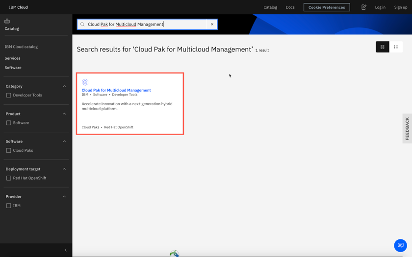

3. Select the Redhat Openshift Cluster that you just created from the list. The DTE provisioned cluster name starts with dteroks or playgrowth. Select **kube-system** as project name.

   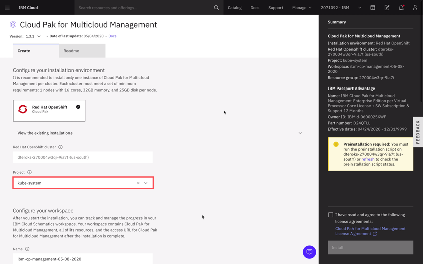
4. You must run the preinstallation script before you install the Cloud Pak. There is no need to modify the content of the script, simply click on Run Script to complete the pre-installation step.

   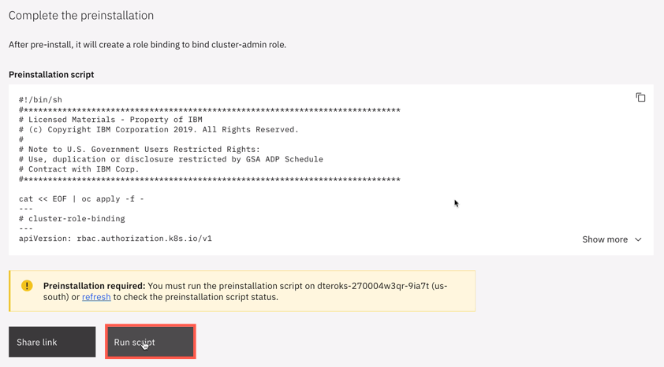

5. Once the pre-installation step is complete, you may proceed with the installation.

   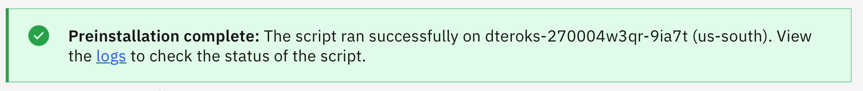

6. Enter a value for defaultAdminPassword. It is important that you choose a password that is 32 characters in length and conforms to the password rule: include only numbers, letters or '-'.

   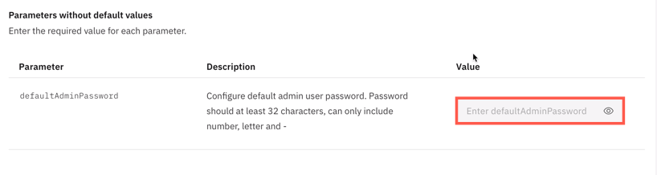

7. Accept license agreement and click **Install** to install Cloud Pak for Pak_Name. The installation takes about 30 minutes.

   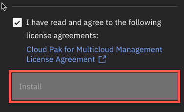

   You can track the deployment on the Schematics workspace that opens.

   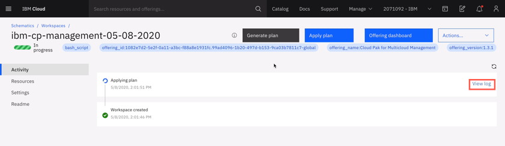

   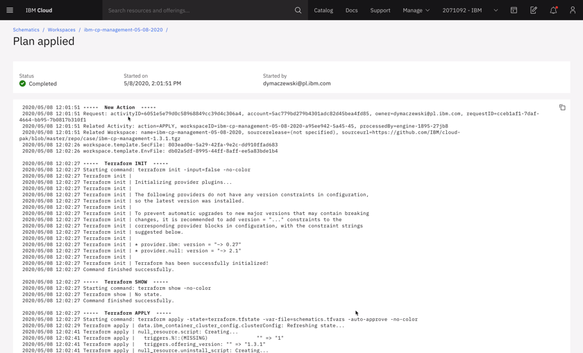

8. Your cluster domain can be found in multiple places, for example at the end of installation log file.

   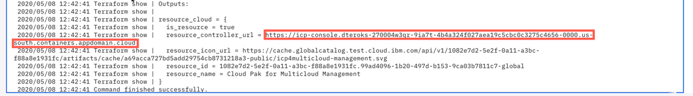

   However the easiest way is to click **Offering dashboard** at the top of the Schematics workspace

   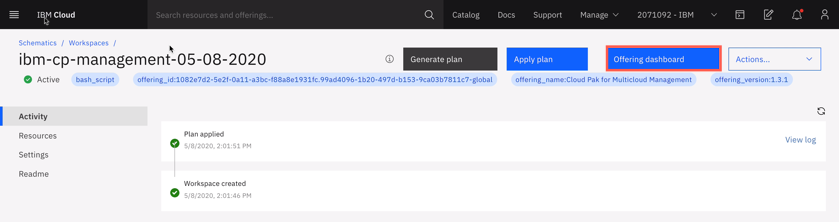

9. Login to Cloud Pak interface using icp-console.*yourcluster-domain-name*. Provide **admin** and the password that you specified in step 6 above.

   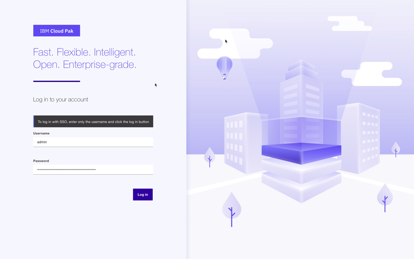

10. You have successfully completed cluster provisioning, Cloud Pak for Pak_Name installation. You are ready to proceed to tutorials that use Cloud Pak for Pak_Name on ROKS, or install other tools if desired.

    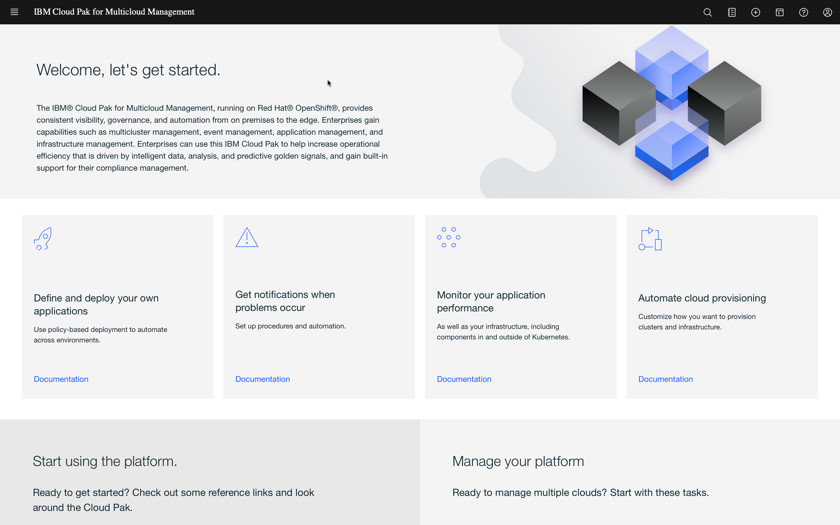
