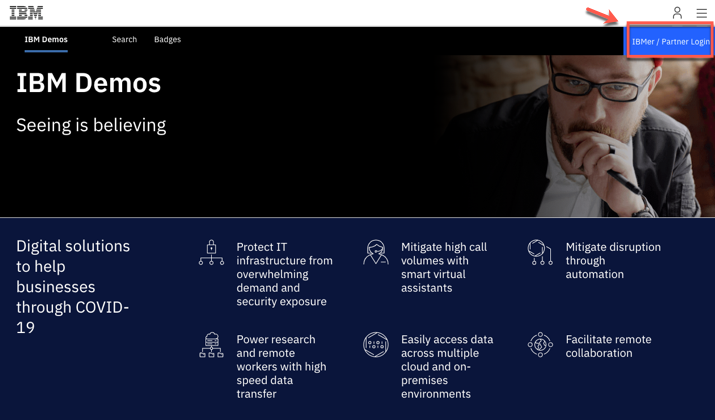
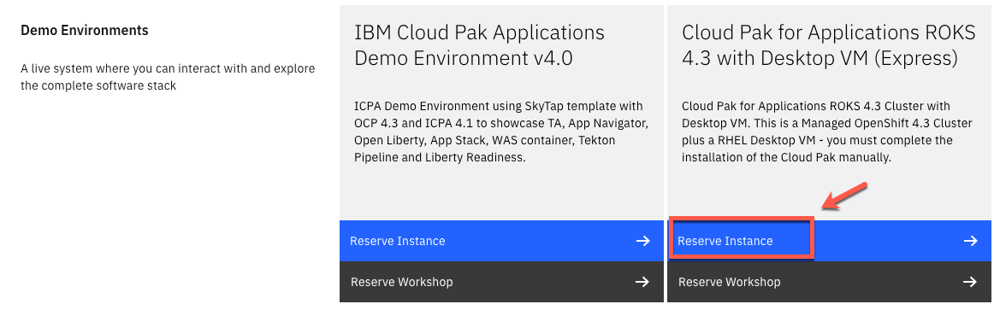
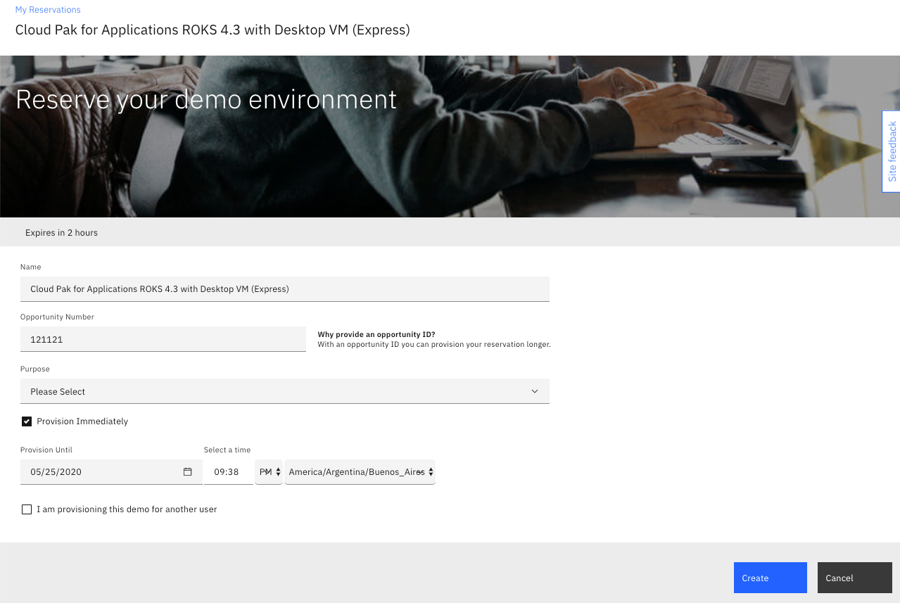
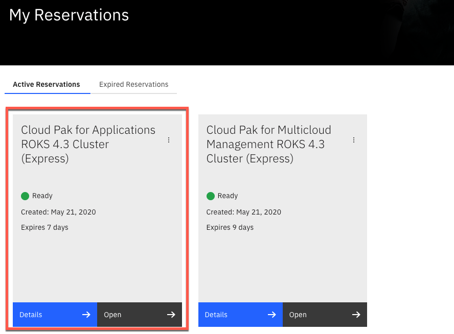

To be able to deliver a **WOW** Cloud Pak for Pak_Name demo, you need to have Managed clusters. We are working to give you extra clusters to manage (ROKS and IKS) when you request a CP4MCM ROKS environment. But now, you have only your CP4MCM Hub cluster.

Here you will see how to minimize the current limitation. Following these steps, you can have a second ROKS cluster, so you can use it in your Demo or Labs environment as a managed cluster. The easiest option now is to request another Cloud Pak Environment. With CP4MCM you can manage any Openshift or managed Kubernetes environment. That includes all other Cloud Paks.

Based on that, one option is to request a Cloud Pak for Applications. CP4A is one of the simplest pak, so it is a good candidate to be your Managed Cluster. Let's do it!

1. Log in to [https://www.ibm.com/demos/](https://www.ibm.com/demos/) using your IBM credentials.

   

2. On the IBM Demos page, scroll down to see the Featured Collections section. Then open **Cloud Pak for Applications** collection.

   

3. Now, scroll down to see the Demo Environments section. If necessary, click **Show All**.  On the **Cloud Pak for Applications ROKS 4.3 Cluster (Express)** Demo Environment, click **Reserve Instance**.

   

   Note: If you cannot see the Demo Environment section, make sure you are logged in as shown in Step 1. At this time, only IBMers are able to request ROKS Demo environments.

4. Enter your **Opportunity number, Purpose, Provision duration** and **country/region**. The environment can be provisioned immediately by selecting the checkbox for a duration up to 14 days.

   

5. The reservation status is shown in the next screen if there is an available cluster from the pool for immediate use. Otherwise, an email notification will be sent when the cluster is ready.

   

6. The reservation details can be viewed by selecting Details.

   

   Now your new ROKS cluster is ready. For the purpose of CP4MCM environment, you don't need to go ahead and install the IBM Cloud Pak for Applications from Catalog. Your ROKS cluster is ready to be used as Managed Cluster of your CP4MCM Demo or Lab Environment. However if you want to go ahead and install Cloud Pak for Apps (CP4A), check the process here in <a href="https://pages.github.ibm.com/demohub/cloudpak-applications/tutorials/su0100-setup/" target="_blank">Cloud Pak for Apps DemoHub</a>.
