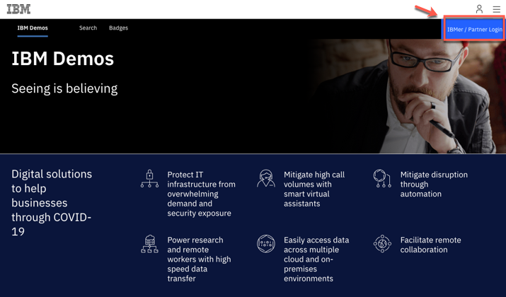
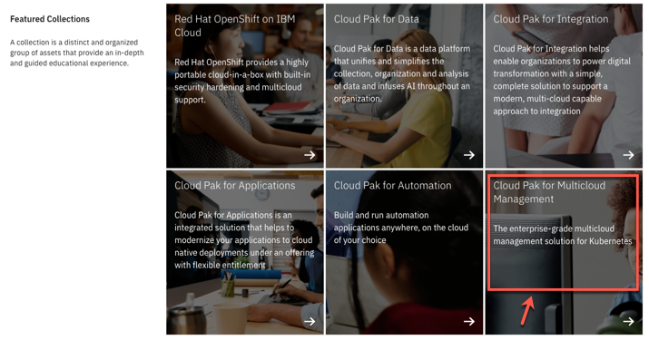
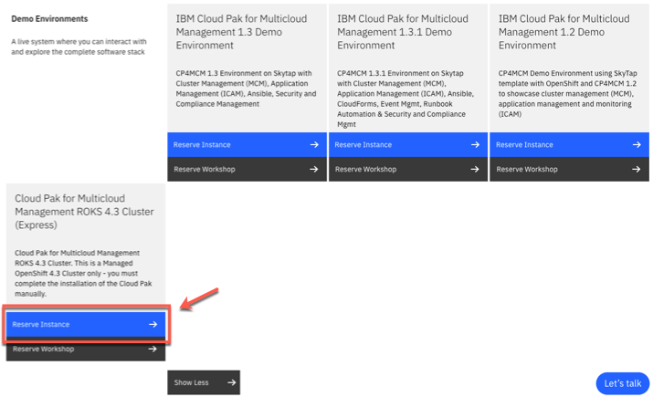
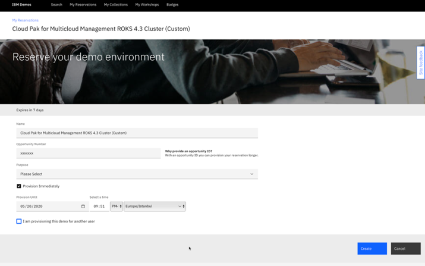
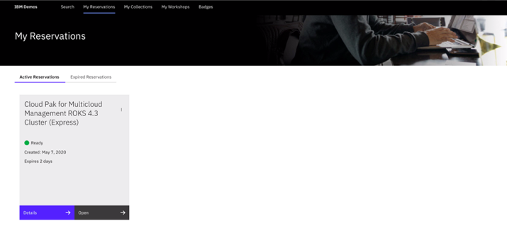
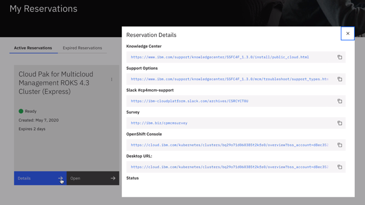

Cloud Pak for Pak_Name ROKS cluster can be provisioned from IBMDemos for demo purposes, self-learning or Proof of Concept projects. If you have not already provisioned a cluster, follow these steps.

1. Log in to [https://www.ibm.com/demos/](https://www.ibm.com/demos/) using your IBM credentials.

   

2. On the IBM Demos page, scroll down to see the Featured Collections section. Then open **Cloud Pak for Pak_Name** collection.

   

3. Now, scroll down to see the Demo Environments section. If necessary, click **Show All**.  On the **Cloud Pak for Pak_Name ROKS 4.3 Cluster (Express)** Demo Environment, click **Reserve Instance**.

   

   Note: If you cannot see the Demo Environment section, make sure you are logged in as shown in Step 1. At this time, only IBMers are able to request ROKS Demo environments.

4. Enter your **Opportunity number, Purpose, Provision duration** and **country/region**. The environment can be provisioned immediately by selecting the checkbox for a duration up to 14 days.

   

5. The reservation status is shown in the next screen if there is an available cluster from the pool for immediate use. Otherwise, an email notification will be sent when the cluster is ready.

   

6. The reservation details can be viewed by selecting Details.

   

   Now you are ready to move to the next step and install Cloud Pak for Pak_Name!
