<Row>

<Column colLg={4} colMd={4} noGutterMdLeft>
<ArticleCard
    color="dark"
    title="CP4MCM Part 1 - Getting Started and Cluster Management"
    href="https://youtu.be/QD6b6kjviZ4"
    author="Demo of IBM Cloud Pak for Multicluster Management covering the Getting Started and Cluster Management capabilities"
    actionIcon="arrowRight"
    >

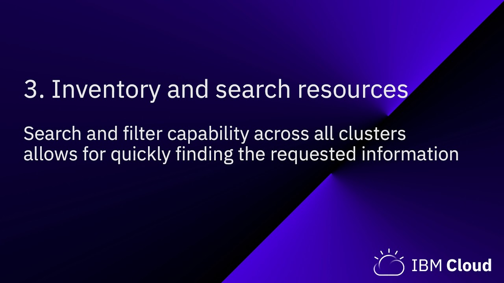

</ArticleCard>
</Column>

<Column colLg={4} colMd={4} noGutterMdLeft>
<ArticleCard
    color="dark"
    title="CP4MCM Part 2 - Application Management"
    href="https://youtu.be/IEX_rTZC99I"
    author="Demo of IBM Cloud Pak for Multicluster Management covering the Application Management and Application monitoring capabilities"
    actionIcon="arrowRight"
    >

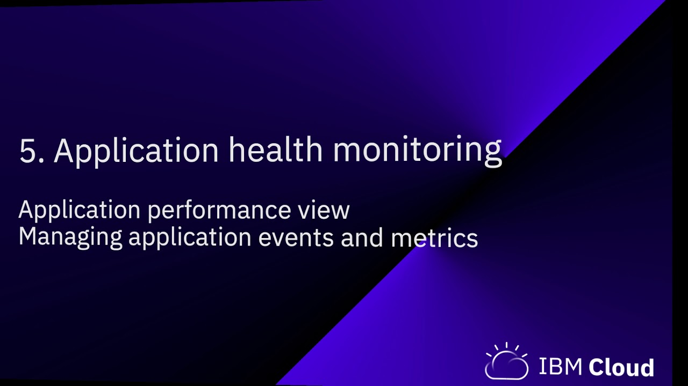

</ArticleCard>

</Column>

<Column colLg={4} colMd={4} noGutterMdLeft>
<ArticleCard
    color="dark"
    title="CP4MCM Part 3 - Governance, Risk and Compliance"
    href="https://youtu.be/o072Bgo2jsM"
    author="In this demo you can see how IBM Cloud Pak for Pak_Name helps you manage governance, risk and compliance across hybrid cloud environments and how you can manage policies as code."
    actionIcon="arrowRight"
    >

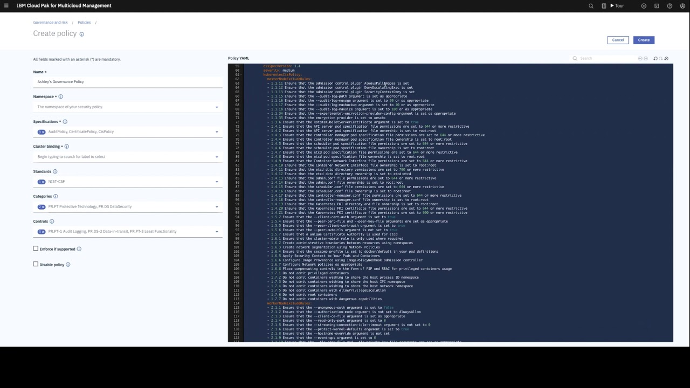

</ArticleCard>
</Column>
</Row>

<Row>

<Column colLg={4} colMd={4} noGutterMdLeft>
<ArticleCard
    color="dark"
    title="CP4MCM - A day in the life of Operations Manager"
    href="https://youtu.be/x7hQAaYU3C4"
    author="Manage, monitor, optimize cost/quality of service for workloads across multiple clouds. Included in this view is Cost & Asset Management, which is currently NOT part of Cloud Pak for Pak_Name but a separate entitlement."
    actionIcon="arrowRight"
    >

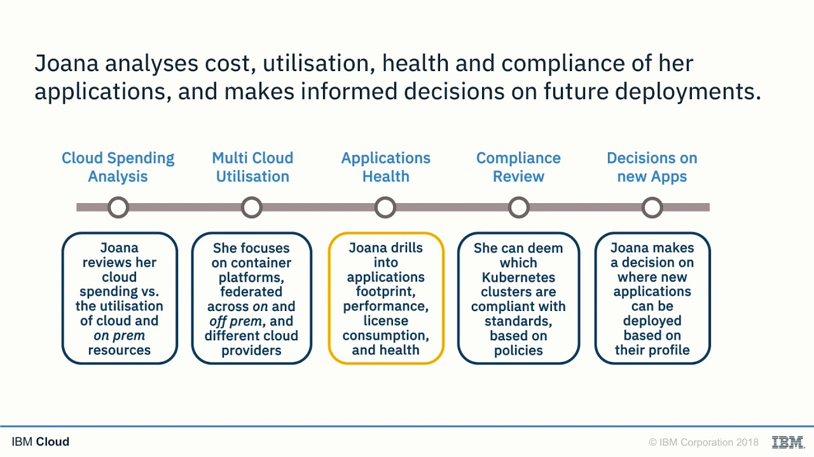

</ArticleCard>
</Column>

<Column colLg={4} colMd={4} noGutterMdLeft>
<ArticleCard
    color="dark"
    title="CP4MCM - A day in the life of Applications Manager"
    href="https://youtu.be/BfcCBV1q83M"
    author="Self service deployment, compliance enforcement and management simplifications of applications across multiple clouds. The Cloud Application Manager shown in this view is currently in tech preview."
    actionIcon="arrowRight"
    >

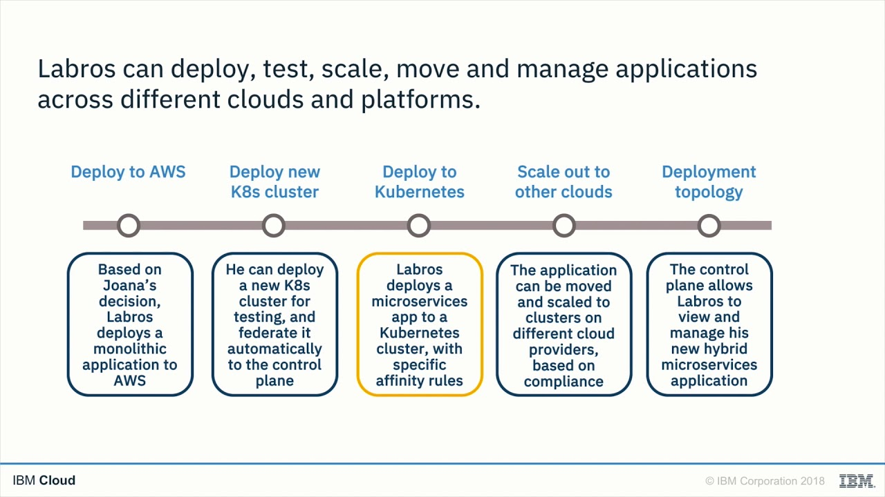

</ArticleCard>

</Column>

<Column colLg={4} colMd={4} noGutterMdLeft>
<ArticleCard
    color="dark"
    title="Using Golden Signals for application monitoring in multicloud environment"
    href="https://youtu.be/z5WLD6vANvw"
    author="This short demonstration of IBM Cloud App Management (part of IBM Cloud Pak for Pak_Name), shows how the golden signals approach helps monitor microservice-based applications deployed in the cloud environment and quickly resolves any availability issues."
    actionIcon="arrowRight"
    >

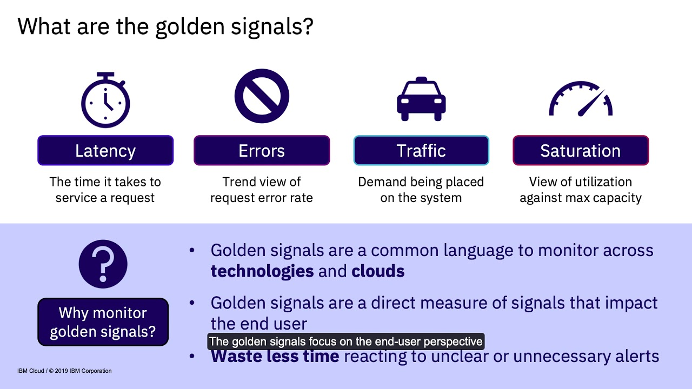

</ArticleCard>
</Column>
</Row>

<Row>

<Column colLg={4} colMd={4} noGutterMdLeft>
<ArticleCard
    color="dark"
    title="Cloud native delivery with CP4A, CP4MCM and IBM DevOps"
    href="https://youtu.be/hfCxvrndqYY"
    author="This demonstration shows how IBM Cloud Pak for Applications, IBM Cloud DevOps and IBM Cloud Pak for Pak_Name work hand-in-hand, delivering the integrated hybrid cloud DevOps solution and provide easy portability of applications across cloud environments."
    actionIcon="arrowRight"
    >

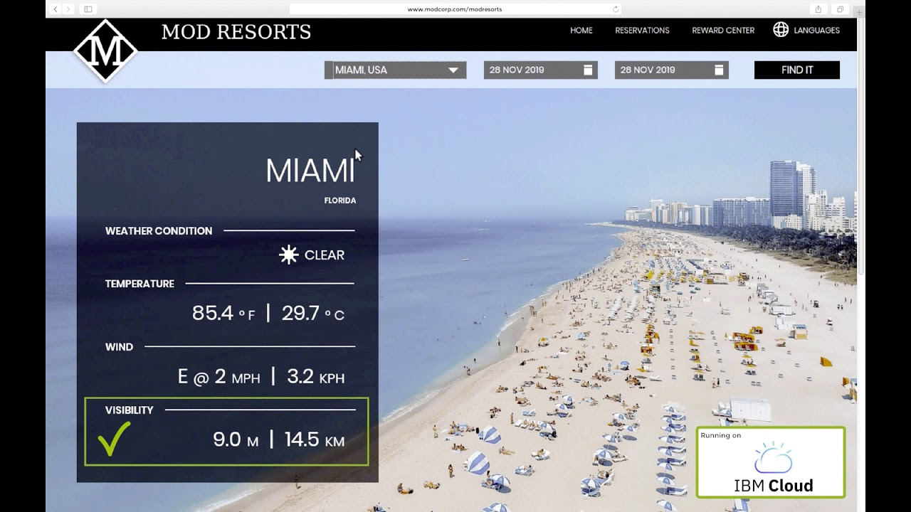

</ArticleCard>
</Column>

<Column colLg={4} colMd={4} noGutterMdLeft>
<ArticleCard
    color="dark"
    title="Partner spotlight: Figuring out developer induced issue with Humio"
    href="https://youtu.be/HceOGMPBHCs"
    author="IBM’s cloud Pak for Pak_Name is a modern management control plane with a single view of “what an app is” and Humio’s integrated application log solution, ensure developers can find logs pointing to problems very quickly and in context with issues."
    actionIcon="arrowRight"
    >

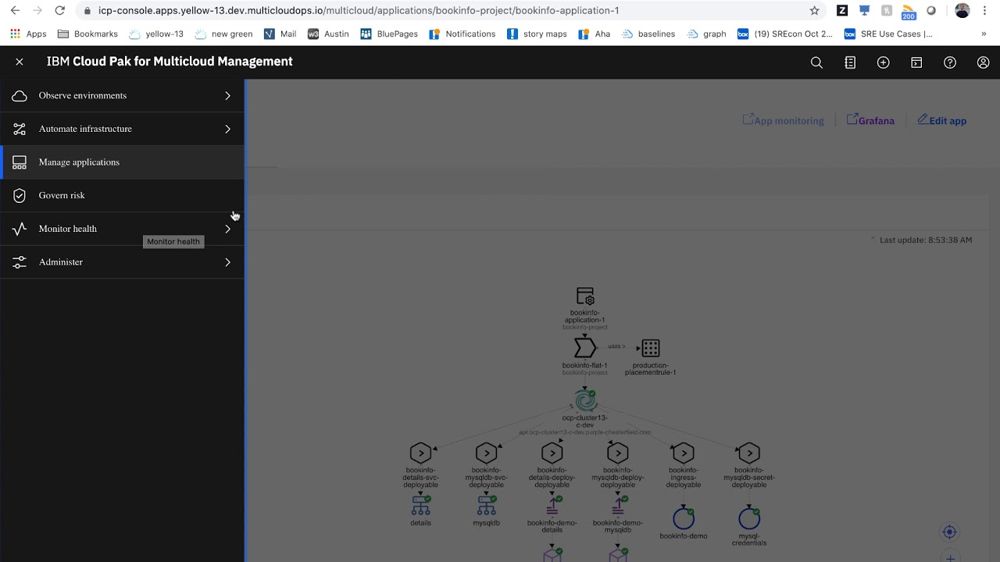

</ArticleCard>

</Column>

<Column colLg={4} colMd={4} noGutterMdLeft>
<ArticleCard
    color="dark"
    title="Partner spotlight: Expiring SSL certificate problem resolution with Humio"
    href="https://youtu.be/if7hZT03Ggk"
    author="Does your company have a bulletproof system for managing SSL certificates? Watch IBM’s Cloud Pak for Pak_Name working with Humio's centralized log management to provide an elegant solution for the SSL certificate expiration problem."
    actionIcon="arrowRight"
    >

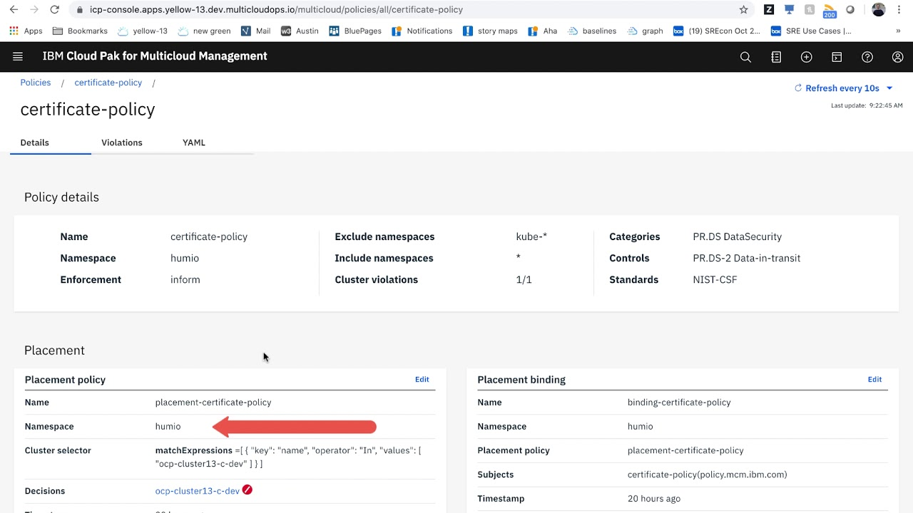

</ArticleCard>
</Column>
</Row>

<Row>

<Column colLg={4} colMd={4} noGutterMdLeft>
<ArticleCard
    color="dark"
    title="Partner spotlight: Extending Security Governance with Sysdig"
    href="https://youtu.be/lIOwvccdYPs"
    author="A consistent, automated approach to securing containerized apps helps you ensure smooth operations and deliver applications faster with less risk. Watch IBM Cloud Pak for Pak_Name enhanced with in-depth container security from Sysdig Secure."
    actionIcon="arrowRight"
    >

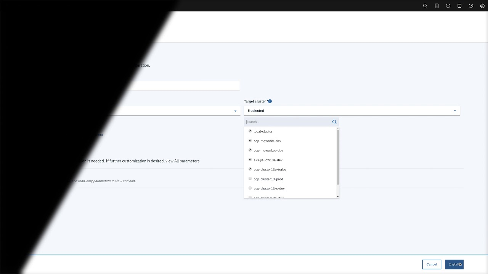

</ArticleCard>
</Column>

<Column colLg={4} colMd={4} noGutterMdLeft>
<ArticleCard
    color="dark"
    title="Partner spotlight: Application-Centric Approach to CP4MCM with Turbonomic"
    href="https://youtu.be/WM-Xg9Nu6rs"
    author="Today, more than ever, applications are the business. See how Turbonomic’s Application Resource Management (ARM) with the IBM Cloud Pak for Pak_Name enables full-stack application management to remove silos and help applications perform."
    actionIcon="arrowRight"
    >

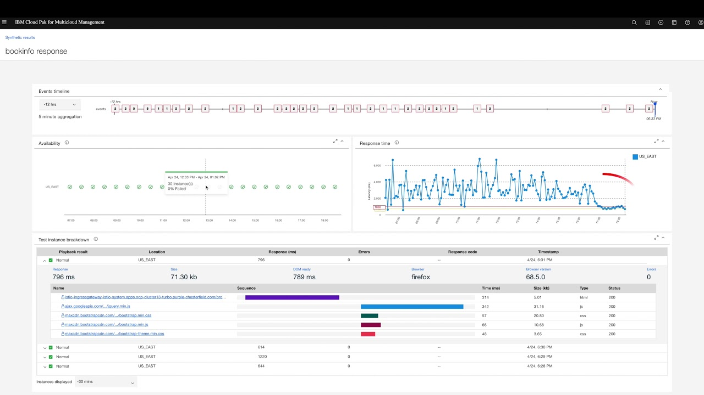

</ArticleCard>

</Column>

</Row>
