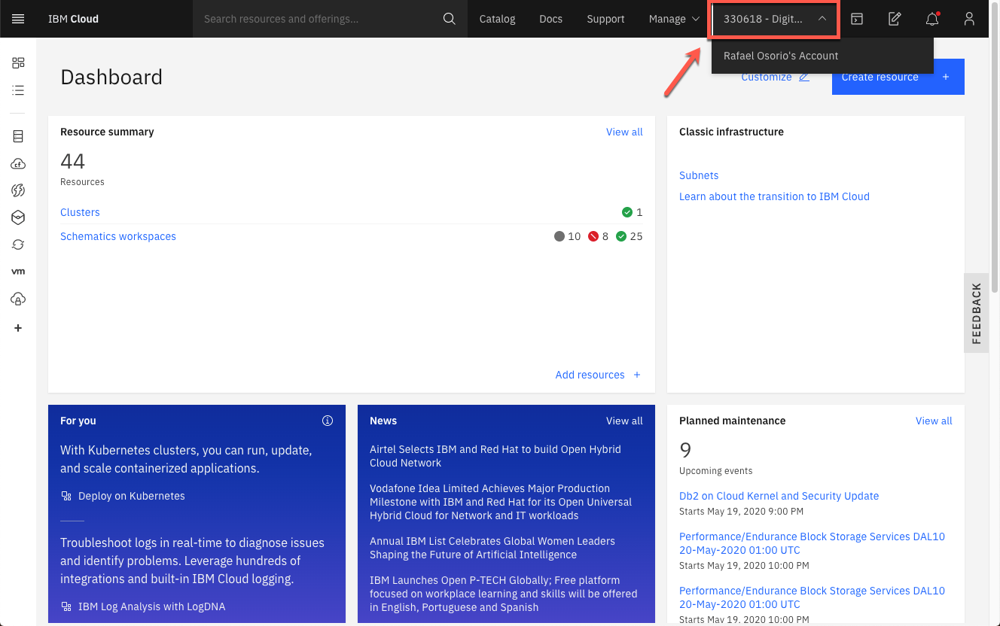
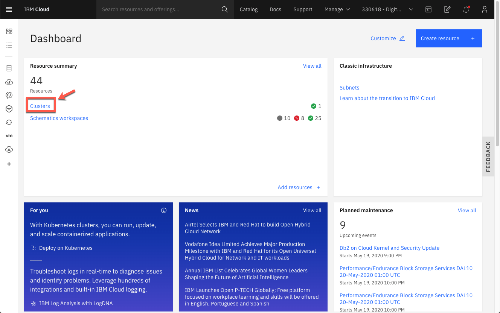
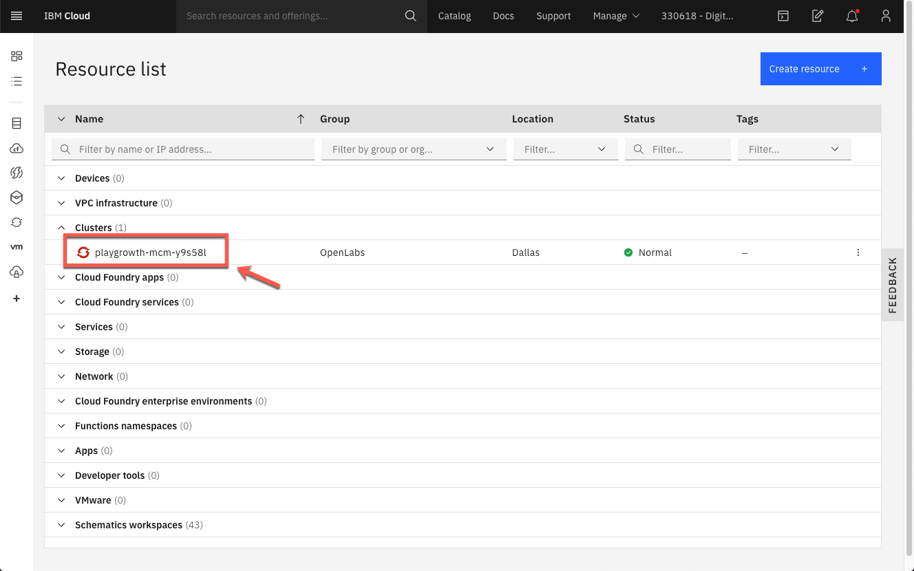
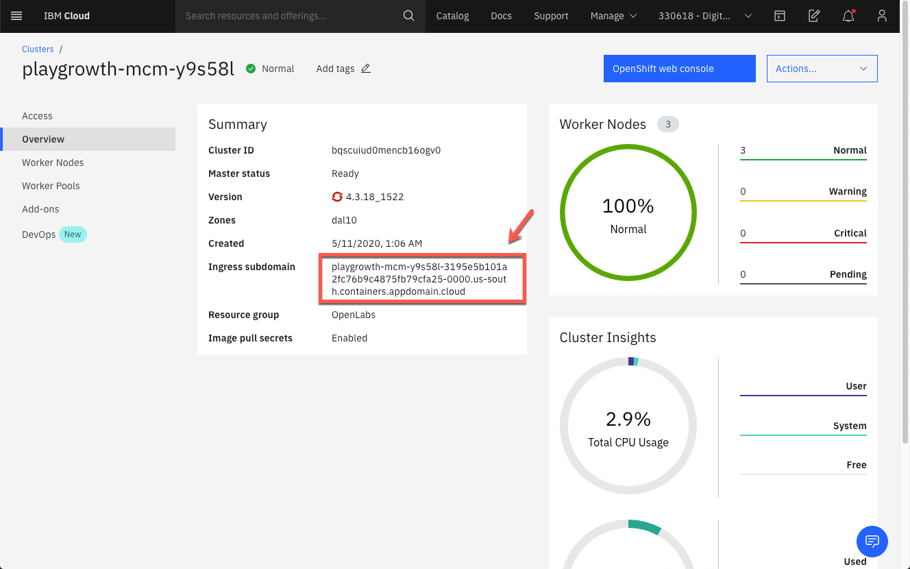
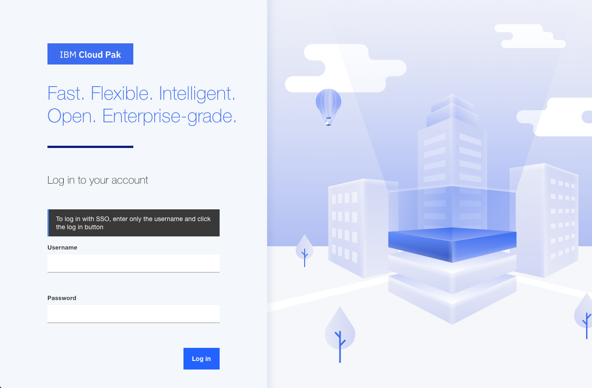

You should have your CP4MCM environment on ROKS requested and installed. If not, please complete the [Request Your Environment](../../environment/overview) steps before start the labs. The following labs are specific for ROKS environment, in [IBM Demos site](https://www.ibm.com/demos/collection/Cloud-Pak-for-Multicloud-Management), you will find a similar version using Skytap (available to use with Customers and Business Partners).

## Accessing your CP4MCM console

If you have just requested your environment and installed your CP4MCM on ROKS, you should be on your CP4MCM Console Page, so you can skip this section.

If not, follow the steps below to access the CP4MCM Console.

1.Log in to [IBM Cloud](http://cloud.ibm.com) using your IBM credentials.

2.First, confirm that you are on Digital Technical Engagement Account, if not click to change it.

  

3.On IBM Cloud Dashboard, click **Clusters** to see your OpenShift Hub Cluster.

  

4.Click the OpenShift Hub cluster to open the cluster view.

  

5.From the Hub Cluster details view, copy the **Ingress subdomain** url.

  

6.Open a new browser tab, and on the URL field, enter **https://icp-console.** and paste the Ingress subdomain url that you copied in the previous step and press **Enter**.

  

7.Log in with your admin and password defined on [Request Your Environment](../../environment/overview) section.

  

8.Great, now you are ready to start your lab! Next section you will learn how to install Command Line Interface tools.

  
