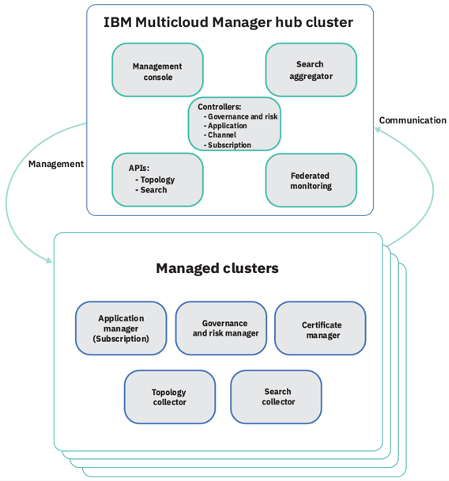
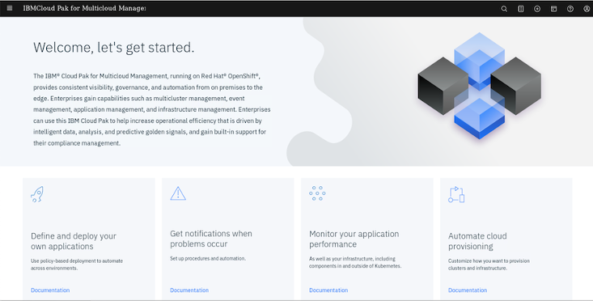
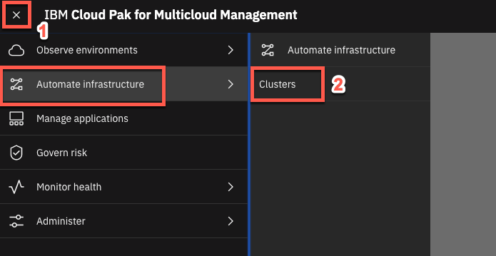
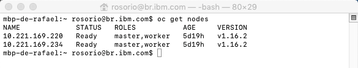

<FeatureCard
  title="Multicluster Management with IBM Cloud Pak for Pak_Name"
  color="dark"
  >


</FeatureCard>


<AnchorLinks>
  <AnchorLink>Lab Overview</AnchorLink>
  <AnchorLink>Prerequisite</AnchorLink>
  <AnchorLink>Business Context</AnchorLink>
  <AnchorLink>Add Managed Clusters</AnchorLink>
  <AnchorLink>Visualize Clusters</AnchorLink>
  <AnchorLink>Deploy an Application</AnchorLink>
  <AnchorLink>Manage Cluster Objects</AnchorLink>
  <AnchorLink>Summary</AnchorLink>
</AnchorLinks>

***

## Lab Overview

IBM Cloud Pak for Pak_Name provides consistent visibility, automation, and governance across a range of multicloud management capabilities such as cost and asset management, infrastructure management, application management, multi-cluster management, edge management, and integration with existing tools and processes. Customers can leverage Cloud Pak for Pak_Name to simplify their IT and application ops management, while increasing flexibility and cost savings with intelligent data analysis driven by predictive signals.

IBM Cloud Pak for Pak_Name can manage Kubernetes clusters that are deployed on any target infrastructure - either in your own data center or in a public cloud.

In this tutorial, you will explore the following key capabilities:
-	`Understand Cloud Pak for Pak_Name`
-	`Learn how to add a managed cluster`
-	`Learn how to deploy an application chart from catalog`
-	`Learn how to manage cluster objects spanning multiple clusters`

***

## Prerequisite

- You need to have your personal CP4MCM on ROKS environment (check [here](../../environment/overview/) how to request it).
- You need to pre-install all necessaries CLI tools (check [here](../installcli/) how to install them).

***

## Business Context

As a member of the Cloud Operation team, you are having problems to manage your multicloud hybrid world. Operate your cloud-based services and data across multiple providers is overwhelming your team.
Your company is deploying multiple Kubernetes clusters to address their specific needs. Some Dev teams are deploying clusters across public and private clouds, and some are deploying clusters across regions, and some are deploying clusters to support the development and test needs.

As different teams deploy more clusters, new challenges are introduced:
-	Where are my services running?
-	How can I monitor applications across clusters and clouds?
-	How can I manage clusters as if they were one environment?
-	How do I monitor usage across clouds?
-	Where are the failed components?
-	How do I deploy applications across these environments?
-	How do I move workloads across environments?
-	How do I set consistent security policies across environments?
-	Which clusters are compliant?
-	How can I place workloads based on capacity, policy?

Because of that, you want to explore how IBM Cloud Pak for Pak_Name, provides consistent visibility, governance and automation of your complex environment.

In this tutorial, you use two Red Hat OpenShift cluster (ROKS) clusters.
-	Hub cluster includes management console, federated monitoring, and all the controllers. In this tutorial, you identify Hub cluster as hub-cluster. Here is the OpenShift cluster.
-	Managed cluster includes klusterlet components that communicate status back to the Hub cluster. In this tutorial, you identify managed cluster as managed-roks.

The relationship between hub and managed clusters is shown in the diagram below:



In this tutorial, you will log in to the Hub cluster to do cluster management.

You will complete the following tasks:
-	Add a managed cluster
-	Visualize cluster topology
-	Visualize clusters and launch to each cluster
-	Deploy an application chart to remote cluster
-	Manage cluster objects

***

## Add Managed Clusters

In this section, you will add two new managed clusters in your Control Panel. As explained before, you will add your OpenShift ROKS Hub cluster and your OpenShift ROKS Managed cluster.

1.To start the lab, you should be in your Cloud Pak for Pak_Name Web Console. If you are not, check [here](../beforestart/) how to open your console page.

  

2.Now, let's explore the Cluster view. Click the hamburger **Menu** (1) and select **Automated Infrastructure -> Clusters** (2).

  

3.Initially, you shouldn't have any cluster registered here. Let's add our first cluster. Click **Add cluster**.

  

4.You can add a cluster by Importing an existing cluster or provisioning a new cluster that uses IBM Cloud Automation Manager. We use the first option. Select **Import an Existing cluster** (1) and click **Select** (2).

  

5.Enter **hub-cluster** for cluster name (1) and **hub-cluster** for namespace (2). You can view the yaml file and change the settings as needed (3). To import an OpenShift cluster no further changes are needed. Click **Generate command** to continue (4).

  

6.A curl command is generated that you will use to add the new cluster. Click **Copy command** button (1) and click **View cluster** (2) to see the new roks-cluster details page. Copy your command in a note, you will use it later.

  

7.Back to the **Terminal** window. You need to set the kubernetes to use the previous created ROKS Hub context.

  To set the the context to use your Hub cluster, run the command below:

```
kubectl config use-context roks-hub-cluster
```

8.Let's test the new context configuration. Run the command below to get the cluster nodes.
```
oc get nodes
```

  

  Great, you are accessing the ROKS cluster. Now you are ready to execute the generated command.

9.**Paste** the generated command that you previously copied in the clipboard.  When you run the command, several Kubernetes objects are created in the multicluster-endpoint namespace.

  

10.You can view the progress by entering the command:

```
oc get pods -n multicluster-endpoint
```

  Make sure all the pods are in the running state.

  

11.The cluster end point is ready when all the Pods are in Running state. Back to the browser window, make sure that the cluster status is **Ready** now (if necessary, refresh the details page).

  

12.On the page navigation breadcrumb, click on **Clusters** link.

  

13.Now you can see your hub-cluster on the clusters list. You can add labels to identify your new cluster. On the hub-cluster row, click on the three dots icon (1) and select **Edit labels** (2).

  

14.Add a new label, **environment** (1), and give a value **Dev** (2). Click **+** (3) and **save** (4) the changes.

  

  Great, your first cluster is ready! Now let's add your ROKS Managed cluster.

15.Click **Add cluster** again.

  

16.Select again **Import an Existing cluster** (1) and click **Select** (2).

  

17.Enter **managed-roks** for cluster name (1) and **managed-roks** for namespace (2). Click **Generate command** to continue (3).

  

18.A curl command is generated that you will use to add the new cluster. Click **Copy command** button (1) and click **View cluster** (2) to see the new iks-cluster details page. Copy the generated command in a note, you will use it later.

  

19.Back to the **Terminal** window. You need to set the kubernetes to use the previous created ROKS Managed context.

  To set the the context to use your ROKS Managed cluster, run the command below:

```
kubectl config use-context roks-managed-cluster
```

20.Let's test the new context configuration. Run the command below to get the cluster nodes.

```
oc get nodes
```

  

  Great, you are accessing the ROKS Managed cluster. Now you are ready to execute the generated command.

21.**Paste** the generated command that you previously copied in the clipboard. When you run the command, several Kubernetes objects are created in the multicluster-endpoint namespace.

  

22.You can view the progress by entering the command:

```
oc get pods -n multicluster-endpoint
```

  Make sure all the pods are in the running state.

  

23.Back to the browser window, make sure that the cluster status is **Ready** now (if necessary, refresh the details page).

  

24.On the page navigation breadcrumb, click on **Clusters** link.

  

25.Now you can see your managed-roks on the clusters list. You can add labels to identify your new cluster. On the managed-roks row, click on the three dots icon (1) and select **Edit labels** (2).

  

26.Add a new label, **environment** (1), and give a value **QA** (2). Click **+** (3) and **save** (4) the changes.

  

  Great, your both clusters are ready and managed by IBM Cloud Pak for Pak_Name. Using this Pak, you are able to manage both cluster from a single pane of glass. Let's check it in the next section.

***

## Visualize Clusters

In this section, you visualize clusters in a tabular view and topology view in your environment with hotlinks to start to each cluster.

1.With IBM Cloud Pak for Pak_Name you are able to manage all your cluster from a single control panel. Open the **Menu** button (1) and click **Observe environments** (2) > **Overview** (3).

  

2.The Overview menu option displays the status of all clusters including the health and resource metrics. The top section shows the operations details across all your cloud providers. In the first section, you can see information about cloud providers, compute resources, applications and infrastructure. Because your both clusters are completely new, you don't have a lot of information here. But in a real production environment here is your starting point to explore your multiple clusters.

  

3.The bottom section shows Resource Overview. Here you can see Cluster Compliance status, Cluster status, CPU, Memory, and Storage Resource View.

  

4.Cluster topology gives a graphical view of clusters and associated networking, applications and polices. Let’s explore the Cluster topology. Open the **Menu** (1) and click on **Observe environments** (2) > **Topology** (3).

  

5.You see a graphical view of your two clusters (hub-cluster and managed-roks). Click on **hub-cluster (Dev)** icon to view more details.

  

6.Here, you can review cluster information in a graphical view.

  

7.Back to the Topology page, open the **Networking** page (1) and select the **hub-cluster** (2). In this area (3), you can have details about the cluster network.

  

8.Now, click on **Applications** (1). By now, you don't have any application here. But it is important to know, that in this area, you will see information about the deployment of an application. Don’t worry about it now, you will explore it later.

  

9.Now, let’s explore a really good feature of Multicloud Management: Visual Web Terminal. On the top right navigator, click on **Visual Web Terminal** button.

  

10.You can use the Visual Web Terminal to run many commands across your environment. When categorized data is returned, such as when you enter a search command, it is returned in an interactive tabular format.

  The Visual Web Terminal is particularly useful when troubleshooting issues that require running multiple commands and navigating the results of the commands in an easy way. Let’s try something simple! Enter the command bellow:

```
oc project multicluster-endpoint
```

```
oc get pods
```

  

  The information that is provided in the Visual Web Terminal is limited by the permissions of the user. When you run a command, only the items that you have permission to view are displayed.

  Next section, you learn how to deploy an application to the local or remote cluster.

***

## Deploy an Application

In this step, you install a helm chart from the catalog to your hub-cluster and your managed-roks cluster. Let's do it!

1.Open the **Menu** (1) and click on **Administer** (2) > **Helm repository** (3).

  

2.On the Helm Repositories page, click **Add Repository** to register a new Helm Repository.

  

3.Type **coc-charts** (1) as repository Name, and enter **https://ibm-icp-coc.github.io/charts/repo/stable** as URL (2). Click **Add** (3).

  

4.After few seconds, you should see Sync Status as **Completed** (1). Now, let’s deploy an application from this new Helm repository. Click **Catalog** (2) on upper right corner of the page to view the list of helm charts that you can deploy.

  

5.Search for **sum** (1) and select **sumapp** (2) application.

  

6.The chart deploys a simple Liberty web application for demonstration purposes. Select **Configure** to continue.

  

7.Enter **mysumapp** as Helm release name (1), select **default** as Target namespace (2). On Target cluster, select the **managed-roks** (3). Then click **Install** (4).

  

8.The installation starts immediately but it takes a few minutes to deploy the application to remote cluster. Click **View Helm Releases** to view the status.

  

9.On the Helm releases page, you can check that **mysumapp** helm is deployed to your clusters.

  

10.Back to your terminal window again. Run the command below to guarantee that you are using the managed-roks cluster context.

```
kubectl config use-context roks-managed-cluster
```

11.From the command line window, check if the new pod is created and it is in Running state. Execute the command below:

```
oc project default
```

```
oc get pods | grep mysumapp
```

  

12.Now, let’s define a route for our web application. First, let’s get the service name created for your application. Execute the command below to capture the Service’s name.

```
oc get services | grep mysumapp
```

  

13.Now that you know the service name (mysumapp-sumapp-service), let’s create a route by exposing our service using the command below:

```
oc expose service mysumapp-sumapp-service
```

14.View your new route:

```
oc get route | grep mysumapp
```

  

  Copy the route of your application.

15.Back to your browser window, open a new tab and navigate to your application route hostname.

  

16.Great! Your Liberty application is available on your managed-roks cluster. In our next lab, you will deploy a business application (ModResorts) using more advanced techniques.

  

  This application is really simple sample, just to show you how easy is to install an application from the catalog in multiple clusters. In our next lab you will deploy a business application (ModResorts) using more advanced techniques about Application Management deployment using channels and subscriptions concepts.

***

## Manage Cluster Objects

You can use the management console to create, manage, view details, and troubleshoot application resources and Kubernetes objects in all clusters from a single interface. The management console search page supports searching for application resources by the component kind for each resource.

1.Back to the IBM Cloud Pak for Pak_Name web page tab, click on the **Search** button.

  

2.The Search menu gives access to application resources and Kubernetes objects. The Search overview screen displays commonly used search templates - a pre-defined template to view workloads, unhealthy pods and workloads created in last hour. You can also create your own search templates. Click on **Created Last Hour** button.

  

3.If you scroll down to the **Pod** section, you should see the **mysumapp-sumapp** pod that you created earlier in the list along with other pods. Click on the pod name.

  

4.From this screen you can open Pod definition, edit the values and view logs. You are able to do this for any objects, in any managed cluster.

  

  Congratulations! You have successfully completed the lab “Multicluster Management with IBM Cloud Pak for Pak_Name”.

***

## Summary

You completed the Cloud Pak for Pak_Name tutorial: Multi-cluster Management. Throughout the tutorial, you explored the key takeaways:
- `Understand Cloud Pak for Pak_Name`;
- `Add a managed cluster`;
- `Deploy an application chart`;
-	`Manage and monitor application resources of local and remote clusters`;

If you would like to learn more about Cloud Pak for Pak_Name, please refer to:
-	<a href="https://www.ibm.com/cloud/cloud-pak-for-management" target="blank">Cloud Pak for Pak_Name home page</a>
- <a href="https://www.ibm.com/demos/collection/Cloud-Pak-for-Multicloud-Management" target="blank">Cloud Pak for Pak_Name Demos </a>
