CLI tools provide the ability to manage applications, containers, infrastructures, services, and other resources. In this section you will install all the necessary CLI tool in your local machine to be able to complete the Labs.


<Accordion>
  <AccordionItem title="Install IBM Cloud Pak CLI (cloudctl)">

1.You should be on your CP4MCM Web Console, if not, check how to access it in [Before Start](../beforestart/) page.

  From the CP4MCM Web Console page, select the **user icon**, then click **Configure client**.

  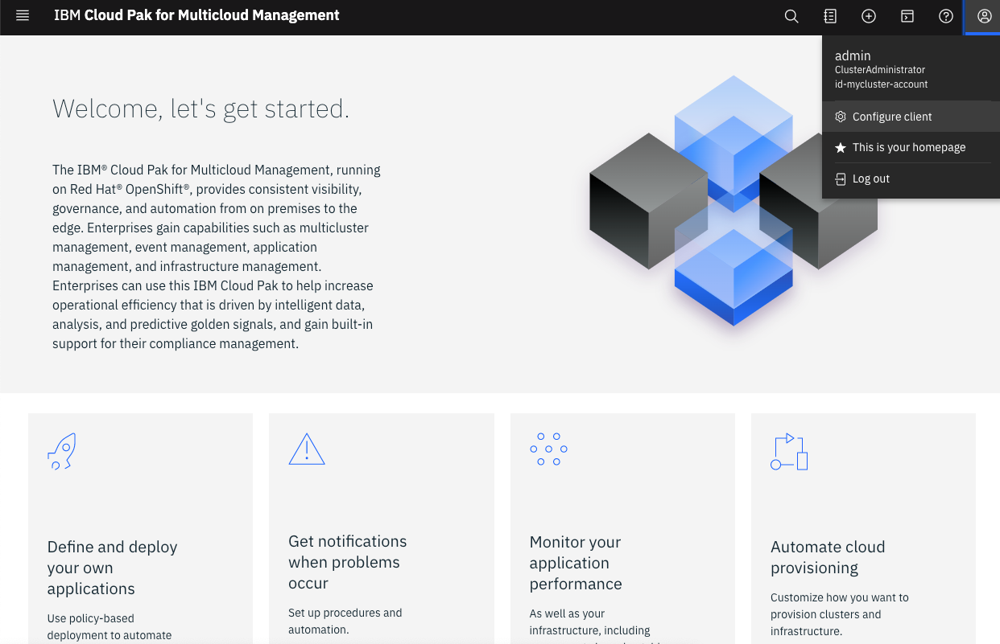

2.Click Install CLI tools.

  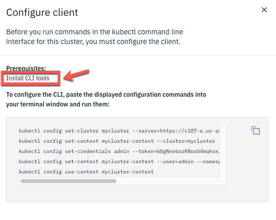

3.Expand Install IBM Cloud Pak CLI (cloudctl). Read the text, then copy and run the curl command for your operating system.

  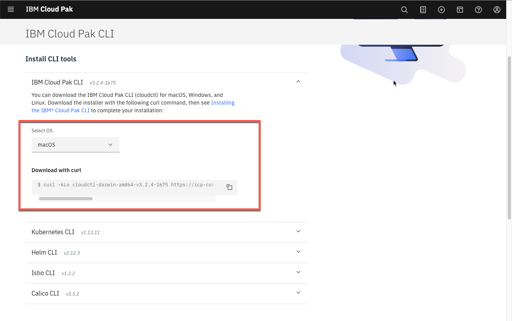

  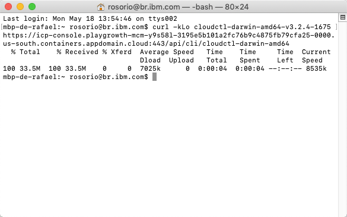

4.After you run the curl command for your operating system, continue to install the IBM Cloud Pak® CLI.

  To install the IBM Cloud Pak® CLI, run the command that matches your client computer operating system, where <path_to_installer> is the path to the directory where you downloaded the cloudctl file, and <install_file> is the downloaded file name.

  For example, for Linux and macOS, run the following commands to change and move the file. Remember that the curl command for your cluster is located in the console:

```
chmod 755 <path_to_installer>/<install_file>
sudo mv <path_to_installer>/<install_file> /usr/local/bin/cloudctl
```

  For Windows, rename the downloaded file to cloudctl and place the file on the PATH environment variable.

  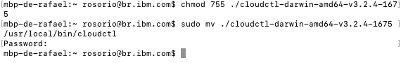

5.Confirm that cloudctl is installed:

```
cloudctl --help
```

  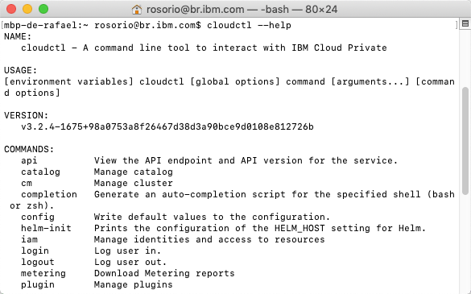

6.Log in to your cluster with the following command:
```
cloudctl login -a <CP4MCM_Console_URL>  --skip-ssl-validation
```

  Where `CP4MCM_Console_URL` is the hostname of your CP4MCM console, something like *https://icp-console.playgroth-mcm...appdomain.cloud*

  After the command, you need to enter your CP4MCM **admin user** (1), your admin **password** (32 charecters password that you defined in the CP4MCM installation) and enter **default** as namespace.

  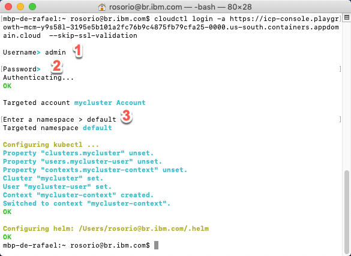

</AccordionItem>

  <AccordionItem title="Install Kubectl CLI">

1.Let's set up the kubectl CLI. Expand Install Kubernetes CLI to download the installer by using a curl command. Copy and run the curl command for your operating system, then continue the installation procedure in the product documentation.

  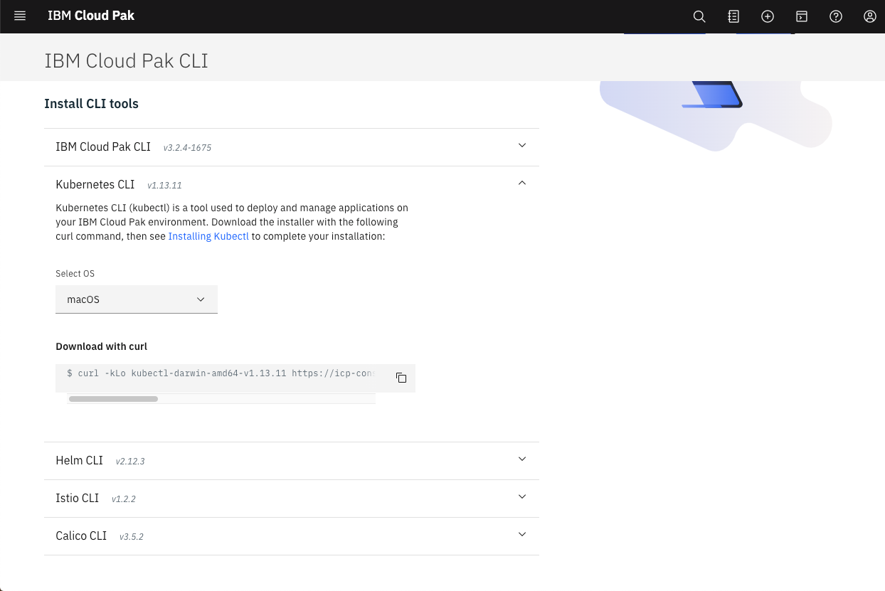

2.Change the file to an executable, then move the file to a directory that is included in your PATH environment variable. See the following commands where <path_to_installer> is the location of the file that you downloaded and <install_file> is the name of the file:

  For Linux and macOS, run the following commands to change the permissions of the file and move the file to a directory that is included in your PATH environment variable:

```
chmod 755 <path_to_installer>/<install_file>
sudo mv <path_to_installer>/<install_file> /usr/local/bin/kubectl
```

  For Windows, rename the downloaded file to kubectl and place the file in a directory that is listed in the PATH environment variable.
</AccordionItem>

<AccordionItem title="Install IBM Cloud CLI">
1.In this tutorial, you install the IBM Cloud CLI along with popular plug-ins and tools so you can work with Kubernete, OpenShift clusters, and more in IBM Cloud.

  You can use the Red Hat OpenShift on IBM Cloud command line interface (CLI) plug-in (ibmcloud oc) to create and manage your OpenShift cluster infrastructure, such as creating clusters and worker nodes. Then, you can use the OpenShift CLI (oc) to manage the resources within your OpenShift cluster, such as projects, pods, and deployments.

  Run the command below to install the IBM Cloud CLI.

```
curl -sL https://ibm.biz/idt-installer | bash
```

  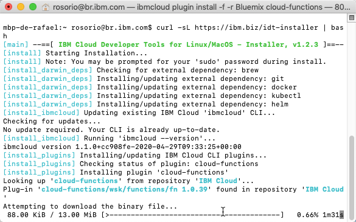

2.To verify that the CLI and Developer Tools were installed successfully, run the help command:

```
ibmcloud dev help
```

  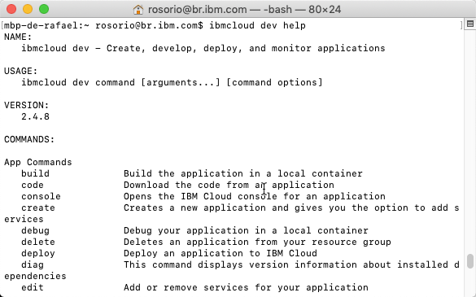

3.Log in to IBM Cloud with your IBMid using the command below to guarantee that you will select your personal account (not DTE account).

```
ibmcloud login -sso -r us-south -g default -c <your_ibm_id>
```

  Follow the URL in the prompt to get the one-time passcode. Copy and paste the passcode value in the CLI as your input.

```
ibmcloud login --sso -r us-south -g default -c <your_ibm_id>
API endpoint: https://cloud.ibm.com

Get One Time Code from https://identity-2.us-south.iam.cloud.ibm.com/identity/passcode to proceed.
Open the URL in the default browser? [Y/n]>
One Time Code >
Authenticating...
OK
```

4.To avoid the SSO extra steps, you can generate an IBM Cloud API Key. Let's do it!  Create an IBM Cloud API Key by running the follow command:

```
ibmcloud iam api-key-create myibmcloudkey --file myic.key
```

5.Let's test the new key. First logout from IBM Cloud.

```
ibmcloud logout
```

6.Now, log in using the command below:

```
ibmcloud login --apikey @myic.key -r us-south -g default -c <your_ibm_id>
```

</AccordionItem>

<AccordionItem title="Install OC CLI">

1.Now open your OpenShift console (there is a link available in email that you received from IBM Cloud, after your Environment Request).

2.On Openshift Console, open the Help menu and select the Command Line Tools link.

  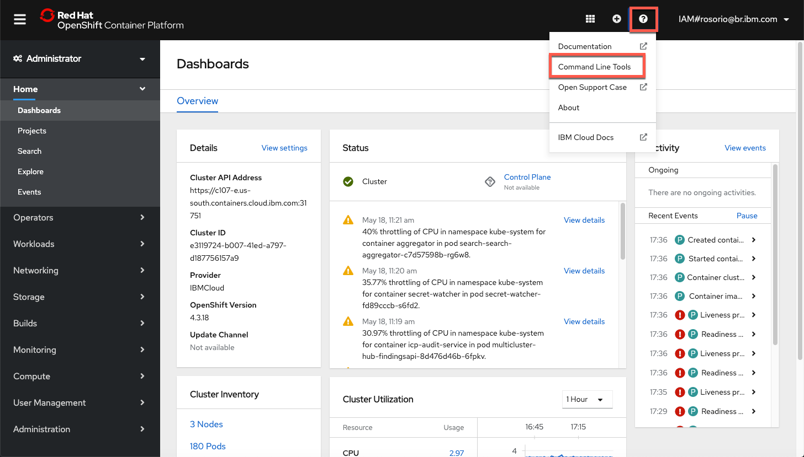

3.On the  OpenShift Command Line Interface section, download the OC CLI specific for your operational system.

  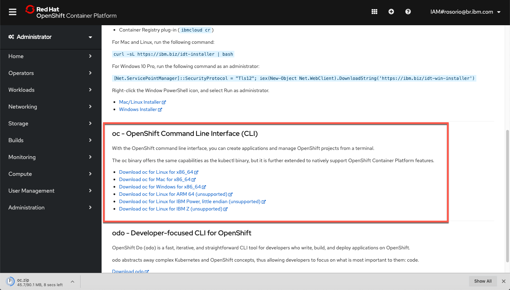

4.If you are using Linux or macOS, run the following commands to change and move the file.

```
chmod 755 <path_to_installer>/<install_file>
sudo mv <path_to_installer>/<install_file> /usr/local/bin/cloudctl
```

5.To verify that the CLI was installed successfully, run the follow command:

```
oc get nodes
```

</AccordionItem>

<AccordionItem title="Install Git CLI">

  You will need Git CLI to clone some YAML files as part of the Application Management Lab. Follow the installation steps described in the page below [Git site](https://git-scm.com/downloads) , based in your operational system.

</AccordionItem>

<AccordionItem title="(Optional) Install MC Plugin on cloudctl">
1.The mc plug-in is not in the IBM Cloud Pak CLI (cloudctl) installation. Complete the following procedure to download and install the plug-in to work with multiple clusters. Download the multicluster, or mc plug-in for the applicable operating system. See the list of the mc plug-in commands for the different operating systems:

```
curl -kLo cloudctl-mc-plugin https://<Cluster_Master_Host>:<Cluster_Master_API Port>/rcm/plugins/mc-darwin-amd64
```

  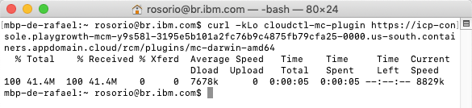

  Note: You can use your CP4MCM Web Console URL on HTTPS as *Cluster Master Host*

2.Install the mc plugin for cloudctl. Run the following command to install the plug-in

```
cloudctl plugin install -f cloudctl-mc-plugin
```

  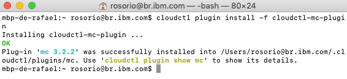

3.Verify that the mc plugin for cloudctl was successfully installed. Run the following command:

```
cloudctl mc -help
```

  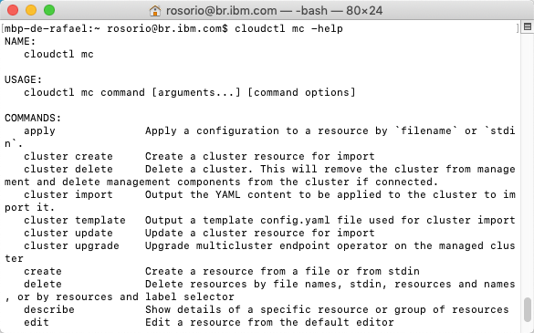

</AccordionItem>


</Accordion>
