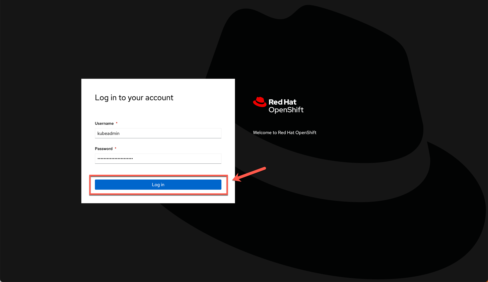
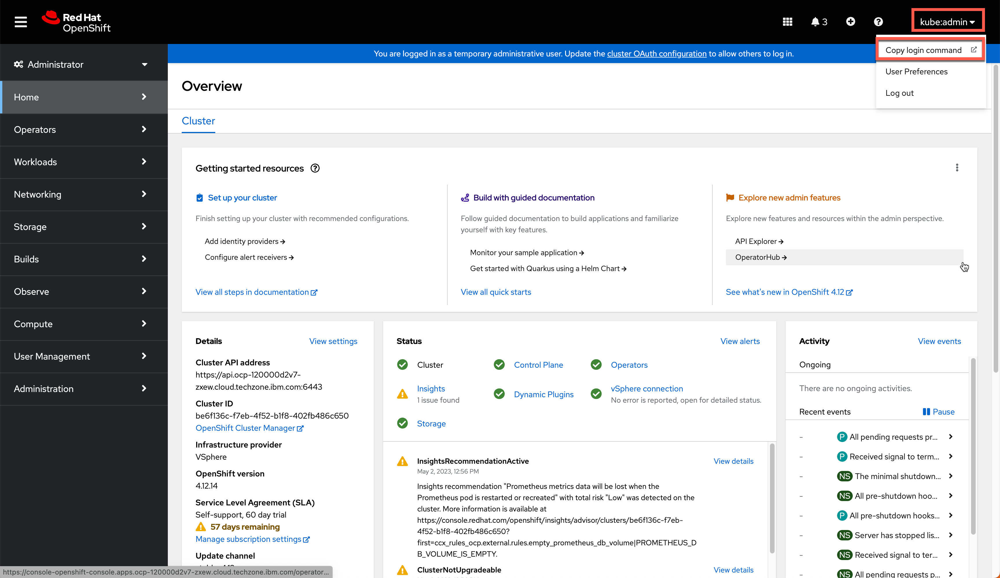
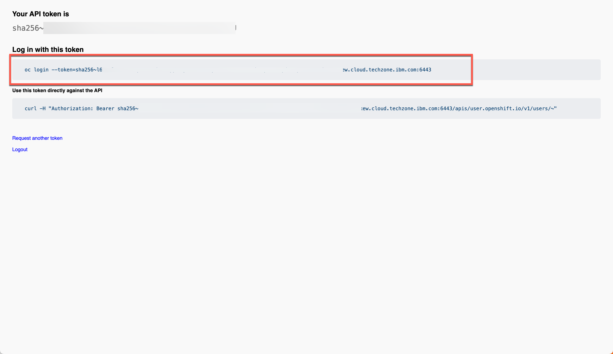
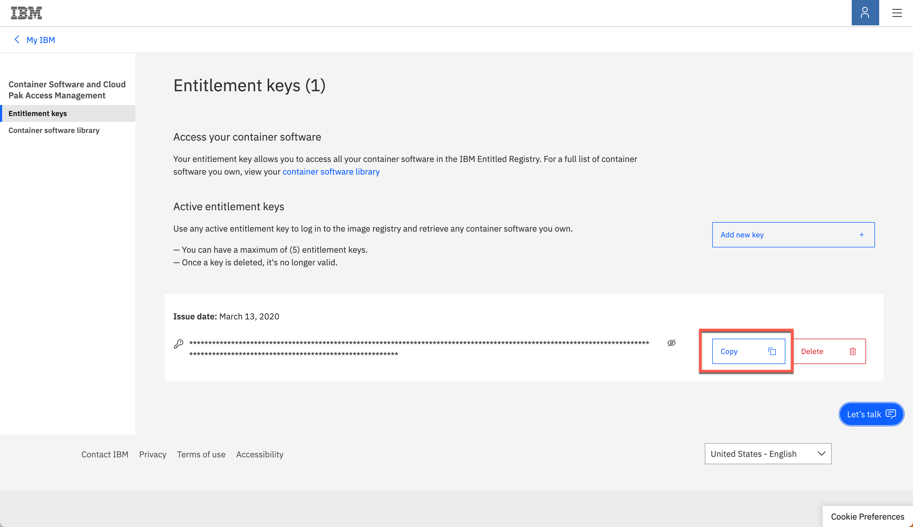

<FeatureCard
  title="Installing IBM API-Led solution using CP4I on IBM Cloud"
  color="dark"
  >


</FeatureCard>

<AnchorLinks>
  <AnchorLink>Lab Overview</AnchorLink>
  <AnchorLink>Prerequisites</AnchorLink>
  <AnchorLink>Installation Overview</AnchorLink>
  <AnchorLink>1 - OpenShift Installation</AnchorLink>
  <AnchorLink>2 – Clone Repositories</AnchorLink>
  <AnchorLink>3 – Set Context</AnchorLink>
  <AnchorLink>4 – Add the Catalog Sources</AnchorLink>
  <AnchorLink>5 – Install the Operators</AnchorLink>
  <AnchorLink>6 – Deploy the Platform UI</AnchorLink>
  <AnchorLink>7 - Deploy Automation Assets</AnchorLink>
  <AnchorLink>8 - Deploy API Connect</AnchorLink>
  <AnchorLink>9 - Deploy App Connect</AnchorLink>
  <AnchorLink>Summary</AnchorLink>
</AnchorLinks>

***

## Lab Overview

A basic knowledge to deliver a CP4I PoC is to know how to install CP4I. Although it is possible to install the Cloud Pak via the OpenShift UI, in this document we will walk you through applying yaml and running scripts from the command line. Having a good understand of interacting with your cluster from the CLI is essential when delivering a PoC.

The first main goal of this session is to provide you the knowledge about how to install CP4I using command line interface from scratch. Here you will use a Openshift environment provided by TechZone team on IBM Cloud (VMware). However, you are welcome to use any supported OpenShift environment.

The second goal is to provide a complete CP4I environment with multiple demo assets to be ready to progress your PoC. This is achieved by reusing a <a href="https://github.ibm.com/joel-gomez/cp4i-demo" target="_blank">multi-style integration demo assets</a>.

In this session you will learn:
  - how to install and configure a basic IBM API-Led solution by deploying CP4I using command line interface from scratch.
  - how to deploy APIC and App Connect instances.

***

## Prerequisites

- You need to have installed in your machine:
  - <a href="https://docs.openshift.com/container-platform/4.8/cli_reference/openshift_cli/getting-started-cli.html" target="_blank">oc CLI</a> v4.6+.
  - github CLI
  - Bash Shell
  - JAVA v8+
  - <a href="https://www.ibm.com/docs/en/api-connect/10.0.x?topic=configuration-installing-toolkit" target="_blank">apic CLI</a>

Note some of the tools will be available after you deploy an instance of the capability you are working on. And you also need an account in the folllowing email service to configure APIC:
  - <a href="https://mailtrap.io/" target="_blank">mailtrap</a>

***

## Installation Overview

A IBM Cloud Pak® for Integration installation consists of a Red Hat® OpenShift® Container Platform cluster with one or more Cloud Pak for Integration operators installed and one or more instances of Platform UI deployed.

In this document, we will follow the steps below to install CP4I. If you need more details about the CP4I Installation process, please check the product documentation <a href="https://www.ibm.com/docs/en/cloud-paks/cp-integration/2022.4?topic=installing-overview-installation" target="_blank">here</a>.

  - 1 - OpenShift Installation
  - 2 – Clone Repositories
  - 3 – Set Context
  - 4 – Add the Catalog Sources
  - 5 – Install the Operators
  - 6 – Deploy the Platform Navigator UI
  - 7 - Deploy Automation Assets
  - 8 - Deploy API Connect
  - 9 - Deploy App Connect

***

## 1 - OpenShift Installation

IBM Cloud Pak for Integration brings together IBM’s market-leading middleware capabilities to support a broad range of integration styles and use cases. With powerful deployment, lifecycle management, and production services running on Red Hat OpenShift, it enables clients to leverage the latest agile integration practices, simplify the management of their integration architecture, and reduce cost. Cloud Pak for Integration demands an OpenShift cluster.

Follow the steps below to provision a Red Hat OpenShift Container Platform cluster on VMware on IBM Cloud.

1. To request an OpenShift Cluster on VMware on IBM Cloud, go <a href="https://techzone.ibm.com/my/reservations/create/63dba359cc19150018af084f" target="_blank">here</a> and complete the form with the follow details.

| Field  | Value |
| ------------- | ------------- |
| Purpose  | If you are doing the L4 course, select **Practice/Self Enablement**. <br/> If you are delivering a PoC, select:**Proof-of-Concept** and inform the Sales opportunity.  |
| Purpose Description  | If you are doing the L4 course, enter: **API-Led Integration L4 Course**. <br/> If you are delivering a POC, enter the PoC details.  |
| Preferred Geography  | You are welcome to select the preferred Geography |


| Field  | Value |
| ------------- | ------------- |
| OpenShift Version | 4.12 |
| OCS/ODF Size  | 500 GiB |
| Worker Node Count  | 5 |
| Worker Node Flavor  | 16 vCPU x 64 GB - 100 GB ephemeral storage |


2. Click **Submit**.


3. You will receive a confirmation email confirming the instance is provisioning.


4. You will receive a second email once the environment is provisioned. You should expect this to take between 30 and 120 minutes. This email contains information, such as URLs, allowing you to connect to the instance.


5. Copy your **Cluster Admin Username** (1) and **Cluster Admin Password** (2). Open the **OCP Console link** (3).


6. Log in with the **Cluster Admin Username** and **Password** copied in the previous step.


7. Great, you are almost ready for the lab. Last but not least important, let’s copy login command to access the cluster by CLI. On the top right, click your **username** and select **Copy login command**.


8. Click **Display Token**.


9. Copy the **Log in with this token** command and **paste** on a terminal window.


  That is it! Now you are ready for the lab. Take a breath and enjoy your lab!

***

## 2 - Clone Repositories

To use this guide you will need to clone the <a href="https://github.ibm.com/joel-gomez/cp4i-demo" target="_blank">CP4I end to end demo repo</a> to your workstation. Let's do it now!


1. Open a terminal window and **run** the command below.

```
git clone https://github.ibm.com/joel-gomez/cp4i-demo.git
```

2. Open the **cp4i-demo** folder.
```
cd cp4i-demo
```

***

## 3 - Set Context

Based on where you have deployed your OCP cluster you will need to set up some environment variables to inform the installation script about your environment. Let's do it here!

1. First, you need to define an environment variable to use the proper storage classes when deploying the instances. The two option available at the moment are ROKS and ODF. In this lab, you are using ODF.
```
export OCP_TYPE=ODF
```

2. To select which version you want to deploy set up the correspponding environment variable. The options available are the latest LTS and CD versions. In this lab, let's use **2022.4** version.
```
export CP4I_VER=2022.4
```

3. By default tracing will be enabled when possible to show this functionality. For clarify, when you are deploying CP4I v2022.2 tracing means Operations Dashboard, and when using v2022.4 it is Instana. In any case, if your demo does not require this option you can disable it setting the environment variable CP4I_TRACING to false, with it you are simplifying the deployment process. In this lab, you will disable tracing. Check the <a href="https://github.ibm.com/joel-gomez/cp4i-demo" target="_blank">CP4I end to end demo repo</a> for more information if you want/need to enable the tracing.
```
export CP4I_TRACING=NO
```

  Operations Dashboard provides integration tracing across instances to allow troubleshooting and investigating errors and latency issues across integration capabilities to ensure applications meet service level agreements.

4. Before you start you can check you have the tools used by this repo running the following script:
```
scripts/00a-cp4i-prereq-vaidation.sh
```

5. We will start installing the overall prerequisites that will help to demonstrate the integration with OCP.
   IBM Cloud Pak for Integration supports both Red Hat OpenShift cluster logging and user-defined logging solutions. For running pods, you can use the logs that are available in the OpenShift console. To make logging data persistent, you need to install a logging solution for your cluster. To do so, run the following command to install the logging functionality. The script will track the progress and it will send you an email to your *mailtrap* inbox when the operators and logging instance are ready or in case any problem is detected, for that you need to set the environment variables with your *mailtrap* account as shown below.
```
export MAILTRAP_USER=<my-mailtrap-user>
export MAILTRAP_PWD=<my-mailtrap-pwd>
scripts/00b-logging-install.sh
```

6. To confirm the installation completed successfully after receiving the email you can run the following commands:
```
oc get csv -n openshift-logging
oc get pods -n openshift-logging
```

You should receive a response like this for each command respectively.
```
NAME                            DISPLAY                            VERSION   REPLACES   PHASE
cluster-logging.v5.6.1          Red Hat OpenShift Logging          5.6.1                Succeeded
elasticsearch-operator.v5.6.1   OpenShift Elasticsearch Operator   5.6.1                Succeeded
```

```
NAME                                            READY   STATUS      RESTARTS   AGE
cluster-logging-operator-756b4c48cc-lhkzs       1/1     Running     0          6m41s
collector-njm62                                 2/2     Running     0          5m36s
collector-nxpmd                                 2/2     Running     0          5m36s
collector-xjl96                                 2/2     Running     0          5m36s
collector-xsv6b                                 2/2     Running     0          5m36s
collector-z9k9l                                 2/2     Running     0          5m36s
elasticsearch-cdm-dxgp4gmf-1-577dc997c-sk7kg    2/2     Running     0          5m36s
elasticsearch-cdm-dxgp4gmf-2-5f5d564466-cgk6x   2/2     Running     0          5m35s
elasticsearch-cdm-dxgp4gmf-3-8695d6658c-lxblf   2/2     Running     0          5m33s
elasticsearch-im-app-27947625-m6qd9             0/1     Completed   0          2m58s
elasticsearch-im-audit-27947625-ht4jj           0/1     Completed   0          2m58s
elasticsearch-im-infra-27947625-r9j8c           0/1     Completed   0          2m58s
kibana-746f699cc-72qfk                          2/2     Running     0          5m34s
```

7. Your cluster will also need access to pull the container software required to deploy the Cloud Pak. Your Entitlement Key is used to grant access. You can download you entitlement key from <a href="https://myibm.ibm.com/products-services/containerlibrary" target="_blank">My IBM</a>. Click **Copy**.


8.The IBM Entitled Registry contains software images for the capabilities in IBM Cloud Pak® for Integration. To allow the Cloud Pak for Integration operators to automatically pull those software images, you must first obtain your entitlement key, then add your entitlement key in a pull secret.
  Now, you will need a namespace called *tools* where you will deploy the different capabilities. You can create the namespace the way you want or you can use the following script which also creates the secret for the *ibm entitlement key*. Replace the *my-key* with your **IBM entitlement key**, run this from the root of the GitHub repo you cloned:
```
export ENT_KEY=<my-key>
scripts/02a-cp4i-ns-key-config.sh
```


***

## 4 – Add the Catalog Sources

First, let's begin our installation by making the IBM Cloud Pak for Integration operators available to the cluster. Because our cluster has direct access to the internet, we will complete this task by addding the online catalog sources to our cluster.

1. Run the following command:
```
oc apply -f catalog-sources/${CP4I_VER}/00-cp4i-catalog-sources.yaml
```

2. Validate the catalog sources have been added successfully using the following command:
```
oc get catalogsources -n openshift-marketplace
```

3. You should have a response like this:
```
NAME                                           DISPLAY                                                  TYPE   PUBLISHER   AGE
appconnect-operator-catalogsource              ibm-appconnect-5.0.1                                     grpc   IBM         21m
aspera-operators                               ibm-aspera-hsts-operator-1.5.2                           grpc   IBM         21m
certified-operators                            Certified Operators                                      grpc   Red Hat     76m
cloud-native-postgresql-catalog                ibm-cloud-native-postgresql-4.0.9                        grpc   IBM         21m
community-operators                            Community Operators                                      grpc   Red Hat     76m
ibm-apiconnect-catalog                         ibm-apiconnect-4.0.1                                     grpc   IBM         21m
ibm-cloud-databases-redis-operator-catalog     ibm-cloud-databases-redis-1.5.3                          grpc   IBM         21m
ibm-datapower-operator-catalog                 ibm-datapower-operator-1.6.4-linux-amd64                 grpc   IBM         21m
ibm-eventstreams-catalog                       ibm-eventstreams-1.6.6                                   grpc   IBM         21m
ibm-integration-asset-repository-catalog       ibm-integration-asset-repository-1.5.2-linux-amd64       grpc   IBM         21m
ibm-integration-operations-dashboard-catalog   ibm-integration-operations-dashboard-2.6.3-linux-amd64   grpc   IBM         21m
ibm-integration-platform-navigator-catalog     ibm-integration-platform-navigator-1.7.3                 grpc   IBM         21m
ibmmq-operator-catalogsource                   ibm-mq-2.0.4                                             grpc   IBM         21m
opencloud-operators                            ibm-cp-common-services-1.15.5                            grpc   IBM         21m
redhat-marketplace                             Red Hat Marketplace                                      grpc   Red Hat     76m
redhat-operators                               Red Hat Operators                                        grpc   Red Hat     76m
```

***

## 5 - Install the Operators

Red Hat OpenShift Operators automate the creation, configuration, and management of instances of Kubernetes-native applications. Operators provide automation at every level of the stack—from managing the parts that make up the platform all the way to applications that are provided as a managed service.

Red Hat OpenShift uses the power of Operators to run the entire platform in an autonomous fashion while exposing configuration natively through Kubernetes objects, allowing for quick installation and frequent, robust updates. In addition to the automation advantages of Operators for managing the platform, Red Hat OpenShift makes it easier to find, install, and manage Operators running on your clusters.

You can easily check all the Operators installed in your OpenShift environment, by opening the Operator Hub page in the OpenShift Web Console.

1. Once you confirm the catalog sources are available you can proceed to install the CP4I operators running the following script.
```
scripts/02b-cp4i-apply-subscriptions.sh
```

2. Once you get the email or if you want to check manually run the following command:
```
oc get csv -n openshift-operators
```

3. And you should get the following response with all the operators listed:
```
NAME                                          DISPLAY                                                                                        VERSION   REPLACES                                      PHASE
datapower-operator.v1.6.4                     IBM DataPower Gateway                                                                          1.6.4     datapower-operator.v1.6.3                     Succeeded
ibm-apiconnect.v3.0.0                         IBM API Connect                                                                                3.0.0                                                   Succeeded
ibm-appconnect.v5.0.1                         IBM App Connect                                                                                5.0.1     ibm-appconnect.v5.0.0                         Succeeded
ibm-aspera-hsts-operator.v1.5.2               IBM Aspera HSTS                                                                                1.5.2     ibm-aspera-hsts-operator.v1.5.1               Succeeded
ibm-cloud-databases-redis.v1.5.3              IBM Operator for Redis                                                                         1.5.3     ibm-cloud-databases-redis.v1.5.2              Succeeded
ibm-common-service-operator.v3.19.5           IBM Cloud Pak foundational services                                                            3.19.5    ibm-common-service-operator.v3.19.4           Succeeded
ibm-eventstreams.v3.0.5                       IBM Event Streams                                                                              3.0.5     ibm-eventstreams.v3.0.4                       Succeeded
ibm-integration-asset-repository.v1.5.2       IBM Automation Foundation assets (previously IBM Cloud Pak for Integration Asset Repository)   1.5.2                                                   Succeeded
ibm-integration-operations-dashboard.v2.6.3   IBM Cloud Pak for Integration Operations Dashboard                                             2.6.3     ibm-integration-operations-dashboard.v2.6.2   Succeeded
ibm-integration-platform-navigator.v6.0.3     IBM Cloud Pak for Integration                                                                  6.0.3     ibm-integration-platform-navigator.v6.0.2     Succeeded
ibm-mq.v2.0.4                                 IBM MQ                                                                                         2.0.4     ibm-mq.v2.0.3                                 Succeeded
```

***

## 6 – Deploy the Platform UI

In this section, you will install the Platform Navigator UI. The Platform UI is a user interface for the IBM Cloud Pak for Integration that allows the user to deploy and manage instances of the integration capabilities from a central location.

1. The first service you will create is the Platform UI instance. You can use the following script:
```
scripts/03a-platform-navigator-inst-deploy.sh
```

  Note that this step will also install the required common services, so it can take up to one hour to get the Platform UI ready.

2. If you want to check the progress manually you can run the following command:
```
oc get platformnavigator -n tools
```

3. Once you receive the email or you get the following response from the previous command you can move to the next step:
```
NAME             REPLICAS   VERSION      READY   LASTUPDATE   AGE
cp4i-navigator   3          2022.2.1-3   True    33s          43m
```

4. The rest of the activities are executed from the cli but if you want to access the Platform UI to track the progress you can use the following script to get the URL and credentials.
```
scripts/03b-cp4i-access-info.sh
```

  In this lab, you are using the cp4i-access-info script to capture this information. But there are multiple ways to find the Platform Navigator URL. Below are some examples, but you can get more details in the <a href="https://www.ibm.com/docs/en/cloud-paks/cp-integration/2022.4?topic=ui-deploying-platform-using-openshift-console">Product documentation page</a>.
    - On the IBM Cloud Pak for Integration operator page in the Installed Operator view in the OpenShift Web Console.
    - Checking the Platform UI route on the Networking > Routes view on OpenShift Web Console.
    - Using the "oc get consolelink" command and filter by "IBM CLoud Pak for Integration" to get the list of Platform UI URLs available.

***

## 7 - Deploy Automation Assets

In this section, you will install the Automation foundation assets(Automaation Assets). It is a capability that lets you store, manage, and share integration assets.

Automation assets enables teams to share and reuse integration assets across capability instances. For example, you can import an OpenAPI specification asset within the IBM API Connect user interface.

Assets can be located in remote repositories, such as Git. This feature allows users to take advantage of the versioning capability offered by the remote repository. Assets that are stored in a remote repository are read-only.

1. Let's deploy an instance of the Automation Assets using the following script:
```
scripts/05-asset-repo-inst-deploy.sh
```

2. Once the instance is deployed you will get an email. To confirm Automation Asset has been installed successfully you can use the following command:
```
oc get assetrepository -n tools
```

3. Once it has been installed successfully you will see the following response for the command and you can proceed to the next step.
```
NAME            PHASE   VERSION      AGE
asset-repo-ai   Ready   2022.2.1-2   21m
```

***

## 8 - Deploy API Connect

1. Start executing the following script.
```
scripts/07d-apic-inst-deploy-instana.sh
```

2. Confirm the APIC was successfully deploy running the following command:
```
oc get apic -n tools
```

***

## 9 - Deploy App Connect

1. Now you will deploy App Connect Integration Servers, the Dashboard and the Designer Authoring tools alongside with a Switch Server to talk about the callable flow functionality as part of the Services layer. Let's deploy them! Run the following scripts:

```
scripts/09a-ace-dashboard-inst-deploy.sh
scripts/09b-ace-switch-server-inst-deploy.sh
scripts/09c-ace-designer-inst-deploy.sh
```

2. After few minutes you will receive the corresponding email, or you can run the following commands manually to confirm the deployments succeded:
```
oc get dashboard -n tools
oc get switchserver -n tools
oc get designerauthoring -n tools
```

3. You will get responses like these showing a Ready status for each instance:

```
NAME            RESOLVEDVERSION   REPLICAS   CUSTOMIMAGES   STATUS   URL                                                                                                                                                                      AGE
ace-dashboard   12.0.6.0-r1-lts   1          false          Ready    https://cpd-tools.itzroks-270007kcnp-k0rbj2-6ccd7f378ae819553d37d5f2ee142bd6-0000.us-east.containers.appdomain.cloud/integration/run/integrations/tools/ace-dashboard/   13m
```

```
NAME                RESOLVEDVERSION   CUSTOMIMAGES   STATUS   AGENTCONFIGURATIONNAME     AGE
ace-switch-server   12.0.6.0-r1-lts   false          Ready    ace-switch-server-agentx   98s
```

```
NAME              RESOLVEDVERSION   URL                                                                                                                                                                           CUSTOMIMAGES   STATUS   AGE
ace-designer-ai   12.0.6.0-r1-lts   https://cpd-tools.itzroks-270007kcnp-k0rbj2-6ccd7f378ae819553d37d5f2ee142bd6-0000.us-east.containers.appdomain.cloud/integration/design/integrations/tools/ace-designer-ai/   false          Ready    6m9s
```

4. To check all the Integration instances installed in your environment, on the Platform UI, open the top left menu and select **Administration > Integration Instances**.

***

## Summary

You have successfully completed this lab. In this lab you learned:
  - how to install and configure a basic IBM API-Led solution by deploying CP4I using command line interface from scratch.
  - how to deploy APIC and App Connect instances.

So far we have focused on the "runtime" aspect of the API-Led deployment, but to provide a full demo experience, check <a href="https://www.ibm.com/docs/en/cloud-paks/cp-integration/2022.4?topic=capabilities-deploying-cloud-pak-integration-demos" target="_blank">here</a> how to install the Car Crash Repair Demo.

In the <a href="https://yourlearning.ibm.com/activity/PLAN-0878B26C1617" target="_blank">Cloud Pak for Integration Level 3 course</a>, you can learn how to demo the IBM API-Led technology.
