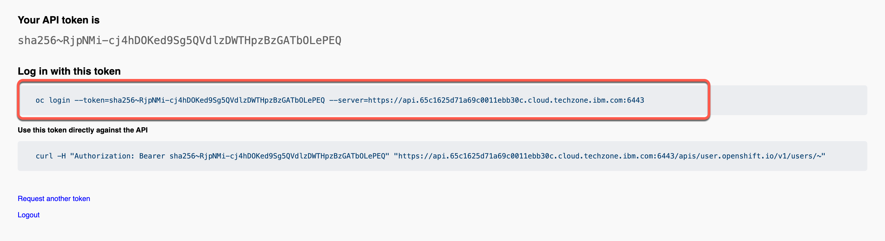

<FeatureCard
  title="Installing IBM API-Led solution using CP4I on IBM TechZone"
  color="dark"
  >


</FeatureCard>

<AnchorLinks>
  <AnchorLink>Lab Overview</AnchorLink>
  <AnchorLink>Prerequisites</AnchorLink>
  <AnchorLink>Installation Overview</AnchorLink>
  <AnchorLink>1 - Deploying the OCP cluster</AnchorLink>
  <AnchorLink>2 - Accessing the OCP cluster</AnchorLink>
  <AnchorLink>3 - Cloning Repositories</AnchorLink>
  <AnchorLink>4 - Setting Context</AnchorLink>
  <AnchorLink>5 - Installing Foundational Services</AnchorLink>
  <AnchorLink>6 – Deploying the Platform UI</AnchorLink>
  <AnchorLink>7 - Deploying Automation Assets</AnchorLink>
  <AnchorLink>8 - Deploying API Connect</AnchorLink>
  <AnchorLink>9 - Deploying App Connect</AnchorLink>
  <AnchorLink>Summary</AnchorLink>
</AnchorLinks>

***

## Lab Overview

A basic knowledge to deliver a CP4I PoC is to know how to install CP4I. Although it is possible to install the Cloud Pak via the OpenShift UI, in this document we will walk you through applying yaml and running scripts from the command line. Having a good understand of interacting with your cluster from the CLI is essential when delivering a PoC.

The main goal of this session is to provide you the knowledge about how to install CP4I using command line interface from scratch. Here you will use a Openshift environment provided by TechZone team on IBM Cloud (VMware). However, you are welcome to use any supported OpenShift environment.

In this session you will learn:
  - how to install and configure a basic IBM API-Led solution by deploying CP4I using command line interface from scratch.
  - how to deploy APIC and App Connect instances.

***

## Prerequisites

- You need to have installed in your machine:
  - <a href="https://docs.openshift.com/container-platform/4.8/cli_reference/openshift_cli/getting-started-cli.html" target="_blank">oc CLI</a> v4.6+.
  - github CLI
  - Bash Shell
  - JAVA v8+
  - <a href="https://www.ibm.com/docs/en/api-connect/10.0.x?topic=configuration-installing-toolkit" target="_blank">apic CLI</a>

Note some of the tools will be available after you deploy an instance of the capability you are working on. And you also need an account in the folllowing email service to configure APIC:
  - <a href="https://mailtrap.io/" target="_blank">mailtrap</a>

***

## Installation Overview

A IBM Cloud Pak® for Integration installation consists of a Red Hat® OpenShift® Container Platform cluster with one or more Cloud Pak for Integration operators installed and one or more instances of Platform UI deployed.

In this document, we will follow the steps below to install CP4I. If you need more details about the CP4I Installation process, please check the product documentation <a href="https://www.ibm.com/docs/en/cloud-paks/cp-integration/2022.4?topic=installing-overview-installation" target="_blank">here</a>.

  - 1 - Deploying the OCP cluster
  - 2 - Accessing the OCP cluster
  - 3 - Cloning Repositories
  - 4 - Setting Context
  - 5 - Installing Foundational Services
  - 6 – Deploying the Platform UI
  - 7 - Deploying Automation Assets
  - 8 - Deploying API Connect
  - 9 - Deploying App Connect

***

## 1 - Deploying the OCP cluster

IBM Cloud Pak for Integration brings together IBM’s market-leading middleware capabilities to support a broad range of integration styles and use cases. With powerful deployment, lifecycle management, and production services running on Red Hat OpenShift, it enables clients to leverage the latest agile integration practices, simplify the management of their integration architecture, and reduce cost. Cloud Pak for Integration demands an OpenShift cluster.

Follow the steps below to provision a Red Hat OpenShift Container Platform cluster on VMware on IBM Cloud.

1.1 To request an OpenShift Cluster on VMware on IBM Cloud, go <a href="https://techzone.ibm.com/my/reservations/create/63a3a25a3a4689001740dbb3" target="_blank">here</a> and complete the form with the follow details.

| Field  | Value |
| ------------- | ------------- |
| Purpose  | If you are doing the L4 course, select **Practice/Self Enablement**. <br/> If you are delivering a PoC, select:**Proof-of-Technology** and inform the Sales opportunity.  |
| Purpose Description  | If you are doing the L3 course, enter: **MQ L3 Course**. <br/> If you are delivering a POC, enter the PoC details.  |
| Preferred Geography  | You are welcome to select the preferred Geography |


| Field  | Value |
| ------------- | ------------- |
| OpenShift Version | 4.16 |
| Storage  | ODF - 2 TB |
| Worker Node Count  | 5 |
| Worker Node Flavor  | 16 vCPU x 64 GB - 100 GB ephemeral storage |


1.2 **Agree** with the TechZone Terms and Conditions (A) and click **Submit** (B).


1.3 You will receive an email confirming the instance is provisioning.


1.4 You will receive a second email once the environment is provisioned. You should expect this to take between 30 and 120 minutes. Now the status update changed to **Ready**.  Click on **Reservation ID** to open the details page of your new reservation environment.


1.5 Copy your **Cluster Admin Username** (A) and **Cluster Admin Password** (B). Copy the **OCP Console link** (C).


That is it! Now you are ready for the lab. Take a breath and enjoy your lab!

***

## 2 - Accessing the OCP cluster

In this section, you access your OpenShift cluster and install the OpenShift command line tool.

3.1 In a web browser, open the OCP Console link and paste the **Cluster Admin Username** (A) and **Password** (B) copied in the previous step and click **Log in** (C).


3.2 Great, you are almost ready for the demo. Last but not least important, let’s copy login command to access the cluster by CLI. On the top right, click your **username** (A) and select **Copy login command** (B).


3.3 Click **Display Token**.


3.4 Copy the **Log in with this token command** and **paste** on a terminal window.



***

## 3 - Cloning Repositories

To use this guide you will need to clone the <a href="https://github.ibm.com/joel-gomez/cp4i-demo" target="_blank">CP4I end to end demo repo</a> to your workstation. Let's do it now!


3.1. Open a terminal window and run the command below. It is recommended you do so in a directory like `/Desktop` so that you can easily locate the files afterwards.
* First, authenticate your Terminal with the IBM GitHub repository with the following command:

```
gh auth login --hostname github.ibm.com
```

* Within the Terminal window, navigate through the following prompts:
    - a. What is your preferred protocol for Git operations on this host? : `HTTPS`
    - b. Authenticate Git with your GitHub credentials? : `Yes`
    - c. How would you like to authenticate GitHub CLI? : `Login with a web browser`
    - d. Terminal will generate a one-time code : `copy this to a notepad`
    - e. Within your web browser, log in using your GitHub credentials
    - f. Supply the one-time code and approve access to GitHub
    - g. Wait until the Terminal window reports back a successful `Logged in as...`

3.2 Execute the following within Terminal to clone the demo repository:
```
gh repo clone github.ibm.com/joel-gomez/cp4i-demo
```

3.3 Open the **cp4i-demo** folder.
```
cd cp4i-demo
```

***

## 4 - Setting Context

Based on where you have deployed your OCP cluster you will need to set up some environment variables to inform the installation script about your environment. Let's do it here!

4.1 Define an environment variable to set the CP4I version.
```
export CP4I_VER=16.1.0
```

4.2 Set the OCP type based on the storage classes in the cluster. If using a ROKS cluster, use export `OCP_TYPE=ROKS` instead.
```
export OCP_TYPE=ODF
```

4.3 Set mailtrap credentials, substituting `<my-mailtrap-user>` and `<my-mailtrap-pwd>`.
```
export MAILTRAP_USER=<my-mailtrap-user>
export MAILTRAP_PWD=<my-mailtrap-pwd>
```

4.4 If you have provisioned the OCP cluster in Tech Zone you can use the following script to set the proper default storage class.
```
scripts/99-odf-tkz-set-scs.sh
```

4.5 Your cluster will also need access to pull the container software required to deploy the Cloud Pak. Your Entitlement Key is used to grant access. You can download you entitlement key from <a href="https://myibm.ibm.com/products-services/containerlibrary" target="_blank">My IBM</a>. Click **Copy**.


<InlineNotification kind="warning">If no active entitlement keys are available, you can create one by clicking the **Add new key** button. If you receive an "Operation could not be completed at this time", try clicking the button a second or third time until one is generated.</InlineNotification>


4.6 The IBM Entitled Registry contains software images for the capabilities in IBM Cloud Pak® for Integration. To allow the Cloud Pak for Integration operators to automatically pull those software images, you must first obtain your entitlement key, then add your entitlement key in a pull secret.  Replace the *my-key* with your **IBM entitlement key**.
```
export ENT_KEY=<my-key>
```


4.7 Now, you need a namespace where you will deploy the different capabilities.
```
scripts/02a-cp4i-ns-key-config.sh
```


***


## 5 - Installing Foundational Services

Red Hat OpenShift Operators automate the creation, configuration, and management of instances of Kubernetes-native applications. Operators provide automation at every level of the stack—from managing the parts that make up the platform all the way to applications that are provided as a managed service.

Red Hat OpenShift uses the power of Operators to run the entire platform in an autonomous fashion while exposing configuration natively through Kubernetes objects, allowing for quick installation and frequent, robust updates. In addition to the automation advantages of Operators for managing the platform, Red Hat OpenShift makes it easier to find, install, and manage Operators running on your clusters.

You can easily check all the Operators installed in your OpenShift environment, by opening the Operator Hub page in the OpenShift Web Console.

The IBM Cloud Pak foundational services operator is no longer installed automatically. Install this operator manually if you need to create an instance that uses identity and access management (IAM). The following steps will walk you through this process.

5.1 First we need to have a certificate manager, otherwise,  the IBM Cloud Pak foundational services operator installation will not complete. Let's do it!

<InlineNotification kind="info-square">Time to install: ~1 minute.</InlineNotification>

```
oc apply -f resources/00-cert-manager-namespace.yaml
oc apply -f resources/00-cert-manager-operatorgroup.yaml
oc apply -f resources/00-cert-manager-subscription.yaml
```

Confirm the subscription has been completed successfully before moving to the next step running the following command.
```
SUB_NAME=$(oc get deployment cert-manager-operator-controller-manager -n cert-manager-operator --ignore-not-found -o jsonpath='{.metadata.labels.olm\.owner}');if [ ! -z "$SUB_NAME" ]; then oc get csv/$SUB_NAME -n cert-manager-operator --ignore-not-found -o jsonpath='{.status.phase}';fi;echo
```

Wait for a response of `Succeeded`.
<InlineNotification kind="warning">If no response is generated, wait a couple of minutes and try again. Do not proceed until receiving the *Succeeded* prompt.</InlineNotification>


5.2 Install the Postgress SQL Catalog Source.

<InlineNotification kind="info-square">Time to install: ~1 minute.</InlineNotification>

```
oc apply -f catalog-sources/${CP4I_VER}/01-postgress-sql-catalog-source.yaml
```

Confirm the catalog source has been deployed successfully before moving to the next step running the following command.
```
oc get pods -n openshift-marketplace | grep postgresql
```

Wait for a response of `READY`.

<InlineNotification kind="warning">You may be seeing a response of *TRANSIENT_FAILURE* which indicates the deployment is underway but not yet complete. Wait until the *READY* response is received before continuing.</InlineNotification>

5.3 Install the Common Services Catalog source.

<InlineNotification kind="info-square">Time to install: ~1 minute.</InlineNotification>

```
oc apply -f catalog-sources/${CP4I_VER}/02-common-services-catalog-source.yaml
```

Confirm the catalog source has been deployed successfully before moving to the next step running the following command.
```
oc get catalogsources opencloud-operators -n openshift-marketplace -o jsonpath='{.status.connectionState.lastObservedState}';echo
```

Wait for a response of `READY`.

5.4 Create the Common Services namespace.
```
oc new-project ibm-common-services
```

5.5 Install the Foundational Services operator (former Common Services).

<InlineNotification kind="info-square">Time to install: ~1 minute.</InlineNotification>

```
oc apply -f subscriptions/${CP4I_VER}/00-common-service-subscription.yaml
```

Confirm the operator has been deployed successfully before moving to the next step running the following command.
```
SUB_NAME=$(oc get deployment/ibm-common-service-operator -n openshift-operators --ignore-not-found -o jsonpath='{.metadata.labels.olm\.owner}');if [ ! -z "$SUB_NAME" ]; then oc get csv/$SUB_NAME --ignore-not-found -o jsonpath='{.status.phase}';fi;echo
```

Wait for a response of `Succeeded`.

***

## 6 – Deploying the Platform UI

In this section, you will install the Platform Navigator UI. The Platform UI is a user interface for the IBM Cloud Pak for Integration that allows the user to deploy and manage instances of the integration capabilities from a central location.

Deploying the Platform UI allows you to deploy and manage instances from a central location.

7.1 First, let's install Platform UI Catalog source.

<InlineNotification kind="info-square">Time to install: ~1 minute.</InlineNotification>

```
oc apply -f catalog-sources/${CP4I_VER}/03-platform-navigator-catalog-source.yaml
```

Confirm the catalog source has been deployed successfully before moving to the next step running the following command.
```
oc get catalogsources ibm-integration-platform-navigator-catalog -n openshift-marketplace -o jsonpath='{.status.connectionState.lastObservedState}';echo
```

Wait for a response of `READY`.


7.2 Install the Platform UI Operator.

<InlineNotification kind="info-square">Time to install: ~1 minute.</InlineNotification>

```
oc apply -f subscriptions/${CP4I_VER}/01-platform-navigator-subscription.yaml
```

Confirm the operator has been deployed successfully before moving to the next step running the following command.
```
SUB_NAME=$(oc get deployment ibm-integration-platform-navigator-operator -n openshift-operators --ignore-not-found -o jsonpath='{.metadata.labels.olm\.owner}');if [ ! -z "$SUB_NAME" ]; then oc get csv/$SUB_NAME --ignore-not-found -o jsonpath='{.status.phase}';fi;echo
```

Wait for a response of `Succeeded`.

7.3 Deploy a Platform UI instance.

<InlineNotification kind="info-square">Time to install: ~10 minutes.</InlineNotification>

```
oc apply -f instances/${CP4I_VER}/common/01-platform-navigator-instance.yaml
```

Confirm the instance has been deployed successfully before moving to the next step running the following command.
```
oc get platformnavigator cp4i-navigator -n tools -o jsonpath='{.status.conditions[0].type}';echo
```

Wait for a response of `READY`.

<InlineNotification kind="warning">You may be seeing a response of `PENDING` which indicates the deployment is underway but not yet complete. Wait until the `READY` response is received before continuing.</InlineNotification>


7.4 Once the Platform UI instance is up and running get the access info.
```
scripts/03b-cp4i-access-info.sh
```

7.5 Open the Platform UI  URL and log in. Note the password is temporary and you will be required to change it. Take note of your new password, you will use it multiple times.


Record the credentials to a notepad for reference later.

7.6 Open the Platform UI URL with a web browser and log in. Note the password is temporary and you will be required to change it. Take note of your new password, as you will use it multiple times throughout the lab.


In this lab, you are using the cp4i-access-info script to capture this information. But there are multiple ways to find the Platform Navigator URL. Below are some examples, but you can get more details in the <a href="https://www.ibm.com/docs/en/cloud-paks/cp-integration/2022.4?topic=ui-deploying-platform-using-openshift-console">Product documentation page</a>.
  - On the IBM Cloud Pak for Integration operator page in the Installed Operator view in the OpenShift Web Console.
  - Checking the Platform UI route on the Networking > Routes view on OpenShift Web Console.
  - Using the "oc get consolelink" command and filter by "IBM CLoud Pak for Integration" to get the list of Platform UI URLs available.

***

## 7 - Deploying Automation Assets

In this section, you will install the Automation foundation assets(Automation Assets). It is a capability that lets you store, manage, and share integration assets.

Automation assets enables teams to share and reuse integration assets across capability instances. For example, you can import an OpenAPI specification asset within the IBM API Connect user interface.

Assets can be located in remote repositories, such as Git. This feature allows users to take advantage of the versioning capability offered by the remote repository. Assets that are stored in a remote repository are read-only.

7.1 Let's deploy an instance of the Automation Assets using the following script:
```
oc apply -f catalog-sources/${CP4I_VER}/04-asset-repo-catalog-source.yaml
```

Confirm the catalog source has been deployed successfully before moving to the next step running the following command.
```
oc get catalogsources ibm-integration-asset-repository-catalog -n openshift-marketplace -o jsonpath='{.status.connectionState.lastObservedState}';echo
```

Wait for a response of `READY`.

7.2 Install Asset Repo Operator.
```
oc apply -f subscriptions/${CP4I_VER}/02-asset-repo-subscription.yaml
```

Confirm the operator has been deployed successfully before moving to the next step running the following command.
```
SUB_NAME=$(oc get deployment ibm-integration-asset-repository-operator -n openshift-operators --ignore-not-found -o jsonpath='{.metadata.labels.olm\.owner}');if [ ! -z "$SUB_NAME" ]; then oc get csv/$SUB_NAME --ignore-not-found -o jsonpath='{.status.phase}';fi;echo
```

Wait for a response of `Succeeded`.

7.3 Deploy an Asset Repo instance
```
oc apply -f instances/${CP4I_VER}/${OCP_TYPE}/02-asset-repo-ai-instance.yaml
```

Confirm the instance has been deployed successfully before moving to the next step running the following command.
```
oc get assetrepository asset-repo-ai -n tools -o jsonpath='{.status.phase}';echo
```

Wait for a response of `Ready`.


***

## 8 - Deploying API Connect

8.1 Install DataPower Catalog Source
```
oc apply -f catalog-sources/${CP4I_VER}/05-datapower-catalog-source.yaml
```

Confirm the catalog source has been deployed successfully before moving to the next step running the following command.
```
oc get catalogsources ibm-datapower-operator-catalog -n openshift-marketplace -o jsonpath='{.status.connectionState.lastObservedState}';echo
```

Wait for a response of `READY`.

8.2 Install DataPower Operator.
```
oc apply -f subscriptions/${CP4I_VER}/03-datapower-subscription.yaml
```

Confirm the operator has been deployed successfully before moving to the next step running the following command.
```
SUB_NAME=$(oc get deployment datapower-operator -n openshift-operators --ignore-not-found -o jsonpath='{.metadata.labels.olm\.owner}');if [ ! -z "$SUB_NAME" ]; then oc get csv/$SUB_NAME --ignore-not-found -o jsonpath='{.status.phase}';fi;echo
```

Wait for a response of `Succeeded`.

8.3 Install APIC Catalog Source.
```
oc apply -f catalog-sources/${CP4I_VER}/07-api-connect-catalog-source.yaml
```

Confirm the catalog source has been deployed successfully before moving to the next step running the following command.
```
oc get catalogsources ibm-apiconnect-catalog -n openshift-marketplace -o jsonpath='{.status.connectionState.lastObservedState}';echo
```

Wait for a response of `READY`.

8.4 Install APIC Operator
```
oc apply -f subscriptions/${CP4I_VER}/04-api-connect-subscription.yaml
```

Confirm the operator has been deployed successfully before moving to the next step running the following command.
```
SUB_NAME=$(oc get deployment ibm-apiconnect -n openshift-operators --ignore-not-found -o jsonpath='{.metadata.labels.olm\.owner}');if [ ! -z "$SUB_NAME" ]; then oc get csv/$SUB_NAME --ignore-not-found -o jsonpath='{.status.phase}';fi;echo
```

You should get responses of `Succeeded` for both of them.

8.5 Deploy APIC instance with some extra features enabled.

<InlineNotification kind="info-square">Time to install: ~30 minutes.</InlineNotification>

```
scripts/07d-apic-inst-deploy-instana.sh
```

Confirm the installation completed successfully before moving to the next step running the following commands.
```
oc get APIConnectCluster apim-demo -n tools -o jsonpath='{.status.phase}';echo
```

Note this will take almost 30 minutes, so be patient, and at the end you should get a `Ready` response.

8.6 Configure the email server in APIC.
```
scripts/07f-apic-initial-config.sh
```

8.7 Create a Provider Organization for admin user.
```
scripts/07g-apic-new-porg-cs.sh
```

## 9 - Deploying App Connect

9.1 Install the App Connect Catalog source.
```
oc apply -f catalog-sources/${CP4I_VER}/10-app-connect-catalog-source.yaml
```

Confirm the catalog source has been deployed successfully before moving to the next step running the following command.
```
oc get catalogsources appconnect-operator-catalogsource -n openshift-marketplace -o jsonpath='{.status.connectionState.lastObservedState}';echo
```

Wait for a response of `READY`.

9.2 Install the App Connect operator.
```
oc apply -f subscriptions/${CP4I_VER}/07-app-connect-subscription.yaml
```

Confirm the operator has been deployed successfully before moving to the next step running the following command.
```
SUB_NAME=$(oc get deployment ibm-appconnect-operator -n openshift-operators --ignore-not-found -o jsonpath='{.metadata.labels.olm\.owner}');if [ ! -z "$SUB_NAME" ]; then oc get csv/$SUB_NAME --ignore-not-found -o jsonpath='{.status.phase}';fi;echo
```

Wait for a response of `Succeeded`.

9.3 It is time to Deploy the Dashboard instance.
```
oc apply -f instances/${CP4I_VER}/${OCP_TYPE}/06-ace-dashboard-instance.yaml
```

Confirm the instance has been deployed successfully before moving to the next step running the following command.
```
oc get dashboard ace-dashboard -n tools -o jsonpath='{.status.phase}';echo
```

Note this will take few minutes, but at the end you should get a response of `Ready`.


9.4 Deploy Designer Authoring instance with support for Callable Flow. First let's deploy the Switch Server instance.
```
oc apply -f instances/${CP4I_VER}/common/07-ace-switch-server-instance.yaml
```

Confirm the instance has been deployed successfully before moving to the next step running the following command.
```
oc get switchserver ace-switch-server -n tools -o jsonpath='{.status.phase}';echo
```

Wait for a response of `Ready`.

9.5 Deploy Designer Authoring instance.
```
oc apply -f instances/${CP4I_VER}/${OCP_TYPE}/08-ace-designer-local-ai-instance.yaml
```

Confirm the instance has been deployed successfully before moving to the next step running the following command.
```
oc get designerauthoring ace-designer-ai -n tools -o jsonpath='{.status.phase}';echo
```

Wait for a response of `Ready`

9.6 Now, let's create Bar Auth Configuration.
```
scripts/11-ace-config-barauth-github.sh
```

***

## Summary

You have successfully completed this lab. In this lab you learned:
  - how to install and configure a basic IBM API-Led solution by deploying CP4I using command line interface from scratch.
  - how to deploy APIC and App Connect instances.

So far we have focused on the "runtime" aspect of the API-Led deployment, but to provide a full demo experience, check <a href="https://www.ibm.com/docs/en/cloud-paks/cp-integration/2022.4?topic=capabilities-deploying-cloud-pak-integration-demos" target="_blank">here</a> how to install the Car Crash Repair Demo.

In the <a href="https://yourlearning.ibm.com/activity/PLAN-0878B26C1617" target="_blank">Cloud Pak for Integration Level 3 course</a>, you can learn how to demo the IBM API-Led technology.
