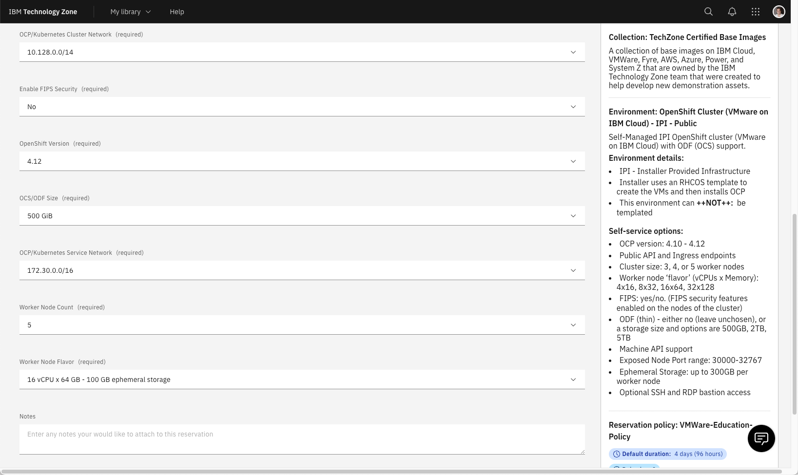
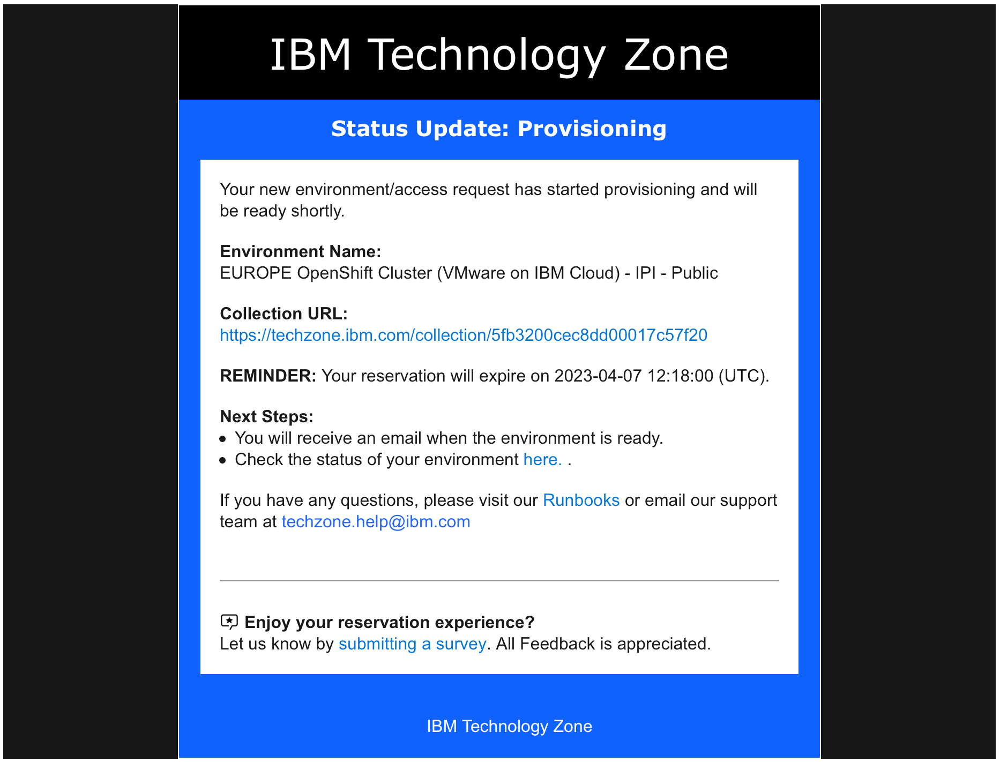
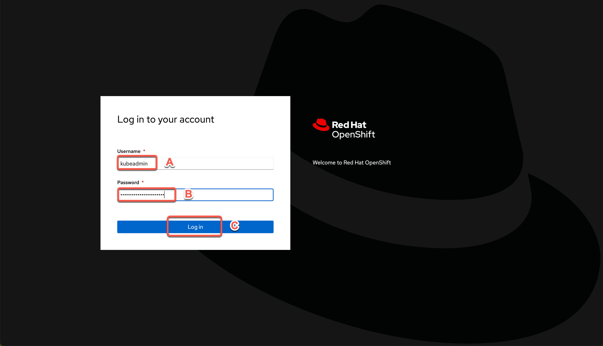
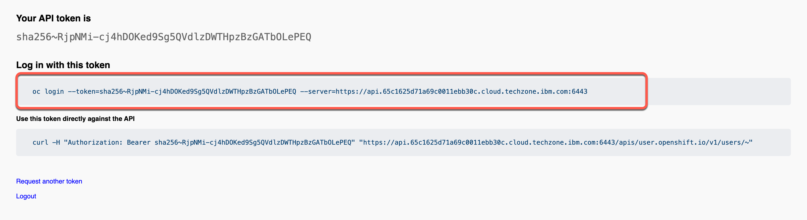

<FeatureCard
  title="Installing IBM Event-led solution using CP4I on IBM Cloud"
  color="dark"
  >


</FeatureCard>

<AnchorLinks>
  <AnchorLink>Lab Overview</AnchorLink>
  <AnchorLink>Prerequisites</AnchorLink>
  <AnchorLink>Installation Overview</AnchorLink>
  <AnchorLink>1 - OpenShift Installation</AnchorLink>
  <AnchorLink>2 – Clone Repositories</AnchorLink>
  <AnchorLink>3 – Set Context</AnchorLink>
  <AnchorLink>4 – Add the Catalog Sources</AnchorLink>
  <AnchorLink>5 – Install the Operators</AnchorLink>
  <AnchorLink>6 – Deploy the Platform UI</AnchorLink>
  <AnchorLink>7 - Deploy Automation Assets</AnchorLink>
  <AnchorLink>8 - Deploy API Connect</AnchorLink>
  <AnchorLink>9 - Deploy App Connect</AnchorLink>
  <AnchorLink>Summary</AnchorLink>
</AnchorLinks>

***

## Lab Overview

A basic knowledge to deliver an Event-led Integration PoC is to know how to install IBM Event Automation solution. There are different deployment model of Event Automation, you can use Event Automation as part of Cloud Pak for Integration or as a standalone solution. In this document we will walk you through applying yaml and running scripts from the command line to install Event Automation on Cloud Pak for Integration. Having a good understand of interacting with your cluster from the CLI is essential when delivering a PoC.

The first main goal of this session is to provide you the knowledge about how to install CP4I using command line interface from scratch. Here you will use a Openshift environment provided by TechZone team on IBM Cloud (VMware). However, you are welcome to use any supported OpenShift environment.

The second goal is to provide some demo assets (based on Event Automation tutorials) to be ready to progress your PoC.

In this session you will learn:
  - how to install and configure a basic IBM Event-led integration solution by deploying CP4I using command line interface from scratch
  - how to deploy Event Streams, Event Endpoint Management, Event Processing and MQ instances.

***

## Prerequisites

- You need to have installed in your machine:
  - <a href="https://docs.openshift.com/container-platform/4.8/cli_reference/openshift_cli/getting-started-cli.html" target="_blank">oc CLI</a> v4.6+.
  - github CLI
  - Bash Shell
  - JAVA v8+
  - <a href="https://www.ibm.com/docs/en/api-connect/10.0.x?topic=configuration-installing-toolkit" target="_blank">apic CLI</a>

Note some of the tools will be available after you deploy an instance of the capability you are working on. And you also need an account in the folllowing email service to configure APIC:
  - <a href="https://mailtrap.io/" target="_blank">mailtrap</a>

***

## Installation Overview

A IBM Cloud Pak® for Integration installation consists of a Red Hat® OpenShift® Container Platform cluster with one or more Cloud Pak for Integration operators installed and one or more instances of Platform UI deployed.

In this document, we will follow the steps below to install Event Automation on CP4I. If you need more details about the CP4I Installation process, please check the product documentation <a href="https://www.ibm.com/docs/en/cloud-paks/cp-integration/2022.4?topic=installing-overview-installation" target="_blank">here</a>.

  - 1 - OpenShift Installation
  - 2 - Access your OpenShift cluster
  - 3 – Clone Repositories
  - 4 – Set Context
  - 5 – Install Foundational Services
  - 6 – Deploy the Platform Navigator UI
  - 7 - Deploy Event Streams
  - 8 - Deploy Event Endpoint Management (EEM)
  - 9 - Deploy the Enterprise Messaging (MQ)
  - 10 - Deploy Event Processing

***

## 1 - OpenShift Installation

IBM Cloud Pak for Integration brings together IBM’s market-leading middleware capabilities to support a broad range of integration styles and use cases. With powerful deployment, lifecycle management, and production services running on Red Hat OpenShift, it enables clients to leverage the latest agile integration practices, simplify the management of their integration architecture, and reduce cost. Cloud Pak for Integration demands an OpenShift cluster.

Follow the steps below to provision a Red Hat OpenShift Container Platform cluster on VMware on IBM Cloud.

1.1. To request an OpenShift Cluster on VMware on IBM Cloud, go <a href="https://techzone.ibm.com/my/reservations/create/63a3a25a3a4689001740dbb3" target="_blank">here</a> and complete the form with the follow details.

| Field  | Value |
| ------------- | ------------- |
| Purpose  | If you are doing the L4 course, select **Practice/Self Enablement**. <br/> If you are delivering a PoC, select:**Proof-of-Concept** and inform the Sales opportunity.  |
| Purpose Description  | If you are doing the L4 course, enter: **Event-led Integration L4 Course**. <br/> If you are delivering a POC, enter the PoC details.  |
| Preferred Geography  | You are welcome to select the preferred Geography |


| Field  | Value |
| ------------- | ------------- |
| OpenShift Version | 4.15 |
| OCS/ODF Size  | ODF - 2 TB |
| Worker Node Count  | 5 |
| Worker Node Flavor  | 16 vCPU x 64 GB - 100 GB ephemeral storage |




1.2 **Agree** with the TechZone Terms and Conditions (A) and click **Submit** (B).


1.3 You will receive an email confirming the instance is provisioning.


1.4 You will receive a second email once the environment is provisioned. You should expect this to take between 30 and 120 minutes. Now the status update changed to **Ready**.  Click on **Reservation ID** to open the details page of your new reservation environment.


1.5 Copy your **Cluster Admin Username** (A) and **Cluster Admin Password** (B). Copy the **OCP Console link** (C).


***

## 2 - Access your OpenShift cluster

In this section, you access your OpenShift cluster and install the OpenShift command line tool.

2.1 In a Browser, open the OCP Console link and paste the **Cluster Admin Username** (A) and **Password** (B) copied in the previous step and click **Log in** (C).


2.2 Great, you are almost ready for the demo. Last but not least important, let’s copy login command to access the cluster by CLI. On the top right, click your **username** (A) and select **Copy login command** (B).


2.3 Click **Display Token**.


2.4 Copy the **Log in with this token command** and **paste** on a terminal window.



That is it! Now you are ready for the Cloud Pak for Integration installation. Take a breath and let's start to install the Pak.

***

## 3 - Clone Repositories

To use this guide you will need to clone the demo repo to your workstation. Let's do it now!

3.1 Open a terminal window and **run** the command below.
```
gh repo clone github.ibm.com/joel-gomez/cp4i-demo
```

3.2 Open the **cp4i-demo** folder.
```
cd cp4i-demo
```

***

## 4 - Set Context

Based on where you have deployed your OCP cluster you will need to set up some environment variables to inform the installation script about your environment. Let’s do it here!

4.1 First, you need to define an environment variable to inform CP4I version.
```
export CP4I_VER=16.1.0
```

4.2 Now let’s set the OCP type based on the storage classes in your cluster.
```
export OCP_TYPE=ODF
```

`Note`: If you are using ROKS cluster, use export OCP_TYPE=ROKS.

4.3 Set mailtap credentials.
```
export MAILTRAP_USER=<my-mailtrap-user>
export MAILTRAP_PWD=<my-mailtrap-pwd>
```

4.4 If you have provisioned your OCP cluster in Tech Zone you can use the following script to set the proper default storage class.
```
scripts/99-odf-tkz-set-scs.sh
```

4.5 Your cluster will also need access to pull the container software required to deploy the Cloud Pak. Your Entitlement Key is used to grant access. You can download you entitlement key from My IBM. Click Copy.

4.6 The IBM Entitled Registry contains software images for the capabilities in IBM Cloud Pak® for Integration. To allow the Cloud Pak for Integration operators to automatically pull those software images, you must first obtain your entitlement key, then add your entitlement key in a pull secret. Replace the my-key with your IBM entitlement key.
```
export ENT_KEY=<my-key>
```

4.7 Now, you need a namespace where you will deploy the different capabilities.
```
scripts/02a-cp4i-ns-key-config.sh
```

***

## 5 - Install Foundational Services
The IBM Cloud Pak foundational services operator is no longer installed automatically. Install this operator manually if you need to create an instance that uses identity and access management. That is exactly, what you will do in this section.

5.1 First you need to have a certificate manager, otherwise, the IBM Cloud Pak foundational services operator installation will not complete. Let’s do it!
```
oc apply -f resources/00-cert-manager-namespace.yaml
oc apply -f resources/00-cert-manager-operatorgroup.yaml
oc apply -f resources/00-cert-manager-subscription.yaml
```

5.2 Confirm the subscription has been completed successfully before moving to the next step running the following command.
```
SUB_NAME=$(oc get deployment cert-manager-operator-controller-manager -n cert-manager-operator --ignore-not-found -o jsonpath='{.metadata.labels.olm\.owner}');if [ ! -z "$SUB_NAME" ]; then oc get csv/$SUB_NAME -n cert-manager-operator --ignore-not-found -o jsonpath='{.status.phase}';fi;echo
```

You should get a response like this:
```
Succeeded
```

5.3 Now, you need to install Postgress SQL Catalog Source.
```
oc apply -f catalog-sources/${CP4I_VER}/01-postgress-sql-catalog-source.yaml
```

5.4 Confirm the catalog source has been deployed successfully before moving to the next step running the following command.
```
oc get catalogsources cloud-native-postgresql-catalog -n openshift-marketplace -o jsonpath='{.status.connectionState.lastObservedState}';echo
```

You should get a response like this:
```
READY
```

5.5 Ok, now you need to install Common Services Catalog source.
```
oc apply -f catalog-sources/${CP4I_VER}/02-common-services-catalog-source.yaml
```

5.6 Confirm the catalog source has been deployed successfully before moving to the next step running the following command:
```
oc get catalogsources opencloud-operators -n openshift-marketplace -o jsonpath='{.status.connectionState.lastObservedState}';echo
```

You should get a response like this:
```
READY
```

5.7 Create the Common Services namespace.
```
oc new-project ibm-common-services
```

5.8 Now, let’s intall the Foundational Services operator (former Common Services).
```
oc apply -f subscriptions/${CP4I_VER}/00-common-service-subscription.yaml
```

5.9 Confirm the operator has been deployed successfully before moving to the next step running the following command:
```
SUB_NAME=$(oc get deployment/ibm-common-service-operator -n openshift-operators --ignore-not-found -o jsonpath='{.metadata.labels.olm\.owner}');if [ ! -z "$SUB_NAME" ]; then oc get csv/$SUB_NAME --ignore-not-found -o jsonpath='{.status.phase}';fi;echo
```

You should get a response like this:
```
Succeeded
```

***

## 6 - Deploy the Platform UI

Deploying the Platform UI allows you to deploy and manage instances from a central location.

6.1 First, let’s install Platform UI Catalog source.
```
oc apply -f catalog-sources/${CP4I_VER}/03-platform-navigator-catalog-source.yaml
```

6.2 Confirm the catalog source has been deployed successfully before moving to the next step running the following command.
```
oc get catalogsources ibm-integration-platform-navigator-catalog -n openshift-marketplace -o jsonpath='{.status.connectionState.lastObservedState}';echo
```

You should get a response like this:
```
READY
```

6.3 Now, let’s install the Platform UI Operator.
```
oc apply -f subscriptions/${CP4I_VER}/01-platform-navigator-subscription.yaml
```

6.4 Confirm the operator has been deployed successfully before moving to the next step running the following command.
```
SUB_NAME=$(oc get deployment ibm-integration-platform-navigator-operator -n openshift-operators --ignore-not-found -o jsonpath='{.metadata.labels.olm\.owner}');if [ ! -z "$SUB_NAME" ]; then oc get csv/$SUB_NAME --ignore-not-found -o jsonpath='{.status.phase}';fi;echo
```

You should get a response like this:
```
Succeeded
```

6.5 Let’s deploy a Platform UI instance.
```
oc apply -f instances/${CP4I_VER}/common/01-platform-navigator-instance.yaml
```

6.6 Confirm the instance has been deployed successfully before moving to the next step running the following command.
```
oc get platformnavigator cp4i-navigator -n tools -o jsonpath='{.status.conditions[0].type}';echo
```

You should get a response like this:
```
Ready
```

6.7 Once the Platform UI instance is up and running get the access info.
```
scripts/03b-cp4i-access-info.sh
```

6.8 Open the Platform UI URL and log in. Note the password is temporary and you will be required to change it. Take note of your new password, you will use it multiple times.

***

## 7 - Deploy Event Streams

7.1 First, let’s intall the Event Streams Catalog Source.
```
oc apply -f catalog-sources/${CP4I_VER}/08-event-streams-catalog-source.yaml
```

7.2 Confirm the catalog source has been deployed successfully before moving to the next step running the following command.
```
oc get catalogsources ibm-eventstreams-catalog -n openshift-marketplace -o jsonpath='{.status.connectionState.lastObservedState}';echo
```

You should get a response like this:
```
READY
```

7.3 Now, let’s install the Event Streams Operator.
```
oc apply -f subscriptions/${CP4I_VER}/05-event-streams-subscription.yaml
```

7.4 Confirm the operator has been deployed successfully before moving to the next step running the following command.
```
SUB_NAME=$(oc get deployment eventstreams-cluster-operator -n openshift-operators --ignore-not-found -o jsonpath='{.metadata.labels.olm\.owner}');if [ ! -z "$SUB_NAME" ]; then oc get csv/$SUB_NAME --ignore-not-found -o jsonpath='{.status.phase}';fi;echo
```

You should get a response like this:
```
Succeeded
```

7.5 Deploy Event Streams instance.
```
oc apply -f instances/${CP4I_VER}/${OCP_TYPE}/05-event-streams-instance.yaml
```

7.6 Confirm the instance has been deployed successfully before moving to the next step running the following command.
```
oc get eventstreams es-demo -n tools -o jsonpath='{.status.phase}';echo
```

`Note`: this will take few minutes, so be patient, and at some point you may see some errors (it is common to receive FAILED message in the first 15 minutes), but at the end (you need to wait few minutes 15/30 minutes) you should get a response like this :
```
Ready
```

7.7 Create topics and users.
```
oc apply -f resources/02a-es-initial-config-jgr-topics.yaml
oc apply -f resources/02a-es-initial-config-jgr-users.yaml
oc apply -f resources/02a-es-initial-config-ea-topics.yaml -n tools
oc apply -f resources/02a-es-initial-config-watsonx-topics.yaml -n tools
```

7.8 Enable Kafka Connect base.
```
scripts/08c-event-streams-kafka-connect-config.sh
```

7.9 Confirm the instance has been deployed successfully before moving to the next step running the following command.
```
oc get kafkaconnects jgr-connect-cluster -n tools -o jsonpath='{.status.conditions[0].type}';echo
```

Note this will take few minutes, but at the end you should get a response like this:
```
Ready
```

7.10 Enable Kafka Connector Datagen.
```
scripts/08e-event-streams-kafka-connector-datagen-config.sh
```

7.11 Confirm the instances has been deployed successfully before moving to the next step running the following command.
```
oc get kafkaconnector -n tools
```

Note this will take few minutes, but at the end you should get a response like this.
```
NAME                 CLUSTER               CONNECTOR CLASS                                                         MAX TASKS   READY
kafka-datagen        jgr-connect-cluster   com.ibm.eventautomation.demos.loosehangerjeans.DatagenSourceConnector   1           True
kafka-datagen-avro   jgr-connect-cluster   com.ibm.eventautomation.demos.loosehangerjeans.DatagenSourceConnector   1           True
kafka-datagen-reg    jgr-connect-cluster   com.ibm.eventautomation.demos.loosehangerjeans.DatagenSourceConnector   1           True
```

***

## 8 - Deploy Event Endpoint Management (EEM)

8.1 First, let’s intall the EEM Catalog Source.
```
oc apply -f catalog-sources/${CP4I_VER}/13-eem-catalog-source.yaml
```

8.2 Confirm the catalog source has been deployed successfully before moving to the next step running the following command.
```
oc get catalogsources ibm-eventendpointmanagement-catalog -n openshift-marketplace -o jsonpath='{.status.connectionState.lastObservedState}';echo
```

You should get a response like this:
```
READY
```

8.3 Install EEM Operator.
```
oc apply -f subscriptions/${CP4I_VER}/09-eem-subscription.yaml
```

8.4 Confirm the operator has been deployed successfully before moving to the next step running the following command.
```
SUB_NAME=$(oc get deployment ibm-eem-operator -n openshift-operators --ignore-not-found -o jsonpath='{.metadata.labels.olm\.owner}');if [ ! -z "$SUB_NAME" ]; then oc get csv/$SUB_NAME --ignore-not-found -o jsonpath='{.status.phase}';fi;echo
```

You should get a response like this:
```
Succeeded
```

8.5 Set passwords via environment variables:
```
export EEM_ADMIN_PWD=<eem-admin-pwd>
export EEM_USER_PWD=<es-user-pwd>
```

8.6 Deploy EEM Manager instance:
```
scripts/19a-eem-manager-inst-deploy.sh
```

8.7 Confirm the instance has been deployed successfully before moving to the next step running the following command:
```
oc get eventendpointmanagement eem-demo-mgr -n tools -o jsonpath='{.status.phase}';echo
```

Note this will take few minutes, so be patient, but at the end you should get a response like this:
```
Running
```

8.8 Deploy EEM Gateway instance:
```
scripts/19b-eem-gateway-inst-deploy.sh
```

8.9 Confirm the instance has been deployed successfully before moving to the next step running the following command.
```
oc get eventgateway eem-demo-gw -n tools -o jsonpath='{.status.phase}';echo
```

Note this will take few minutes, so be patient, but at the end you should get a response like this:
```
Running
```

8.10 Integrate EEM with ES instance
```
scripts/19f-eem-es-config.sh
```

8.11 Get token for post deployment configuration.

a) Log in to your Event Endpoint Management UI from a supported web browser (use the cmd  oc get eem -n tools to determine the login URL for your Event Endpoint Management instance and log in with eem-admin and the password defined earlier).

b) Click the user icon in the header, and then click Profile to open the Profile page.

c) Within the Profile page, click Create token to open the dialog.

d) Read the message and note that API access tokens expire.

e) Provide a token description that can be used to identify your token and then click Create.

f) To copy the token, click Copy token.

g) Click Close to close the dialog.


8.12 Set environment variable for token.
```
export EEM_TOKEN=<my-eem-token>
```

8.13 Populate EEM Catalog.
```
scripts/19e-eem-manager-config.sh
```

***

## 9 - Deploy the Enterprise Messaging (MQ)

9.1 First, let’s intall the MQ Catalog Source.
```
oc apply -f catalog-sources/${CP4I_VER}/09-mq-catalog-source.yaml
```

9.2 Confirm the catalog source has been deployed successfully before moving to the next step running the following command.
```
oc get catalogsources ibmmq-operator-catalogsource -n openshift-marketplace -o jsonpath='{.status.connectionState.lastObservedState}';echo
```

You should get a response like this:
```
READY
```

9.3 Install MQ Operator.
```
oc apply -f subscriptions/${CP4I_VER}/06-mq-subscription.yaml
```

9.4 Confirm the operator has been deployed successfully before moving to the next step running the following command.
```
SUB_NAME=$(oc get deployment ibm-mq-operator -n openshift-operators --ignore-not-found -o jsonpath='{.metadata.labels.olm\.owner}');if [ ! -z "$SUB_NAME" ]; then oc get csv/$SUB_NAME --ignore-not-found -o jsonpath='{.status.phase}';fi;echo
```

You should get a response like this:
```
Succeeded
```

9.5 Set MQ namespace environment variable.
```
export MQ_NAMESPACE=cp4i-mq
```

9.6 Create certificates and extra route.
```
scripts/10a-qmgr-pre-config.sh
```

9.7 Create configmap with MQ configuration.
```
oc apply -f resources/03c-qmgr-mqsc-config.yaml
```

9.8 Deploy MQ Queue Manager instance.
```
scripts/10b-qmgr-inst-deploy.sh
```

9.9 Confirm the instance has been deployed successfully before moving to the next step running the following command.
```
oc get queuemanager qmgr-demo -n tools -o jsonpath='{.status.phase}';echo
```

Note this will take few minutes, but at the end you should get a response like this:
```
Running
```

9.10 Create CCDT.
```
scripts/10c-qmgr-post-config.sh
```

9.11 Deploy MQ Source Connector.
```
oc apply -f resources/02b-es-mq-source.yaml
```

9.12 Deploy MQ Sink Connector.
```
oc apply -f resources/02c-es-mq-sink.yaml
```

***

## 10 - Deploy Event Processing

10.1 Install Apache Flink Catalog Source.
```
oc apply -f catalog-sources/${CP4I_VER}/14-ea-flink-catalog-source.yaml
```

10.2 Confirm the catalog source has been deployed successfully before moving to the next step running the following command.
```
oc get catalogsources ibm-eventautomation-flink-catalog -n openshift-marketplace -o jsonpath='{.status.connectionState.lastObservedState}';echo
```

You should get a response like this:
```
READY
```

10.3 Install Apache Flink Operator.
```
oc apply -f subscriptions/${CP4I_VER}/10-ea-flink-subscription.yaml
```

10.4 Confirm the operator has been deployed successfully before moving to the next step running the following command.
```
SUB_NAME=$(oc get deployment flink-kubernetes-operator -n openshift-operators --ignore-not-found -o jsonpath='{.metadata.labels.olm\.owner}');if [ ! -z "$SUB_NAME" ]; then oc get csv/$SUB_NAME --ignore-not-found -o jsonpath='{.status.phase}';fi;echo
```

You should get a response like this:
```
Succeeded
```

10.5 Prepare TrustStore for Event Automation.
```
scripts/20d-ea-truststore-config.sh
```

10.6 Deploy Apache Flink instance.
```
oc apply -f instances/${CP4I_VER}/common/21-ea-flink-instance.yaml
```

10.7 Confirm the instance has been deployed successfully before moving to the next step running the following command.
```
oc get flinkdeployment ea-flink-demo -n tools -o jsonpath='{.status.jobManagerDeploymentStatus}';echo
```

You should get a response like this:
```
READY
```

10.8 Install Event Processing Catalog Source.
```
oc apply -f catalog-sources/${CP4I_VER}/15-event-processing-catalog-source.yaml
```

10.9 Confirm the catalog source has been deployed successfully before moving to the next step running the following command.
```
oc get catalogsources ibm-eventprocessing-catalog -n openshift-marketplace -o jsonpath='{.status.connectionState.lastObservedState}';echo
```

You should get a response like this:
```
READY
```

10.10 Install Event Processing Operator.
```
oc apply -f subscriptions/${CP4I_VER}/11-event-processing-subscription.yaml
```

10.11 Confirm the operator has been deployed successfully before moving to the next step running the following command.
```
SUB_NAME=$(oc get deployment ibm-ep-operator -n openshift-operators --ignore-not-found -o jsonpath='{.metadata.labels.olm\.owner}');if [ ! -z "$SUB_NAME" ]; then oc get csv/$SUB_NAME --ignore-not-found -o jsonpath='{.status.phase}';fi;echo
```

You should get a response like this.
```
Succeeded
```

10.12 Set password via environment variables.
```
export EP_ADMIN_PWD=<ep-admin-pwd>
```

10.13 Deploy Event Processing instance.
```
scripts/20b-ea-ep-inst-deploy.sh
```

10.14 Confirm the instance has been deployed successfully before moving to the next step running the following command.
```
oc get eventprocessing ep-demo -n tools -o jsonpath='{.status.phase}';echo
```

You should get a response like this:
```
Running
```

10.15 Install PGSQL Operator.
```
oc apply -f resources/12a-pgsql-subscription.yaml
```

10.16 Confirm the operator has been deployed successfully before moving to the next step running the following command.
```
SUB_NAME=$(oc get deployment pgo -n openshift-operators --ignore-not-found -o jsonpath='{.metadata.labels.olm\.owner}');if [ ! -z "$SUB_NAME" ]; then oc get csv/$SUB_NAME --ignore-not-found -o jsonpath='{.status.phase}';fi;echo
```

You should get a response like this:
```
Succeeded
```

10.17 Create configmap with db configuration.
```
oc apply -f resources/12b-pgsql-config.yaml
```

10.18 Deploy a PGSQL DB instance.
```
oc apply -f resources/12c-pgsql-db.yaml
```

10.19 Confirm the instance has been deployed successfully before moving to the next step running the following command.
```
oc get pods -l "postgres-operator.crunchydata.com/role=master" -n tools -o jsonpath='{.items[0].status.conditions[1].status}';echo
```

After a few minutes you should get a response like this:
```
True
```

10.20 Get information to access EA instances.
```
scripts/20c-ea-access-info.sh
```

***
## Summary

You have successfully completed this lab. In this lab you learned:
  - how to install and configure a basic IBM Event-led solution by deploying CP4I using command line interface from scratch.
  - how to deploy vent Streams, Event Endpoint Management, Event Processing and MQ instances.

In the <a href="https://yourlearning.ibm.com/activity/PLAN-85D073F5A7AA" target="_blank">IBM Event Automation Level 3 course</a>, you can learn how to demo the IBM Event Automation technology.
