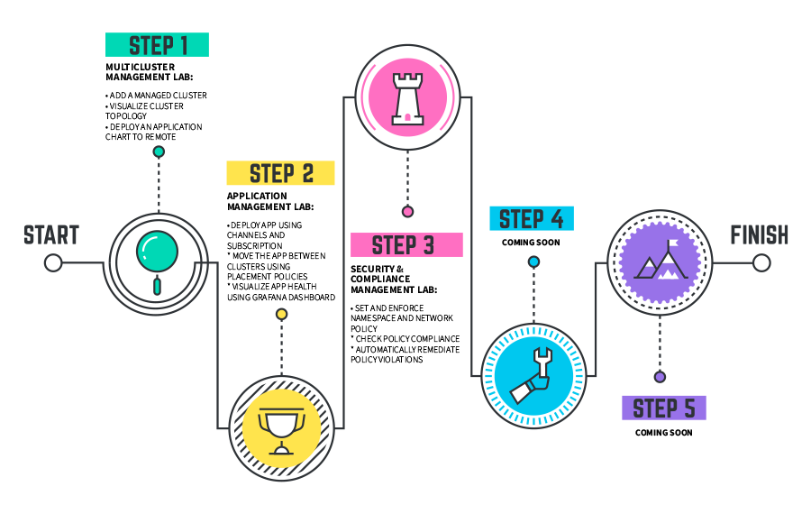

Do you want to learn more about CP4MCM using your ROKS environment? Here is the right place. In the following sections, you will have hands-on experience with Cloud Pak for Pak_Name. And to complete the labs, you will use your CP4MCM environment on ROKS.

By now, there are three hands-on labs: Multicluster Management, Application Management and Security & Compliance Management.

We recommend to follow the sequence above, however if you want to explore one specific lab, you can do it, just check the lab prerequisite section before start it.
