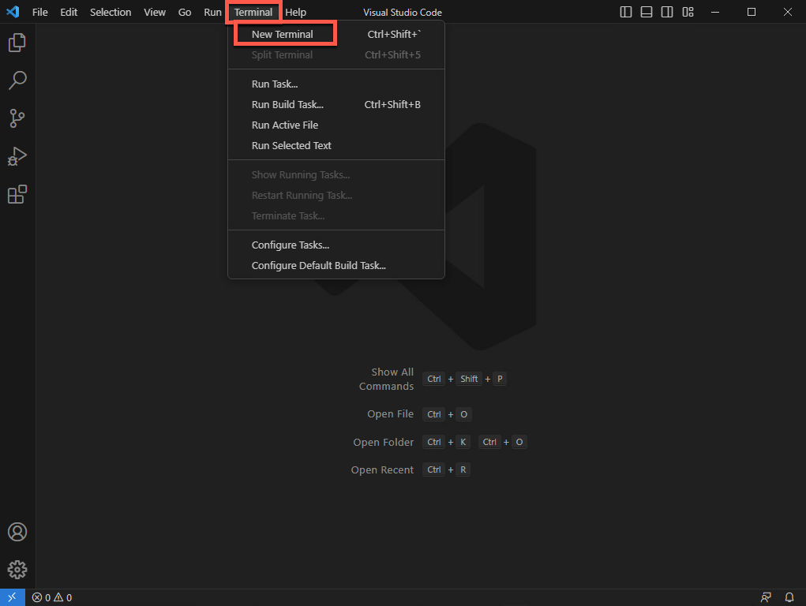
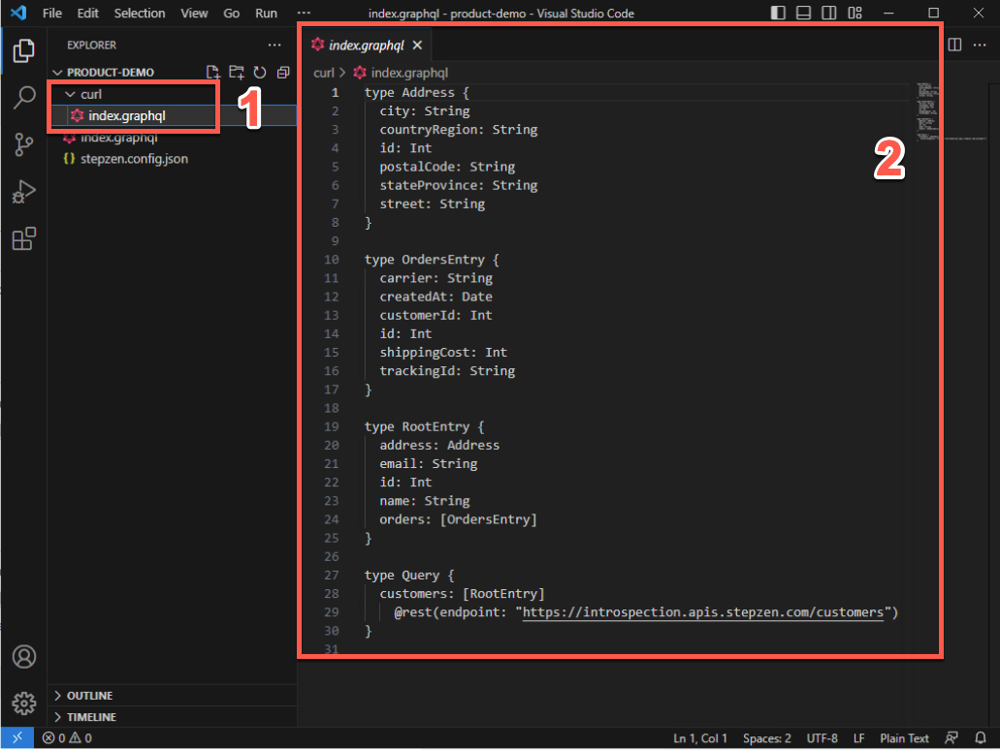
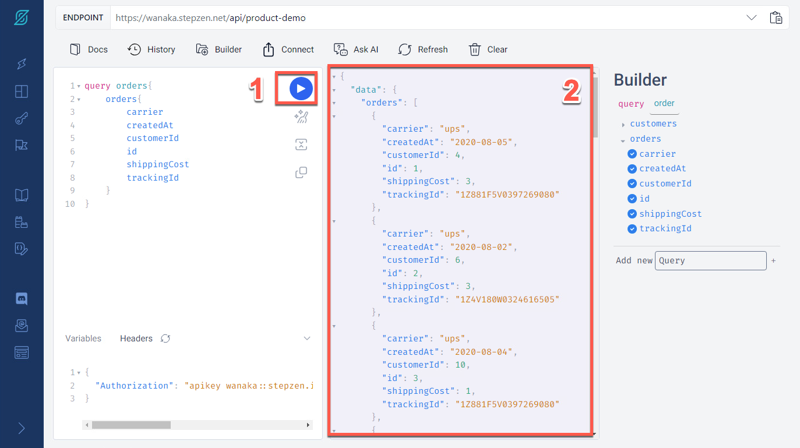
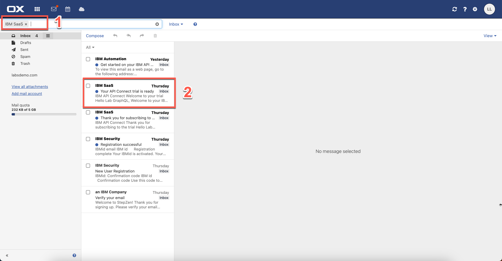
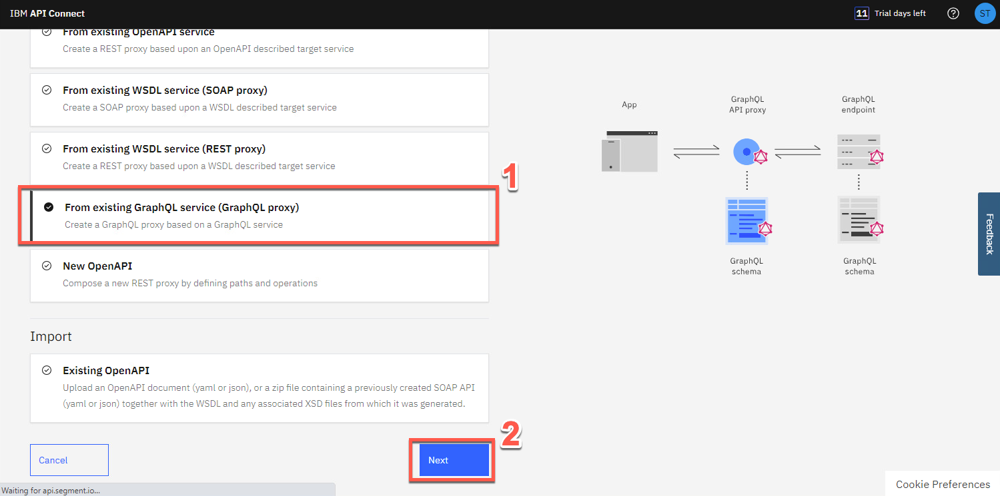
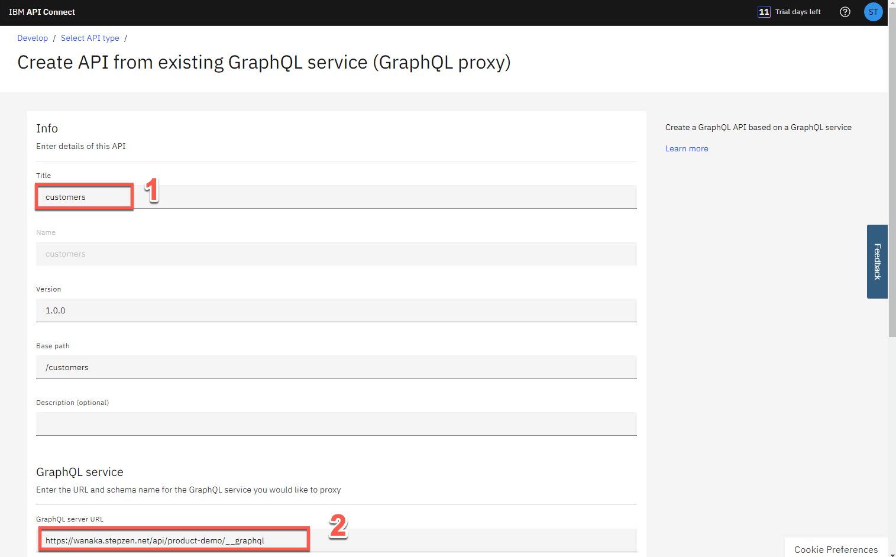

<FeatureCard
  title="Mastering Enterprise-Level GraphQL - Hands-on with StepZen and API Connect"
  color="dark"
  >


</FeatureCard>

<AnchorLinks>
  <AnchorLink>Introduction</AnchorLink>
  <AnchorLink>Prerequisites</AnchorLink>
  <AnchorLink>Business Context</AnchorLink>
  <AnchorLink>Lab Overview</AnchorLink>
  <AnchorLink>1 - Install Node.JS</AnchorLink>
  <AnchorLink>2 - Install IDE</AnchorLink>
  <AnchorLink>3 - Setup StepZen</AnchorLink>
  <AnchorLink>4 - Build your GraphQL API from a REST API</AnchorLink>
  <AnchorLink>5 - Adding a new REST API in your GraphQL API</AnchorLink>
  <AnchorLink>6 - Autogenerate GraphQL Schemas from MySQL Database</AnchorLink>
  <AnchorLink>7 - Creating a composition of building blocks using @materializer</AnchorLink>
  <AnchorLink>8 - Create a GraphQL Proxy API in APIC</AnchorLink>
  <AnchorLink>9 - Editing and Testing the GraphQL Proxy API</AnchorLink>
  <AnchorLink>10 - Create a Product and apply GraphQL RateLimits</AnchorLink>
  <AnchorLink>11 - Explore the API from Developer Portal</AnchorLink>
  <AnchorLink>Summary</AnchorLink>
</AnchorLinks>

***

## Lab Overview

The rising adoption of hybrid cloud has resulted in data stored everywhere – in different types of data stores likes data warehouses, lakes, and lakehouses as well as across different clouds and on-premises environments. APIs serve as the essential connector between different data sources and applications, which means that businesses are relying on and creating more APIs than ever before to get the data they need to power their applications and experiences.

GraphQL has rapidly become a go-to query language for companies to interact with their data and is emerging as a new standard for APIs, layering upon the investments in REST APIs and data systems. While GraphQL APIs are significantly easier for the application teams to consume, they can represent a challenge to the API teams tasked with building them.  We believe that APIs built declaratively are simply better - leading to first implementation with fewer lines of clean code, faster time to deploy, and APIs with built-in performance, cost, and reliability optimizations.

When you program declaratively you are configuring a system - you are also providing the system with universal rules that can be applied across all queries, and in different situations. The resulting code is more fault-tolerant, reduces repetition of software patterns (follows DRY principles), and is easier to understand and maintain. Importantly, it allows the platform to do things for you that you would otherwise have to code yourself.

StepZen enables developers to easily build and deploy a single GraphQL API that gets the data they need from multiple backends. The API delivers the right data reliably, irrespective of backend protocols, schemas and authentications. We manage the API so that developers manage zero infrastructure.

With StepZen’s declarative approach developers can build GraphQL APIs (and federated graphs) by composing GraphQL building blocks to create the GraphQL schema. Strong introspection capabilities mean that a GraphQL model for enterprise data can be constructed and composed with only a few lines of code.

Because you build your APIs declaratively, StepZen understands the API and can make optimization decisions at runtime, delivering low latency and high throughput and imposing a minimum burden on the backends.

***

## Prerequisites

You need to have your IBM API Connect environment. As part of this lab, you will use IBM API Connect as a Service on AWS. If you don't have an account, follow the steps from this <a href="https://ibm-integration.github.io/learninghub/labs/trial-aws/#1-start-your-ibm-api-connect-trial-on-aws" target="_blank">documentation</a> to create a 30 days trial account.

You need to have a StepZen account. StepZen provides an easier way for developers to build GraphQL APIs. StepZen takes a declarative programming approach (describing WHAT the program does, without explicitly specifying HOW), which results in smaller and more intuitive code, better runtime performance, and faster time to value. StepZen was also designed to be highly flexible. It is compatible with other API approaches and is available as-a-Service (SaaS) while also supporting deployments in private clouds and on-premises data centers. If you don't have an account, you are able to get started with a free StepZen account <a href="https://stepzen.com/signup" target="_blank">here</a> (no credit card required).

***

## Business Context

Your company decided to invest in GraphQL as the new standard for APIs. GraphQL is a query language for APIs that gives an application client greater control over what data it retrieves in an API request when compared with a REST API request.

You would like to explore an easier way for developers to build GraphQL APIs, consuming data stored everywhere. Take an e-commerce application for example. With a single call, GraphQL can merge data that is found in different subsystems, like customer information, order numbers, and delivery status, and return it in an expected format. While GraphQL APIs are significantly easier for the application teams to consume, they can represent a challenge to the API teams tasked with building them. Based on that, you would like to explore a way to create GraphQL APIs using a declarative approach for federated access to data.

On the other hand, as a developer, you are having problems to manage the use of GraphQL APIs in your company.

GraphQL provides the following particular advantages over REST APIs:

  - The application client can request only the data that it needs. For example, when retrieving bank account records, request only the account number and current balance for each account, but not the customer name and address details. With a REST API request, either the backend REST service must provide separate endpoints for different data subsets, or the application client must retrieve the complete records and then discard the unwanted data.

  - The application client can retrieve multiple related resources in a single request. For example, a customer’s bank account record might include an array that references other finance products that the customer holds. If an application client wants to retrieve the bank account details for a specific customer, and details of the other finance products for that customer, then with a REST API the client would first retrieve the bank account details, then make separate requests for each of the other products. A GraphQL API can be designed to allow the client to retrieve all this information in a single request.

However, this flexibility presents rate limiting challenges, because two seemingly very similar requests might return vastly different amounts of data, and what might have required multiple REST API requests, each counting towards the rate limit, might require only a single GraphQL API request. It is important therefore that rate limiting controls are imposed that reflect the amount of data that is retrieved.

***

## Lab Overview

In this lab you will learn how to move from Zero to Enterprise in the GraphQL domain. Initially you will learn how to use StepZen to create a a federated GraphQL API by pulling data from disparate sources (REST API and MySQL). After that you will use IBM API Connect to create a GraphQL API proxy definition that proxies a backend GraphQL server from StepZen, and to define rate limiting controls that reflect the amount of data that is returned from the server by a request to the GraphQL API.

In this lab, you will complete the following sections:

  1 - Install Node.JS
  2 - Install IDE
  3 - Setup StepZen
  4 - Build your GraphQL API from a REST API
  5 - Adding a new REST API in your GraphQL API
  6 - Autogenerate GraphQL Schemas from MySQL Database
  7 - Creating a composition of building blocks using @materializer
  8 - Create a GraphQL Proxy API in APIC
  9 - Editing and Testing the GraphQL Proxy API
  10 - Create a Product and apply GraphQL RateLimits
  11 - Explore the API from Developer Portal

***

## 1 - Install Node.JS


In this section you will install Node.JS in your machine. Let’s start it!

1. Start your lab environment and open a browser.


2. Open the URL below (1). And download the recommended node.js version.
```
https://nodejs.org
```


3. Save the Node installation in your machine and execute it.


4. Accept the default values and click **Install** to complete the installation.


5. When completed, just click **Finish**.


***

## 2 - Install IDE

An **Integrated Development Environment (IDE)** is a piece of software that contains all of the things you need to develop, compile, link, and debug your programs. Furthermore, IDEs typically bundle a number of other helpful editing features, such as integrated help, name completion, auto-formatting, and sometimes a version control system. So while you could do all of these things separately, it’s much easier to install an IDE and have them all accessible from a single interface.

In this lab, you will use the IDE to explore your graphQL schema. You are welcome to use any IDE that you prefer. If you don't have any preference, you can follow the steps below to install Visual Studio Code.

1. On your browser, open the URL below (1). And download the VSCode User Installer specific of your OS (2).
```
https://code.visualstudio.com/Download
```


2.Save the VSCode installation in your machine and execute it.


3. Follow the installation steps to complete it.


4. At the end, check the option to **Launch Visual Studio Code** and click **Finish**.


5. You can close the **Welcome** tab.


6. Open the **Terminal** menu and click on **New Terminal**.



7. Great! Now you should see a terminal window on bottom of your Visual Studio Code. Enter the command below to check if the node installation is ok (as result of the command you should see the node version).
```
node -v
```


8. If you are using Windows machine, now you need to change the PowerShell execution policies to be able to execute scripts in VS Code terminal. An execution policy is part of the PowerShell security strategy. Execution policies determine whether you can load configuration files, such as your PowerShell profile, or run scripts. Let's do it! On your Visual Studio Code Terminal window run the command below.
```
Set-ExecutionPolicy -Scope CurrentUser -ExecutionPolicy Bypass
```


  That is it! Now you are ready for the lab. Take a breath and enjoy your lab!

***

## 3 - Setup StepZen

In this section, you will start to use StepZen. You will install StepZen CLI and log in with your StepZen account. If you don't have a StepZen account check the prerequisites section how to create it.

StepZen enables developers to easily build and deploy a single GraphQL API that gets the data they need from multiple backends. The StepZen CLI is the primary tool for creating, uploading, deploying and testing your StepZen API. The StepZen CLI enables you use to manage your StepZen schemas, configurations, and endpoints. The CLI also comes with a built-in Schema Explorer that enables you to explore and test the API you've deployed locally from your browser. The StepZen CLI is available via npm, let's install it.


1. On your terminal, run the command below to install the StepZen CLI.
```
npm install -g stepzen
```


2. Now, let's log in with StepZenAccount. Back to the browser window, open the URL below (1) and click on **Log In** link (2).
```
http://www.stepzen.com
```


3. If you have a personal account, go ahead and log in. If you are using an account provided by your lab owner, click on **Sign in with GitHub** and log in with the user and password that you received.


4. If you are using the username provided by the lab owner, maybe you need to open the gmail  account (log in with the same user id and password) to get the GitHub verification code.


5. On StepZen Dashboard page, on the left menu, open the **Account** page (key icon).


6. Here you have all the information that you need to log in using the CLI. Your **Account** name (1) and **Admin Key** (2). You will use them in the next step.


7. On your Visual Studio Code terminal window, execute the command below to log in with StepZen CLI, replace [your_account] with the account value (1) from the Account page.
```
stepzen login -a [your_account]
```


8. Now, you need to enter your Admin Key. Copy and paste the Admin Key value (2) from the Account page.


  Great, now you are ready to build your graphQL API!

***

## 4 - Build your GraphQL API from a REST API

Use the StepZen CLI to create a GraphQL API for backends with REST interfaces in minutes.

There are two ways to create your GraphQL API with StepZen when you have a REST backend.
  - Use the command-line interface (CLI) command stepzen import curl to specify an existing REST endpoint - StepZen introspects the endpoint and auto-generates a GraphQL schema for you.
  - Write your schema code in a .graphql GraphQL Schema Definition Language (SDL) file. Use the powerful GraphQL directive @rest to connect the REST endpoint, and with just a few lines of code, you have a working schema.)

In this section you will learn how to use stepzen import curl on an existing REST API. This command sends a curl request to StepZen and parses the GraphQL types from the JSON response.

Before we build your GraphQL API, let's create a new directory and initialize a StepZen workspace in this directory.

1. On Visual Studio Code Terminal, execute the command below to create a new directory.
```
mkdir product-demo
```


2. Change to the new directory.
```
cd product-demo
```


3. You need to initialize a StepZen workspace in the current directory. Execute the command below.
```
stepzen init --endpoint=api/product-demo
```


4. Now, let's take advantage of StepZen to introspects the REST endpoint and auto-generates a GraphQL schema for you. Here you will use a pre-created REST API.
```
stepzen import curl "https://introspection.apis.stepzen.com/customers" --query-name "customers"
```


5. Great, your first GraphQL API is created. Let's explore the graphQL schema! On Visual Studio Code, click on **Explorer** icon (1) and click **Open Folder** (2).


6. Select the new created **product-demo** folder (1) and click **Select Folder** (2).


7. If necessary, click **Yes, I trust the authors** button.


8. To see the GraphQL schema, open the **curl** folder and select the **index.graphql** file (1). You are welcome to explore and check the .graphQL file (2).



9. If necessary, click **View > Terminal** to see the terminal window again.


  You will not deploy this GraphQL yet. Before that, let's import another REST endpoint.

***

## 5 - Adding a new REST API in your GraphQL API

In this section, you will import a different endpoint. Let's do it!

1. Execute the command below to import another REST API.
```
stepzen import curl "https://introspection.apis.stepzen.com/orders" --query-name "orders" --query-type "Order"
```


2. To check the new graphQL schema, open the **curl-01** folder and open the new **index.graphql** file (1). You are welcome to explore the new schema (2).


3. Open the third schema, the **index.graphql** file in the **product-demo** folder (1) and check this schema is referencing the other two schemas (2).


4. Now, you are able to run the command below to initialize your endpoint.
```
stepzen start
```


This command does three things:

    - Deploys the code in the current directory (or the directory provided via the --dir flag) to the specified endpoint on StepZen.
    - Watches the directory for changes and automatically deploys them to the endpoint specified.
    - Share a URL with StepZen's Schema Explorer that enables you to test your API by exploring the queries and types available and querying the API running on StepZen.


5. The StepZen dashboard provides a playground for testing your GraphQL API. Let's open it to explore our GraphQL API. Scroll down your terminal page to see the Dashboard URL of your API. Copy and paste it in you browser window.


6. In StepZen Dahsboard you can play with different queries. Go ahead and click **Execute Query** button (1) to test the orders query.  Check the result data (2).



7. You are welcome to play with the Builder section (1), to create queries with different values. For example, delete the order query, and create a customers query with some fields (2). Execute the query again (3) and check the result data (4).


  These results, we are consuming from two different REST APIs. But you can do that with different type of data sources. In the next section, you will inspect data from a MySQL database.

***

## 6 - Autogenerate GraphQL Schemas from MySQL Database

There are two ways to create your GraphQL API with StepZen when you have a SQL database backend.
  - Use the command-line interface (CLI) command stepzen import [mysql | postgresql] to specify your database - StepZen introspects it and auto-generates a GraphQL schema for you.
  - Write your schema code in a .graphql GraphQL Schema Definition Language (SDL) file. Use the GraphQL directive @dbquery to connect the database, and with just a few lines of code, you have a working schema.)

In this section, you will learn how to use stepzen import mysql. In this lab, you will use a sample MySQL database from StepZen.

1. Back to your terminal, cancel the current execution (CTRL+C). And execute the command below to create a GraphQL API that connects data from a database backend.
```
stepzen import mysql --db-host='db.introspection.stepzen.net' --db-database='introspection' --db-user='testUserIntrospection' --db-password='HurricaneStartingSample1934' --name=‘mysql’
```


2. To check the new graphQL schema, open the **mysql** folder and open the new **index.graphql** file (1). You are welcome to explore the new schema (2).


  Before deploy the new API, next section you will merge the MySQL database and REST API endpoints.

***

## 7 - Creating a composition of building blocks using @materializer

Now that you have two subgraphs,  you can link types across subgraphs with @materializer. Let's do it!

1. On the **index.graphql** from **mysql** folder (1), scroll down to see the ‘*type Query*’ declaration. Below the sentence "**Queries for type ‘Address’**" include the query code below (2).
```
getAddressById(id: Int!): [Address]
@dbquery(
  type: "mysql"
  query: """
  SELECT * FROM `address` where `id` = ?
  """
  configuration: "mysql_config"
)
```

  This code is defining a getAddressById query to select address from mySQL database.


2. Now open the **index.graphql** file from **curl** folder (1), this is the schema from customers REST API.  Scroll down to see the ‘*type RootEntry*’ section.  By now, the address is coming from the REST API endpoint. Let's change it to get this value from MySQL database. Replace the current address type definition (address: Address) for the code below (2).
```
address: [Address]
  @materializer (query: "getAddressById")
```


3. Let's deploy the new API. And refresh the StepZen Dashboard.
```
stepzen start
```


4. On the StepZen Dashboard page, use the Builder section (1), to create a customers query including address attributes (2). Execute the query again (3) and check the result data is coming from Rest and MySQL database (4).


  Great! You created a GraphQL API by doing a composition from REST API and MySQL database. Next section you will see how to use IBM API Connect to manage this API.

5. Before you move to APIC section, take a copy of your API endpoint (1) and the Authorization header (2). You will need them later to invoke your API.


  One important point to highlight here is about how StepZen controls access to GraphQL schemas and endpoints.

  As you build out your GraphQL APIs, you will want to add access control mechanisms to prevent unauthorized use of these endpoints. StepZen supports two different solutions for this problem:
    - API Keys: You can use API keys to control access to the entire endpoint. API keys are the default access control mechanism.
    - Field Policies: You can use Field policies to control access to specific entry point fields on the endpoint. Field policies provide fine-grained access control to you GraphQL API, using a model similar to attribute-based access control.

    StepZen provides two different types of API keys for use with an account: Admin Keys and API Keys. Admin keys provide administrative-level access to your account, and should only be used at development time. API keys provide more limited access to your account, and should be used for production.

    In this lab, for simplification purpose, you will use the Admin Keys to access your API. In a real environment, you should use API Keys or Field Policies to improve your security level.

***

## 8 - Create a GraphQL Proxy API in APIC

IBM API Connect enables you to create a GraphQL API proxy definition that proxies a backend GraphQL server. API Connect extends the GraphQL standard by providing, in a GraphQL API definition, the ability to configure a range of settings that are used to calculate the complexity of a GraphQL request and an associated cost that counts towards the rate limit.

For this part of the lab, you need to have an API Connect environment. If necessary, check the Prerequisites section to learn how to create your API Connect on AWS Trial Account.

1. If you received a lab account from your lab monitor, you need to open the Gmail site to get the your APIC environment URL.  On Gmail inbox of your account, search for **IBM SaaS** (1), open the "**Your API Connect trial is ready**" email (2).



2. Now, click **Access trial** button.


3. Log in with your APIC user and password (account that you received from your lab monitor or account that you created).


4. Here, you are on your API Connect Enterprise as a Service environment. API Connect Enterprise as a Service is a cloud-based edition of IBM API Connect. Using API Connect Enterprise as a Service enables you to work in the cloud to create, manage, secure, and socialize APIs using our latest user experiences, innovation, and industry standards for full API lifecycle management.

  API Connect Enterprise as a Service uses the software-as-a-service as a delivery model. With this model, API Connect is hosted on Amazon Web Services and is managed by IBM. You pay for using the software without worrying about owning and maintaining the underlying infrastructure. With API Connect Enterprise as a Service, you pay for usage through your AWS bill.

  Let's see how to create a GraphQL Proxy API.  On the **Home** page (1), scroll down and click on **Develop API** tile (2).


5. Then click **Add->API**.


6. To create a GraphQL proxy, select **From Existing GraphQL service (GraphQL proxy)** (1). When you point to an existing GraphQL server, API Connect introspects the service and automatically creates a GraphQL proxy service. Then click **Next** (2).



7. Enter the following values:

   Title: **customers** (1)
   GraphQL server URL: [*Your API URL copied from StepZen Dashboard*] (for example: https://wanaka.stepzen.net/api/product-demo/__graphql) (2)



8. As described earlier in this lab, your StepZen API is using an API Key approach to control access to the entire endpoint. Because of that, you need to include the API Key in the Authorization Header of the HTTP Header. Here you will include that to read the API Schema (not to call API itself). Let's do it!

  In the *HTTP Header* section, click **Add** (1) to enter **Authorization** (2) as *Header* and paste the *API Key value* that you copied from the *StepZen Dashboard Headers* section as *Value* (3). Then click *Next* (4).


9. The schema validator reports warning and errors if found. Ignore the Schema warning by now, will fix this warning in later steps. In the Paths section, select **all** the available endpoints (1), then click **Next** (2).


10. Keep both **Secure using Client ID** and **CORS** checked (1) and click **Next** (2).


11. Great! API Connect successfully created a GraphQL proxy API.


***

## 9 - Editing and Testing the GraphQL Proxy API


***

## 10 - Create a Product and apply GraphQL RateLimits


***

## 11 - Explore the API from Developer Portal


***


## Summary

Let’s summarize what you’ve done today.

In this lab you moved from Zero to Enterprise in the GraphQL domain. Initially you learned how to use StepZen to create a a federated GraphQL API by pulling data from disparate sources (REST API and MySQL). After that you learned how to use IBM API Connect to create a GraphQL API proxy definition that proxies a backend GraphQL API from StepZen, and you verified how to define rate limiting controls that reflect the amount of data that is returned from the server by a request to the GraphQL API.

Check this <a href="https://stepzen.com/docs" target="blank">page</a>, for more technical information about StepZen. And for more information about API Connect Enterprise as a Service, visit this <a href="https://www.ibm.com/docs/en/api-connect/saas?topic=api-connect-enterprise-as-service-overview" target="blank">page</a>.
