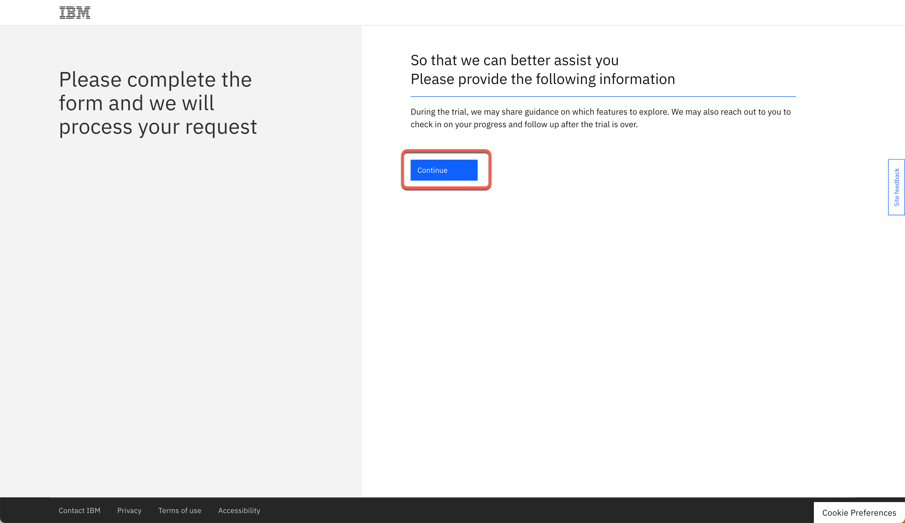

<FeatureCard
  title="Accessing IBM API Connect and IBM App Connect on AWS"
  color="dark"
  >

</FeatureCard>

<AnchorLinks>
  <AnchorLink>Introduction</AnchorLink>
  <AnchorLink>1 - Start your IBM API Connect trial on AWS</AnchorLink>
  <AnchorLink>2 - Start your IBM App Connect trial on AWS</AnchorLink>
  <AnchorLink>Summary</AnchorLink>
</AnchorLinks>

***

## Introduction

An increasing number of companies are undergoing digital transformation and seeking to adopt new technologies as they pursue top-line growth, organizational efficiency and more innovative ways of delivering faster, more personalized customer experiences. According to a recent IDC Study, 95% of businesses who responded see the need to adopt a digital-first strategy and the majority of organizations are already moving down the path of executing their plans. However, to achieve top-line growth, organizational efficiency and deliver digitization at a pace to meet customer demands, organizations must realize that a robust API strategy is a prerequisite.

Organizations rely on hundreds, sometimes thousands of APIs, and the number of APIs within organizations is growing rapidly in IT departments and in lines of business. It should come as no surprise that APIs play a crucial role in enabling digitization. They provide the foundation for modernization and help organizations build successful business ecosystems. APIs link together individual systems that contain data about clients, partners, products, business performance and more.

They help organizations scale operations by providing a convenient and standardized means of sharing data and services. API management should not be viewed as just another piece of technology, but rather the basis of an organization’s digital strategy.

As businesses grow, keeping track of all the APIs available for use, socialization and monetization can become more challenging. This may increase the likelihood of security issues, since unknown APIs are possibly unsecure, out of date and provide a potential breach point. A robust API management solution is designed to allow organizations to monitor API lifecycles, boost socialization and optimize monetization efforts across the entire business ecosystem, while driving digitization at scale.

As more and more organizations are deploying API management solutions on cloud to improve mobility and accelerate the API development cycle, IBM offers IBM API Connect and IBM App Connect as a Service on Amazon Web Services (AWS) Cloud.

In this session, you will learn how to create a trial account to access API Connect and App Connect as a service on Amazon Web Services (AWS) Cloud.

***

## 1 - Start your IBM API Connect trial on AWS

API Connect Enterprise as a Service is a cloud-based edition of IBM API Connect. Using API Connect Enterprise as a Service enables you to work in the cloud to create, manage, secure, and socialize APIs using our latest user experiences, innovation, and industry standards for full API lifecycle management.

API Connect Enterprise as a Service uses the software-as-a-service is a delivery model. With this model, API Connect is hosted on Amazon Web Services and is managed by IBM. You pay for using the software without worrying about owning and maintaining the underlying infrastructure. With API Connect Enterprise as a Service, you pay for usage through your AWS bill.

API Connect Enterprise as a Service offers the following subscription levels:
  - Trial: provides a single service instance for 30 days, with up to 100K API calls, at no cost.
  - Base: provides 3 service instances, a choice of call-volume tiers, and a dedicated support team within IBM.

The trial subscription is subject to the following terms:
  - The trial and the Base tiers include the same set of features. The only difference is that the trial period is 30 days and includes 1 instance of API Connect Enterprise as a Service with up to 100K API calls. All API Calls with response codes of 1xx, 2xx, 3xx, 4xx, and 5xx are counted.
  - Dedicated support is not included in the trial but you can visit the API Connect user community page to read other users’ questions and ask your own questions.
  - The person who creates the trial instance is designated as the Administrator and can invite other users to the trial instance.
  - The Administrator can upgrade the trial instance to a paid subscription at any time during the 30-day trial period, using the same IBMid and trial instance. When you upgrade, all of your trial assets will be upgraded as well.
  - After the 30-day trial period ends, users can no longer log in to the trial instance to access their assets. However, IBM retains the assets for an additional 30-day “suspension period” to allow you time to upgrade to a paid subscription without losing your assets.
  - If the trial subscription is not upgraded within 60 days of the initial trial sign-up date, all assets will be deleted.
  - If your trial instance reaches the 100K API call limit within the 30-day trial period, your users cannot make any more API calls. However, users can still log in and view assets until the 30-day trial period ends.
  - The Administrator will receive multiple emails as you approach your API calls limit or the end of your 30-day trial period.

Let's create our API Connect Enterprise as a Service trial now.

1. Open the trial registration page <a href="https://register.saas.ibm.com/apic/trial/aws?source=UserCommunity" target="_blank">here</a> and log in with your IBMid, or if necessary create a new one.

2. After you log in, click **Continue** to start your trial creation.

3. Select the best **AWS region** for your trial (1), define an **instance name** (e.g.: yourname-demo) (2) ands click **Continue** (3).

4. In few minutes, you trial should be ready. Click on **Access your trial now**.

5. First time, you will see a Welcome to API Connect dialog. You are welcome to explore the options. Feel free to see a **Product overview** (1), if necessary. When done, **close** (2) the Welcome dialog to access the API Connect home screen.

6. Great, now you are on API Connect home screen. Here you can easily create, manage, secure and socialize APIs.  Now, let's create the IBM App Connect to develop integration flows. Click on **Develop integration flows with OpenAPI using App Connect**. If you don't see this tile, click <a href="https://register.saas.ibm.com/ace/trial/aws?source=UserCommunity" target="_blank">here</a> to access the App Connect trial registration page.

***

## 2 - Start your IBM App Connect trial on AWS

IBM App Connect Enterprise SaaS on AWS is a powerful iPaaS solution.

iPaaS, or Integration-Platform-as-a-Service, is a self-service cloud-based solution that standardizes how applications are integrated. Business technologists, citizen and professional developers, integration specialists and consultants can all use iPaaS solutions out-of-the-box to quickly build the integration flows for sharing data within an organization or with multiple companies.

With iPaaS solutions, organizations can connect different applications, data, business processes, and services, whether they are hosted on-premises, in a private cloud, or within a public cloud environment.

Let's create our APP Connect Enterprise as a Service trial now.

1. **Log in** with your IBMid, or if necessary create a new one.

2. Select the best **AWS region** for your trial (1), define an **instance name** (e.g.: yourname-demo) (2) ands click **Continue** (3).

3. In few minutes, you trial should be ready. Click on **Access your trial now**.

4. First time, you will see a Welcome to IBM App Connect Designer dialog. You are welcome to explore the options. Feel free to start a product tour(2). When done, **close** the Welcome dialog to access the IBM App Connect Designer home screen.

5. Great! Here you are on the App Connect Designer Home screen, you are ready to start to create flows!

6. IBM App Connect Enterprise as a Service provides App Connect Designer and App Connect Dashboard environments for authoring and running integrations. Each environment provides tools and resources to create and deploy your integrations. You can switch between your App Connect Designer and App Connect Dashboard instances by using the instance switcher on the header.

***

## Summary

You have successfully completed this lab. In this lab you learned:
  - how to create a trial account to access API Connect and App Connect as a service on Amazon Web Services (AWS) Cloud.

In the <a href="https://yourlearning.ibm.com/activity/PLAN-0878B26C1617" target="_blank">Cloud Pak for Integration Level 3 course</a>, you can learn how to demo the IBM API-Led technology.
